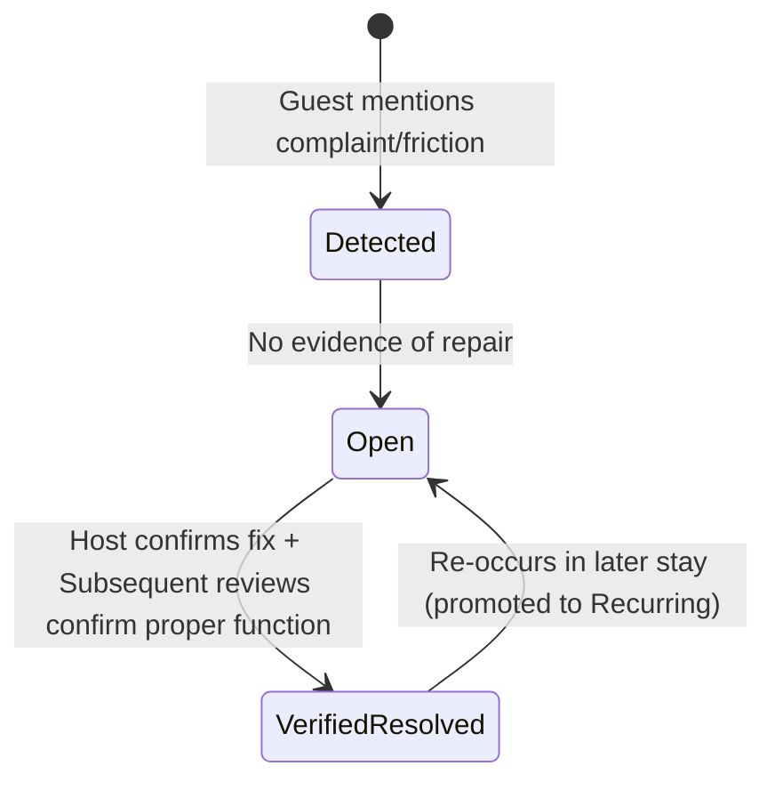

# Villa del Sol — Guest Reviews Operational Analysis Skill

This skill guides the AI assistant in systematically auditing pre-scraped guest reviews and sentiment from `data/ratings_reviews.json` across all four booking channels (Airbnb, VRBO, Booking.com, and Kivoya Direct). It classifies negative sentiment and friction points into a 3-tier severity rubric and tracks resolution status to maintain an actionable remediation report in `data/reviews_analysis.md`.

---

## 1. Operational Context & Purpose

Prospective guests booking high-ticket luxury stays ($800–$2,500+/night) at Villa del Sol scrutinize reviews across all major booking platforms. Minor friction points (e.g. smart lock keypad lag, kitchen blender accessories, pool temperature calibration) that go unaddressed can simmer across multiple stays, eventually leading to lower star ratings or negative guest impressions.

This skill equips the agent to:
1. Parse all review records in `data/ratings_reviews.json`.
2. Extract all constructive feedback, complaints, and service issues.
3. Categorize issues into Tier 1 (Severe), Tier 2 (Recurring), and Tier 3 (Minor).
4. Cross-reference host public responses and subsequent chronological reviews to determine whether issues are `[OPEN]` or `[VERIFIED RESOLVED]`.
5. Write and update the operational triage report in `data/reviews_analysis.md`.

---

## 2. Three-Tier Severity Rubric

| Tier | Severity | Definition & Trigger Examples | Expected Response |
| :--- | :--- | :--- | :--- |
| **Tier 1: Severe Issues** | `[SEVERE]` | Critical structural, safety, HVAC, or hygiene failures that would directly lead to bad reviews ($<4.0★$), refund requests, or cancellations.<br>• Air conditioning failure during Phoenix summer ($>100^\circ\text{F}$).<br>• Pool heater failure during winter reservation ($<75^\circ\text{F}$).<br>• Hot water outage, major plumbing leaks, or sewage backups.<br>• Uncleaned home on arrival or severe pest infestations. | **Address Immediately** (Emergency dispatch / 24-hr vendor remediation). |
| **Tier 2: Recurring Problems** | `[RECURRING]` | Persistent or repeated friction points mentioned across 2 or more distinct stays. Chronic annoyances that steadily erode 5-star ratings.<br>• Gate code / smart lock access confusion or finicky keypad.<br>• Wi-Fi dead zones in specific back bedrooms.<br>• Insufficient bath towels or kitchen cookware for 14–16 guests.<br>• Finicky pool controls or confusing BBQ grill ignition.<br>• Noise complaints regarding pool equipment or local neighbors. | **Address Soon** (Schedule during next turnover or maintenance window). |
| **Tier 3: Minor Issues** | `[MINOR]` | Isolated, one-off quirks, subjective stylistic preferences, or minor nits that are unlikely to reoccur or damage overall rating.<br>• Guest found mattresses slightly too firm or soft.<br>• Suggestion to add a specific board game or extra coffee pods.<br>• Light bulb burned out during a stay and replaced.<br>• Landscape debris in pool after high-wind monsoon storm. | **Optionally Address** (Low priority; batch into routine home upgrades). |

---

## 3. Issue Resolution State Machine (`[OPEN]` vs `[VERIFIED RESOLVED]`)

To prevent property management from repeatedly troubleshooting problems that have already been fixed:

1. **Host Response Cross-Reference**:
   - Inspect the review's `host_response` object for explicit commitments and confirmation of completed repairs (e.g. *"We had our handyman adjust the bathroom latch right away"* or *"We've replaced the blender pitcher and gasket"*).
2. **Subsequent Review Verification**:
   - Verify if subsequent chronological reviews mention that the amenity is now working properly (e.g. a pool heat complaint in January followed by multiple spring reviews praising the 86° pool confirms resolution).
3. **Status Annotation**:
   - `[OPEN]`: Active issue with no verified evidence of physical repair or maintenance resolution.
   - `[VERIFIED RESOLVED]`: Problem confirmed addressed by host response AND/OR validated by subsequent positive guest feedback.



---

## 4. Operational Execution Protocol

When conducting a reviews audit:
1. **Load Data**: Read `data/ratings_reviews.json`.
2. **Chronological Scan**: Scan all reviews from oldest to newest to understand the historical progression of repairs and guest sentiment.
3. **Cluster & De-duplicate**: Group mentions of the same amenity or physical fixture (e.g. front door keypad, pool heater, blender).
4. **Evaluate Resolution**: If an issue was mentioned, check if a host reply exists or if subsequent reviews validate normal operation.
5. **Update Artifact**: Write or overwrite `data/reviews_analysis.md` using the exact structure below.
6. **CLI Viewer**: The host or operator can inspect the analysis anytime in terminal by running:
   ```bash
   .venv/bin/python -m src.cli audit-reviews
   ```

---

## 5. Report Structure (`data/reviews_analysis.md`)

```markdown
# Villa del Sol — Guest Reviews Operational Audit & Action Plan
**Generated by Antigravity Review Analysis Engine**
**Data Source**: `data/ratings_reviews.json` (Total Reviews: {count})

## Executive Summary
- Overall Guest Satisfaction: Exceptional across all 4 channels (Airbnb 4.96, VRBO 4.90, Booking 9.4, Kivoya 5.0).
- Open Severe Issues: {N}
- Open Recurring Problems: {N}
- Open Minor Issues: {N}

---

## 🚨 Tier 1: Severe Issues (Address Immediately)
*None currently open.*

---

## ⚠️ Tier 2: Recurring Problems (Address Soon)

### 1. {Issue Title} `[OPEN]`
- **Frequency**: Mentioned in {X} stays ({dates}).
- **Guest Citations**:
  - *{Author} ({Platform}, {Date})*: "{Quote}"
- **Root Cause**: {Analysis}
- **Recommended Action**: {Concrete maintenance recommendation}

---

## ℹ️ Tier 3: Minor Issues (Optionally Address)

### 1. {Issue Title} `[OPEN]`
- **Frequency**: 1 mention ({Date}).
- **Guest Citation**: *{Author} ({Platform})*: "{Quote}"
- **Recommended Action**: {Maintenance recommendation}

---

## ✅ Verified Resolved Issues Catalog
| Issue | Platform & Date | Resolution Evidence |
| :--- | :--- | :--- |
| {Issue} | {Platform} ({Date}) | {Host response / subsequent review confirmation} |
```

