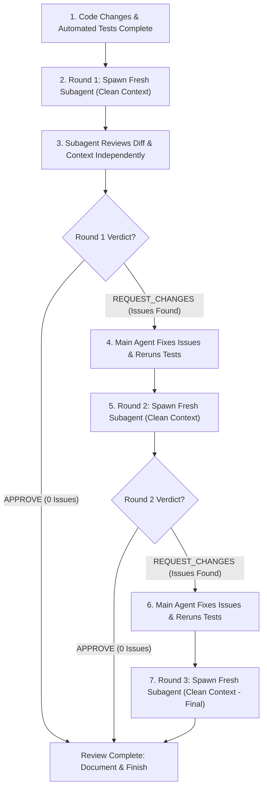

# Automated Code Review Protocol

This skill enforces a rigorous peer code review process for all code modifications before declaring work complete. Every round is conducted by a **fresh, independent subagent** with an **isolated, clean context** to guarantee objective, unpolluted evaluation. If Round 1 approves with zero issues, the review completes immediately; a second round is triggered only if Round 1 identifies issues or requests changes (up to 3 cycles).

---

## 1. Overview & Workflow



---

## 2. When to Trigger

Trigger this workflow **immediately after executing code changes and running automated tests**, and **before** presenting the completed task or requesting final user review.

Apply to:
- New features or endpoints
- Bug fixes and refactors
- Architectural and configuration modifications
- Script and workflow automation changes

*Do NOT trigger for trivial typo fixes, simple formatting tweaks, or purely investigatory prompts.*

---

## 3. Mandatory Clean Context Protocol (Zero Context Pollution)

To guarantee 100% objective, uncompromised, and rigorous code evaluation across all review rounds, agents must strictly uphold the **Clean Context Invariant**:

1. **Brand-New Subagent Instance Per Round**:
   - Every review round (Round 1, Round 2, Round 3) MUST be spawned as a **brand-new subagent** via `invoke_subagent` with a distinct `Role` (`Role: "Code Reviewer Round 1"`, `Role: "Code Reviewer Round 2"`, `Role: "Code Reviewer Round 3"`).
   - Each reviewer begins with an empty conversation transcript and a completely clean context window.

2. **Strict Prohibition Against Agent Reuse (`send_message`)**:
   - **NEVER** use `send_message` to request subsequent review rounds, follow-up reviews, or re-verifications from an existing subagent.
   - Sending messages to previously invoked reviewer subagents carries conversational baggage, token bloat, and confirmation bias. Once a reviewer completes its evaluation and returns its verdict, its conversation lifecycle for code review is finished.

3. **Zero Cross-Round Context Leakage & Bias Elimination**:
   - **DO NOT** pass previous review round outputs, prior reviewers' complaints, resolved feedback lists, or "here is how I addressed reviewer 1's concerns" to subsequent review rounds.
   - Subagents must evaluate the current state of the codebase and diff with completely fresh, unbiased eyes.
   - Priming a reviewer with "please verify if X was fixed" creates tunnel vision where the subagent focuses solely on X while missing regressions elsewhere in the diff.

4. **Hermetic Review Prompt Payload**:
   The prompt to each review subagent must contain strictly:
   - **Requirements**: The problem being solved as described in the requirements doc or bug description.
   - **CL / Task Description**: The problem being solved and how it was resolved.
   - **Implementation Plan**: High-level design, component boundaries, and non-obvious rationale.
   - **Current Unified Git Diff**: The latest unified `git diff` of uncommitted changes.
   - **Latest Automated Test Results**: Fresh test suite execution output.
   - **Review Instructions & Rubric**: The standard 4-tier importance rubric and structured output schema.
   It must NEVER contain prior review transcripts, prior reviewer verdicts, or conversational debate.

---

## 4. Subagent Spawning Protocol

For each round:
1. **Model**: Set `Model: 'inherit'` to leverage the user's primary reasoning model.
2. **Fresh Context**: Always invoke a **new** subagent with a unique `Role` (e.g. `Code Reviewer Round 1`, `Code Reviewer Round 2`, `Code Reviewer Round 3`). Never reuse conversation IDs across rounds.
3. **Payload Structure**: The prompt to the subagent **must** contain the hermetic review payload described in §3.

---

## 5. Review Rubric & Severity Tiers

The reviewer subagent must evaluate the changes against:
- **Correctness & Edge Cases**: Off-by-one errors, null/None safety, type mismatches, division by zero, timezone handling.
- **Regressions & System Health**: Broken existing functionality, unintended side-effects across components, performance regressions, database connection or memory leaks.
- **Contract & Architecture Adherence**: Conformance to project patterns, schema rules, and requirements.
- **Test Integrity**: Missing test coverage for newly introduced branches or edge cases.

### Importance Levels:
- **`[BLOCKER]`**: Syntax errors, broken builds/tests, critical runtime crashes, data corruption, or security vulnerabilities. Must be fixed immediately.
- **`[MAJOR]`**: Logic flaws, regressions, unhandled exceptions, incorrect calculations, or missing required error handling. Must be resolved before shipping.
- **`[MINOR]`**: Performance sub-optimizations, potential memory or resource leaks, code duplication, or defensive edge-case handling.
- **`[NIT]`**: Style, naming clarity, docstring or comment quality, or minor readability improvements.

---

## 6. Structured Review Output Schema

The reviewer subagent **must** respond using this exact structured markdown template:

```markdown
## Code Review Findings — Round X

**Overall Verdict**: [APPROVE | REQUEST_CHANGES]
**Summary**: <Brief 1-2 sentence assessment of change quality and stability>

### Issues Identified

#### 1. [BLOCKER | MAJOR | MINOR | NIT] [`filename.ext:Lstart-Lend`](file:///absolute/path/to/file.ext#Lstart-Lend)
- **Problem**: <Clear, objective description of what is wrong or vulnerable>
- **Proposed Solution**: <Exact code snippet or guidance to fix the issue>

#### 2. ... (repeat for each issue, or state "No issues identified. Code is clean and correct.")
```

---

## 7. The Conditional Multi-Round Iteration Loop (Up to 3 Cycles)

1. **Round 1 (Mandatory)**:
   - Spawn fresh subagent: `Role: "Code Reviewer Round 1"`.
   - **Round 1 Completion if Approved**: If Round 1 returns `APPROVE` with 0 unresolved issues, the review process terminates successfully on Round 1. A second round is **not** required.
   - If issues found / `REQUEST_CHANGES`: Parent agent evaluates each issue, applies genuine fixes, reruns automated tests, and proceeds to Round 2.
2. **Round 2 (Triggered Only if Round 1 Did Not Approve — Clean Context)**:
   - Executed **only if** Round 1 requested changes or required fixes. If Round 1 approved with 0 issues, Round 2 is skipped.
   - Spawn a completely **new** subagent: `Role: "Code Reviewer Round 2"`.
   - The subagent receives the updated `git diff` and completely clean context (does **not** see Round 1 conversation, prior comments, or prior verdicts).
   - If verdict is `APPROVE` with 0 unresolved issues $\rightarrow$ **Review complete**, proceed to documentation and final completion.
   - If issues found / `REQUEST_CHANGES`: Parent agent fixes valid issues, reruns automated tests, and proceeds to Round 3.
3. **Round 3 (Contingency / Final — Clean Context)**:
   - If Round 2 reported issues that required fixes, spawn a completely **new** subagent: `Role: "Code Reviewer Round 3"` with clean context.
   - Final review of remaining changes. Parent agent addresses any remaining blocker/major items and runs final tests.
4. **Clean Context Invariant Preserved**:
   - Whenever a second or third round is required, it MUST be conducted by a distinct, freshly spawned subagent with zero cross-round context leakage. Subagents are never reused via `send_message`.

---

## 8. Reporting & Documentation

After the review cycle completes:
1. **Chat Response**: Provide a concise summary of the review trajectory:
   ```markdown
   ### Code Review Summary
   - **Round 1**: 1 MAJOR (logic fix), 1 NIT addressed.
   - **Round 2**: APPROVED (0 issues).
   ```
2. **Walkthrough (`walkthrough.md`)**: Add a dedicated **"Subagent Code Review"** section detailing each round's verdict, issues found, and the resolutions implemented.

