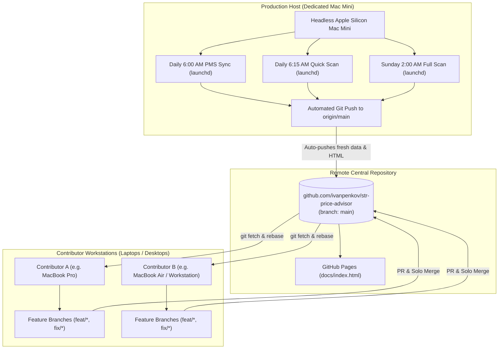
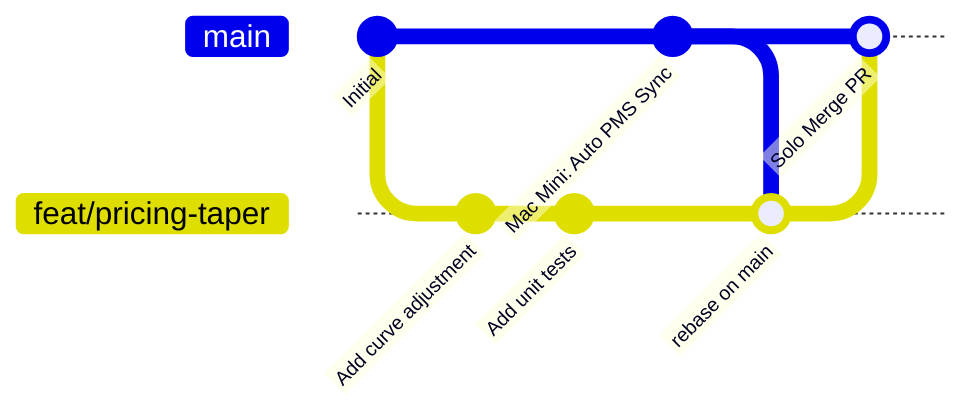

# Contributing & Multi-Device Setup Guide

Welcome to the **STR Competitive Price Advisor** project for **Villa del Sol** (Tempe, AZ). This guide documents how to onboard a new machine, transfer sensitive credentials safely, run local testing, and coordinate development between multiple contributors without disrupting the automated production environment.

---

## 1. System Architecture & Machine Roles

The project operates under a strict **two-tier machine model**:



### Machine Roles
1. **Production Host (Dedicated Mac Mini)**:
   - Dedicated headless node running `launchd` daemons 24/7.
   - Automatically executes scheduled PMS syncs, live OTA proxy scrapes, and dashboard HTML regeneration.
   - Automatically commits and pushes fresh data (`data/pricing_data_*.json`, `docs/index.html`) directly to `origin/main`.
2. **Contributor Workstations (MacBook / Laptop / Desktop)**:
   - Used by human contributors for writing code, fixing bugs, and enhancing pricing/analytics algorithms.
   - Runs unit tests and targeted local CLI audits.
   - **MUST NEVER** install automated `launchd` daemons or run automated background push scripts.

---

## 2. Hardware & Software Prerequisites

The codebase is optimized for **macOS** (Apple Silicon M-series or Intel), which matches the production runtime. Cross-platform notes for Linux and Windows (WSL2) are provided where applicable.

### Required Software
- **Operating System**: macOS Sonoma (14+) or Sequoia (15+) recommended. *(Linux Ubuntu 22.04+ or Windows 11 with WSL2 are also supported for development).*
- **Python**: Version `3.11`, `3.12`, or `3.13` (Current production runs Python `3.13.x`).
- **Git**: Installed and configured with your GitHub credentials (SSH key or GitHub CLI recommended).
- **Homebrew** (macOS): For installing system-level dependencies.

Verify your environment before starting:
```bash
git --version
python3 --version
```

---

## 3. Initial Device Setup & Repository Cloning

Follow these step-by-step instructions on your new device:

### Step 1: Clone the Repository
Clone the repository using SSH (recommended) or HTTPS:
```bash
# Using SSH (recommended if SSH keys are configured):
git clone git@github.com:ivanpenkov/str-price-advisor.git

# Or using HTTPS:
git clone https://github.com/ivanpenkov/str-price-advisor.git

# Enter the project directory:
cd str-price-advisor
```

### Step 2: Create and Activate Virtual Environment
Use Python's built-in `venv` module to isolate project dependencies in `.venv`:
```bash
# Create the virtual environment
python3 -m venv .venv

# Activate the virtual environment
# On macOS / Linux (zsh or bash):
source .venv/bin/activate

# On Windows (WSL2 / bash):
# source .venv/bin/activate
```

> [!TIP]
> Always verify that your terminal prompt displays `(.venv)` and points to the project Python:
> ```bash
> which python
> # Should output: /path/to/str-price-advisor/.venv/bin/python
> ```

### Step 3: Install Python Dependencies
Install all required packages from `requirements.txt`:
```bash
pip install --upgrade pip
pip install -r requirements.txt
```

### Step 4: Install Playwright Browser Binaries
The pricing engine uses Playwright with stealth patches to inspect OTA checkout rates. Install the Chromium browser binary:
```bash
playwright install chromium
```
*(On Linux/WSL2, also install system browser dependencies if prompted: `playwright install-deps chromium`).*

---

## 4. Secure Secret Bootstrapping (`.env`)

The project requires sensitive credentials to communicate with **NordVPN SOCKS5 proxy servers** and the **Streamline OwnerX / Kivoya PMS API**.

> [!CAUTION]
> **Zero-Leakage Security Invariant**:
> - NEVER commit `.env`, `.env.*`, or secrets to Git.
> - NEVER send `.env` files or credentials over plaintext channels (Slack, Discord, Email, SMS, or unencrypted web forms).
> - `.gitignore` is preconfigured to strictly ignore `.env` and all `.env.*` files (except the template `.env.example`).

### Expected Environment Variables
The repository includes a tracked template: [`.env.example`](.env.example). Inspect it to see all expected keys:

| Environment Variable | Description | Source / Where to Obtain |
| :--- | :--- | :--- |
| `NORDVPN_USER` | NordVPN SOCKS5 service username | NordVPN Dashboard &rarr; Services &rarr; NordVPN &rarr; Manual Setup |
| `NORDVPN_PASS` | NordVPN SOCKS5 service password | NordVPN Dashboard &rarr; Services &rarr; NordVPN &rarr; Manual Setup |
| `NORDVPN_SERVER` | Default proxy host:port fallback | `us8245.nordvpn.com:89` (or team default) |
| `STREAMLINE_OWNER_USERNAME` | Streamline OwnerX PMS login email | Kivoya property owner portal account |
| `STREAMLINE_OWNER_PASSWORD` | Streamline OwnerX PMS login password | Kivoya property owner portal account |
| `STEALTH_STARTUP_DELAY` *(Optional)* | Proxy startup delay in seconds | Default `0.6` (set to `0.0` in unit tests) |
| `NTFY_TOPIC` *(Optional)* | Push alert topic on `ntfy.sh` | Default `ivan-str-advisor-xyz` |

### Recommended Peer-to-Peer Transfer Channels

Choose one of the following secure methods to transfer the existing `.env` file from your primary machine (or Mac Mini) to your new device:

#### Method A: macOS AirDrop (Fastest for Mac-to-Mac)
Because `.env` is a hidden dotfile, macOS Finder hides it by default.
1. On the source Mac, open Terminal and make a temporary copy:
   ```bash
   cp /path/to/str-price-advisor/.env ~/Desktop/str_env_transfer.txt
   ```
2. In Finder, right-click `str_env_transfer.txt` &rarr; **Share** &rarr; **AirDrop** &rarr; select your new device.
3. On the destination Mac, move the received file into the project root as `.env`:
   ```bash
   # From within your cloned str-price-advisor root:
   mv ~/Downloads/str_env_transfer.txt .env
   chmod 600 .env
   ```
4. Securely delete the temporary file on the source Mac:
   ```bash
   rm ~/Desktop/str_env_transfer.txt
   ```

#### Method B: Local Network SSH / SCP
If both devices are on the same local Wi-Fi / LAN network and Remote Login (SSH) is enabled on the source machine:
```bash
# On your new device, pull .env directly from the source machine:
scp user@source-mac-mini.local:/path/to/str-price-advisor/.env .env
chmod 600 .env
```

#### Method C: Team Password Manager (1Password / Bitwarden)
1. Store the exact contents of `.env` inside a shared **Secure Note** in your password manager vault.
2. On the new machine, create a fresh `.env` from template and paste the values:
   ```bash
   cp .env.example .env
   # Edit .env in your editor (e.g. nano, code, or vim) and paste the credentials
   chmod 600 .env
   ```

---

## 5. Local Reservations Database Initialization

The project tracks reservation history, bookings, and revenue pacing in a local SQLite database: `data/reservations.db`.
Because `*.db` files are gitignored, your freshly cloned repository will not contain this database.

### How to Initialize `data/reservations.db`

#### Option 1: Live Sync from Streamline OwnerX PMS (Recommended)
Once your `.env` credentials are configured, generate a fresh local database directly from Kivoya's PMS:
```bash
python -m src.cli sync-reservations --days-back 60 --dashboard
```
This fetches reservations, booked blocks, guest counts, and gross revenue for the past 60 days and future 12 months, building `data/reservations.db` locally in ~20–30 seconds.

#### Option 2: Offline File Copy
If working offline without internet access, copy `data/reservations.db` from your existing Mac using AirDrop or SCP:
```bash
# Example using SCP:
scp user@mac-mini.local:/path/to/str-price-advisor/data/reservations.db ./data/reservations.db
```

---

> [!IMPORTANT]
> ### 🚨 URGENT FOLLOW-UP ARCHITECTURE ROADMAP: Centralized Shared Cloud Database
> Currently, `data/reservations.db` is stored as an unversioned local SQLite file on disk. While this works well for a single headless node, multiple contributor machines can experience database state drift.
> 
> **Immediate Next Step**: We have scheduled an urgent architectural migration to transition from local SQLite to a **centralized cloud database service** (e.g., Firebase Firestore, Cloud SQLite / Turso, or Supabase PostgreSQL). This will allow all authorized devices and the production Mac Mini to read and write live reservation states seamlessly in real-time without requiring manual file copies or redundant PMS API syncs.

---

## 6. Smoke Testing & Verification on the New Device

Before contributing code, run the following verification suite to confirm that your Python environment, browser automation, proxy pool, and API credentials are 100% operational:

### 1. Run Inner-Loop Unit Tests
Ensure all analytical calculations and unit tests pass locally (with `.venv` active, `python` or `.venv/bin/python` can be used):
```bash
python -m unittest tests/test_analytics.py
```
*(Expected: Ran 10 tests in ~0.08s with `OK`).*

### 2. Verify Stealth Proxy Pool & Out-of-State Routing
Test the 10-worker NordVPN proxy connection pool:
```bash
python -m src.cli test-stealth --count 3
```
*(Expected: Connects to 3 out-of-state proxy nodes without Phoenix IP leakage and reports latency).*

### 3. Verify Kivoya / Streamline OwnerX API Connection
Test direct PMS calendar and rate retrieval:
```bash
python -m src.cli test-kivoya
```
*(Expected: Connects to Kivoya API, verifies unit `503802` availability, and displays upcoming blocks).*

### 4. Run a Dry Quick Audit (Without Pushing)
Run a local price audit for the next 3 open intervals without pushing to GitHub:
```bash
python -m src.cli run --quick --limit 3
```
*(Expected: Evaluates 3 upcoming intervals against comps and displays recommended pricing).*

### 5. Verify HTML Dashboard Generator
Verify the static 9-tab dashboard builds without errors:
```bash
python -m src.cli generate-html
```
*(Expected: Generates `docs/index.html` locally).*

---

## 7. Two-Contributor Collaboration & Git Workflow

When two developers are contributing to the codebase, strict coordination is required to prevent merge conflicts with each other and with the **production Mac Mini's automated scheduled commits**.

### The Golden Rule of Automation
> [!WARNING]
> **DO NOT INSTALL LAUNCHD ON SECONDARY MACHINES**
> - The production Mac Mini is the sole machine authorized to run `scripts/launchd/install_launchd.sh`.
> - If secondary devices install the launchd jobs, they will trigger duplicate concurrent OTA scrapes, exhaust proxy rate limits, and cause racing git pushes to `origin/main`.
> - Secondary devices should run CLI commands manually as needed for testing, without the `--push` flag.

### Master Automation Schedule (Mac Mini)
Be aware of when the production host commits directly to `origin/main`:
- **Daily @ 6:00 AM MST**: PMS Sync (`com.villasol.pms-sync`)
- **Daily @ 6:15 AM MST**: Quick Scan (`com.villasol.daily-quickscan`)
- **Sunday @ 2:00 AM MST**: Full 12-Month Scan (`com.villasol.weekly-fullscan`)

### Daily Development Workflow: Feature Branches & Solo Merges



1. **Start from an Up-to-Date `main`**:
   ```bash
   git checkout main
   git pull --rebase origin main
   ```

2. **Create a Short-Lived Feature Branch**:
   Use descriptive branch prefixes (`feat/`, `fix/`, `docs/`, `refactor/`):
   ```bash
   git checkout -b feat/enhance-pacing-chart
   ```

3. **Develop and Run Targeted Tests**:
   Per the repository efficiency protocol, run targeted unit tests for the specific file you are editing:
   ```bash
   .venv/bin/python -m unittest tests/test_analytics.py
   ```

4. **Rebase on `origin/main` Before Merging**:
   Because the production Mac Mini may have pushed an automated daily scan while you were coding, always rebase before merging:
   ```bash
   git fetch origin
   git rebase origin/main
   ```

5. **Solo Merge Protocol**:
   - Push your branch to GitHub:
     ```bash
     git push -u origin feat/enhance-pacing-chart
     ```
   - Open a Pull Request on GitHub.
   - **Solo merges are permitted**: Once your targeted tests and the repository test suite pass locally, you may merge your own PR into `main`.
   - Send a brief message to your co-contributor (e.g., in team chat) letting them know a new change has landed on `main`.

---

## 8. Merge Conflict Resolution Recipe for Generated Artifacts

The production Mac Mini regularly commits updated pricing snapshots (`data/pricing_data_YYYY-MM-DD.json`) and the static web dashboard (`docs/index.html`).

To avoid messy merge conflicts in large JSON or 5,000+ line HTML files:

### Rule 1: Do Not Commit Generated Artifacts on Feature Branches
Unless your feature is explicitly modifying the dashboard HTML template or data schema, **do not commit `docs/index.html`** on your feature branch. Revert it before committing:
```bash
git checkout origin/main -- docs/index.html
```

### Rule 2: Resolving Rebase Conflicts on `docs/index.html`
If you rebase your branch against `origin/main` and hit a conflict in `docs/index.html` or `data/pricing_data_*.json`:
1. Always accept the upstream version from `origin/main`:
   ```bash
   # Accept origin/main's upstream version of the file:
   git checkout origin/main -- docs/index.html
   # (Note: In git rebase, --ours is upstream origin/main and --theirs is your feature branch)
   git add docs/index.html
   git rebase --continue
   ```
2. If your code changes affected the dashboard layout, simply regenerate it cleanly on top of `main`:
   ```bash
   python -m src.cli generate-html
   ```

---

## 9. Summary Checklist for New Contributors

- [ ] Repository cloned locally (`git clone ...`)
- [ ] Virtual environment created and active (`.venv/bin/activate`)
- [ ] Dependencies installed (`pip install -r requirements.txt`)
- [ ] Chromium binary installed (`playwright install chromium`)
- [ ] `.env` copied securely from primary machine (AirDrop / SCP / 1Password)
- [ ] Local reservations database initialized (`python -m src.cli sync-reservations --days-back 60 --dashboard`)
- [ ] Unit tests passing (`.venv/bin/python -m unittest tests/test_analytics.py`)
- [ ] Proxy and PMS API smoke tests passing (`test-stealth`, `test-kivoya`)
- [ ] `launchd` automation confirmed **NOT** installed on this secondary device
- [ ] Feature branch created for new work (`git checkout -b feat/...`)
