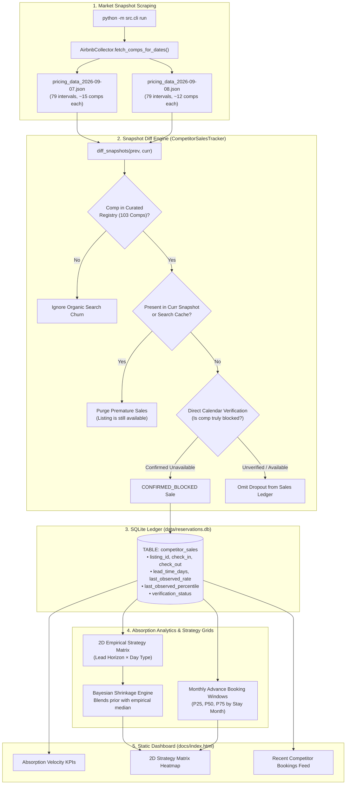

# Competitor Sales Transaction Feed & Absorption Velocity Engine
**Comprehensive Feature Architecture, Operational Guide & Failure Mode Analysis**

---

## 1. Executive Summary & Purpose

In short-term rental (STR) revenue management, competitor benchmarking traditionally relies on **asking rates** (what other hosts are charging right now). However, asking rates only reflect market *supply*. They do not reveal market *absorption*—which listings guests actually book, at what rates they clear, and how far in advance (lead time) those bookings happen.

The **Competitor Sales Transaction Feed & Absorption Velocity Engine** bridges this gap by:
1. Ingesting chronological market pricing snapshots (`data/pricing_data_YYYY-MM-DD.json`).
2. Detecting when a competitor listing ceases to be available for a specific stay interval.
3. Measuring the **booking lead time** ($N$ days before check-in) and the listing's **market percentile rank** ($Y^{\text{th}}$ percentile) at the moment of booking.
4. Aggregating historical sales into a **2D Strategy Grid** (4 Lead Horizons $\times$ Weekend/Midweek) using **Bayesian shrinkage** ($k = 3$) to recommend empirical pricing percentiles.
5. Computing **Monthly Advance Booking Windows** (P25–P75 quartiles) to inform seasonal booking paces.
6. Presenting the real-time **Competitor Bookings Transaction Feed** on the dashboard's "Comp Sales" tab (`docs/index.html#tab-market-sales`).

---

## 2. End-to-End System Architecture

---

## 3. Data Flow & Mathematical Model

### 3.1 Interval Snapshot Representation
Each pricing snapshot contains a list of stay intervals:
58849\mathcal{I} = \{(D_{\text{in}}, D_{\text{out}}, \mathcal{C})\}58849
where $\mathcal{C}$ is the collection of active competitor listings observed for that interval, each with an effective nightly rate $R_c = \frac{\text{Total Price}}{\text{Nights}}$.

### 3.2 Detection of Disappearances
When comparing snapshot $S_{\text{prev}}$ (date $D_{\text{prev}}$) to $S_{\text{curr}}$ (date $D_{\text{curr}}$) for stay interval $(D_{\text{in}}, D_{\text{out}})$:
58849\text{Disappeared Comps} = \mathcal{C}_{\text{prev}} \setminus \mathcal{C}_{\text{curr}}58849

Filtered strictly to the curated **103 registered comps** ($\mathcal{R}$ in `config/comps_registry.json`):
58849\Delta_{\text{sales}} = \{ c \in \mathcal{C}_{\text{prev}} \cap \mathcal{R} \mid c \notin \mathcal{C}_{\text{curr}} \}58849

### 3.3 Metrics Recorded for Each Sale
1. **Lead Time ($N$)**:
   $$N = (D_{\text{in}} - D_{\text{curr}}).\text{days}$$
   Partitioned into 4 strategic horizons:
   - **Far-Out (> 90 days)**: Early luxury planners with low price sensitivity.
   - **Peak Booking Window (31–90 days)**: Core booking period for large family groups.
   - **Near-Term Compression (15–30 days)**: Increasing price elasticity.
   - **Last-Minute Distress ($\le 14$ days)**: High perishability risk, requires aggressive conversion.

2. **Inferred Percentile Rank ($Y$)**:
   $$Y = \frac{\sum_{i \in \mathcal{C}_{\text{prev}}} \mathbf{1}(R_i \le R_c)}{|\mathcal{C}_{\text{prev}}|} \times 100$$
   Represents where in the market price hierarchy the listing cleared.

3. **Bayesian Shrinkage Formulation**:
   For each cell in the 2D matrix (Horizon $H \times$ Stay Type $T$), if historical sample count $n < 3$:
   $$\hat{Y} = \frac{n \cdot \bar{Y}_{\text{empirical}} + k \cdot Y_{\text{prior}}}{n + k} \quad (k = 3)$$
   where $Y_{\text{prior}} = 65\%$ for weekends and $45.5\%$ for midweeks.

---

## 4. Why False Sales Occurred (Failure Mode Analysis)

### 4.1 Root Cause 1: Page 1 Search Truncation vs. Listing Availability
* `AirbnbCollector` queries broad area searches:
  `https://www.airbnb.com/s/Mesa--AZ/homes?adults=16&min_bedrooms=6&checkin=...`
* **Airbnb only renders 18–24 cards on Page 1**. The collector does not paginate.
* There are over 30 matching homes in Mesa and hundreds in Scottsdale.
* Airbnb’s organic search ranking is dynamic: between Monday and Tuesday, listings rotate positions based on algorithm updates, host responsiveness, and A/B tests.
* When listing `711609909194570058` slipped from rank #14 on Sep 7 to rank #21 on Sep 8, it fell off Page 1.
* **The diff engine mistakenly treated "not in top 18 cards" as "booked/blocked"**, stamping 11 sales for a single property on one day.

### 4.2 Root Cause 2: Missing Calendar Verification
* The architecture design specified calendar verification before finalizing a sale record.
* However, in [`CompetitorSalesTracker.diff_snapshots()`](file:///Users/ivanpe/str-price-advisor/src/competitor_sales_tracker.py#L331-L335), the verification step was omitted, unconditionally assigning `verification_status = "CONFIRMED_BLOCKED"`.

### 4.3 Root Cause 3: Reconciliation Asymmetry
* `reconcile_with_latest_snapshot()` removes false sales if a listing reappears in a subsequent scan.
* However, daily quick scans (`--quick`) only scan **12 near-term intervals**.
* Far-out intervals (82–362 days out) are only scanned weekly, and when scanned, they query the same Page 1 search or reuse search cache files.
* Because listings relegated to Page 2 never appear on Page 1, they **never reappear in the snapshot**, permanently trapping false sales in the SQLite database.

---

## 5. Architectural Guardrails & Hardening

To ensure 100% data integrity moving forward:

1. **Direct Listing Checkout Verification (`StaysPdpSections`)**:
   - A listing disappearance from broad search is treated as a **candidate disappearance**, NOT an immediate sale.
   - When a candidate disappearance is flagged, the system executes a direct single-comp PDP verification (`https://www.airbnb.com/rooms/{id}?check_in=...&check_out=...`).
   - If `unavail == False` and a price is returned, the candidate is discarded as a search ranking artifact, and the live price is cached.
   - Only if `unavail == True` or the calendar explicitly returns "Those dates are not available" is the sale committed to `competitor_sales` as `CONFIRMED_BLOCKED`.

2. **Strict Disappearance Thresholds**:
   - If multiple dates for the same listing disappear in a single diff without prior direct checkout verification, flag as bulk search churn.

3. **Active Automated Reconciliation**:
   - At dashboard build time, purge any sale where direct single-comp checkout cache or live search shows the property as available.
