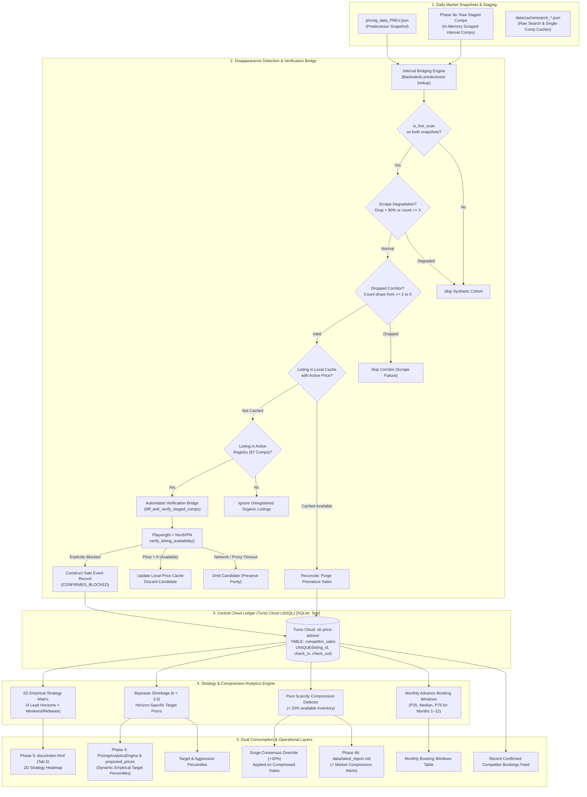
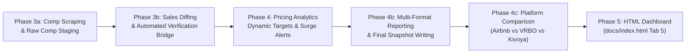

# Competitor Sales Tracking, Disappearance Detection & Absorption Velocity Engine
**Technical Architecture, Algorithmic Specification & Implementation Guide**

---

## 1. Executive Summary & Core Hypothesis

### 1.1 The Short-Term Rental Absorption Problem
Traditional short-term rental (STR) revenue management systems rely almost exclusively on **asking prices** (what competitors are currently advertising). However, asking rates only reflect market *supply*; they do not reveal market *absorption*—which listings guests actually purchase, at what clearing prices, and how far in advance of check-in those transactions occur.

Benchmarking Villa del Sol against unbooked competitor asking prices risks inheriting competitor pricing errors and vacancies. To maximize revenue and preserve calendar equity, the pricing engine must track empirical market absorption:
$$\text{Market Supply (Asking Rates)} \quad \longrightarrow \quad \mathbf{\text{Market Absorption (Confirmed Clearing Sales)}}$$

### 1.2 The Disappearance Hypothesis
In a finite short-term rental market, when a previously available competitor listing ceases to be bookable for a specific stay interval $(D_{\text{in}} \to D_{\text{out}})$, it serves as an empirical indicator that the property has been **booked (sold)** or taken off the market.

By capturing consecutive daily pricing snapshots ($\mathcal{S}_{T-1}, \mathcal{S}_T$), detecting listing disappearances, verifying true calendar unavailability, and recording transactions with their exact **lead-time horizon** ($N$ days before check-in) and **clearing price percentile** ($Y^{\text{th}}$ percentile), the engine builds an empirical sales ledger. This ledger powers:
1. **Dynamic Target Pricing**: Replaces static, hardcoded percentiles in [`src/analytics.py`](file:///Users/ivanpe/str-price-advisor/src/analytics.py) and [`src/proposed_prices.py`](file:///Users/ivanpe/str-price-advisor/src/proposed_prices.py) with empirical Bayesian-shrunk clearing percentiles.
2. **Market Compression & Surge Harvesting**: Detects pure market scarcity whenever active available competitor inventory drops below $20\%$ of the cohort and applies target percentile boosts ($+15\%$) and surge floors ($1.30\times$) to capture scarcity demand.
3. **Interactive & Advisory Reporting**: Powers Tab 5 on [`docs/index.html`](file:///Users/ivanpe/str-price-advisor/docs/index.html) and weekly markdown audit alerts in [`data/latest_report.md`](file:///Users/ivanpe/str-price-advisor/data/latest_report.md).

### 1.3 The False-Positive Trap & Anti-Detection Defenses
A naive implementation that treats every disappearance from broad search as a confirmed sale suffers from severe false positives:
- **Search Pagination Fallout**: Airbnb's desktop search only displays 18 cards per page. Organic search rankings fluctuate daily; a listing dropping from rank #15 to #22 is still 100% available, but absent from Page 1 search results.
- **Transient Scrape Degradation**: If an edge proxy or corridor query returns only 2 comps due to rate limiting or timeout, diffing against a full snapshot would erroneously record dozens of false sales.
- **Dropped Corridors**: If an entire geographic query (e.g., Mesa Tier A) fails, all comps in that corridor would falsely appear sold.

To ensure 100% ledger purity, this specification defines a **multi-stage defensive detection pipeline** combined with an **automated calendar verification bridge** and **active daily reconciliation**.

---

## 2. System Architecture & Component Overview



---

## 3. Mathematical & Algorithmic Formulations

### 3.1 Stay Intervals & Candidate Disappearances
Let a market pricing snapshot $\mathcal{S}$ contain a collection of stay intervals:
$$\mathcal{S} = \{(D_{\text{in}}, D_{\text{out}}, \mathcal{C})\}$$
where $\mathcal{C}$ is the set of observed active competitor listings for stay interval $(D_{\text{in}}, D_{\text{out}})$.

Let $\mathcal{R}$ be the set of curated, active competitor listings in `config/comps_registry.json` (excluding disqualified listings and excluded comps).

When comparing predecessor snapshot $\mathcal{S}_{\text{prev}}$ against successor snapshot or staged raw comps $\mathcal{S}_{\text{curr}}$:
$$\Delta_{\text{candidates}} = \{ c \in \mathcal{C}_{\text{prev}} \cap \mathcal{R} \mid c \notin \mathcal{C}_{\text{curr}} \}$$

### 3.2 Booking Lead-Time Horizon ($N$)
For a stay interval with check-in date $D_{\text{in}}$ detected as booked on date $D_{\text{detected}}$:
$$N = \max\left(0, (D_{\text{in}} - D_{\text{detected}}).\text{days}\right)$$

Lead times are segmented into four strategic horizons:
| Horizon | Interval Days | Market Dynamic | Strategy Directive |
|---|---|---|---|
| **Far-Out** | $> 90$ days | Early planners, inelastic corporate/family groups | Hold firm at premium percentiles (65%–70% Weekend / 45%–50% Midweek). Do not discount. |
| **Peak Booking** | $31\text{–}90$ days | Prime conversion window for luxury group travel | Target 60%–65% Weekend / 45%–50% Midweek. Match competitive pacing. |
| **Near-Term** | $15\text{–}30$ days | Compressing demand curve, rising price elasticity | Trim to 50%–55% Weekend / 38%–42% Midweek if unbooked to accelerate booking velocity. |
| **Last-Minute** | $\le 14$ days | Distress liquidation window; high perishability risk | Aggressive conversion: 40%–45% Weekend / 30%–35% Midweek to secure occupancy. |

### 3.3 Realized Clearing Rate & Inferred Market Percentile Rank ($Y$)
For a confirmed sale of listing $c$, its last observed effective nightly rate is:
$$R_c = \frac{\text{Total Price}}{\text{Nights}}$$

Its quality-adjusted rate normalized against Villa del Sol's luxury baseline is:
$$R_{\text{adj}, c} = \frac{R_c}{\text{Desirability Ratio}_c}$$

Its market percentile rank within the stay interval's curated comp distribution prior to booking is calculated strictly over curated registered comps $\mathcal{C}_{\text{prev}} \cap \mathcal{R}$ per PRD §6 FR-2:
$$Y_c = \frac{\sum_{i \in \mathcal{C}_{\text{prev}} \cap \mathcal{R}} \mathbf{1}\left(R_i \le R_c\right)}{|\mathcal{C}_{\text{prev}} \cap \mathcal{R}|} \times 100$$
*(Note: Raw effective nightly rates $R_i$ are evaluated to capture nominal transaction clearing price points within the verified competitor cohort, eliminating uncurated organic search churn).*

### 3.4 2D Strategy Matrix & Horizon-Specific Bayesian Shrinkage
For each cell defined by Horizon $H \in \{>90\text{d}, 31\text{–}90\text{d}, 15\text{–}30\text{d}, \le 14\text{d}\}$ and Stay Type $T \in \{\text{Weekend}, \text{Midweek}\}$:
- Empirical Sample Size: $n = |\{s \in \text{Sales} \mid s \in (H, T)\}|$
- Empirical Median: $P_{50} = \text{Median}(\{Y_s \mid s \in (H, T)\})$ for $n > 0$
- Empirical 75th Percentile: $P_{75} = \text{Percentile}_{75}(\{Y_s \mid s \in (H, T)\})$ for $n > 0$

To prevent low-sample volatility ($n < 3$), the system applies Bayesian shrinkage with pseudo-observation weight $k = 3.0$ against horizon-specific baseline pricing priors, with explicit boundary conditions when $n = 0$:
$$\hat{Y}_{\text{target}}(H, T) = \begin{cases} Y_{\text{prior}}(H, T) & \text{if } n = 0 \\ \frac{n \cdot P_{50} + k \cdot Y_{\text{prior}}(H, T)}{n + k} & \text{if } n > 0 \end{cases}$$
$$\hat{Y}_{\text{aggressive}}(H, T) = \begin{cases} Y_{\text{prior, P75}}(H, T) & \text{if } n = 0 \\ \frac{n \cdot P_{75} + k \cdot Y_{\text{prior, P75}}(H, T)}{n + k} & \text{if } n > 0 \end{cases}$$

*(When $n = 0$, empirical $P_{50}$ and $P_{75}$ are rendered as `"—"` in dashboard tables, while recommended targets seamlessly utilize the baseline prior).*

#### Horizon-Specific Baseline Priors Table
To ensure that sparse data does not pull near-term liquidation rates up to peak-season levels, the system uses tiered priors matching our revenue management strategy:

| Horizon ($H$) | Lead Days | Weekend Target Prior ($Y_{\text{prior}}$) | Weekend P75 Prior | Midweek Target Prior ($Y_{\text{prior}}$) | Midweek P75 Prior |
|---|---|---|---|---|---|
| **Far-Out** | $> 90$ days | $67.5\%$ | $75.0\%$ | $47.5\%$ | $55.0\%$ |
| **Peak Booking** | $31\text{–}90$ days | $62.5\%$ | $70.0\%$ | $45.5\%$ | $52.5\%$ |
| **Near-Term** | $15\text{–}30$ days | $52.5\%$ | $60.0\%$ | $38.5\%$ | $45.0\%$ |
| **Last-Minute** | $\le 14$ days | $42.5\%$ | $50.0\%$ | $31.5\%$ | $38.0\%$ |

### 3.5 Monthly Advance Booking Windows
For each stay month $m \in \{1, 2, \dots, 12\}$:
$$\mathcal{L}_m = \{N_s \mid s \in \text{Sales}, \text{Month}(D_{\text{in}, s}) = m\}$$
Quartiles $P_{25}, \text{Median } (P_{50}), P_{75}$ are computed using standard rank interpolation ($p \cdot (n - 1)$) to generate the empirical booking pace window ($P_{25}\text{–}P_{75}$ days out).

### 3.6 Market Compression & Pure Market Scarcity Engine
Market compression occurs when competitor inventory is heavily depleted, leaving fewer than 20% of the luxury cohort available. This severe market scarcity indicates high-intensity unconstrained demand (e.g., WM Phoenix Open, Barrett-Jackson, Cactus League Spring Training, major concerts, or multi-generational wedding blocks).

#### 3.6.1 Pure Market Scarcity Formulation
Rather than relying on noisy short-term 48-hour scraping diffs, High Compression is defined by **Pure Market Scarcity**: triggered whenever active available competitor inventory drops below **$20\%$** of the active luxury cohort ($>80\%$ market absorption / unavailable).

For an active cohort of registered luxury comps $\mathcal{R}$ with total count $N_{\text{total}}$ and available comps count $N_{\text{avail}}(D_{\text{in}})$:
$$\text{Availability Ratio}(D_{\text{in}}) = \frac{N_{\text{avail}}(D_{\text{in}})}{N_{\text{total}}} < 0.20 \quad \Longleftrightarrow \quad N_{\text{avail}}(D_{\text{in}}) \le \lfloor 0.20 \cdot N_{\text{total}} - 10^{-9} \rfloor$$

#### 3.6.2 Cohort Compression Thresholds
Across our active curated competitor cohorts, the exact scarcity triggers are:
1. **All Active Comps ($N_{\text{total}} = 97$)**:
   $$\text{Threshold} = 0.20 \times 97 = 19.4 \implies \mathbf{N_{\text{avail}} \le 19 \text{ comps}} \quad (19 / 97 = 19.58\% < 20\%)$$
2. **Tier A Cohort ($N_{\text{total}} = 49$, 16+ guests, 6+ BR)**:
   $$\text{Threshold} = 0.20 \times 49 = 9.8 \implies \mathbf{N_{\text{avail}} \le 9 \text{ comps}} \quad (9 / 49 = 18.37\% < 20\%)$$
3. **Tier B Cohort ($N_{\text{total}} = 48$, 12–15 guests, 5 BR)**:
   $$\text{Threshold} = 0.20 \times 48 = 9.6 \implies \mathbf{N_{\text{avail}} \le 9 \text{ comps}} \quad (9 / 48 = 18.75\% < 20\%)$$

#### 3.6.3 Pricing Directive, Non-Compounding Surge & Consensus Policy Override
To capture scarcity premiums while preventing compounding double-surges (e.g., elevating the percentile and then multiplying the resulting rate by 1.30), the pricing engine enforces a unified surge pipeline:

1. **Upstream Market Elevation (`PricingAnalyticsEngine`)**: In [`src/analytics.py`](file:///Users/ivanpe/str-price-advisor/src/analytics.py), whenever scarcity compression is detected ($N_{\text{avail}} / N_{\text{total}} < 0.20$), the target percentile is boosted by **$+15\%$** (capped at $90.0\%$):
   $$\hat{Y}_{\text{target, surge}} = \min(90.0\%, \hat{Y}_{\text{target}} + 15.0\%)$$
   which elevates the recommended market clearing rate $P_{\text{rec, surge}}$ (e.g., P65 $\to$ P80, P75 $\to$ P90).
2. **Non-Compounding Surge Rate (`src/proposed_prices.py`)**:
   $$P_{\text{proposed, surge}} = \min\left(P_{\text{ceiling}}, \max\left(\text{round}(P_{\text{proposed, normal}} \times 1.30), P_{\text{rec, surge}}\right)\right)$$
3. **Consensus Policy Override in `compute_interval_consensus()`**:
   Under ordinary circumstances, `compute_interval_consensus()` holds base rate $B$ (`CONFLICT_HOLD` or `NO_HISTORY_HOLD`) if historical median $H$ disagrees with market recommendation $M$. 
   **Policy Override Invariant**: When `segment.get("is_compression_surge") == True`:
   - Empirical real-time scarcity compression explicitly **overrides** `CONFLICT_HOLD` and `NO_HISTORY_HOLD`.
   - The interval consensus rate is assigned directly to $P_{\text{proposed, surge}}$ with status `"SURGE_INCREASE"`.
   - Protects Villa del Sol from selling out at outdated rates when the surrounding market experiences extreme scarcity.
4. **Alert Generation**: Triggers high-priority warnings in [`data/latest_report.md`](file:///Users/ivanpe/str-price-advisor/data/latest_report.md), outputs alerts in the CLI, and displays a `⚡ Scarcity Surge` badge on the HTML dashboard.

#### 3.6.4 Visual Trajectory Highlighting on Comp Sales Chart (`docs/index.html#tab-market-sales`)
High Compression is visually integrated into the 12-Month Market Availability & Absorption Trajectory chart:
1. **Vertical Amber Column Shading**: Subtle translucent amber columns (`rgba(245, 158, 11, 0.12)`) drawn directly onto the canvas behind every calendar date under high compression ($<20\%$ available comps).
2. **Horizontal Dashed Threshold Guide Line**: A crisp dashed amber line drawn across the chart at $y = 0.80 \times N_{\text{total}}$ labeled `⚡ 20% Availability Threshold (≤X comps)`.
3. **Streamlined Minimal Tooltips**: Focused strictly on core context: day of week, ISO date, and Villa del Sol availability status (e.g., `Mon, 2026-12-21` and `🟨 Villa del Sol: Available & Open` / `⬛ Villa del Sol: Booked Guest Stay`), eliminating secondary clutter while canvas shading and the 5th KPI card communicate compression.
4. **5th Trajectory KPI Card (`#trajCompressionDays`)**: A dedicated KPI card displaying the total count and percentage of visible days under compression, dynamically recalculating on 90D, 6M, and 12M range zooms.

### 3.7 Dynamic Pricing Engine Integration (`src/proposed_prices.py` & `src/analytics.py`)
To satisfy PRD §4.1, static percentile curves in [`src/analytics.py`](file:///Users/ivanpe/str-price-advisor/src/analytics.py) are replaced with dynamic empirical targets queried from the sales tracker.

#### 3.7.1 Tracker API Specifications
`CompetitorSalesTracker` provides the following query methods with in-memory caching:

```python
def get_target_percentile(self, lead_time_days: int, segment_type: str = "weekend") -> float:
    """
    Retrieve empirical Bayesian-shrunk target percentile for a lead-time horizon.
    Smoothly falls back to horizon-specific priors (k = 3.0) if sample size n < 3.
    Caches the 2D strategy grid in memory to prevent redundant SQLite queries across segments.
    """

def detect_market_compression(
    self, 
    check_in: str, 
    check_out: Optional[str] = None, 
    total_cohort_count: Optional[int] = None,
    current_available_count: Optional[int] = None,
) -> Dict[str, Any]:
    """
    Evaluate pure market scarcity for an interval.
    Triggers when available comps drop below 20% of the active cohort (avail_ratio < 0.20).
    Returns:
      {
        'is_compressed': bool,
        'available_count': int,
        'total_cohort_count': int,
        'available_ratio': float,
        'surge_multiplier': 1.30,
        'reason': str
      }
    """

def get_recent_sales(self, lookback_days: int = 7) -> List[Dict[str, Any]]:
    """Query verified sales confirmed in the last lookback_days for markdown audit reports."""

def get_active_compression_alerts(self, lookback_hours: int = 48) -> List[Dict[str, Any]]:
    """Retrieve all upcoming intervals currently meeting pure scarcity compression (<20% available)."""
```

#### 3.7.2 Analytics Evaluation Wiring
In [`src/analytics.py`](file:///Users/ivanpe/str-price-advisor/src/analytics.py) (`evaluate_segment`):
```python
if self.sales_tracker:
    target_pct = self.sales_tracker.get_target_percentile(lead_days, segment_type=seg_type)
    reg_comps = self.sales_tracker.load_registered_comps()
    tot_reg = len(reg_comps) if reg_comps else len(effective_rates_to_use)
    compression = self.sales_tracker.detect_market_compression(
        check_in=segment.get("check_in", ""),
        check_out=segment.get("check_out"),
        total_cohort_count=tot_reg,
        current_available_count=len(effective_rates_to_use),
    )
    if compression.get("is_compressed"):
        target_pct = min(90.0, target_pct + 15.0)
        segment["is_compression_surge"] = True
        segment["compression_details"] = compression
    else:
        segment["is_compression_surge"] = False
        segment.pop("compression_details", None)
else:
    target_pct = self.get_target_percentile(lead_days, segment_type=seg_type)
```

---

## 4. Multi-Stage Defensive Detection Pipeline

To completely eliminate false sales while capturing true bookings, the diff engine implements six sequential defense barriers:

### Stage 1: Interval Predecessor Bridging (`process_latest_snapshot`)
Daily quick scans monitor 12 near-term intervals, whereas weekly full scans monitor up to 79 intervals. Comparing a 12-interval scan against a 79-interval scan directly would cause 67 far-out intervals to appear orphaned.
- **Algorithm**: For each interval $(D_{\text{in}}, D_{\text{out}})$ in the current scan, the engine searches backwards chronologically through prior snapshots (`data/pricing_data_*.json`) to locate the most recent snapshot containing that specific interval.
- Intervals are partitioned by predecessor file (`intervals_by_prev_path: Dict[Path, Set[Tuple[str, str]]]`), ensuring seamless continuity across mixed daily/weekly scan cadences.

### Stage 2: Live Platform Scan Guard (`is_live_scan`)
- Both previous and current interval objects must have `is_live_scan == True`.
- If either snapshot utilized fallback synthetic cohorts (e.g., during offline development or unproxied failure modes), the interval diff is aborted. Transitions between synthetic placeholders and live sweeps must never generate sales records.

### Stage 3: Scrape Degradation Guard
- If an interval previously contained $\ge 8$ registered comps, but the current scrape contains $\le 3$ comps (or comp count dropped by $> 80\%$), the engine detects search pagination truncation, network throttling, or anti-bot challenge.
- Disappearance detection for that interval is skipped entirely and logged as a warning.

### Stage 4: Dropped Corridors Guard
- The engine calculates comp counts grouped by geographic sub-market (Scottsdale, Tempe, Mesa, Paradise Valley).
- If a sub-market had $\ge 2$ registered comps previously and drops to exactly 0 comps in the current snapshot, that corridor is flagged as a failed query. Listings in that corridor are skipped.

### Stage 5: Local Search Cache Check
- Prior to declaring a listing disappeared, the engine inspects local search cache files (`data/cache/search_{check_in}_{check_out}_*.json`).
- If the listing appears in any valid cache file for that interval with an effective nightly rate $> 0$, the listing is verified available and cannot be marked sold.

### Stage 6: Curated Registry Filtering
- Disappearances among non-curated, organic search results are discarded immediately.
- Only listings present in `config/comps_registry.json` under `tier_a` or `tier_b` with `is_valid_comp == True` (and not in `excluded_comps` or `disqualified`) are evaluated.

---

## 5. Two-Tier Verification & Reconciliation Engine

### 5.1 Fast Snapshot Reconciliation (Auto-Healing)
Reconciliation runs automatically:
1. At the start of every diffing run.
2. At dashboard generation time via `reconcile_with_latest_snapshot()`.

**Reconciliation Rule**:
If a property/stay interval $(C, D_{\text{in}}, D_{\text{out}})$ is observed **AVAILABLE** with price $> 0$ in:
- The current market snapshot (`pricing_data_CURR.json`),
- Any local search cache file (`data/cache/search_*.json`), or
- A verified audit file (`data/audit_sales_results.json`),
then it is physically impossible for the property to be booked. The engine immediately deletes any premature sale record:
```sql
DELETE FROM competitor_sales 
WHERE listing_id = ? AND check_in = ? AND check_out = ?;
```

### 5.2 Calendar Verification Architecture & Three-State Resolution
To enforce PRD §6 FR-5 (*"Unverified search dropouts must not be inserted into the database. All stored records must be verified by visiting the property page on Airbnb"*), the engine provides an automated verification bridge:

#### 5.2.1 Asynchronous Verification Bridge (`diff_and_verify_staged_comps`)
When candidate disappearances pass Stages 1–6, they are queued for active verification via `verify_listing_availability`:
```python
async def diff_and_verify_staged_comps(
    self,
    staged_intervals: Union[Dict[Tuple[str, str], List[Dict[str, Any]]], Dict[Tuple[str, str], Dict[str, Any]]],
    prev_snapshot_path: Optional[Path] = None,
    max_concurrent_checks: int = 5,
) -> List[Dict[str, Any]]:
    """
    Detect candidate dropouts between predecessor snapshots and newly scraped staged comps.
    If prev_snapshot_path is omitted, automatically executes Stage 1 backwards search across data/.
    Verifies candidates via throttled Playwright + NordVPN PDP sweeps and persists confirmed sales.
    """
```

#### 5.2.2 Strict Three-State Outcome Resolution (FR-5 Purity Invariant)
To ensure network timeouts or proxy interruptions are never recorded as sales:
1. **`CONFIRMED_BLOCKED`**: The listing's PDP response explicitly returns `unavail == True` or a localized unavailability message (e.g. *"Those dates are not available"*). Committed to SQLite with status `CONFIRMED_BLOCKED`.
2. **`CONFIRMED_AVAILABLE`**: The PDP returns `price > 0` and `unavail == False`. Local cache is updated with the active price, the candidate is discarded, and any prior premature sales record is auto-healed.
3. **`UNVERIFIED_ERROR`**: If the request encounters a timeout (e.g., 25s limit), network disconnect, HTTP 429/503 error, or anti-bot challenge where availability cannot be proven (`price is None` and `unavail == False`), the candidate is **strictly omitted from SQLite**. It will be re-evaluated during the next scan.

### 5.3 Direct Sale Recording (`record_direct_sale`)
When a direct checkout sweep confirms a comp is blocked/booked:
```python
tracker.record_direct_sale(
    listing_id=listing_id,
    check_in=check_in,
    check_out=check_out,
    nights=nights,
    last_observed_rate=rate,
    verification_status="CONFIRMED_BLOCKED",
    raw_snippet="Direct Verified Checkout Sweep"
)
```

---

## 6. Database Schema & Storage Specifications

### 6.1 Database Schema (Turso Cloud `competitor_sales`, SQLite Testing Fallback)
```sql
CREATE TABLE IF NOT EXISTS competitor_sales (
    id INTEGER PRIMARY KEY AUTOINCREMENT,
    listing_id TEXT NOT NULL,
    listing_name TEXT,
    tier TEXT,                          -- 'tier_a' (16+ guests) or 'tier_b' (12-15 guests)
    location TEXT,                      -- Scottsdale, Tempe, etc.
    check_in TEXT NOT NULL,             -- YYYY-MM-DD
    check_out TEXT NOT NULL,            -- YYYY-MM-DD
    nights INTEGER NOT NULL,            -- Number of stay nights
    segment_type TEXT NOT NULL,         -- 'weekend', 'midweek', 'mix'
    detected_date TEXT NOT NULL,        -- Snapshot date when disappearance was confirmed
    lead_time_days INTEGER NOT NULL,    -- (check_in - detected_date) in days
    last_observed_rate REAL NOT NULL,   -- Last raw effective nightly rate ($)
    last_observed_adj_rate REAL,        -- Quality-adjusted effective nightly rate ($)
    last_observed_percentile REAL,      -- Market percentile rank at time of sale (0.0–100.0)
    composite_score REAL,               -- 6-factor luxury score (0.0–100.0)
    desirability_ratio REAL,            -- Quality desirability ratio relative to Villa del Sol
    verification_status TEXT NOT NULL,  -- 'CONFIRMED_BLOCKED'
    raw_snippet TEXT,
    created_at TIMESTAMP DEFAULT CURRENT_TIMESTAMP,
    UNIQUE(listing_id, check_in, check_out)
);

CREATE INDEX IF NOT EXISTS idx_comp_sales_lead ON competitor_sales(lead_time_days);
CREATE INDEX IF NOT EXISTS idx_comp_sales_seg ON competitor_sales(segment_type);
CREATE INDEX IF NOT EXISTS idx_comp_sales_detected ON competitor_sales(detected_date);
CREATE INDEX IF NOT EXISTS idx_comp_sales_surge ON competitor_sales(check_in, detected_date);
```

### 6.2 Idempotent Upsert & Earliest Detection Preservation
When a sale is recorded, the engine enforces uniqueness on `(listing_id, check_in, check_out)`. If the sale is detected across multiple consecutive diffs, it preserves the **earliest detection date** and recalculates the maximum lead time:
```sql
INSERT INTO competitor_sales (
    listing_id, listing_name, tier, location, check_in, check_out,
    nights, segment_type, detected_date, lead_time_days,
    last_observed_rate, last_observed_adj_rate, last_observed_percentile,
    composite_score, desirability_ratio, verification_status, raw_snippet
) VALUES ( ... )
ON CONFLICT(listing_id, check_in, check_out) DO UPDATE SET
    detected_date = CASE 
        WHEN excluded.detected_date < competitor_sales.detected_date 
        THEN excluded.detected_date 
        ELSE competitor_sales.detected_date 
    END,
    lead_time_days = CASE
        WHEN excluded.detected_date < competitor_sales.detected_date
        THEN excluded.lead_time_days
        ELSE competitor_sales.lead_time_days
    END,
    verification_status = CASE
        WHEN excluded.verification_status = 'CONFIRMED_BLOCKED'
        THEN 'CONFIRMED_BLOCKED'
        ELSE competitor_sales.verification_status
    END;
```

---

## 7. Operational Workflows & CLI Integration

### 7.1 Decoupled Pipeline Execution Flow (`src.cli.run`)
To resolve circular file dependencies and guarantee that freshly detected sales, empirical targets, and surge flags inform pricing and reporting, the pipeline is structured into five decoupled phases:



```python
# Phase 3a: Scrape comp listings across active intervals into staged dictionary
# raw_staged_comps: Dict[Tuple[str, str], List[Dict[str, Any]]]
raw_staged_comps = await collector.scrape_all_active_intervals(active_segments)

# Phase 3b: Competitor Sales Tracking & Verification Bridge
sales_tracker = CompetitorSalesTracker()
sales_tracker.reconcile_with_latest_snapshot()
new_sales = await sales_tracker.diff_and_verify_staged_comps(
    staged_intervals=raw_staged_comps,
)

# Phase 4: Pricing Analytics with Dynamic Empirical Targets & Surge Detection
analytics = PricingAnalyticsEngine(sales_tracker=sales_tracker)
evaluated_results = [
    analytics.evaluate_segment(s, raw_staged_comps.get((s["check_in"], s["check_out"]), []))
    for s in active_segments
]
# compute_interval_consensus applies the scarcity surge policy override when is_compression_surge is True
proposed_prices = generate_proposed_prices(seasonal_rates, evaluated_results)

# Phase 4b: Multi-Format Advisory Reporting & Snapshot Finalization
# (Writes latest_report.md with sales alerts, pricing_sheet.csv, and pricing_data_YYYY-MM-DD.json)
reporter = PriceReportGenerator(sales_tracker=sales_tracker)
outputs = reporter.generate_all(evaluated_results, property_name="Villa del Sol")
```

### 7.2 Standalone CLI Operations (`track-competitor-sales`)
```bash
# Diff the two most recent snapshots with active Playwright PDP verification:
.venv/bin/python -m src.cli track-competitor-sales --verify

# Backfill historical sales across all existing chronological snapshots in data/:
.venv/bin/python -m src.cli track-competitor-sales --backfill

# Diff, recompute analytics, regenerate dashboard, and deploy to GitHub Pages:
.venv/bin/python -m src.cli track-competitor-sales --dashboard --push
```
*(Operational Note: `--backfill --verify` executes live Playwright PDP checks for future intervals with $D_{\text{in}} \ge T_{\text{today}}$. For historical past dates where live checkout search is prohibited by Airbnb, backfilling relies on Stage 1–6 snapshot diff guards and verified audit files `data/audit_sales_results.json`).*

### 7.3 Portfolio Lifecycle Hooks
Whenever a competitor listing is disqualified or removed:
- `CompManager.remove_comp(listing_id)` executes:
  `DELETE FROM competitor_sales WHERE listing_id = ?;`
- `CompetitorSalesTracker.purge_sales_for_disqualified_comps()` audits `config/comps_registry.json` and purges historical records for any listing currently in `excluded_comps` or `disqualified`.

### 7.4 Markdown Advisory Report Integration (`src/reporter.py` / `latest_report.md`)
`PriceReportGenerator._build_markdown_report` embeds two dedicated sections into [`data/latest_report.md`](file:///Users/ivanpe/str-price-advisor/data/latest_report.md):

1. **⚡ Market Compression & Scarcity Alerts**:
   - Emitted whenever available comps drop below $20\%$ of the active luxury cohort ($N_{\text{avail}} / N_{\text{total}} < 0.20$).
   - Advises host: *"Severe market scarcity (<20% comps available for [Dates]). Scarcity surge directive applied (+30% rate adjustment)."*
2. **🎯 Recent Confirmed Competitor Sales Ledger**:
   - Table of sales confirmed within the past 7 days: Property Name, Stay Dates, Lead Days, Realized Nightly Rate, Quality-Adjusted Rate, and Market Percentile at Sale.

---

## 8. Dashboard Presentation Specification (`docs/index.html`)

The dashboard features **Tab 5: 🎯 Comps Sales** (`#tab-market-sales`), structured into four visual zones:

1. **Executive KPI Strip**:
   - Total Confirmed Sales Count
   - Overall Median Absorption Percentile
   - Average Booking Lead Time
   - Realized Average Nightly Rate
   - Weekend vs. Midweek Sales Ratio

2. **Competitor Monthly Advance Booking Windows**:
   - Table displaying rows for January through December.
   - Columns: Month, Season Badge, Sales Count, Median Lead Time, P25–P75 Interquartile Window, Min–Max Range, and Narrative Revenue Guidance.

3. **2D Empirical Strategy Matrix (Heatmap Grid)**:
   - Rows: 4 Horizons (`>90d`, `31–90d`, `15–30d`, `≤14d`).
   - Columns: Weekend vs. Midweek.
   - Cells display: Sales Count, Empirical $P_{50}$ / $P_{75}$, Bayesian Recommended Target, Baseline Prior, and Average Realized Nightly Rate.
   - Displays a `⚡ Scarcity Surge` badge on any horizon cell containing an actively compressed upcoming interval.

4. **Recent Confirmed Competitor Bookings Feed**:
   - Chronological table of verified transactions: Property Name, Stay Dates, Nights, Lead Days, Realized Rate, Quality-Adjusted Rate, Market Percentile Rank, Desirability Ratio, and `CONFIRMED_BLOCKED` Status Badge.

---

## 9. Verification & Testing Matrix

Any conforming implementation must satisfy the following automated verification tests:

| Test Case | Method / Target | Validation Criteria |
|---|---|---|
| **Disappearance Detection** | `test_diff_snapshots_detects_sales` | Verifies listing present in snapshot $T-1$ and missing in $T$ generates a sales record. |
| **Active Reconciliation** | `test_reconcile_purges_available_listing` | Verifies listing reappearing in current snapshot or cache purges premature sale. |
| **Live Scan Invariant** | `test_synthetic_scan_skipped` | Verifies intervals with `is_live_scan=False` do not generate sales events. |
| **Degradation Guard** | `test_scrape_degradation_guard` | Verifies comp count dropping from $\ge 8$ to $\le 3$ skips disappearance detection. |
| **Corridor Drop Guard** | `test_dropped_corridor_guard` | Verifies entire geographic sub-market dropping to 0 skips sales detection. |
| **Earliest Detection Upsert** | `test_earliest_detected_date_preserved` | Verifies repeated detections preserve earliest `detected_date` and max `lead_time_days`. |
| **Bayesian Shrinkage (Tiered Priors)** | `test_bayesian_shrinkage_tiered_priors` | Verifies cell with $n < 3$ blends empirical median with horizon-specific priors (e.g. 42.5% for last-minute weekend); verifies $n=0$ returns prior directly. |
| **Monthly Quartiles** | `test_monthly_lead_time_quartiles` | Verifies $P_{25}, P_{50}, P_{75}$ calculations across 12 calendar months. |
| **Three-State PDP Verification** | `test_verify_listing_availability_three_states` | Verifies parser sets `blocked=True` only on explicit unavailable signal; network timeouts return `UNVERIFIED_ERROR` without inserting into DB. |
| **Verification Bridge** | `test_diff_and_verify_bridge_flow` | Verifies asynchronous bridge queries PDP for candidates and commits only blocked listings. |
| **Compression Surge & Scarcity** | `test_market_compression_surge_detection` | Verifies interval with $< 20\%$ available comps triggers surge directive ($+15\%$ target percentile boost, $1.30\times$ floor); normal availability ($\ge 20\%$) does not trigger. |
| **Consensus Policy Override** | `test_consensus_policy_surge_override` | Verifies `compute_interval_consensus` overrides `CONFLICT_HOLD` and `NO_HISTORY_HOLD` when `is_compression_surge=True`. |
| **Dynamic Target Lookup** | `test_get_target_percentile_empirical_lookup` | Verifies `get_target_percentile()` maps lead days to horizons, uses cached grid, and returns Bayesian targets. |
| **Advisory Report Alerts** | `test_reporter_embeds_sales_and_surge_alerts` | Verifies `latest_report.md` includes recent sales table and scarcity warnings. |
