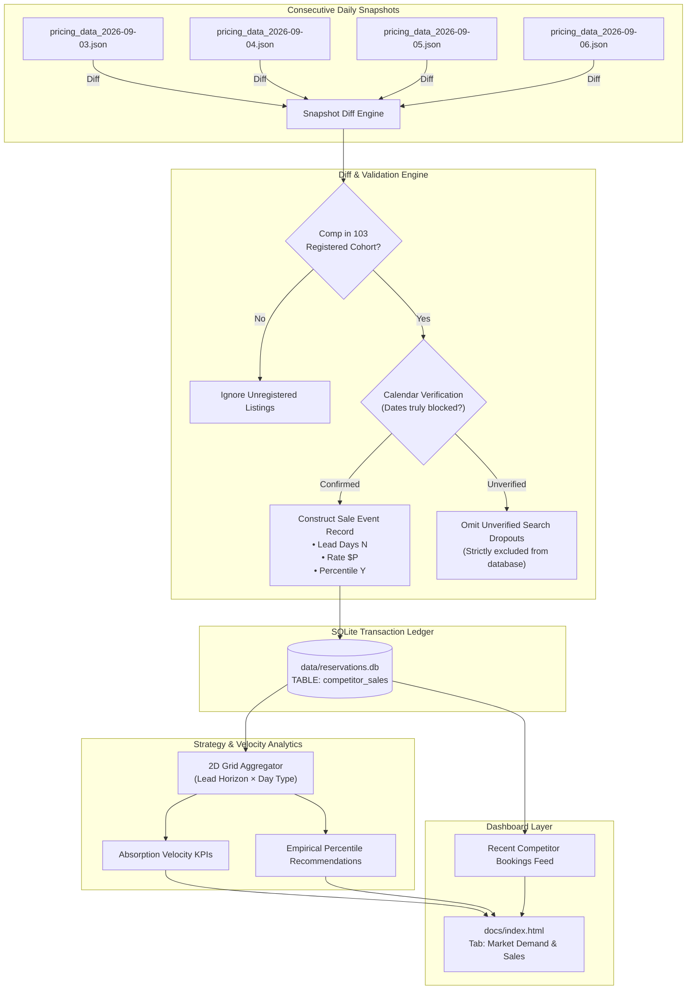

# Competitor Sales Tracking & Absorption Velocity Engine
**Technical Architecture & Design Specification**

---

## 1. Executive Summary & Problem Statement

Short-term rental pricing optimization traditionally relies on static competitor snapshots: comparing what competitors are currently asking today. However, asking prices only reveal supply; they do not reveal **market absorption** (what guests actually buy and at what price).

The **Competitor Sales Tracking & Absorption Velocity Engine** solves this by:
1. Converting consecutive market pricing snapshots (`pricing_data_YYYY-MM-DD.json`) into an empirical transaction ledger.
2. Detecting when a competitor listing disappears for a specific stay interval ($N$ days before check-in).
3. Verifying that the disappearance represents a true booking (calendar blocked) rather than search pagination fallout.
4. Recording the event with its exact **lead-time horizon** ($N$ days) and **market percentile rank** ($Y^{\text{th}}$ percentile).
5. Aggregating historical sales into a **2D Strategy Grid** (Lead-Time Horizon $\times$ Stay Type) to recommend mathematically grounded target percentiles.

---

## 2. Mathematical & Algorithmic Foundations

### 2.1 Lead-Time Horizon ($N$)
For any stay interval with check-in date $D_{\text{in}}$ detected as booked on snapshot date $D_{\text{snap}}$:
$$N = (D_{\text{in}} - D_{\text{snap}}).\text{days}$$

Lead times are partitioned into four strategic horizons:
- **Horizon 1: Far-Out (> 90 days)** — Early planners with high willingness-to-pay.
- **Horizon 2: Mid-Term (31–90 days)** — Peak booking window for family vacations and luxury group travel.
- **Horizon 3: Near-Term (15–30 days)** — Compressing demand window where price sensitivity increases.
- **Horizon 4: Last-Minute ($\le 14$ days)** — Distress absorption window where unfilled inventory must discount.

### 2.2 Inferred Competitor Percentile ($Y$)
When competitor listing $C$ was last observed on date $D_{\text{prev}}$ with quality-adjusted effective nightly rate $R_{\text{adj}}$, its percentile rank within that interval's comp distribution was:
$$Y = \frac{\text{Count of comps with rate } \le R_{\text{adj}}}{\text{Total available comps in interval}} \times 100$$

### 2.3 2D Empirical Strategy Matrix
For each combination of Horizon $H \in \{>90\text{d}, 31\text{--}90\text{d}, 15\text{--}30\text{d}, \le 14\text{d}\}$ and Stay Type $T \in \{\text{Weekend}, \text{Midweek}\}$:
$$\text{Target Percentile}_{\text{optimal}}(H, T) = \text{Median}\left(\{Y_i \mid \text{sale } i \in (H, T)\}\right)$$
$$\text{Aggressive Percentile}(H, T) = \text{P}_{75}\left(\{Y_i \mid \text{sale } i \in (H, T)\}\right)$$

If an empirical bucket has fewer than 3 historical samples, the system smoothly blends empirical sales with the baseline rubric (65th percentile weekend, 45.5th percentile midweek) via Bayesian shrinkage:
$$\hat{Y} = \frac{n \cdot \bar{Y}_{\text{empirical}} + k \cdot Y_{\text{prior}}}{n + k} \quad (k = 3)$$

---

## 3. Data Pipeline & Schema Architecture



### 3.1 SQLite Schema (`data/reservations.db`)
```sql
CREATE TABLE IF NOT EXISTS competitor_sales (
    id INTEGER PRIMARY KEY AUTOINCREMENT,
    listing_id TEXT NOT NULL,
    listing_name TEXT,
    tier TEXT,                          -- 'tier_a' (16+ guests) or 'tier_b' (12-15 guests)
    location TEXT,                      -- Scottsdale, Tempe, etc.
    check_in TEXT NOT NULL,             -- YYYY-MM-DD
    check_out TEXT NOT NULL,            -- YYYY-MM-DD
    nights INTEGER NOT NULL,            -- Number of stay nights
    segment_type TEXT NOT NULL,         -- 'weekend', 'midweek', 'mix'
    detected_date TEXT NOT NULL,        -- Snapshot date when disappearance was confirmed
    lead_time_days INTEGER NOT NULL,    -- (check_in - detected_date) in days
    last_observed_rate REAL NOT NULL,   -- Last raw effective nightly rate
    last_observed_adj_rate REAL,        -- Quality-adjusted effective nightly rate
    last_observed_percentile REAL,      -- Market percentile at time of sale (0-100)
    composite_score REAL,               -- 6-factor score (e.g. 92.5)
    desirability_ratio REAL,            -- Desirability ratio (e.g. 1.15)
    verification_status TEXT NOT NULL,  -- 'CONFIRMED_BLOCKED' (unverified dropouts are omitted)
    raw_snippet TEXT,
    created_at TIMESTAMP DEFAULT CURRENT_TIMESTAMP,
    UNIQUE(listing_id, check_in, check_out)
);

CREATE INDEX IF NOT EXISTS idx_comp_sales_lead ON competitor_sales(lead_time_days);
CREATE INDEX IF NOT EXISTS idx_comp_sales_seg ON competitor_sales(segment_type);
CREATE INDEX IF NOT EXISTS idx_comp_sales_detected ON competitor_sales(detected_date);
```

---

## 4. Operational Workflows & CLI Commands

### 4.1 Automated Workflow (Integrated with Daily Pipeline)
Whenever `.venv/bin/python -m src.cli run` executes:
1. The new snapshot `pricing_data_YYYY-MM-DD.json` is generated.
2. The engine discovers the immediate preceding snapshot in `data/`.
3. It performs the interval diff, validates disappearances, and records new sales.
4. The dashboard is re-rendered with updated absorption velocity metrics.

### 4.2 Standalone CLI Command (`track-competitor-sales`)
```bash
# Backfill all existing chronological snapshots in data/
.venv/bin/python -m src.cli track-competitor-sales --backfill

# Diff latest two snapshots with strict calendar verification:
.venv/bin/python -m src.cli track-competitor-sales --verify

# Refresh dashboard and push to GitHub Pages:
.venv/bin/python -m src.cli track-competitor-sales --dashboard --push
```

---

## 5. UI Presentation (`docs/index.html`)

The dashboard introduces a new primary tab: **"Market Demand & Sales"** (`#tab-market-sales`):
1. **Top KPI Bar**:
   - `Total Competitor Sales Detected`
   - `Median Absorption Percentile`
   - `Average Lead Time at Booking`
   - `Weekend vs. Midweek Absorption Premium`
2. **Empirical Strategy Matrix (Interactive Grid)**:
   - Visual heatmap displaying median and 75th percentile absorption rates across the 4 lead-time horizons for both Weekends and Midweeks.
   - Compares the empirical absorption rate with our current baseline strategy, highlighting opportunities to raise rates far out or trim rates last minute.
3. **Recent Competitor Bookings Feed**:
   - Chronological table showing properties that booked, stay dates, days in advance, last rate, and market percentile when sold.

