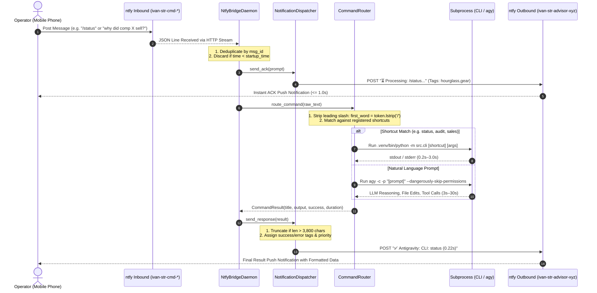

# Antigravity Two-Way Mobile ntfy Bridge
**Technical Architecture & System Design Document**

---

## 1. System Overview & Architecture Topology

The **Antigravity Two-Way Mobile ntfy Bridge** connects mobile devices to a local development machine running macOS, enabling remote operational control over the STR Price Advisor and the Google Antigravity AI Agent (`agy`).

### 1.1 Architectural Layers

The architecture consists of five coordinated layers:

```mermaid
graph TD
    subgraph ClientLayer ["1. Mobile Client Layer"]
        UserDevice["Android / iOS Device"]
        NtfyClient["ntfy Client App / Voice Dictation"]
    end

    subgraph RelayLayer ["2. Cloud Relay Layer (ntfy.sh)"]
        InboundTopic["Private Inbound Topic<br/>(ivan-str-cmd-8e2b4f91)"]
        OutboundTopic["Outbound Alert Topic<br/>(ivan-str-advisor-xyz)"]
    end

    subgraph DaemonLayer ["3. macOS Daemon Layer"]
        LaunchAgent["launchd Service Manager<br/>(com.villasol.mobile-ntfy-bridge)"]
        WrapperScript["run_mobile_bridge.sh<br/>(Env & PATH Setup)"]
        StreamListener["NtfyBridgeDaemon<br/>(SSE/JSON Streaming Listener)"]
        ConfigManager["MobileBridgeConfig<br/>(JSON & .env Resolution)"]
    end

    subgraph RoutingLayer ["4. Hybrid Smart Router Layer"]
        CommandRouter["CommandRouter"]
        Classifier{"Token Match / lstrip('/')"}
        SubprocessCLI["Direct Subprocess Runner<br/>(.venv/bin/python -m src.cli ...)"]
        SubprocessAgy["Headless Agent Runner<br/>(agy -c -p ... --dangerously-skip-permissions)"]
    end

    subgraph TargetLayer ["5. Local Data & Domain Layer"]
        SQLiteDB[("SQLite Database<br/>data/reservations.db")]
        CompsRegistry[("Curated Comps<br/>config/comps_registry.json")]
        Snapshots[("Daily Snapshots<br/>data/pricing_data_*.json")]
        NordPool["NordVPN Stealth SOCKS5 Pool"]
    end

    UserDevice --> NtfyClient
    NtfyClient -->|HTTP POST| InboundTopic
    InboundTopic -->|Persistent HTTP Stream| StreamListener
    LaunchAgent --> WrapperScript --> StreamListener
    ConfigManager -.-> StreamListener

    StreamListener -->|1. Instant ACK Push| OutboundTopic
    StreamListener --> CommandRouter
    CommandRouter --> Classifier

    Classifier -->|Shortcuts (status, audit, sales)| SubprocessCLI
    Classifier -->|Natural Language Prompts| SubprocessAgy

    SubprocessCLI <--> SQLiteDB & CompsRegistry & Snapshots & NordPool
    SubprocessAgy <--> SQLiteDB & CompsRegistry & Snapshots & NordPool

    SubprocessCLI -->|Result Payload| StreamListener
    SubprocessAgy -->|Result Payload| StreamListener
    StreamListener -->|2. Formatted Result Push| OutboundTopic
    OutboundTopic -->|Push Notification| UserDevice
```

---

## 2. End-to-End Execution Sequence

The complete request-response lifecycle follows a 10-step sequence:



---

## 3. Communication Protocol & Streaming Listener

### 3.1 ntfy JSON Streaming Endpoint
Rather than polling on an interval, the daemon maintains a persistent HTTP connection to the ntfy JSON stream:
```http
GET https://ntfy.sh/{inbound_topic}/json HTTP/1.1
Host: ntfy.sh
Accept: application/x-ndjson
```

Each event delivered by the relay is a single newline-delimited JSON (NDJSON) string:
```json
{"id":"LFjtcJxbhaCV","time":1789331879,"expires":1789375079,"event":"message","topic":"ivan-str-cmd-8e2b4f91","message":"/status"}
```

### 3.2 Deduplication & Startup Gating Logic
To eliminate ghost executions on re-connection:
1. **Startup Timestamp Gating**: On launch, the daemon sets `self.startup_time = time.time()`. Any buffered message with `data["time"] < (startup_time - 5.0)` is discarded.
2. **In-Memory ID Cache**: `self.seen_ids: Set[str]` tracks every processed message ID. Duplicate network deliveries of the same `id` are silently dropped.
3. **Non-Message Event Filtering**: Events with `event in ("open", "keepalive")` are acknowledged by the stream loop and bypassed.

### 3.3 Resilient Exponential Backoff
When transient Wi-Fi drops, VPN reconnects, or internet outages occur, the stream listener catches `requests.exceptions.RequestException` and applies bounded exponential backoff:

$$\text{delay}_{t+1} = \min(\text{delay}_t \times 1.5, \, 30.0\text{s})$$

Upon receiving an HTTP 200 connection, `current_delay` immediately resets to the base configured value (`self.config.reconnect_delay = 3.0s`).

---

## 4. Configuration & Environment Precedence

The configuration system (`MobileBridgeConfig`) resolves parameters across a 3-tier hierarchy:

| Priority | Tier | Source | Example Value |
| :---: | :--- | :--- | :--- |
| **1 (Highest)** | System Environment | Active shell environment | `export NTFY_INBOUND_TOPIC=custom-key` |
| **2** | Workspace Secrets | `.env` file in workspace root | `NTFY_INBOUND_TOPIC=ivan-str-cmd-8e2b4f91` |
| **3** | Versioned Config | `config/mobile_bridge.json` | Default configuration file |
| **4 (Lowest)** | Hardcoded Fallback | Code constants in `MobileBridgeConfig` | `reconnect_delay = 3.0`, `max_output_length = 3800` |

### 4.1 Schema of `config/mobile_bridge.json`
```json
{
  "inbound_topic": "ivan-str-cmd-8e2b4f91",
  "outbound_topic": "ivan-str-advisor-xyz",
  "workspace_dir": "/Users/ivanpe/str-price-advisor",
  "agy_path": "/Users/ivanpe/.local/bin/agy",
  "python_path": "/Users/ivanpe/str-price-advisor/.venv/bin/python",
  "notify_script": "/Users/ivanpe/.gemini/config/scripts/notify_mobile.sh",
  "reconnect_delay": 3.0,
  "max_output_length": 3800,
  "command_timeout_sec": 300,
  "shortcuts": {
    "status": {
      "desc": "System health, comp portfolio, sales, and reservations overview",
      "command": [".venv/bin/python", "-m", "src.cli", "status"]
    },
    "audit": {
      "desc": "Audit competitor portfolio against luxury rubric",
      "command": [".venv/bin/python", "-m", "src.cli", "audit-comps"]
    },
    "sales": {
      "desc": "Display competitor sales and absorption velocity summary",
      "command": [".venv/bin/python", "-m", "src.cli", "track-competitor-sales"]
    },
    "sales-verify": {
      "desc": "Live calendar verification sweep of competitor sales",
      "command": [".venv/bin/python", "-m", "src.cli", "track-competitor-sales", "--verify", "--dashboard"]
    },
    "dashboard": {
      "desc": "Regenerate HTML dashboard docs/index.html",
      "command": [".venv/bin/python", "-m", "src.cli", "generate-html"]
    },
    "test-kivoya": {
      "desc": "Verify Kivoya PMS API connectivity and live rates",
      "command": [".venv/bin/python", "-m", "src.cli", "test-kivoya"]
    },
    "test-stealth": {
      "desc": "Test health of stealth NordVPN connections",
      "command": [".venv/bin/python", "-m", "src.cli", "test-stealth"]
    },
    "sync-reservations": {
      "desc": "Scrape and sync Streamline OwnerX reservations",
      "command": [".venv/bin/python", "-m", "src.cli", "sync-reservations"]
    }
  }
}
```

---

## 5. Hybrid Smart Router Implementation

The `CommandRouter` inspects incoming messages and executes the optimal operational path:

### 5.1 Slash Normalization & Tokenization
```python
tokens = raw_message.strip().split()
first_word = tokens[0].lower().lstrip("/")
args = tokens[1:]
```
This ensures `/status`, `status`, `/STATUS`, and `Status` all map identically to the `status` shortcut.

### 5.2 Deterministic Shortcut Dispatching
When `first_word in self.config.shortcuts`:
1. The base command list is cloned from `self.config.shortcuts[first_word]["command"]`.
2. Any extra arguments (e.g. `--verify`, `--no-save`) are appended.
3. Virtual environment python path (`.venv/bin/python`) is dynamically resolved to an absolute path.
4. Executed via `subprocess.run(full_cmd, shell=False, cwd=workspace_dir, timeout=300)`.
5. Execution metrics (`duration_sec`, `returncode`) and combined `stdout` + `stderr` are packaged into a `CommandResult`.

### 5.3 Headless Antigravity AI Agent Dispatching
When `first_word` does NOT match a shortcut:
1. Validates that the `agy` binary exists at `self.config.agy_path` (`/Users/ivanpe/.local/bin/agy`).
2. Constructs the invocation vector:
   ```bash
   agy -c -p "<prompt>" --dangerously-skip-permissions
   ```
3. Dispatches via `subprocess.run(cmd, shell=False, cwd=workspace_dir, timeout=300)`.
4. Stderr preservation rule: If `returncode != 0` and `proc.stderr` exists, stderr diagnostic trace is appended to output rather than swallowed.

---

## 6. Notification Dispatcher & Payload Safety

The `NotificationDispatcher` manages communication to `ntfy.sh/{outbound_topic}`:

### 6.1 Instant Acknowledgment Format
- **Trigger**: Sent immediately upon message ingestion before subprocess execution.
- **Title**: `Antigravity: Command Received`
- **Message**: `⏳ Processing: "<prompt_preview>"` (preview capped at 72 chars + `...`).
- **Tags**: `hourglass_flowing_sand,gear`
- **Priority**: `default`

### 6.2 Safe Output Truncation
The ntfy server enforces a strict maximum payload size of 4,096 bytes per notification. To prevent delivery drops, `send_response()` truncates messages safely:
```python
if len(output) > self.config.max_output_length:
    truncate_point = max(0, self.config.max_output_length - 60)
    output = output[:truncate_point] + "\n\n... [Output truncated to 3,800 characters]"
```

### 6.3 Tag & Priority Taxonomy
| Execution Outcome | Notification Title | Tags | Priority |
| :--- | :--- | :--- | :---: |
| **Command Ingestion (ACK)** | `Antigravity: Command Received` | `hourglass_flowing_sand,gear` | `default` |
| **Successful CLI Shortcut** | `Antigravity: CLI: <name> (<duration>s)` | `white_check_mark,rocket` | `default` |
| **Successful Agent Query** | `Antigravity: Agent Response (<duration>s)` | `white_check_mark,rocket` | `default` |
| **CLI / Agent Failure** | `Antigravity Error: <name> (<duration>s)` | `warning,x` | `high` |
| **Command Timeout** | `Antigravity Error: CLI Timeout: <name>` | `warning,x` | `high` |

---

## 7. macOS launchd Service Architecture

The service runs continuously as a macOS user daemon managed by `launchd`:

```
User Login -> launchctl bootstrap gui/<UID> -> com.villasol.mobile-ntfy-bridge.plist
                   |
                   v
        run_mobile_bridge.sh (Wrapper)
          - Set PATH: $HOME/.local/bin:...
          - Source .env
          - Set PYTHONUNBUFFERED=1
          - Activate .venv
                   |
                   v
        python3 -u scripts/mobile_ntfy_bridge.py
                   |
        Logs: ~/Library/Logs/str-price-advisor/mobile_bridge.log
```

### 7.1 Key Plist Configuration Keys
- **`Label`**: `com.villasol.mobile-ntfy-bridge`
- **`KeepAlive`**: `true` — `launchd` immediately restarts the daemon if it crashes or terminates.
- **`RunAtLoad`**: `true` — Automatically starts when the user logs into macOS.
- **`PYTHONUNBUFFERED`**: `1` — Forces real-time line buffering so logs appear in `mobile_bridge.log` without block-caching delays.
- **`StandardOutPath` / `StandardErrorPath`**: Redirected to `~/Library/Logs/str-price-advisor/mobile_bridge.log` and `.err`.

---

## 8. Security & Hardening Architecture

1. **Inbound Topic Unguessability**:
   - The inbound topic name `ivan-str-cmd-8e2b4f91` provides $16^8 \approx 4.29 \times 10^9$ entropy states.
   - Anyone scanning public ntfy topics cannot discover or send commands without knowing the secret hex identifier.
2. **Command Injection Elimination**:
   - Every subprocess call in `CommandRouter` explicitly sets `shell=False` and passes command tokens as discrete array elements.
   - Passing shell metacharacters (`; rm -rf`, `&&`, `|`, `` ` ``) inside mobile text does not trigger shell expansion.
3. **Secret Isolation**:
   - `.env` contains API keys and credentials and is listed in `.gitignore`.
   - The bridge loads `.env` directly into `os.environ` within local process memory, preventing secrets from leaking into logs or mobile notification streams.

---

## 9. Verification Matrix & Automated Testing

The feature is validated by 21 unit tests in `tests/test_mobile_ntfy_bridge.py` complying strictly with the **Zero-Sleep Test Environment Invariant**:

| Test Method | Component Exercised | Assertion Verified | Latency |
| :--- | :--- | :--- | :---: |
| `test_default_config_loading` | `MobileBridgeConfig` | Inbound topic, outbound topic, and shortcut table integrity | < 0.005s |
| `test_environment_variable_overrides` | `MobileBridgeConfig` | `NTFY_INBOUND_TOPIC` overrides file settings | < 0.005s |
| `test_missing_config_file_uses_defaults` | `MobileBridgeConfig` | Graceful fallback when config JSON is missing | < 0.005s |
| `test_env_file_loading` | `MobileBridgeConfig` | Custom `workspace_dir` `.env` parsing directly into environment | < 0.005s |
| `test_empty_message_returns_error` | `CommandRouter` | Whitespace-only prompts return clean error | < 0.005s |
| `test_help_menu_returns_registered_shortcuts` | `CommandRouter` | `help` generates complete shortcut table | < 0.005s |
| `test_shortcut_execution_success` | `CommandRouter` | Subprocess executes and formats CLI output | < 0.005s |
| `test_slash_prefixed_shortcut_execution` | `CommandRouter` | `/status` normalizes to `status` and executes CLI | < 0.005s |
| `test_shortcut_with_extra_arguments` | `CommandRouter` | `audit --no-save` forwards `--no-save` flag | < 0.005s |
| `test_shortcut_timeout_handling` | `CommandRouter` | `TimeoutExpired` generates clean error result | < 0.005s |
| `test_natural_language_dispatches_to_agy` | `CommandRouter` | Free-text prompts route to `agy -c -p` with permissions skipped | < 0.005s |
| `test_agent_includes_stderr_on_error` | `CommandRouter` | Stderr trace appended to response on non-zero exit | < 0.005s |
| `test_agent_dispatch_when_agy_binary_missing` | `CommandRouter` | Missing `agy` binary returns actionable guidance | < 0.005s |
| `test_send_ack_formats_preview` | `NotificationDispatcher` | ACK preview bounds prompt to 72 chars + quotes | < 0.005s |
| `test_send_response_truncates_long_output` | `NotificationDispatcher` | 5,000-char output safely truncated to 3,800 chars | < 0.005s |
| `test_send_response_failure_sets_warning_tags` | `NotificationDispatcher` | Error result sets `warning,x` tags and `high` priority | < 0.005s |
| `test_ignores_non_message_events` | `NtfyBridgeDaemon` | `open` and `keepalive` stream events ignored | < 0.005s |
| `test_ignores_historical_messages` | `NtfyBridgeDaemon` | Messages timestamped prior to daemon launch discarded | < 0.005s |
| `test_deduplicates_duplicate_message_ids` | `NtfyBridgeDaemon` | Repeated deliveries of identical `id` dropped | < 0.005s |
| `test_run_stream_stops_after_max_messages` | `NtfyBridgeDaemon` | Stream consumer terminates cleanly on `max_messages` | < 0.005s |
| `test_print_system_status_structure` | `src.cli` | Status command outputs all 4 core sections | < 0.050s |
| **Total Test Suite** | **Full Suite** | **21 / 21 Tests Passed** | **0.092s** |

