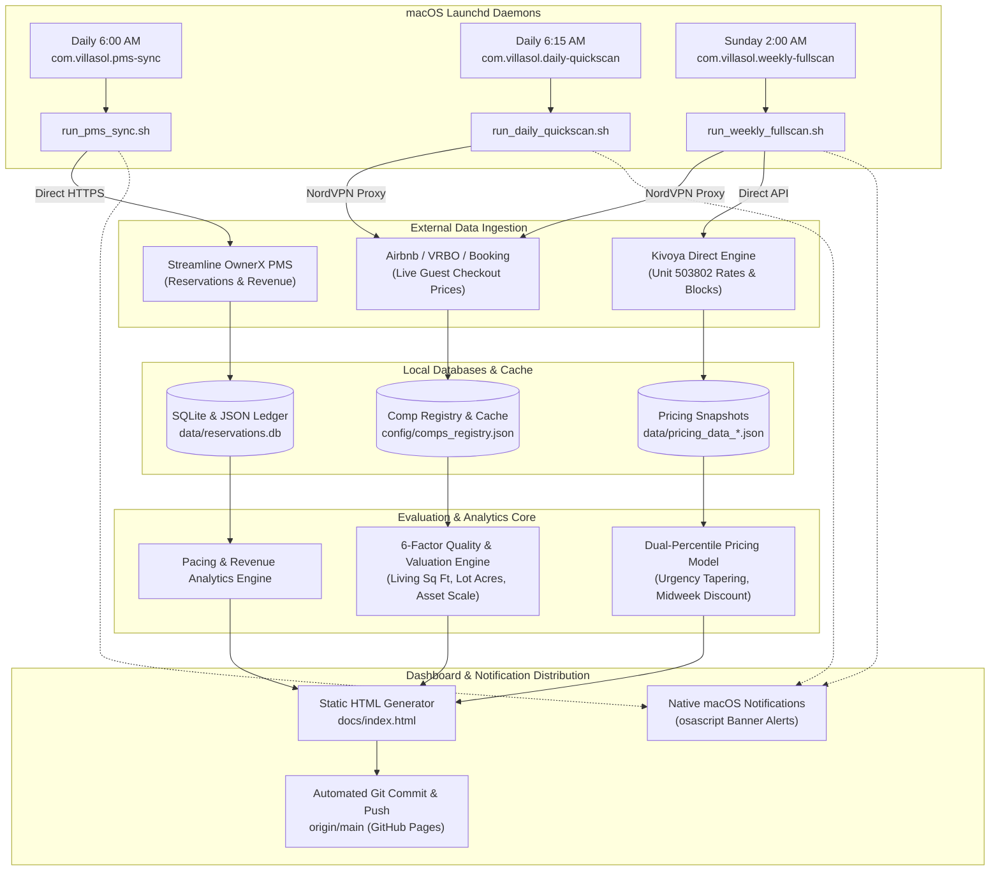

# STR Price Advisor — Production Operational & Automation Guide
**Villa del Sol (Tempe, AZ) • Automated Short-Term Rental Analytics Pipeline**

---

## 1. Executive Summary & Pipeline Architecture

The **STR Price Advisor** is an autonomous intelligence pipeline designed to run 24/7 on a headless Apple Silicon Mac Mini. It continuously monitors competitor pricing, reconciles multi-channel distribution markups, tracks property management reservations, and publishes an interactive static dashboard to GitHub Pages.



---

## 2. Master Automation Schedule

The pipeline uses a **3-tier automated cadence** balancing data freshness, proxy rate-limit conservation, and execution speed:

| Job Name | Launchd Label | Cadence & Time | Primary CLI Command | Typical Runtime | Sleep Inhibited |
| :--- | :--- | :--- | :--- | :---: | :---: |
| **PMS Sync** | `com.villasol.pms-sync` | **Daily @ 6:00 AM** | `sync-reservations --days-back 60 --dashboard --push` | ~20–40 sec | Yes (`caffeinate -i`) |
| **Quick Scan** | `com.villasol.daily-quickscan` | **Daily @ 6:15 AM** | `run --quick --limit 12 --push` | ~3–5 min | Yes (`caffeinate -i`) |
| **Weekly Full Scan** | `com.villasol.weekly-fullscan` | **Sunday @ 2:00 AM** | `run --weekly --compare-platforms --push` | ~15–25 min | Yes (`caffeinate -i`) |

### Rationale for Schedule Timing:
1. **6:00 AM PMS Sync**: Runs immediately after midnight OTA booking batches settle, updating confirmed reservations and blocked calendar dates.
2. **6:15 AM Quick Scan**: Fires right after the calendar is refreshed. Focuses on the next 90 days (first 12 upcoming intervals) where market demand shifts fast, detecting competitor price drops or surge pricing.
3. **Sunday 2:00 AM Weekly Full Scan**: Runs when OTA web traffic is at weekly lows (minimizing anti-bot friction), scraping the full 12-month calendar and comparing multi-platform distribution fees across all channels.

---

## 3. Complete Feature Catalog & Operational Mapping

Below is the complete inventory of all features supported by the system. For each feature, this guide lists the automated background command and the corresponding interactive **Antigravity AI Prompt + `SKILL.md` workflow**.

---

### Feature 1: Dynamic Pricing & Rate Recommendation Engine
- **Description**: Recommends optimal nightly rates based on dynamic market percentiles (e.g. 65th percentile weekend luxury target), automated lead-time tapering (urgency discounts as check-in approaches), 30% midweek discount factor, and full cleaning fee amortization.
- **Automated CLI Command**:
  ```bash
  # Quick scan for upcoming 12 intervals:
  .venv/bin/python -m src.cli run --quick --limit 12 --push

  # Comprehensive 12-month scan:
  .venv/bin/python -m src.cli run --weekly --push
  ```
- **Operator AI Workflow (Antigravity + `cli-operations`)**:
  - *When to use*: When planning for special events (e.g., Waste Management Open, Super Bowl, Spring Training) or setting custom percentile targets.
  - *Skill*: [`.agents/skills/cli-operations/SKILL.md`](file:///Users/ivanpe/str-price-advisor/.agents/skills/cli-operations/SKILL.md)
  - *Prompt Template*:
    > "Run a quick pricing audit for the date window 2027-02-01 to 2027-02-15 with an aggressive 75th percentile target, analyze competitor rate dispersion, and update the dashboard."

---

### Feature 2: Multi-Channel Platform Comparisons & Commission Reconciliation
- **Description**: Compares Villa del Sol quotes across **Airbnb**, **VRBO**, **Booking.com**, and **Kivoya Direct**. Details exact fee mechanics:
  - *Airbnb*: Net rent + 3% host fee + 14% platform guest service fee + 14.5% local lodging tax.
  - *VRBO*: Net rent + platform commission + 14.5% lodging tax.
  - *Booking.com*: Net rent + $550 cleaning fee + 6% service charge + 16% VAT + 14.5% tax.
  - *Kivoya Direct*: Direct quote without OTA distribution markups.
- **Automated CLI Command**:
  ```bash
  # Scrape and compare all 4 channels for all open intervals:
  .venv/bin/python -m src.cli compare-platforms --push

  # Limit comparison to upcoming 10 intervals:
  .venv/bin/python -m src.cli compare-platforms --limit 10 --push
  ```
- **Operator AI Workflow (Antigravity + `cli-operations`)**:
  - *When to use*: When a channel updates its commission structure or when auditing channel parity.
  - *Skill*: [`.agents/skills/cli-operations/SKILL.md`](file:///Users/ivanpe/str-price-advisor/.agents/skills/cli-operations/SKILL.md)
  - *Prompt Template*:
    > "Audit the multi-channel price breakdown for check-in 2026-10-15. Check our total guest checkout price on Airbnb vs Booking.com and verify that all service fees and taxes match current channel statements."

---

### Feature 3: Competitor Intelligence & 6-Factor Valuation Registry
- **Description**: Maintains a curated comp registry (`config/comps_registry.json`) across Tier A (16+ guests) and Tier B (12–15 guests). Evaluates listings using an objective 6-factor rubric:
  1. *Outdoor Yard & Lot Size (25%)*: Pool heating, resort scale, tennis/pickleball courts, and **Lot Acreage** ($\ge 1.0$ ac `+8`, $0.65-0.99$ ac `+5`, $< 0.20$ ac `-6`).
  2. *Bedrooms & House Size (20%)*: Capacity, casita, and **Living Area Sq Ft** ($\ge 7,000$ sq ft `+10`, $5,000-6,999$ sq ft `+6`, $< 4,000$ sq ft `-5`).
  3. *Property Scale & Market Asset Value (15%)*: Hedonic asset valuation vs. Villa del Sol's **\$2.0M baseline anchor** (88.0 pts).
  4. *Interior Luxury & Finishes (15%)*: Billiards table, private cinema, chef kitchen, arcade.
  5. *Location Corridor (15%)*: Scottsdale/PV (95 pts), South Tempe/Arcadia (88 pts), East Valley (82 pts), Mesa (78 pts).
  6. *Reviews & Track Record (10%)*: Rating, review volume, Superhost/Guest Favorite.
- **Automated CLI Commands**:
  ```bash
  # Re-evaluate all comps in registry with 6-factor rubric:
  .venv/bin/python -m src.cli evaluate-comps

  # Add a new competitor listing and auto-price scrape:
  .venv/bin/python -m src.cli add-comp "https://www.airbnb.com/rooms/1077813310260513265" --scrape-prices --push

  # Remove an invalid or closed competitor listing:
  .venv/bin/python -m src.cli remove-comp "1077813310260513265" --push
  ```
- **Operator AI Workflows (Antigravity + `manage-comps` & `evaluate-comps`)**:
  - *Skills*: [`.agents/skills/manage-comps/SKILL.md`](file:///Users/ivanpe/str-price-advisor/.agents/skills/manage-comps/SKILL.md) and [`.agents/skills/evaluate-comps/SKILL.md`](file:///Users/ivanpe/str-price-advisor/.agents/skills/evaluate-comps/SKILL.md)
  - *Prompt Template 1 (Add Comp)*:
    > "Add this new competitor listing https://www.airbnb.com/rooms/12345678 to our registry. Deep-scrape its specs, extract house square footage and yard acreage, score it using our 6-factor valuation rubric, and scrape its prices."
  - *Prompt Template 2 (Audit Comp)*:
    > "Audit comp 628534576871518102. Check whether the pool heat is free or fee-based from guest reviews, re-run its winter vs summer desirability ratios, and refresh the dashboard."

---

### Feature 4: Availability Calendar & Stay Interval Segmentation
- **Description**: Integrates directly with Kivoya / Streamline VRS AJAX endpoints to fetch blocked calendar periods and generate 3-night stay intervals (weekend Thu–Sun / Fri–Mon vs midweek Mon–Thu) over a rolling 12-month horizon.
- **Automated CLI Commands**:
  ```bash
  # Verify Kivoya connectivity and upcoming 3 reservations:
  .venv/bin/python -m src.cli test-kivoya
  ```
- **Operator AI Workflow (Antigravity + `cli-operations`)**:
  - *Skill*: [`.agents/skills/cli-operations/SKILL.md`](file:///Users/ivanpe/str-price-advisor/.agents/skills/cli-operations/SKILL.md)
  - *Prompt Template*:
    > "Run `test-kivoya` to verify our PMS calendar connectivity, check if any newly blocked dates are missing from the dashboard, and inspect seasonal rate tables."

---

### Feature 5: Reservations & Booking Ledger
- **Description**: Synchronizes confirmed historical and upcoming reservations from Streamline OwnerX PMS into SQLite (`data/reservations.db`) and JSON (`data/reservations_history.json`). Tracks:
  - Dates, nights, stay classification (weekend, midweek, mix).
  - Channel attribution (Airbnb, VRBO, Kivoya Direct, Owner Stay, Maintenance).
  - Gross rent, platform service fees, management commission, and owner net payout.
  - Estimated guest checkout prices vs. net owner receipts.
- **Automated CLI Command**:
  ```bash
  # Daily incremental sync (last 60 days + all future):
  .venv/bin/python -m src.cli sync-reservations --days-back 60 --dashboard --push

  # Complete historical database rebuild (from 2022 to present):
  .venv/bin/python -m src.cli sync-reservations --full --dashboard --push
  ```
- **Operator AI Workflow (Antigravity + `cli-operations`)**:
  - *Skill*: [`.agents/skills/cli-operations/SKILL.md`](file:///Users/ivanpe/str-price-advisor/.agents/skills/cli-operations/SKILL.md)
  - *Prompt Template*:
    > "Perform a full reservation sync from OwnerX PMS going back to 2022, verify channel fee reconciliation, and update the reservations table on the dashboard."

---

### Feature 6: Revenue Analytics & Performance Tracking
- **Description**: Visualizes cumulative actualized revenue, forward-looking pacing curves, average length of stay, ADR trends, and channel mix distribution.
- **Automated CLI Command**:
  ```bash
  # Automatically generated whenever sync-reservations or generate-html is run:
  .venv/bin/python -m src.cli generate-html --push
  ```
- **Operator AI Workflow (Antigravity + `cli-operations`)**:
  - *Skill*: [`.agents/skills/cli-operations/SKILL.md`](file:///Users/ivanpe/str-price-advisor/.agents/skills/cli-operations/SKILL.md)
  - *Prompt Template*:
    > "Analyze our revenue pacing for Q1 2027 compared to Q1 2026. Break down booked nights by channel and project remaining unbooked revenue."

---

### Feature 7: Interactive Static Dashboard & GitHub Pages
- **Description**: Generates a self-contained, responsive dashboard at [`docs/index.html`](file:///Users/ivanpe/str-price-advisor/docs/index.html) hosted on GitHub Pages. Features include:
  - Instant modal dialogs (no latency).
  - Interactive formula tooltips with dynamic variable replacement on hover.
  - Client-side filtering by city, tier, validity, and date range.
  - Responsive layout for desktop and mobile inspection.
- **Automated CLI Command**:
  ```bash
  .venv/bin/python -m src.cli generate-html --push
  ```
- **Operator AI Workflow (Antigravity + `generative_ui` & `cli-operations`)**:
  - *Skill*: [`.agents/skills/cli-operations/SKILL.md`](file:///Users/ivanpe/str-price-advisor/.agents/skills/cli-operations/SKILL.md)
  - *Prompt Template*:
    > "Re-render the static HTML dashboard with latest pricing and reservation data, verify that all charts and tables load properly, and push to GitHub Pages."

---

### Feature 8: Competitor Sales Tracking & Market Absorption Velocity Engine
- **Description**: Tracks empirical transaction velocity across competitor listings. By diffing consecutive daily pricing snapshots (`pricing_data_YYYY-MM-DD.json`), it detects when competitor listings cease being available, calculates the exact lead time ($N$ days) and market percentile rank ($Y^{\text{th}}$ percentile), and aggregates historical sales into a **2D Strategy Grid** (4 Lead Horizons $\times$ Weekend/Midweek) using Bayesian shrinkage ($k=3$) to determine empirical target percentiles. Full technical specification is available at [`docs/COMPETITOR_SALES_TRACKER_DESIGN.md`](file:///Users/ivanpe/str-price-advisor/docs/COMPETITOR_SALES_TRACKER_DESIGN.md).
- **Automated CLI Command**:
  ```bash
  # Diff latest two snapshots and update absorption velocity metrics:
  .venv/bin/python -m src.cli track-competitor-sales --dashboard --push

  # Backfill all historical pricing snapshots:
  .venv/bin/python -m src.cli track-competitor-sales --backfill --dashboard --push
  ```
- **Operator AI Workflow (Antigravity + `cli-operations`)**:
  - *Skill*: [`.agents/skills/cli-operations/SKILL.md`](file:///Users/ivanpe/str-price-advisor/.agents/skills/cli-operations/SKILL.md)
  - *Prompt Template*:
    > "Diff our latest pricing snapshots, analyze recent competitor booking velocity, check what percentiles competitors are clearing at for 30–90 day lead times, and update the absorption strategy grid."

---

## 4. Antigravity AI Interactive Prompt Matrix

When interacting with Antigravity, use this quick reference table to trigger specialized skills:

| Scenario / Goal | Recommended Skill | Copy-Paste User Prompt |
| :--- | :--- | :--- |
| **Add New Comp** | `manage-comps` + `evaluate-comps` | `"Add comp https://www.airbnb.com/rooms/1077813310260513265 to Tier A. Extract house sq ft, lot acreage, score with the 6-factor rubric, and scrape its prices across open intervals."` |
| **Audit Listing Specs** | `evaluate-comps` | `"Audit listing 628534576871518102. Check if pool heating is free or fee-based from guest reviews, verify living area, and update winter ratio."` |
| **Track Comp Sales** | `cli-operations` | `"Diff latest pricing snapshots, calculate competitor absorption velocity across lead horizons, update empirical percentile recommendations, and push to dashboard."` |
| **Special Event Scan** | `cli-operations` | `"Run a targeted pricing scan for Super Bowl / WM Open (Feb 8–16, 2027), compare our rates against top Scottsdale comps, and push updates."` |
| **Proxy Diagnostics** | `proxy-scraping` | `"We are encountering HTTP 429 rate limits on Airbnb. Inspect proxy credentials in .env, verify proxy rotation, and test connectivity."` |
| **PMS Ingestion Audit** | `cli-operations` | `"Sync our latest OwnerX reservations, check if any recent bookings changed dates, and update the revenue ledger."` |
| **Deploy Release** | `cli-operations` | `"Run full unit tests, re-generate HTML dashboard, and push a release commit to origin/main."` |

---

## 5. New Mac Mini Provisioning & Hardening Runbook

Follow these exact steps when unboxing and setting up your dedicated Mac Mini to ensure 24/7 automated reliability.

### Step 1: Initial macOS System Configuration
1. **Set Hostname & Computer Name**:
   - Open **System Settings $\rightarrow$ General $\rightarrow$ About $\rightarrow$ Name**: Set to `VillaSol-MacMini`.
2. **Enable Automatic Login** (Crucial for auto-restarting after power outages):
   - **System Settings $\rightarrow$ Users & Groups $\rightarrow$ Automatically log in as**: Select your user account.
3. **Configure Power & Sleep Settings**:
   - **System Settings $\rightarrow$ Displays $\rightarrow$ Advanced**: Set "Prevent automatic sleeping when the display is off" to **ON**.
   - **System Settings $\rightarrow$ Energy Saver**: Enable "Start up automatically after a power failure".
   - Run in Terminal:
     ```bash
     sudo pmset -a disablesleep 1
     sudo pmset -a sleep 0
     sudo pmset -a displaysleep 15
     ```
4. **Enable Remote Login (SSH)**:
   - **System Settings $\rightarrow$ General $\rightarrow$ Sharing $\rightarrow$ Remote Login**: Enable for your user so you can SSH into the Mac Mini from your laptop.

---

### Step 2: Install Base Developer Tooling
Open Terminal on the Mac Mini and run:
```bash
# 1. Install Xcode Command Line Tools
xcode-select --install

# 2. Install Homebrew (macOS package manager)
/bin/bash -c "$(curl -fsSL https://raw.githubusercontent.com/Homebrew/install/HEAD/install.sh)"

# 3. Add Homebrew to shell PATH
echo 'eval "$(/opt/homebrew/bin/brew shellenv)"' >> ~/.zprofile
eval "$(/opt/homebrew/bin/brew shellenv)"

# 4. Install Python 3.11 and Git
brew install python@3.11 git
```

---

### Step 3: Clone Repository & Create Virtual Environment
```bash
# 1. Create development directory and clone
mkdir -p ~/Development
cd ~/Development
git clone git@github.com:ivanpe/str-price-advisor.git
cd str-price-advisor

# 2. Create Python virtual environment using Python 3.11
/opt/homebrew/bin/python3.11 -m venv .venv
source .venv/bin/activate

# 3. Install Python dependencies
pip install --upgrade pip
pip install -r requirements.txt

# 4. Install Playwright browser binaries (Chromium)
playwright install chromium
playwright install-deps chromium
```

---

### Step 4: Configure Secrets & `.env` File
Create `/Users/ivanpe/str-price-advisor/.env` with your production API keys and proxy credentials:
```bash
cat << 'EOF' > .env
# NordVPN / Proxy Configuration (Mandatory for scraping Airbnb/VRBO without rate limits)
NORDVPN_PROXY_HOST=us.smartproxy.com
NORDVPN_PROXY_PORT=10001
NORDVPN_PROXY_USER=your_proxy_username
NORDVPN_PROXY_PASS=your_proxy_password

# Kivoya / Streamline VRS PMS Credentials
KIVOYA_UNIT_ID=503802
KIVOYA_API_KEY=your_kivoya_key_if_applicable

# Streamline OwnerX PMS Credentials
OWNERX_USERNAME=your_ownerx_username
OWNERX_PASSWORD=your_ownerx_password
OWNERX_PROPERTY_ID=503802
EOF

# Restrict file permissions so only your user can read credentials
chmod 600 .env
```

---

### Step 5: Configure GitHub SSH Key (for Automated Git Push)
Because background daemons push updated reports and HTML to GitHub Pages without human interaction, set up an SSH key with push access:
```bash
# 1. Generate dedicated ED25519 SSH key
ssh-keygen -t ed25519 -C "macmini@villadelsol.internal" -f ~/.ssh/id_ed25519 -N ""

# 2. Add key to SSH agent
eval "$(ssh-agent -s)"
ssh-add ~/.ssh/id_ed25519

# 3. Display public key to copy to GitHub
cat ~/.ssh/id_ed25519.pub
```
- Go to GitHub repository: **Settings $\rightarrow$ Deploy Keys $\rightarrow$ Add deploy key**:
  - Title: `Mac Mini Automation Bot`
  - Key: Paste contents of `~/.ssh/id_ed25519.pub`
  - Check **"Allow write access"** $\rightarrow$ Click Save.
- Test SSH connection:
  ```bash
  ssh -T git@github.com
  # Expect: "Hi ivanpe/str-price-advisor! You've successfully authenticated..."
  ```

---

### Step 6: Install & Activate Launchd Daemons
Run the automated installation script:
```bash
cd ~/Development/str-price-advisor
bash scripts/launchd/install_launchd.sh
```

The script will automatically:
1. Make all wrapper scripts executable.
2. Create log directory at `~/Library/Logs/str-price-advisor/`.
3. Substitute project paths into plist files.
4. Copy plists to `~/Library/LaunchAgents/`.
5. Bootstrap and activate all 3 daemons.

Verify active daemons:
```bash
launchctl list | grep villasol
```
Expected output:
```
-   0   com.villasol.pms-sync
-   0   com.villasol.daily-quickscan
-   0   com.villasol.weekly-fullscan
```

---

## 6. Maintenance, Diagnostics & Log Management

### 1. Live Log Streaming
To inspect daemon execution in real time:
```bash
# Stream PMS sync logs:
tail -f ~/Library/Logs/str-price-advisor/pms_sync.log

# Stream daily quick scan logs:
tail -f ~/Library/Logs/str-price-advisor/daily_quickscan.log

# Stream weekly full scan logs:
tail -f ~/Library/Logs/str-price-advisor/weekly_fullscan.log
```

### 2. Manual Test Execution
You can manually trigger any job without waiting for the scheduled time:
```bash
# Run PMS sync wrapper manually:
bash scripts/launchd/run_pms_sync.sh

# Run Quick scan wrapper manually:
bash scripts/launchd/run_daily_quickscan.sh

# Run Weekly scan wrapper manually:
bash scripts/launchd/run_weekly_fullscan.sh
```

Or trigger via `launchctl`:
```bash
launchctl kickstart -k "gui/$(id -u)/com.villasol.pms-sync"
```

### 3. Log Rotation
To prevent log files from growing indefinitely over months of scraping:
Create `/etc/newsyslog.d/str-price-advisor.conf` (requires sudo):
```bash
sudo bash -c 'cat << EOF > /etc/newsyslog.d/str-price-advisor.conf
# logfilename                                                 [owner:group]    mode count size when  flags [/pid_file] [sig_num]
/Users/*/Library/Logs/str-price-advisor/*.log                                  644  5     5000 *     J
EOF'
```
This automatically compresses and rotates log files when they reach 5 MB, keeping the last 5 archives.

### 4. Uninstalling Daemons
If you ever need to stop or remove the automated jobs:
```bash
bash scripts/launchd/uninstall_launchd.sh
```

---

## 7. Operational Troubleshooting Matrix

| Issue | Root Cause | Solution |
| :--- | :--- | :--- |
| **Scraper returns HTTP 503 / 429** | Proxy IP temporarily flagged by Airbnb | Verify NordVPN proxy credentials in `.env`. Ensure Playwright routes through proxy as documented in `.agents/skills/proxy-scraping/SKILL.md`. |
| **Git push fails during daemon run** | SSH key not loaded or missing write permissions | Verify SSH key with `ssh -T git@github.com`. Ensure GitHub deploy key has "Allow write access" checked. |
| **Job doesn't run at scheduled time** | Mac Mini went into deep hibernation sleep | Verify `caffeinate -i` is in wrapper script. Run `sudo pmset -a disablesleep 1` to disable deep sleep. |
| **Desktop notification banner missing** | macOS Notification Center permissions | Open **System Settings $\rightarrow$ Notifications $\rightarrow$ Script Editor / Terminal** and toggle **Allow Notifications** to ON. |
| **Kivoya connection timeout** | Streamline VRS server maintenance | Run `.venv/bin/python -m src.cli test-kivoya` to test response latency and payload validity. |
| **Comp quality ratio looks skewed** | Text mining missed pool heating or casita | Check `data/enriched_comps/{listing_id}.json`. Ask Antigravity to audit the listing using `.agents/skills/evaluate-comps/SKILL.md`. |

