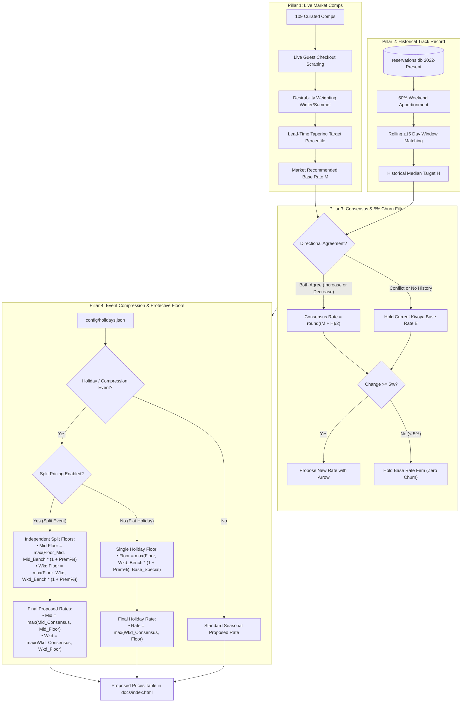

# STR Competitive Pricing Engine & Operational Guide
**Villa del Sol — Tempe, Arizona**

This document serves as the master architectural reference and operational manual for the **STR Price Advisor Engine**. It explains how competitive market data, historical booking intelligence, and protective holiday rules synthesize into the **Proposed Prices Table** for property managers to adjust rates in Kivoya (Streamline VRS PMS).

> [!TIP]
> **Executive Summary & Specialist Sign-Off Document**: If you are looking for the client-ready, non-technical memorandum to share directly with a property manager, real estate specialist, or investor for review and validation, please see [`docs/STR_PRICING_STRATEGY_MEMO.md`](file:///Users/ivanpe/str-price-advisor/docs/STR_PRICING_STRATEGY_MEMO.md), which includes a complete **5-Point Validation Scorecard & Sign-Off Sheet**.

---

## 1. Quick Reference: Where Are the Configuration Files?

| Configuration File | Path | What It Controls |
| :--- | :--- | :--- |
| **Holiday & Event Registry** | [`config/holidays.json`](file:///Users/ivanpe/str-price-advisor/config/holidays.json) | **Holiday markup % (`premium_pct`), protective rate floors (`floor_rate`), min night rules (`min_nights`), and custom event date windows (`from_date`, `to_date`).** |
| **Listing Specs & Amenities** | [`config/listing_specs.json`](file:///Users/ivanpe/str-price-advisor/config/listing_specs.json) | Villa del Sol baseline attributes (6 BR, 4 BA, sleeps 16, private heated pool/grotto, basketball court, putting green). |
| **Competitor Comps Registry** | [`config/comps_registry.json`](file:///Users/ivanpe/str-price-advisor/config/comps_registry.json) | Curated 109 luxury competitors across Tempe, Scottsdale, Chandler, Mesa, and Gilbert, with desirability ratios and verification status. |
| **Strategy & System Settings** | [`config/settings.yaml`](file:///Users/ivanpe/str-price-advisor/config/settings.yaml) | Target percentiles, lead-time curve parameters, Kivoya API credentials, and proxy configurations. |

---

## 2. Executive Overview of the Pricing Engine

The pricing engine solves the primary failure modes of both generic automated pricing software (like PriceLabs or Wheelhouse, which treat luxury compounds like generic hotel rooms) and static PMS seasonal calendars:



---

## 3. Core Pillar 1: Market Analysis (Comps & Target Percentiles)

### A. Curated Competitor Registry (109 Listings)
Rather than relying on automated radius scraping that pulls irrelevant 2-bedroom apartments or unverified budget listings, our engine benchmarks Villa del Sol against a hand-curated registry in [`config/comps_registry.json`](file:///Users/ivanpe/str-price-advisor/config/comps_registry.json):
* **Tier A (Direct Comps — Sleeps 16+, 6+ Bedrooms)**: Prime luxury compounds with resort backyards (pools, hot tubs, outdoor kitchens, sports courts).
* **Tier B (Secondary Comps — Sleeps 12–15, 5+ Bedrooms)**: High-capacity homes that compete for slightly smaller family reunions and golf groups.

### B. True Guest Checkout Cost & OTA Channel Normalization
Guests on Airbnb make booking decisions based on **Total Stay Cost** (Base Rate + Cleaning Fee + Channel Markup + Service Fee), not internal PMS rates.
* The engine scrapes the actual live checkout price for competitors directly from Airbnb.
* When recommending a base rate for Kivoya, the engine backs out Kivoya’s standard cleaning fee (\$500) and OTA distribution markup (factor $\approx 1.15$):
  $$\text{Target Kivoya Total} = \frac{\text{Target Airbnb Checkout Total}}{\text{Channel Factor}}$$
  $$\text{Recommended Base Nightly} = \frac{\text{Target Kivoya Total} - \$500\ \text{Clean}}{\text{Nights}}$$

### C. Desirability Adjustment Ratios (Winter vs. Summer)
Every comp has an audited quality score evaluated across 6 dimensions: Lot & Privacy, Pool & Backyard Amenities, Interior Finishes, Bedroom Utility, Location, and Host Track Record:
* **Winter Ratio ($\ge 1.0$)**: Benchmarks high-season demand where private heated pools, hot tubs, putting greens, and golf proximity command maximum premiums.
* **Summer Ratio**: Adjusts for extreme Phoenix summer heat (>100°F), where outdoor-heavy estates experience compressed demand.

### D. Lead-Time Tapering Curve & Midweek Discount
Booking pace in Phoenix is heavily front-loaded in winter and last-minute in summer:
* **Far Out ($>90$ days)**: Price at the top **80th–85th percentile** of luxury comps to capture early high-budget vacationers.
* **Mid-Range (30–90 days)**: Taper to the **70th–75th percentile** as the booking window enters normal conversion velocity.
* **Near-In ($<30$ days)**: Taper to the **60th percentile** to preserve occupancy and avoid perishable zero-revenue nights.
* **Midweek Discount**: A **30% lower target percentile** is applied to midweek stays (Sun–Wed) compared to weekends (Thu–Sat) to stimulate weekday occupancy.

---

## 4. Core Pillar 2: Historical Track Record Intelligence

### A. Empirical Reservations Database (2022–Present)
All confirmed bookings for Villa del Sol are stored in [`data/reservations.db`](file:///Users/ivanpe/str-price-advisor/data/reservations.db). This provides empirical ground truth on what guests have *actually paid* across different seasons.

### B. The 50% Weekend Weighting Rule ($R_w = 1.50 \times R_m$)
When a guest books a 5-night stay spanning Sunday to Friday, generic systems divide total rent by 5, which artificially inflates midweek rates and deflates weekend pricing.
Our engine mathematically apportions mixed stays assuming weekend nights (Thursday, Friday, Saturday) carry at least a **50% premium** over midweek nights (Sunday through Wednesday):
$$\text{Gross Rent} = (N_m \times R_m) + (N_w \times 1.50 \times R_m)$$
$$R_m = \frac{\text{Gross Rent}}{N_m + 1.50 \times N_w}, \quad R_w = 1.50 \times R_m$$

This empirical shift proved that lowering midweek rates expanded midweek booked volume from **27.9% in 2024 to 43.1% in 2025**, driving higher annual revenue without sacrificing weekend yield.

### C. Rolling $\pm 15$-Day Historical Window
To benchmark an upcoming interval (e.g., October 15–18):
1. The engine queries all historical bookings within a $\pm 15$-day window (October 1 to October 31) across all prior years (2022–2026).
2. It filters strictly by stay type (matching weekend intervals against historical weekend nights).
3. It computes the historical \$Min, \$Max, and **Median ADR** to serve as a sanity check against pure market algorithms.

---

## 5. Core Pillar 3: Consensus Engine & 5% Churn Reduction Threshold

### A. Directional Consensus Policy
To prevent erratic algorithmic whipsaws, rate recommendations require **agreement between market comp data and historical sales**:
* **Agreed Increase**: If Market Rec $> \text{Base}$ AND Historical Median $> \text{Base}$:
  $$\text{Consensus Rate} = \text{round}\left(\frac{\text{Market Rec} + \text{Historical Target}}{2}\right)$$
* **Agreed Decrease**: If Market Rec $< \text{Base}$ AND Historical Median $< \text{Base}$:
  $$\text{Consensus Rate} = \text{round}\left(\frac{\text{Market Rec} + \text{Historical Target}}{2}\right)$$
* **Conflict or Missing History**: If market comps suggest decreasing but historical data was booked higher (or vice versa), the engine **holds the current Kivoya base rate unchanged**.

### B. The 5% Churn Reduction Filter
Property managers should not waste time updating PMS schedules for trivial rate adjustments (\$5 to \$15 changes).
* If the proposed change is **less than 5%** of the existing base price:
  $$\frac{|\text{Proposed Rate} - \text{Base Rate}|}{\text{Base Rate}} < 0.05 \implies \text{Hold Current Base Rate Firm}$$
* **Example**:
  * Labor Day was calculated at \$604 vs base \$599 (+0.8%). Result: **Held at \$599 (No change proposed)**.
  * September Weekend was calculated at \$541 vs base \$549 (-1.5%). Result: **Held at \$549 (No change proposed)**.
  * Columbus Day was calculated at \$659 vs base \$599 (+10.0%). Result: **Proposed: \$599 → \$659**.
  * Christmas & New Year calculated at \$1,348 vs base \$949 (+42.0%). Result: **Proposed: \$949 → \$1,348**.

### C. Dynamic 90-Day Minimum Nights Policy
* **Next 90 Days ($\le 90$ days out)**: Automatically sets **2-night minimum** to capture short-lead weekend getaways and prevent vacant unbooked dates.
* **Long Range ($90+$ days out)**: Automatically enforces **3-night minimum** (or 4 nights for Christmas/New Year) to protect calendar integrity and prevent low-revenue fragmented gaps.

---

## 6. Core Pillar 4: Special Holiday & Event Rules

### A. Why Market Analysis Alone Fails on Holidays
1. **Shoulder Midweek Dilution**: In Kivoya, holidays are set as single flat-rate periods across all days (`second_price: null`). If a holiday period spans Thursday to Monday, generic scrapers averaging all 4 nights allow the cheaper Monday shoulder night to pull down the peak Saturday rate.
2. **Thin Luxury Comps**: In Tempe, there are only a handful of 6-bedroom estates. During mega-peak events, the best comps sell out 4–6 months in advance. The remaining comps on the market are often overpriced outliers or lower-tier inventory, skewing algorithmic percentiles downward.

### B. The Protective Fallback Strategy
Market analysis drives pricing first. However, if the market consensus produces a rate lower than standard weekends or below the holiday tier floor, the **protective holiday floor** kicks in:
$$\text{Target Floor} = \max\left(\text{floor\_rate},\ \text{round}\left(\text{Standard Weekend} \times (1 + \frac{\text{premium\_pct}}{100})\right),\ \text{Kivoya Base}\right)$$
$$\text{Final Special Rate} = \max(\text{Market Consensus},\ \text{Target Floor})$$

### C. Holiday Tiers in `config/holidays.json`
* **Tier 1: Mega-Peak / National Destination (+50% to +60% over standard weekend)**:
  * **Christmas & New Year** (Dec 23 – Jan 3): Floor \$1,250, Min nights: 4. (Historical booked ADR: \$1,911).
  * **Holy Week & Spring Training Finals** (Mar 19 – Mar 28): Floor \$1,200, Min nights: 3. (Historical booked ADR: \$1,257–\$1,486).
* **Tier 2: High Family & Leisure Compression (+25% to +50% over standard weekend)**:
  * **Thanksgiving** (Nov 26 – Nov 30): Floor \$949, Min nights: 3. (Historical booked ADR: \$860).
  * **Memorial Day** (May 28 – May 31): Floor \$899, Min nights: 3. (Kickoff to pool season).
* **Tier 3: Regional Long Weekends (+10% over standard weekend)**:
  * **Labor Day** (Sep 3 – Sep 7): Floor \$599, Min nights: 3. (End of summer heat).
  * **Columbus Day** (Oct 8 – Oct 12): Floor \$599, Min nights: 3. (Fall break).

---

## 7. Strategic Advice for the Host

### A. How to Analyze and Adjust Target Percentiles
In [`config/settings.yaml`](file:///Users/ivanpe/str-price-advisor/config/settings.yaml), target percentiles determine where Villa del Sol positions itself relative to comps:
* **Current Baseline**: 80th–85th percentile far out ($>90$ days); 70th–75th percentile mid-range (30–90 days); 60th percentile near-in ($<30$ days).
* **When to RAISE Percentiles (+5% to +10%)**:
  * If booking pace is accelerating ahead of normal lead time (e.g., March dates booking in November or December).
  * If competitor absorption velocity spikes (multiple comps marked `CONFIRMED_BLOCKED` in the Sales Tracker tab).
* **When to LOWER Percentiles (-5% to -10%)**:
  * If an unbooked date enters the **Active Booking Window** (e.g. 30–45 days out) and inquiries are low.
  * In summer (July/August) if competitor median rates drop below \$500.

### B. How to Adjust Holiday Markups & Split Pricing in `config/holidays.json`
To adjust a holiday, simply open [`config/holidays.json`](file:///Users/ivanpe/str-price-advisor/config/holidays.json) in any text editor and modify:
```json
{
  "holiday_name": "Christmas & New Year",
  "premium_pct": 50,     // Markup % over regular weekend if market rec falls below
  "floor_rate": 1350,    // Absolute minimum rate floor
  "min_nights": 4        // Require 4 nights minimum
}
```

#### Enabling Midweek & Weekend Split Pricing (`"split_pricing": true`)
For multi-day or week-long holiday periods like **Holy Week** (which spans 10 calendar days across both weekdays and weekends), setting a flat single "Special" rate can cause midweek nights to sit vacant at weekend prices or weekend rates to be diluted. By adding `"split_pricing": true`, the engine calculates separate **Midweek** and **Weekend** rates and enforces **independent price floors**:
```json
{
  "holiday_name": "Holy Week",
  "kivoya_period_name": "Holy Week 27",
  "split_pricing": true,
  "premium_pct": 0,
  "floor_midweek": 699,
  "floor_weekend": 1049,
  "floor_rate": 699,
  "min_nights": 3,
  "description": "Peak MLB Spring Training finals and Easter family travel"
}
```
* **Independent Price Floors**:
  * **Midweek Floor**: Strictly derived from the midweek consensus price for that interval, bounded by `floor_midweek` and regular midweek benchmarks. It never looks at or references the weekend price.
  * **Weekend Floor**: Strictly derived from the weekend consensus price for that interval, bounded by `floor_weekend` and regular weekend benchmarks. It is never diluted by midweek rates.
* **Midweek Output**: Evaluates midweek consensus ($1,099 → **$979**), enabling bookings during Mon–Thu shoulder nights.
* **Weekend Output**: Evaluates weekend consensus ($1,099 → **$1,534**), capturing peak baseball and Easter weekend demand.
* **Streamline VRS Support**: Streamline VRS natively supports separate Midweek (`daily_first_interval_price`) and Weekend (`daily_second_interval_price`) rates for every rate period.

#### Standalone Future Custom Events (`"custom_event": true`)
When pricing future compression events that are not yet defined as distinct periods in Kivoya's PMS rate table (such as the **WM Phoenix Open 2028**), you can declare them in `config/holidays.json`:
```json
{
  "holiday_name": "WM Phoenix Open",
  "kivoya_period_name": null,
  "from_date": "02/07/2028",
  "to_date": "02/13/2028",
  "split_pricing": true,
  "premium_pct": 0,
  "floor_rate": 699,
  "base_midweek": 749,
  "base_weekend": 1099,
  "min_nights": 3,
  "custom_event": true,
  "description": "Arizona's highest tourism & ADR compression event (~700k attendees)"
}
```
* **Engine Handling**: If the event falls inside an existing Kivoya period, the engine splits it into `[Pre-Event, Event, Post-Event]`. If it is beyond existing Kivoya rate periods (e.g. 2028), it is automatically injected as a standalone row in the Proposed Prices schedule with a `Custom Event` badge.

#### Orphan Slot Protection for Minimum Nights
Under standard rules, stays 90+ days out recommend a **3-night minimum**. However, if a rate period contains unbooked intervals bounded by reservations, strict 3-night rules can make those slots impossible to book.
The engine enforces **Orphan Slot Protection**:
1. **2-Night Gap Between Reservations**: If an unbooked slot between two bookings is exactly 2 nights, the engine caps proposed min nights at **2 nights**.
2. **Weekend with Only 2 Nights Left**: If for any weekend (Thu–Sat nights) one night is booked leaving only two nights available, the engine never recommends 3 nights and holds/downgrades to **2 nights**.
* **Visual Indicator**: The Min Nights column displays an info badge (`ℹ️`) with a hover tooltip explaining the exact orphan slot condition.

After editing `config/holidays.json`, re-generate the dashboard via:
```bash
.venv/bin/python -m src.cli generate-html
```

### C. Should We Index Historical Data for Inflation?
**Host Question**: *Should we index our 2022–2024 historical booking prices by headline CPI (+15%–18%) when computing benchmarks?*

**Expert Recommendation: NO, do NOT apply blanket CPI inflation to historical STR rates.**
Here is the macroeconomic and hospitality rationale:
1. **The Post-2022 Supply Boom**: Between 2021 and 2024, the total supply of active short-term rentals in Maricopa County (Phoenix, Scottsdale, Tempe) expanded by **over 35%**. While consumer goods (food, fuel, services) experienced high general inflation, **vacation rental market ADRs flattened or contracted** due to supply competition.
2. **Artificial Overpricing Risk**: If a 2022 booking of \$860 is indexed by 18% CPI inflation, the historical target becomes \$1,015. In today’s more competitive supply environment, forcing that target can cause dates to sit unbooked until last-minute distress.
3. **Market Comps Already Capture True Inflation**: The **Market Comps Pillar** evaluates live Airbnb guest pricing in *today's real-time dollars*. If inflation increases costs and market rates rise, the live comps capture it immediately. The historical track record serves as a **stability anchor**, not an inflation escalator.

---

## 8. Property Manager Operational Workflow (Weekly / Monthly)

### Step 1: Open the Proposed Prices Table
1. Open [`docs/index.html`](file:///Users/ivanpe/str-price-advisor/docs/index.html) in your browser.
2. Click on the **Pricing Recommendations** tab (`#tab-pricing`).
3. Scroll down to the **Proposed Prices (PMS Consensus Schedule)** section.

### Step 2: Review Suggested Actions
* **White values**: Current Kivoya rate is confirmed correct. No change needed.
* **Green arrows (`$Base → $New`)**: Recommended rate increases supported by both market comp consensus and historical track record.
* **Red arrows (`$Base → $New`)**: Recommended rate reductions to stimulate conversion.

### Step 3: Copy & Apply to Kivoya PMS
1. Click the **📋 Copy Proposed Prices** button in the table header.
2. The engine instantly copies clean tab-separated values (TSV) to your clipboard:
   ```text
   From        To          Midweek    Weekend    Special    Min nights    Holiday
   09/03/2026  09/07/2026                        $599       3             Labor Day
   09/08/2026  09/30/2026  $399       $549                  2             
   10/01/2026  10/07/2026  $399       $599                  2             
   10/08/2026  10/12/2026                        $659       3             Columbus Day
   10/13/2026  10/31/2026  $444       $599                  2             
   ...
   ```
3. Paste directly into Excel/Google Sheets, or use the schedule to update rates in **Streamline VRS** (`Tools > Property Management > Seasonal Rates`).

