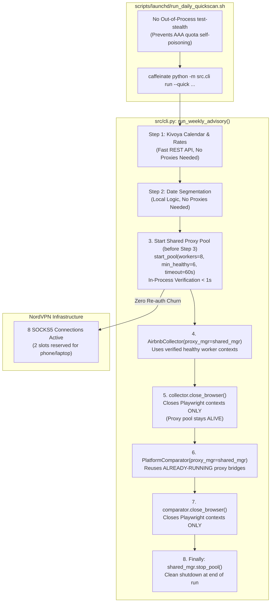

# Stealth Proxy Pool Resilience & Session Lifecycle
**Technical Design Document & Architecture Specification**

---

## 1. System Overview & Problem Review

In the STR Price Advisor system, web scraping against Airbnb, VRBO, and Booking.com is parallelized across out-of-state SOCKS5 proxy bridges using NordVPN. The current architecture suffers from two critical operational flaws during pipeline execution:

1. **Premature Teardown and Rapid Re-creation**: Between Step 3 (`AirbnbCollector`) and Step 4b (`PlatformComparator`), 10 local proxy forwarders are destroyed and 10 new ones are requested 2.5 seconds later. Because NordVPN's RADIUS/AAA servers enforce a 10-connection limit and retain stale sessions for 3–6 minutes, the second step is blocked.
2. **Rigid Quorum Enforcement (`min_healthy=10`) with Unbounded Polling**: The system requires 100% of requested nodes to be online, causing an infinite retry loop even when 9 healthy nodes (90% capacity) are operational. Furthermore, if the operator uses NordVPN on a personal mobile device, the maximum available connections drop to 9, creating an unrecoverable deadlock.

### 1.2 Technical Deep Dive: Why Client-Side Disconnect Notifications Cannot Expedite Server Accounting

A natural question arises: *Can we simply send a "disconnecting / need connection soon" message to NordVPN when terminating forwarders so their accounting servers immediately decrement the active connection count?*

**The short answer is no.** At both the network protocol level and the provider architecture level, such a mechanism does not exist:

1. **Protocol Limitations (RFC 1928 & RFC 1929)**:
   - SOCKS5 (RFC 1928) is a connection-oriented transport relay protocol. It defines no application-layer "LOGOUT", "DISCONNECT", or "SESSION_RELEASE" packet opcode.
   - RFC 1929 (Username/Password authentication) only defines subnegotiation for credentials exchange during initial socket setup. It contains no teardown or session termination subprotocol.
   - The only signal a client can send to a SOCKS5 server is a standard TCP socket termination (TCP `FIN` via graceful half-close or TCP `RST` via process termination).

2. **Distributed AAA / RADIUS Accounting Asynchrony**:
   - NordVPN routes millions of concurrent users across thousands of edge proxy daemons. Edge servers communicate with centralized Authentication, Authorization, and Accounting (AAA) databases (typically RADIUS or distributed microservices).
   - When a TCP socket closes at the edge server, accounting records (`Acct-Status-Type = Stop`) are not processed instantaneously and synchronously across the global cluster; doing so on every microsecond connection drop would cause catastrophic distributed database lock contention.
   - Instead, accounting systems utilize **interim accounting intervals** or **session lease TTLs** (3 to 6 minutes). The centralized counter is only decremented after the TTL expires or during the next periodic synchronization window.

3. **Absence of Out-of-Band REST APIs**:
   - NordVPN provides no programmatic REST API for users to inspect or terminate individual SOCKS5 socket sessions.
   - The user account portal (`my.nordaccount.com`) offers a manual "Log out of all devices" button, but that invalidates OAuth2 refresh tokens for GUI apps (OpenVPN/WireGuard), not individual SOCKS5 proxy sessions.

### 1.3 The Pre-Flight Quota Trap: Why Out-of-Process Pre-Flight Checks Poison Connection Accounting

An essential architectural question arises: *Can we run a pre-flight test (`python -m src.cli test-stealth`) before launching scans in shell scripts to confirm NordVPN connectivity?*

**No, not out-of-process.** Running connection tests in a separate process right before executing a scraping pipeline directly breaks NordVPN's connection accounting:

1. **The Quota Poisoning Sequence**:
   - A shell script (`run_daily_quickscan.sh`) executes:
     ```bash
     python -m src.cli test-stealth --count 10
     caffeinate python -m src.cli run --quick ...
     ```
   - Process 1 (`test-stealth`) establishes 10 SOCKS5 sessions to test latency.
   - Process 1 finishes and exits, terminating its TCP connections.
   - Due to RADIUS/AAA accounting linger (Section 1.2), NordVPN's backend keeps all 10 connections registered against the account for 3 to 6 minutes.
   - Process 2 (`cli.py run`) launches milliseconds later and attempts to establish its own proxy pool.
   - Because the account's 10-connection quota is fully saturated by the lingering ghost sessions of Process 1, NordVPN immediately rejects every new connection attempt with `0x01 AUTH_FAIL`.
2. **Architectural Invariant (In-Process Verification Only)**:
   - To verify proxy health without poisoning quota, **connection verification MUST be integrated in-process** as part of pool allocation (`start_pool()`).
   - The connections that are health-checked and verified ARE the connections that are kept alive and leased to `AirbnbCollector` and `PlatformComparator`.
   - Separate, out-of-process pre-flight test commands in automated shell scripts (`run_daily_quickscan.sh`, `run_weekly_fullscan.sh`) must be eliminated.

4. **Architectural Implication (The Case for Connection Pooling)**:
   - Because the accounting TTL is a provider-side invariant that cannot be accelerated from the client, fighting it by repeatedly destroying and recreating connections within seconds is an anti-pattern.
   - In distributed systems, this exact problem is solved by **Connection Pooling** (analogous to database connection pools like PgBouncer or HikariCP). By maintaining the existing verified bridges alive across pipeline phases, the application avoids teardown/re-auth churn entirely and experiences **0.0 seconds** of startup delay.

This document details the architectural redesign to establish **Cross-Step Proxy Pool Persistence**, **Resilient Quorum-Based Startup**, **Bounded Wait Timeouts**, and **Safe 8-Node Default Headroom**.

---

## 2. Target Architecture & Flow Diagrams

### 2.1 Before vs. After Architectural Comparison

#### Current Architecture (Brittle Churn & Independent Pools)
```mermaid
flowchart TD
    subgraph CLI ["src/cli.py: run_weekly_advisory()"]
        Step3["Step 3: Comp Scraping<br/>(AirbnbCollector)"]
        Teardown["collector.close_browser()<br/>kills all 10 pproxy processes"]
        Sleep["asyncio.sleep(2.5)"]
        Step4b["Step 4b: Platform Compare<br/>(PlatformComparator)"]
    end

    subgraph NordVPN ["NordVPN AAA Session Accounting"]
        Active10["10 Active Sessions<br/>(feeder-la-1 .. dal-2)"]
        Lingering["10 Linger Sessions<br/>(3–6 min grace period)"]
        Rejected["10th Connection REJECTED<br/>(0x01 Limit Reached)"]
    end

    Step3 -->|1. start_pool(10, min=10)| Active10
    Step3 -->|2. Scrapes comps (4m)| Step3
    Step3 --> Teardown
    Teardown --> Lingering
    Teardown --> Sleep
    Sleep --> Step4b
    Step4b -->|3. start_pool(10, min=10)| Rejected
    Rejected -.->|STALL 6.5 MINUTES| Step4b
```

#### Proposed Architecture (Persistent Shared Pool with In-Process Verification)


---

## 3. Detailed Component Designs

### Component 1: Shared Proxy Pool Lifecycle & Ownership

#### Pipeline Integration & Timing in `src/cli.py:run_weekly_advisory()`
As established in the design interview, proxy connections should **not** be held open during Kivoya API calls (Step 1) or Calendar Segmentation (Step 2). Instead:
1. Steps 1 & 2 execute cleanly without proxy forwarder overhead.
2. The shared proxy manager is instantiated and started **immediately prior to Step 3 (Comp Scraping)** inside an enclosing `try...finally` block.
3. Steps 3 and 4b share the running forwarders.
4. `stop_pool()` is invoked exactly once in the `finally:` block when the entire advisory run concludes or encounters an unhandled exception.

#### Ownership Model
To allow `AirbnbCollector` and `PlatformComparator` to operate both within the shared pipeline and as standalone CLI tools, both classes adopt an **explicit ownership flag** (`_owns_proxy_mgr`):
- If `proxy_mgr` is passed into `__init__`, the caller owns the manager (`self._owns_proxy_mgr = False`). `close_browser()` will close Playwright contexts and the browser instance, but **will not stop the proxy pool**.
- If `proxy_mgr` is omitted, the class instantiates its own manager (`self._owns_proxy_mgr = True`), preserving legacy self-contained cleanup behavior.

```python
class AirbnbCollector:
    def __init__(
        self,
        ...,
        proxy_mgr: Optional[StealthConnectionManager] = None,
    ):
        ...
        self._owns_proxy_mgr = (proxy_mgr is None)
        self.proxy_mgr = proxy_mgr or StealthConnectionManager(required=True)

    async def close_browser(self):
        # Close all browser contexts and browser instance
        ...
        if self._owns_proxy_mgr:
            await self.proxy_mgr.stop()
```

The same pattern applies to `PlatformComparator`:
```python
class PlatformComparator:
    def __init__(
        self,
        ...,
        proxy_mgr: Optional[StealthConnectionManager] = None,
    ):
        ...
        self._owns_proxy_mgr = (proxy_mgr is None)
        self.proxy_mgr = proxy_mgr or StealthConnectionManager(required=True)

    async def close_browser(self):
        ...
        if self._owns_proxy_mgr:
            await self.proxy_mgr.stop()
```

#### Pipeline Integration in `src/cli.py:run_weekly_advisory()`
In `run_weekly_advisory()`, the pool is initialized before Step 3 and cleanly shut down in an enclosing `try...finally` block:

```python
async def run_weekly_advisory(...):
    ...
    # Initialize shared proxy manager once for the entire advisory run
    shared_proxy_mgr = StealthConnectionManager(required=True)
    try:
        if parallel:
            # Start the pool once; workers will be reused across Step 3 and Step 4b
            num_workers = shared_proxy_mgr.max_workers
            min_healthy = max(3, num_workers - 2)
            await shared_proxy_mgr.start_pool(
                num_workers=num_workers,
                min_healthy=min_healthy,
                wait_for_full_pool=False,
                max_wait_seconds=60.0,
            )

        # Step 3: Comp Data Collection (reuses running proxy pool)
        collector = AirbnbCollector(parallel=parallel, proxy_mgr=shared_proxy_mgr)
        async with async_playwright() as p:
            try:
                await collector.init_browser(p)
                ...
            finally:
                await collector.close_browser()

        # Step 4b: Cross-Platform Comparison (reuses running proxy pool without re-auth)
        if should_compare:
            comparator = PlatformComparator(parallel=parallel, proxy_mgr=shared_proxy_mgr)
            async with async_playwright() as p:
                try:
                    await comparator.init_browser(p)
                    await comparator.compare_all_intervals(...)
                finally:
                    await comparator.close_browser()

    finally:
        # Guarantee all forwarder subprocesses are terminated upon run completion
        await shared_proxy_mgr.stop_pool()
```

---

### Component 2: Dynamic Quorum & Bounded Wait Timeout

#### Dynamic Quorum Calculation
In `StealthConnectionManager.start_pool()`:
1. When `min_healthy` is not passed:
   $$\text{min\_healthy} = \max(3, \text{num\_workers} - 2)$$
2. When `wait_for_full_pool` is not passed:
   `wait_for_full_pool = False` by default whenever `min_healthy < num_workers`. This enables immediate execution as soon as a healthy quorum is available.
3. If all `num_workers` happen to come online during the first pass (sub-second), the entire pool is used. If 1 or 2 nodes fail auth or timeout, the engine proceeds immediately with the healthy 8 or 9 nodes without pausing.

#### Bounded Wait Timeout
In `src/stealth_connection.py`:
```python
DEFAULT_MAX_WAIT_SECONDS: float = 60.0

# In start_pool():
if max_wait_seconds is None:
    env_max_wait = os.getenv("STEALTH_MAX_WAIT_SECONDS")
    if env_max_wait:
        try:
            max_wait_seconds = float(env_max_wait)
        except ValueError:
            max_wait_seconds = DEFAULT_MAX_WAIT_SECONDS
    else:
        max_wait_seconds = DEFAULT_MAX_WAIT_SECONDS
```

#### Timeout Resolution Logic
When `time.time() - start_time >= max_wait_seconds`:
- If `len(active_slots) >= min_healthy`:
  Log warning and break out of loop:
  `logger.warning(f"Startup wait timed out after {max_wait_seconds:.1f}s. Proceeding with {len(active_slots)}/{target_count} healthy servers (quorum met).")`
- If `len(active_slots) < min_healthy`:
  Raise descriptive `RuntimeError`:
  `raise RuntimeError(f"❌ [PROXY POOL ERROR] Only {len(active_slots)} healthy forwarders available after {max_wait_seconds:.1f}s (required quorum: {min_healthy}).")`

#### Quorum Endpoint Return & Elimination of Duplicate Padding
Prior code attempted to pad the active endpoint list back up to `target_count` using round-robin duplication whenever `wait_for_full_pool=False`. This created duplicate entries in `self.endpoints`, causing multiple concurrent browser contexts to share the exact same local forwarder port and remote NordVPN IP.

Under the resilient quorum architecture:
- Round-robin duplicate padding is **completely eliminated**.
- When quorum is met (e.g. 6 or 7 healthy nodes out of 8), `start_pool()` returns **only the verified unique healthy endpoints** (`len == len(active_slots)`).
- `AirbnbCollector` and `PlatformComparator` dynamically scale their worker contexts (`_worker_queue` and `_context_queue`) to the exact number of unique endpoints returned.
- This guarantees that every concurrent browser worker context maps 1-to-1 to a distinct, unique out-of-state IP, eliminating bot-detection triggers and rate-limiting collisions.

---

### Component 3: Safe Headroom & Connection Budget

To prevent the workstation from colliding with personal devices (operator mobile phones, tablets, travel laptops):
1. **Reduce Default Max Connections**:
   Update `DEFAULT_MAX_STEALTH_CONNECTIONS` in `src/stealth_connection.py`:
   ```python
   DEFAULT_MAX_STEALTH_CONNECTIONS: int = 8
   ```
   *Rationale*: NordVPN permits 10 connections. Using 8 leaves 2 guaranteed slots for personal devices.
2. **Default Hub Definition**:
   The primary hub list `DEFAULT_STEALTH_HUBS` retains 10 curated nodes (`feeder-la-1` through `feeder-dal-2`). When `num_workers=8`, the first 8 hubs are prioritized. If any of the first 8 fail, the remaining 2 primary hubs and the 12 candidate servers act as immediate warm backups.
3. **Environment Override**:
   The operator can set `STEALTH_MAX_CONNECTIONS=10` in `.env` if dedicated to a headless server, or `STEALTH_MAX_CONNECTIONS=6` if sharing credentials across multiple active machines.

---

### Component 4: Adaptive Worker Context Queuing

Both `AirbnbCollector` and `PlatformComparator` already utilize FIFO queues for context leasing (`_worker_queue` and `_context_queue`). 

#### Auto-Scaling Verification
When `proxy_configs` is returned from `start_pool()`:
```python
# In AirbnbCollector.init_browser() and PlatformComparator.init_browser():
proxy_configs = await self.proxy_mgr.start_pool(...)
self.worker_contexts = []
self._worker_queue = asyncio.Queue()

for idx, p_cfg in enumerate(proxy_configs):
    ctx = await self.browser.new_context(
        proxy={"server": p_cfg["server"]},
        ...
    )
    self.worker_contexts.append(ctx)
    await self._worker_queue.put(ctx)
```
- If 8 endpoints are provisioned, exactly 8 browser contexts are registered.
- Tasks lease contexts with `async with collector.lease_context():`. If 12 tasks run across 8 contexts, 8 run concurrently while 4 await the next available slot in FIFO order.
- This decoupling guarantees that scraping runs flawlessly at any pool size between `min_healthy` and `max_workers`.

---

### Component 5: Diagnostic Tooling (`cli.py test-stealth`) & Shell Script Refactoring

#### 1. `cli.py test-stealth` Quorum Tolerance & Status Reporting
The `test-stealth` CLI command provides manual on-demand health and latency auditing for operators:
- **Default Count**: Defaults to `DEFAULT_MAX_STEALTH_CONNECTIONS` (8), dynamically overridable by `STEALTH_MAX_CONNECTIONS`.
- **Quorum Target**: Evaluates health against resilient quorum:
  $$\text{min\_healthy} = \max(3, \text{count} - 2)$$
- **Exit Code & Banner**:
  - **Quorum Met ($\ge \text{min\_healthy}$)**: Exits cleanly with status `0`.
  - **Degraded Banner**: If quorum is met with fewer than `count` healthy servers, prints a prominent yellow warning:
    `⚠️  [QUORUM MET] 7/8 healthy nodes verified (minimum 6 required). Pipeline ready to proceed with degraded capacity.`
  - **Below Quorum ($< \text{min\_healthy}$)**: Exits with non-zero status `1` and displays full troubleshooting diagnosis.

#### 2. Launchd & Shell Script Refactoring (Eliminating Out-of-Process Preflight Quota Poisoning)
In `scripts/launchd/run_daily_quickscan.sh` and `run_weekly_fullscan.sh`:
- **Problem**: Executing `python -m src.cli test-stealth --count 10` right before `cli.py run` creates 10 ephemeral SOCKS5 sessions. Because of NordVPN's 3–6 minute RADIUS accounting linger, these sessions persist in the provider's database, leaving 0 connections for the immediate subsequent `cli.py run` process.
- **Solution**: The separate out-of-process `test-stealth` invocation is **completely removed** from automated scheduled scripts.
- **In-Process Safety**: Health verification is handled automatically in-process by `shared_proxy_mgr.start_pool()` right before Step 3 in `cli.py run`. The connections that are verified ARE the connections used for scraping, eliminating connection churn and accounting collisions entirely.

---

## 4. Method Signatures & Exact File Modifications

### 4.1 `src/stealth_connection.py`
1. **Constants**:
   ```python
   DEFAULT_MAX_STEALTH_CONNECTIONS: int = 8
   DEFAULT_MAX_WAIT_SECONDS: float = 60.0
   ```
2. **`start_pool()` Default Parameters**:
   - `min_healthy: Optional[int] = None`: Defaults to `max(3, num_workers - 2)`.
   - `wait_for_full_pool: Optional[bool] = None`: Defaults to `False` when `min_healthy < num_workers`.
   - `max_wait_seconds: Optional[float] = None`: Defaults to `60.0` (or `os.getenv("STEALTH_MAX_WAIT_SECONDS")`).

### 4.2 `src/airbnb_collector.py`
1. **`__init__()` Signature**:
   ```python
   def __init__(
       self,
       cache_dir: Union[str, Path] = "data/cache",
       headless: bool = True,
       min_delay: float = 3.5,
       max_delay: float = 6.5,
       parallel: bool = True,
       max_attempts: int = 3,
       retry_delay: Optional[float] = None,
       proxy_mgr: Optional[StealthConnectionManager] = None,
   ):
       ...
       self._owns_proxy_mgr = (proxy_mgr is None)
       self.proxy_mgr = proxy_mgr or StealthConnectionManager(required=True)
   ```
2. **`init_browser()`**:
   ```python
   if not self.proxy_mgr.endpoints:
       num_workers = self.proxy_mgr.max_workers
       min_healthy = max(3, num_workers - 2)
       proxy_configs = await self.proxy_mgr.start_pool(
           num_workers=num_workers,
           min_healthy=min_healthy,
           wait_for_full_pool=False,
       )
   else:
       proxy_configs = self.proxy_mgr.get_proxy_configs()
   ```
3. **`close_browser()`**:
   ```python
   if self._owns_proxy_mgr:
       await self.proxy_mgr.stop()
   ```

### 4.3 `src/platform_comparator.py`
1. **`__init__()` Signature**:
   ```python
   def __init__(
       self,
       config_path: str = "config/property_details.json",
       headless: bool = True,
       parallel: bool = True,
       proxy_mgr: Optional[StealthConnectionManager] = None,
   ):
       ...
       self._owns_proxy_mgr = (proxy_mgr is None)
       self.proxy_mgr = proxy_mgr or StealthConnectionManager(required=True)
   ```
2. **`init_browser()`**:
   ```python
   if not self.proxy_mgr.endpoints:
       num_workers = self.proxy_mgr.max_workers if self.parallel else len(self.FEEDER_CHANNELS)
       server_targets = [(ep_name, host) for _, ep_name, host in self.FEEDER_CHANNELS] if not self.parallel else None
       min_healthy = max(3, num_workers - 2) if self.parallel else 1
       proxy_configs = await self.proxy_mgr.start_pool(
           num_workers=num_workers,
           servers=server_targets,
           min_healthy=min_healthy,
           wait_for_full_pool=False,
           test_target="https://www.google.com",
       )
   else:
       proxy_configs = self.proxy_mgr.get_proxy_configs()
   ```
3. **`close_browser()`**:
   ```python
   if self._owns_proxy_mgr:
       await self.proxy_mgr.stop()
   ```

### 4.4 `src/cli.py`
1. **`run_weekly_advisory()` Orchestration**:
   - Kivoya ingestion (Step 1) and Date Segmentation (Step 2) run first with zero proxy overhead.
   - Immediately before Step 3 (Comp Scraping), initialize `shared_proxy_mgr = StealthConnectionManager(required=True)`.
   - Wrap Steps 3 through 4b in `try...finally` to ensure `await shared_proxy_mgr.stop_pool()` is called on completion or error.
   - Pass `proxy_mgr=shared_proxy_mgr` when constructing `AirbnbCollector` and `PlatformComparator`.
   - Remove obsolete `await asyncio.sleep(2.5)` between Step 3 and Step 4b.
2. **`test-stealth` Diagnostic Command**:
   - Default `--count` to 8 (or `STEALTH_MAX_CONNECTIONS`).
   - Evaluate against quorum: `min_healthy = max(3, args.count - 2)`.
   - Print warning banner if degraded capacity (`< args.count` but $\ge \text{min\_healthy}$).
   - Exit code 0 if quorum met; exit code 1 only if $< \text{min\_healthy}$.

### 4.5 `scripts/launchd/run_daily_quickscan.sh` and `run_weekly_fullscan.sh`
Remove out-of-process pre-flight `test-stealth` call to eliminate connection quota self-poisoning (Section 1.3 / RCA-6):
```bash
# Prior flawed pattern (DO NOT USE):
# "$PROJECT_ROOT/.venv/bin/python" -m src.cli test-stealth --count 10 >> "$LOG_FILE" 2>&1

# In-process verification pattern:
# Launch scraper directly; in-process pool startup verifies health and reuses verified connections
caffeinate -i "$PROJECT_ROOT/.venv/bin/python" -u -m src.cli run --quick --limit 12 --force --push >> "$LOG_FILE" 2>&1
```

---

## 5. Edge Cases & Failure Mode Analysis

| Edge Case | Failure Mechanism | Proposed Mitigation |
| :--- | :--- | :--- |
| **All Candidate Nodes Reject Auth (Limit Hit)** | 10 active connections exist externally on user's account. | `max_wait_seconds=60` triggers. If $< \text{min\_healthy}$, raises clear `RuntimeError` citing 10-connection limit and advising user to disconnect other devices. |
| **Transient Google Health Check Failure** | Local network drop causes Google E2E probe to fail for 2 of 8 nodes. | Quorum logic proceeds with the remaining 6 healthy nodes (`min_healthy=6`). |
| **Sequential Mode (`--sequential`)** | User specifies sequential execution (`parallel=False`). | `num_workers=1`, `min_healthy=1`. Only 1 proxy bridge is established. |
| **Premature Process Abort (Ctrl+C / SIGTERM)** | User interrupts script during scraping. | `finally:` blocks in `cli.py` and signal handlers in `stealth_connection.py` invoke `_cleanup_sync()` and `reap_orphaned_forwarders()`, immediately terminating all child `pproxy` processes. |
| **Unit Test Mock Environment** | Mocked `start_pool()` calls in test suite. | Defaults ensure zero-sleep tests: when `STEALTH_MAX_WAIT_SECONDS=0.01` or delays are 0.0, quorum returns in $< 1\text{ms}$. |

---

## 6. Implementation & Test Plan

### Step-by-Step Implementation Sequence
1. **Core Pool Refactor (`src/stealth_connection.py`)**:
   - Change `DEFAULT_MAX_STEALTH_CONNECTIONS` to 8.
   - Update `start_pool()` default parameters: `min_healthy=max(3, num_workers - 2)`, `wait_for_full_pool=False`, `max_wait_seconds=60.0`.
   - Eliminate round-robin duplicate padding so `start_pool()` returns only verified unique healthy endpoints.
   - Add `get_proxy_configs()` helper method to return active endpoint configs if pool is already running.
2. **Collector & Comparator Updates (`src/airbnb_collector.py`, `src/platform_comparator.py`)**:
   - Add `proxy_mgr` parameter and `_owns_proxy_mgr` flag to `__init__`.
   - Check `if not self.proxy_mgr.endpoints:` before calling `start_pool()`.
   - Dynamically size worker context queues (`_worker_queue`, `_context_queue`) to the exact count of endpoints returned.
   - Guard `proxy_mgr.stop()` in `close_browser()` behind `_owns_proxy_mgr`.
3. **Workflow Orchestration (`src/cli.py`)**:
   - In `run_weekly_advisory()`: initialize `shared_proxy_mgr` right before Step 3 in `try...finally`.
   - Inject `shared_proxy_mgr` into collector and comparator.
   - Update `test-stealth` command to default to 8 workers, evaluate against quorum, and print degraded warning banner.
4. **Shell & Launchd Update (`scripts/launchd/run_daily_quickscan.sh`, `run_weekly_fullscan.sh`)**:
   - Remove out-of-process pre-flight `test-stealth` command to prevent connection quota poisoning.

### Test Verification
1. **Targeted Unit Tests**:
   - `tests/test_stealth_connection.py`: Verify quorum calculation, timeout fallback, unique endpoint return, and proxy config retrieval.
   - `tests/test_proxy_pool.py`: Verify `start_pool()` proceeds when `min_healthy` is satisfied even if full count is not reached.
   - `tests/test_airbnb_collector.py`: Verify `_owns_proxy_mgr=False` preserves proxy endpoints on `close_browser()`.
   - `tests/test_platform_comparator.py`: Verify shared `proxy_mgr` reuses running endpoints without re-spawning processes.
2. **Full Test Suite & Invariant Validation**:
   - Execute `.venv/bin/python -m unittest discover tests` to ensure 100% pass rate and zero wall-clock sleep regressions.
3. **End-to-End Live Validation**:
   - Run `.venv/bin/python -m src.cli test-stealth --count 8` to verify clean Google probe across 8 feeder hubs with quorum tolerance.
   - Run `.venv/bin/python -m src.cli run --quick --limit 2` to verify seamless transition from Step 3 to Step 4b with zero pause.

---

## 7. Summary of /grill-me Design Interview Findings & Architectural Decisions

During the interactive design interview, five fundamental architecture and lifecycle decisions were resolved:

1. **In-Process Connection Verification vs. Out-of-Process Preflighting**:
   - *Problem*: Running `test-stealth` in a separate process right before `cli.py run` creates ephemeral SOCKS5 sessions. Because of NordVPN's 3–6 minute RADIUS linger, those sessions linger in accounting and consume the entire 10-connection quota, causing the immediate scraper run to fail with `0x01 AUTH_FAIL`.
   - *Decision*: Out-of-process preflight checks are strictly eliminated from launchd scripts. Verification is executed **in-process** during `start_pool()`, directly sharing those exact verified connections with scraping workers.
2. **Elimination of Round-Robin Duplicate Padding**:
   - *Problem*: Padding endpoints with duplicate forwarders to reach `num_workers` caused multiple browser contexts to share the same IP.
   - *Decision*: `start_pool()` returns only verified unique healthy endpoints (e.g. 6 endpoints if 6/8 are healthy). Scrapers dynamically scale their context queues to match, ensuring 1-to-1 mapping between worker contexts and outbound out-of-state IPs.
3. **Shared Proxy Pool Lifecycle & Step Timing**:
   - *Problem*: Starting proxies at the very beginning of `run_weekly_advisory()` needlessly holds TCP sockets open during Kivoya API ingestion and date segmentation.
   - *Decision*: `shared_proxy_mgr` is initialized and started immediately before Step 3 (Comp Scraping) inside a `try...finally` block, persisting across Step 3 and Step 4b, and stopped cleanly in `finally:`.
4. **Diagnostic Tooling (`cli.py test-stealth`) Quorum Tolerance**:
   - *Decision*: `test-stealth` defaults to 8 nodes, evaluates against resilient quorum ($\ge 6$), exits with `0` when quorum is met (with a prominent yellow degraded warning banner if $<8$), and exits with `1` only if below quorum ($<6$).
5. **Safe Headroom & Default Concurrency**:
   - *Decision*: Default pool size is lowered from 10 to 8 workers, leaving 2 reserved slots for personal operator devices (phones/laptops), preventing account lockouts. Overridable via `STEALTH_MAX_CONNECTIONS`.


