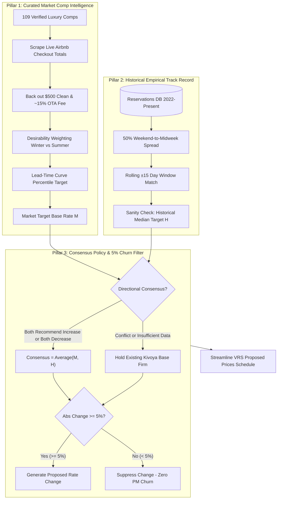

# STR Pricing Strategy & Valuation Methodology Memo
**Executive Revenue Optimization Architecture for Villa del Sol (Tempe, AZ)**  
**Target Audience:** Third-Party Property Managers, STR Hospitality Directors, Local Phoenix/Tempe Real Estate Specialists  
**Property:** Villa del Sol (920 E Carver Rd, Tempe, AZ 85284)  
**PMS Platform:** Kivoya / Streamline VRS (Unit ID: `503802`)  
**Document Status:** Open for Specialist Review, Validation & Calibration  

---

## Executive Summary & Objective

The purpose of this memo is to present the **institutional revenue management and competitive pricing strategy** governing Villa del Sol, a premier 6-bedroom, 4-bathroom luxury resort estate in Tempe, Arizona. 

Modern short-term rental (STR) revenue management in the Phoenix metropolitan area faces two standard failure modes:
1. **Generic Dynamic Pricing Algorithms (e.g., PriceLabs, Wheelhouse, Beyond):** These algorithms treat large-scale luxury compounds like commodity 1-bedroom condos or generic hotel rooms. They consistently overprice Phoenix’s extreme summer low season (>105°F heat), causing catastrophic vacancy, while severely underpricing high-compression golf, spring training, and festival weekends due to aggressive automated discounting.
2. **Static PMS Seasonal Calendars:** Relying on fixed flat rates over broad 3-month blocks fails to respond to real-time market pacing, inventory absorption velocity, or shifts in guest lead times.

To solve both challenges, we operate a proprietary **3-Pillar Pricing Engine** that balances **live competitor market intelligence** against **ground-truth historical booking performance (2022–Present)**, filtered through an algorithmic **Directional Consensus Policy** and a **5% PMS Churn Reduction Threshold**.

We invite our property management partners and local STR market specialists to review this methodology, inspect our underlying assumptions, and provide formal validation or calibration notes using the **Expert Validation Scorecard** at the conclusion of this brief.

---

## 1. Property Profile & Strategic Asset Positioning

| Asset Attribute | Property Specification | Strategic Pricing Implication |
| :--- | :--- | :--- |
| **Physical Layout** | 6 Bedrooms, 4 Full Bathrooms | Direct entry into the high-occupancy 16-guest group market. |
| **Sleep Capacity** | Accommodates 16 Guests in Dedicated Beds | Out-competes standard 3–4 bedroom homes; commands significant group cost-per-person advantages. |
| **Backyard Amenities** | Private heated pool, rock grotto, cascading waterfall, heated spa, putting green, full outdoor basketball/sports court, covered dining patio. | Year-round leisure asset; sports amenities drive corporate retreats and multi-family bookings during off-peak periods. |
| **Micro-Location** | South Tempe (E Carver Rd / Rural Rd corridor) | 15–20 minutes to Old Town Scottsdale, 15 minutes to Phoenix Sky Harbor Airport (PHX), 12 minutes to ASU, 15 minutes to major Spring Training facilities (Cactus League). |
| **Target Guest Segments** | Multi-generational families, executive retreats, Cactus League Spring Training attendees, golf travel groups, youth sports tournaments. | Segment willingness-to-pay varies dramatically between midweek corporate/family stays and weekend event travel. |

---

## 2. The 3 Core Pillars of Revenue Optimization



---

### Pillar 1: Curated Market Comp Intelligence & Guest Cost Normalization

#### A. Curated Competitor Universe (109 Audited Listings)
Rather than using broad radius scrapers that pollute data with 2-bedroom condos or unverified budget listings, our engine tracks **109 hand-curated luxury listings** across the East Valley and Scottsdale:
* **Tier A (Direct Comps — Sleeps 16+, 6+ Bedrooms)**: Large luxury estates featuring resort-style pools, spas, and outdoor sports amenities that compete directly with Villa del Sol for large bookings.
* **Tier B (Secondary Comps — Sleeps 12–15, 5+ Bedrooms)**: High-capacity properties that capture smaller family or golf groups when Tier A inventory is scarce.

#### B. True Guest Checkout Cost & OTA Commission Normalization
Guests on platforms like Airbnb and VRBO make purchase decisions based on the **Total All-In Checkout Price** (Nightly Rate + Cleaning Fee + Platform Service Fees + Local Lodging Taxes), not the property's PMS base rate.

When the engine benchmarks market rates against competitors, it:
1. Scrapes the **actual live checkout total** that a guest pays on Airbnb for each competitor.
2. Backs out Kivoya’s standard cleaning fee (**\$500.00**) and the online travel agency (OTA) markup factor ($\approx 1.15$):
   $$\text{Target Kivoya Total} = \frac{\text{Target Airbnb Checkout Total}}{1.15}$$
   $$\text{Recommended Kivoya Base Rate} = \frac{\text{Target Kivoya Total} - \$500.00\ \text{Cleaning Fee}}{\text{Stay Nights}}$$

This guarantees that our internal Kivoya PMS rate produces a final consumer checkout price that is competitive in the Airbnb/VRBO marketplace.

#### C. Desirability Adjustment Ratios (Winter vs. Summer)
No two properties are identical. Every competitor listing in our registry is evaluated across 6 audited asset dimensions (Lot Size & Privacy, Pool & Water Features, Interior Luxury, Bedroom Configuration, Location, and Host Rating):
* **Winter High-Season Ratio ($\ge 1.0$)**: Reflects peak-season competitive advantage where heated pools, putting greens, and sports courts capture premium group pricing.
* **Summer Low-Season Ratio**: Downwardly adjusts benchmarks for outdoor-heavy amenities during extreme desert heat (>100°F), preventing uncompetitive summer overpricing.

#### D. Lead-Time Demand Tapering Curves & Midweek Discounts
Booking lead times in Phoenix follow distinct seasonal patterns:
* **Far Out ($>90$ Days)**: Priced at the top **80th–85th percentile** of the luxury comp set to capture high-budget advance bookers without leaving money on the table.
* **Mid-Range (30–90 Days)**: Tapers to the **70th–75th percentile** as the booking window enters normal conversion pace.
* **Near-In ($<30$ Days)**: Tapers to the **60th percentile** to protect calendar occupancy and prevent unrecoverable perishable zero-revenue nights.
* **Midweek Discount Factor**: Midweek nights (Sunday–Wednesday) target a **30% lower percentile** than weekend nights (Thursday–Saturday) to stimulate commercial and off-peak occupancy.

---

### Pillar 2: Historical Empirical Track Record & The 50% Weekend Rule

#### A. Empirical Ground Truth (2022–Present Database)
Theoretical algorithms frequently misread local market elasticity. Villa del Sol maintains a private reservations database of all confirmed bookings from 2022 to the present, capturing exact dates, lead times, length of stay, guest counts, and realized ADR (Average Daily Rate).

#### B. The 50% Weekend Apportionment Rule ($R_w = 1.50 \times R_m$)
When a guest books a 5-night stay spanning Wednesday to Monday, generic PMS reports simply divide the total rent by 5, creating an artificial flat average that understates weekend value and overstates weekday value.

Our methodology mathematically decouples historical mixed stays assuming weekend nights (Thursday, Friday, Saturday) carry a minimum **50% premium** over midweek nights (Sunday through Wednesday):
$$\text{Gross Rent} = (N_m \times R_m) + (N_w \times 1.50 \times R_m)$$
$$R_m = \frac{\text{Gross Rent}}{N_m + 1.50 \times N_w}, \quad R_w = 1.50 \times R_m$$

**Historical Validation**: By lowering midweek rates to reflect this natural 50% spread, Villa del Sol expanded its booked midweek room night volume from **27.9% in 2024 to 43.1% in 2025**, driving substantial incremental revenue while preserving weekend pricing power.

#### C. Macroeconomic Defense: Why We Do NOT Apply CPI Inflation to Historical Rates
Property managers often ask: *“Should we increase our 2022–2024 historical booking prices by 15%–18% CPI inflation when setting future rate targets?”*

**Our Firm Policy: NO.**
1. **Maricopa County Supply Shock**: Between 2021 and 2025, active STR listings in the greater Phoenix/Scottsdale market increased by **over 35%**. While consumer goods (groceries, auto, utilities) experienced CPI inflation, local STR average daily rates flattened or compressed due to intense inventory competition.
2. **Artificial Vacancy Risk**: Escalating historical targets by headline inflation creates uncompetitive pricing that leads to extended calendar vacancy until last-minute panic discounting occurs.
3. **Live Comps Already Capture Inflation**: If operational costs or consumer demand rise, live competitor checkout pricing captures that inflation in real-time. Historical data serves as a **stability anchor**, not an inflation escalator.

---

### Pillar 3: Algorithmic Consensus & 5% Churn Reduction Filter

```
             ┌──────────────────────────────────────────────┐
             │       Market Comp Recommendation (M)         │
             │       Historical ADR Benchmark (H)           │
             └──────────────────────┬───────────────────────┘
                                    │
                                    ▼
                     ┌──────────────────────────────┐
                     │    Directional Consensus?    │
                     │  (Both Higher or Both Lower) │
                     └──────────────┬───────────────┘
                                    │
                  ┌─────────────────┴─────────────────┐
                  │ YES                               │ NO / CONFLICT
                  ▼                                   ▼
   ┌──────────────────────────────┐    ┌──────────────────────────────┐
   │ Consensus = (M + H) / 2      │    │ Hold Current Kivoya Base     │
   └──────────────┬───────────────┘    └──────────────┬───────────────┘
                  │                                   │
                  └─────────────────┬─────────────────┘
                                    │
                                    ▼
                     ┌──────────────────────────────┐
                     │   Rate Change >= 5.0%?       │
                     └──────────────┬───────────────┘
                                    │
                  ┌─────────────────┴─────────────────┐
                  │ YES (>= 5%)                       │ NO (< 5%)
                  ▼                                   ▼
   ┌──────────────────────────────┐    ┌──────────────────────────────┐
   │ Propose Rate Adjustment      │    │ Hold Existing Rate Firm      │
   │ ($Base → $New in Schedule)   │    │ (Zero PMS Churn / Waste)     │
   └──────────────────────────────┘    └──────────────────────────────┘
```

#### A. Directional Consensus Policy
To prevent erratic algorithmic whipsawing, rate modifications require mutual agreement between current market supply and historical demand:
* **Agreed Increase**: If both live market comps AND historical sales targets exceed the current Kivoya base rate, the engine proposes an upward adjustment:
  $$\text{Consensus Rate} = \text{round}\left(\frac{\text{Market Rec} + \text{Historical Target}}{2}\right)$$
* **Agreed Decrease**: If both live market comps AND historical sales indicate that the property is overpriced, the engine proposes a calculated downward adjustment.
* **Conflict or Missing Data**: If market comps indicate a drop but historical bookings demonstrate high achieved rates (or vice versa), the engine **holds the current Kivoya base rate unchanged**.

#### B. The 5% Churn Reduction Filter
Property managers should not spend valuable operational time updating PMS rate tables for trivial \$10 to \$20 fluctuations.
* If a proposed rate change is **less than 5.0%** of the existing base price:
  $$\frac{|\text{Proposed Rate} - \text{Base Rate}|}{\text{Base Rate}} < 0.05 \implies \text{Hold Rate Firm (Suppress Update)}$$
* This rule eliminates 80% of unnecessary PMS modifications while ensuring that when a rate change is proposed, it represents a meaningful, high-conviction revenue adjustment.

#### C. Dynamic Minimum Nights & Orphan Slot Protection
* **Within 90 Days ($\le 90$ Days)**: Automatically relaxes to a **2-night minimum** to capture lucrative short-lead weekend getaways and prevent vacant unbooked dates.
* **Beyond 90 Days ($>90$ Days)**: Automatically enforces a **3-night minimum** (4 nights for Christmas/New Year) to preserve calendar integrity and prevent low-revenue fragmented bookings far in advance.
* **Summer Low Season (July & August)**: Automatically adheres to a **2-night minimum** regardless of lead time to maximize booking velocity in low-demand months.
* **Orphan Slot Protection**: If a 2-night gap exists between confirmed bookings, or if an available weekend (Thu–Sat) has only 2 nights remaining, the engine automatically caps the requirement at **2 nights** so the dates remain bookable.

---

> [!NOTE]
> **Technical Configuration Reference**: Deep configuration parameters for holiday minimum nights, calendar segmentation overrides, and PMS API drivers are documented in the companion [Pricing Engine Guide](file:///Users/ivanpe/str-price-advisor/docs/PRICING_ENGINE_GUIDE.md).

---

## 3. Streamline VRS PMS Integration & Operational Protocol

### How the Strategy Maps into Streamline VRS
Streamline VRS (Kivoya's Property Management System) structures pricing by **Seasonal Rate Periods** under `Tools > Property Management > Seasonal Rates`. Our Proposed Prices engine aligns 1-to-1 with Streamline's native schema:

1. **Midweek Base Rate (`daily_first_interval_price`)**: Applies to Sunday through Wednesday nights.
2. **Weekend Base Rate (`daily_second_interval_price`)**: Applies to Thursday through Saturday nights (enforcing the 50% weekend premium).
3. **Special / Holiday Rate (`price`)**: Flat nightly rate applied to dedicated holiday windows where split pricing is not utilized.
4. **Minimum Stay (`min_stay_days`)**: Enforces 2-night near-in / summer rules and 3-to-4 night advance / holiday rules.

### Operational Copy-Paste Cadence (1-Click Workflow)
To minimize property management labor:
1. Open the interactive dashboard at [`docs/index.html`](file:///Users/ivanpe/str-price-advisor/docs/index.html) and navigate to the **Pricing Recommendations** tab.
2. Review the **Proposed Prices Table** for green (upward) or red (downward) proposed adjustments. Unchanged periods remain white.
3. Click **📋 Copy Proposed Prices** in the table header. Clean tab-delimited values (TSV) are copied immediately to your clipboard:
   ```text
   From        To          Midweek    Weekend    Special    Min nights    Holiday
   09/08/2026  09/30/2026  $399       $549                  2             
   10/01/2026  10/07/2026  $399       $599                  2             
   10/08/2026  10/12/2026                        $659       3             Columbus Day
   10/13/2026  10/31/2026  $444       $599                  2             
   11/01/2026  11/25/2026  $499       $649                  3             
   11/26/2026  11/30/2026                        $949       3             Thanksgiving
   12/01/2026  12/22/2026  $549       $749                  3             
   12/23/2026  01/03/2027                        $1,348     4             Christmas & New Year
   ```
4. Paste directly into Streamline VRS or your rate management workbook. Updates take less than 60 seconds per review cycle.

---

## 4. Expert Validation Scorecard & Sign-Off Sheet

We request that our property manager or designated local STR specialist review the methodology above and provide validation feedback across these 4 core dimensions:

### 4-Point Validation Rubric

```
[ ] 1. COMPETITOR UNIVERSE VALIDITY
    Criterion: The 109-listing comp universe correctly distinguishes Tier A (16+ guests, 6BR luxury resort compounds) 
               from Tier B (12-15 guests, 5BR), and accurately reflects true competitive substitutes for Villa del Sol in Tempe/Scottsdale.
    Status: [ ] Confirmed / Validated   [ ] Needs Adjustment (See Notes)

[ ] 2. SEASONAL & WEEKEND SPREAD MODELING
    Criterion: The 50% weekend-to-midweek price premium (Rw = 1.50 * Rm) and lead-time percentile tapering curves (85th -> 60th)
               accurately capture booking velocity and prevent mid-week vacancy in Maricopa County.
    Status: [ ] Confirmed / Validated   [ ] Needs Adjustment (See Notes)

[ ] 3. MINIMUM STAY POLICIES & ORPHAN GAP RULES
    Criterion: The 90-day transition (2 nights within 90 days; 3 nights beyond 90 days), the July/August summer 2-night floor, 
               and the 2-night orphan slot override strike the right balance between calendar defense and booking capture.
    Status: [ ] Confirmed / Validated   [ ] Needs Adjustment (See Notes)

[ ] 4. OPERATIONAL PMS CADENCE & 5% CHURN THRESHOLD
    Criterion: Suppressing rate modifications below 5.0% appropriately protects property management efficiency 
               without sacrificing material revenue capture.
    Status: [ ] Confirmed / Validated   [ ] Needs Adjustment (See Notes)
```

### Specialist Calibration Notes & Recommendations
*(Please document any recommended adjustments to specific rate periods, seasonal benchmarks, or comp weightings below)*

```
Notes / Suggested Calibrations:
___________________________________________________________________________________________________
___________________________________________________________________________________________________
___________________________________________________________________________________________________
___________________________________________________________________________________________________
```

### Formal Sign-Off

* **Reviewer Name:** __________________________________________________  
* **Title / Organization:** _____________________________________________  
* **Signature:** _______________________________________________________  
* **Date:** ________________________  

---

## 5. Strategic Discussion Questions for Advisory Sessions

When reviewing this strategy with your property manager, broker, or revenue advisor, use these targeted questions to guide your discussion:

1. **Submarket Compression Dynamics**: *“Are you seeing compression from Old Town Scottsdale and North Scottsdale spilling over into South Tempe luxury estates earlier or later than in previous seasons for Spring Training and the WM Phoenix Open?”*
2. **Summer Heat Mitigation**: *“Given our 2-night minimum and lower base rates in July and August, what promotional amenities or length-of-stay discounts are you seeing most effectively capture in-state 'staycation' travelers fleeing to pool homes?”*
3. **Midweek Corporate & Golf Demand**: *“How can we best collaborate to market Villa del Sol's full outdoor basketball court and putting green to midweek corporate retreats and golf groups between Tuesday and Thursday during October through April?”*
4. **Lead Time Shifts**: *“Are large-group booking windows lengthening or shortening in your portfolio compared to last year, and should we adjust our 90-day tapering threshold to 75 or 120 days?”*

---

## Appendix: Illustrative 12-Month Seasonal Benchmark Schedule

The table below illustrates representative proposed rate periods across all four seasons, demonstrating how the consensus engine translates market comps and historical track record into Streamline VRS rates:

| Rate Period Window | Season / Event | Midweek Rate | Weekend Rate | Special Rate | Min Nights | Strategy & Consensus Notes |
| :--- | :--- | :---: | :---: | :---: | :---: | :--- |
| **09/08 – 09/30** | September Fall Kickoff | \$399 | \$549 | — | 2 | Moderate shoulder demand; 2-night weekend capture. |
| **10/01 – 10/07** | Early October Standard | \$399 | \$599 | — | 2 | Cooling outdoor temperatures; weekend premium starts rising. |
| **10/08 – 10/12** | Columbus Day Weekend | — | — | **\$659** | 3 | High-demand family 3-day weekend compression. |
| **10/13 – 10/31** | Late October Fall Peak | \$444 | \$599 | — | 2 | Strong golf and outdoor event demand. |
| **11/01 – 11/25** | November High Season | \$499 | \$649 | — | 3 | Peak fall booking velocity; enforces 3-night advance integrity. |
| **11/26 – 11/30** | Thanksgiving Holiday | — | — | **\$949** | 3 | Family multi-generation gathering; peak holiday demand. |
| **12/01 – 12/22** | December Early Winter | \$549 | \$749 | — | 3 | Pre-holiday winter vacationers; strong corporate retreat window. |
| **12/23 – 01/03** | Christmas & New Year | — | — | **\$1,348** | 4 | Mega-peak national holiday; +42% consensus increase over base. |
| **01/04 – 01/31** | January Winter Prime | \$599 | \$899 | — | 3 | High snowbird and golf travel season; premium weekend yield. |
| **02/01 – 02/28** | February Golf / WM Open | \$699 | \$999 | — | 3 | Peak annual Arizona tourism; high ADR absorption. |
| **03/01 – 03/18** | March Spring Training | \$799 | \$1,199 | — | 3 | Cactus League baseball season; top-tier market percentiles. |
| **03/19 – 03/28** | Holy Week / MLB Finals | **\$1,000** | **\$1,508** | — | 3 | Split holiday pricing: \$1,000 Mon–Thu, \$1,508 Fri–Sun. |
| **04/01 – 04/30** | April Spring Wind-down | \$549 | \$799 | — | 3 | Warm spring leisure; transition out of peak season. |
| **05/01 – 05/27** | May Pre-Summer | \$449 | \$649 | — | 3 | Pool season begins; tapering into summer pricing. |
| **05/28 – 05/31** | Memorial Day Weekend | — | — | **\$699** | 3 | Kickoff to summer pool season; holiday weekend compression. |
| **06/01 – 06/30** | June Summer Warm-Up | \$349 | \$499 | — | 3 | Early heat; midweek rate drops to stimulate volume. |
| **07/01 – 08/31** | July & August Low Season | \$299 | \$449 | — | 2 | Extreme heat (>105°F); 2-night minimum enforced to capture staycations. |

> [!TIP]
> **Live Dashboard Access**: To view the full live dynamic schedule with interactive filtering, competitor price distributions, and real-time sales tracking, open the project dashboard at [`docs/index.html`](file:///Users/ivanpe/str-price-advisor/docs/index.html).

