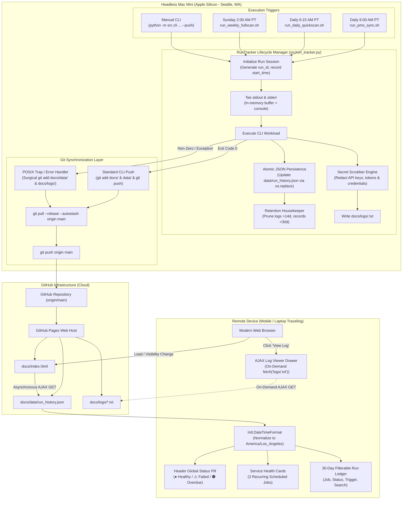

# Remote System Run Monitoring & Diagnostics
**Technical Design Document & System Architecture Specification**

---

## 1. Executive Summary & Problem Definition

### 1.1 Context & Background
The **STR Competitive Price Advisor** is deployed on a dedicated headless Apple Silicon Mac Mini located in Seattle, WA. It executes three mission-critical scheduled automation daemons via macOS `launchd`:
1. **Daily PMS Reservation Sync (`pms-sync`)**: Runs daily at **6:00 AM PT** (Pacific Time) to ingest newly booked reservations and calendar blocks from Streamline OwnerX PMS and reconcile revenue pacing.
2. **Daily 90-Day Quick Market Scan (`daily-quickscan`)**: Runs daily at **6:15 AM PT** (Pacific Time) to scrape live competitor rates across Airbnb, VRBO, and Booking.com using a 10-node NordVPN stealth proxy pool, compute lead-time tapered price recommendations, update pricing models, and push updates.
3. **Weekly Full 12-Month Market Scan (`weekly-fullscan`)**: Runs every **Sunday at 2:00 AM PT** (Pacific Time) to execute a comprehensive 12-month calendar audit, benchmark multi-channel OTA markups against Kivoya direct pricing, and recalculate long-range pacing benchmarks.

### 1.2 The Operational Problem
When the property owner/operator is away from the Mac Mini (traveling or operating from mobile devices), there is currently no centralized, remote way to:
- Confirm whether the morning runs succeeded or failed.
- Audit run performance over the last 30 days (duration, drift, failure rate).
- Inspect high-level business metrics per run (intervals evaluated, comps scraped, new bookings imported).
- Access detailed execution tracebacks on demand when a job crashes or encounters OTA blocks without an SSH tunnel.
- Detect a silent Mac Mini outage (e.g. power failure, Wi-Fi interruption, kernel sleep) that causes a missed execution window.

### 1.3 Aligned Design Decisions (Grill-Me Consensus)

| Dimension | Architectural Decision | Technical Rationale |
| :--- | :--- | :--- |
| **Primary Delivery Channel** | GitHub Pages Static Web Dashboard (`docs/index.html`) | Zero-cost hosting, globally accessible on mobile and desktop without VPN, firewalls, or third-party monitoring SaaS. |
| **Tab Label** | Concise: `"System"` | Clean, minimal UI that integrates naturally into the existing top navigation bar. |
| **Notification Policy** | **100% Elimination of routine push alerts & local GUI dialogs/sounds** | Completely remove routine `notify_mobile.sh` mobile alerts and local macOS `osascript` GUI dialogs/sounds for **both successes and failures**. The headless Mac Mini runs 100% silently; ntfy is strictly reserved for interactive human-in-the-loop agent prompts. Remote visibility is achieved entirely through the GitHub Pages dashboard and automated emergency git pushes. |
| **Trigger Source Identification** | **CLI Flag `--trigger {launchd,manual}` with `STR_TRIGGER` Fallback** | Explicit CLI flag `--trigger {launchd,manual}` (defaulting to `manual`) identifies trigger context, falling back to environment variable `STR_TRIGGER=launchd`. Scheduled launchd bash scripts pass `--trigger launchd`. |
| **Manual CLI Scope** | **Explicit Tracking Gate (`--push` or `--track`)** | Scheduled `launchd` runs are always tracked. Manual ad-hoc CLI commands are tracked in `run_history.json` only if `--push` or `--track` is passed, preventing local debugging and read-only queries from flooding the ledger. |
| **Dashboard Freshness** | **Hybrid Dynamic Client-Side AJAX Fetch** | `docs/index.html` renders pre-baked skeletons, but immediately executes `fetch('data/run_history.json?t=' + Date.now())` on load, tab switch, and auto-poll. Emergency failure pushes are instantly visible without requiring a full HTML rebuild. |
| **Emergency Push Protocol** | **Surgical Staging with Autostash & Safe Rebase Abort** | Failure traps stage **only** `docs/data/run_history.json` and `docs/logs/*.txt` (never `git add -A`). They execute `git pull --rebase --autostash origin main` before `git push origin main`. If an unresolvable merge conflict occurs, the handler immediately executes `git rebase --abort`, logs the conflict, and leaves the local commit clean for the next sync cycle. |
| **Timezone Normalization & SLA** | **Client-Side `America/Los_Angeles` Anchoring** | Browser drift logic normalizes client device time to Pacific Time (`America/Los_Angeles`, PST/PDT with automatic DST handling) using `Intl.DateTimeFormat` before evaluating SLA windows (6:00 AM, 6:15 AM, Sun 2:00 AM). On Mon–Sat, Weekly Fullscan reports `HEALTHY` if last Sunday's run succeeded, and `OVERDUE`/`FAILED` if missed or failed. |
| **Secret Scrubber Engine** | **Targeted Regex Heuristics with Whitelist** | Redacts values matching secret patterns (`*KEY*`, `*SECRET*`, `*TOKEN*`, `*PASSWORD*`, `*AUTH*`, `*CREDENTIAL*`) with length $\ge 8$ chars, excluding common booleans and keywords (`true`, `false`, `none`, `localhost`, etc.) to prevent false-positive log corruption. |
| **Retention Policy** | **14-Day Logs / 30-Day JSON History** | Automatically deletes `docs/logs/*.txt` older than 14 days and purges `run_history.json` entries older than 30 days to keep repository clone size and load times lean. |
| **Log Viewer UX** | **On-Demand Slide-Over Drawer with AJAX Fetch** | Raw logs are loaded asynchronously via `fetch()` only when clicked. Includes auto-scroll to exception tracebacks on `FAILED` runs, in-modal search highlighting, copy-to-clipboard, and download buttons. |

---

## 2. High-Level Architecture & End-to-End Workflow



---

## 3. Core Backend Components & Engine Design

### 3.1 RunTracker Lifecycle Manager (`src/run_tracker.py`)

`RunTracker` is a Python execution lifecycle context manager and programmatic interface designed to wrap automated jobs and manual CLI sweeps.

#### 3.1.1 Class Responsibilities
1. **Lifecycle Tracking**: Generates unique `run_id`, captures start/end timestamps, exit codes, and durations.
2. **Stream Teeing**: Intercepts `sys.stdout` and `sys.stderr` in real time, streaming output simultaneously to the console and to an in-memory buffer for log generation.
3. **Structured Summary Metrics**: Collects job-specific domain metrics (e.g. reservations imported, intervals evaluated, comps scraped) for display in dashboard cards and ledger tables.
4. **Error Extraction**: On non-zero exits or uncaught exceptions, automatically extracts a sanitized 3-line error excerpt for instant remote scanning without opening full logs.
5. **Secret Sanitization**: Passes all buffered log text through `SecretScrubber` before writing to disk.
6. **Atomic Ledger Updates**: Safely updates `data/run_history.json` and copies to `docs/data/run_history.json` using atomic file replacement (`tempfile` + `os.replace`).
7. **Housekeeping & Pruning**: Deletes log files older than 14 days and purges ledger entries older than 30 days.

#### 3.1.2 Python API Specification
```python
from typing import Optional, Dict, Any
from pathlib import Path

class RunTracker:
    def __init__(
        self,
        job_type: str,
        job_title: Optional[str] = None,
        trigger: str = "launchd",
        enabled: bool = True,
        log_dir: Path = Path("docs/logs"),
        history_path: Path = Path("data/run_history.json"),
        docs_history_path: Path = Path("docs/data/run_history.json"),
    ):
        """
        job_type: Identifier ('pms-sync', 'daily-quickscan', 'weekly-fullscan', 'manual-cli')
        trigger: 'launchd' or 'manual' (resolved via CLI --trigger, env STR_TRIGGER, or defaulted to manual)
        enabled: If False, tracker is a no-op passthrough (gated by --push, --track, or trigger='launchd')
        """
        ...

    def set_summary(self, **kwargs: Any) -> None:
        """Update structured domain summary metrics (e.g. intervals_evaluated=12)."""
        ...

    def set_message(self, msg: str) -> None:
        """Set high-level business summary sentence for the run record."""
        ...

    def record_error(self, err: BaseException, excerpt: Optional[str] = None) -> None:
        """Record explicit exception details and build error excerpt."""
        ...

    def __enter__(self) -> "RunTracker":
        """Start run timer, tee stdout/stderr, mark status RUNNING."""
        ...

    def __exit__(self, exc_type, exc_val, exc_tb) -> bool:
        """
        Finalize run: record end_time, duration, exit_code (0 or 1).
        Scrub logs, write docs/logs/<run_id>.txt.
        Atomically update run_history.json.
        Execute retention pruning.
        Returns False to propagate exceptions.
        """
        ...
```

#### 3.1.3 Stream Teeing Mechanism (`TeeStream`)
To capture complete CLI execution output without interfering with terminal output, `RunTracker` wraps `sys.stdout` and `sys.stderr` using a thread-safe multi-writer stream:
```python
import io
import sys

class TeeStream(io.TextIOBase):
    def __init__(self, original_stream, buffer: io.StringIO):
        self.original = original_stream
        self.buffer = buffer

    def write(self, s: str) -> int:
        self.original.write(s)
        self.original.flush()
        return self.buffer.write(s)

    def flush(self) -> None:
        self.original.flush()
        self.buffer.flush()
```

#### 3.1.4 Job-Specific Domain Summaries
`RunTracker` records rich business summaries tailored to each operational workload:
- **`pms-sync`**:
  ```json
  {
    "total_reservations": 209,
    "new_reservations": 1,
    "shifted_reservations": 0,
    "next_arrival": "2026-09-28 (Smith)",
    "message": "Synced 209 reservations from Streamline; 1 new booking imported."
  }
  ```
- **`daily-quickscan`**:
  ```json
  {
    "intervals_evaluated": 12,
    "comps_scraped": 97,
    "urgent_adjustments": 3,
    "moderate_adjustments": 5,
    "proxy_pool_health": "10/10 active",
    "message": "Scanned 12 intervals across 97 comps; 3 urgent price adjustments identified."
  }
  ```
- **`weekly-fullscan`**:
  ```json
  {
    "total_intervals": 52,
    "comps_evaluated": 109,
    "multi_channel_audited": true,
    "rate_anomalies": 2,
    "message": "Full 12-month audit completed; 2 OTA rate anomalies detected."
  }
  ```
- **`manual-cli`**:
  ```json
  {
    "command": "python -m src.cli run --quick --push",
    "modified_records": 12,
    "message": "Manual quickscan triggered by operator."
  }
  ```

---

## 4. Security & Secret Scrubbing Engine (`SecretScrubber`)

### 4.1 Threat Model & Sanitization Objective
The repository publishes `docs/` directly to GitHub Pages. All raw logs stored in `docs/logs/` are public web assets. It is a strict system invariant (**NFR-1.1**) that no credentials, tokens, or private secrets are leaked into `docs/logs/` or `run_history.json`.

### 4.2 Heuristic Filtering Criteria
To prevent false-positive log corruption (e.g. redacting words like `True`, `8000`, `AZ`, `Seattle`, `Phoenix`, `localhost`), `SecretScrubber` applies a 4-tier filtering hierarchy:

1. **Environment Key Identifier Pattern**: Only values associated with sensitive keys in `.env` or `os.environ` are candidates for redaction:
   ```regex
   .*(KEY|SECRET|TOKEN|PASSWORD|AUTH|CREDENTIAL|BEARER|SOCKS|PRIVATE).*
   ```
2. **Length Guard**: Values must have a length of **$\ge 8$ characters**.
3. **Keyword & Literal Whitelist**: Values matching common keywords, hostnames, and booleans are strictly excluded from scrubbing:
   ```python
   SCRUB_EXCLUSIONS = {
       "true", "false", "none", "null", "localhost", "127.0.0.1",
       "0.0.0.0", "production", "development", "staging", "seattle",
       "washington", "phoenix", "arizona", "villasol", "kivoya", "streamline"
   }
   ```
4. **High-Entropy Structural Patterns**: Regardless of `.env` discovery, the scrubber applies regex detection for standard secret token shapes:
   - **JWT Tokens**: `r"ey[A-Za-z0-9_-]{10,}\.[A-Za-z0-9_-]{10,}\.[A-Za-z0-9_-]{10,}"`
   - **API Key Prefixes**: `r"(?:sk|pk|api|token|secret)_[A-Za-z0-9_-]{16,}"`
   - **URL Basic Auth**: `r"(https?:\/\/)([^:\/\s]+):([^@\/\s]+)@"` $\to$ `\1[REDACTED_USER]:[REDACTED_PASS]@`
   - **SOCKS5 Proxies**: `r"socks5:\/\/([^:\/\s]+):([^@\/\s]+)@"` $\to$ `socks5://[REDACTED_USER]:[REDACTED_PASS]@`

### 4.3 Sanitization Pipeline
```python
import os
import re
from typing import Set

class SecretScrubber:
    def __init__(self, env_path: str = ".env"):
        self.secrets: Set[str] = set()
        self._load_secrets(env_path)

    def _load_secrets(self, env_path: str):
        # Scan os.environ and .env for sensitive keys
        sensitive_key_rx = re.compile(r"(KEY|SECRET|TOKEN|PASSWORD|AUTH|CREDENTIAL|BEARER|SOCKS)", re.I)
        # Populate self.secrets with candidates satisfying length >= 8 and not in SCRUB_EXCLUSIONS
        ...

    def scrub(self, text: str) -> str:
        if not text:
            return ""
        # 1. Structural Regex replacements (URLs, JWTs, SOCKS5 credentials)
        scrubbed = self._scrub_patterns(text)
        # 2. Exact match replacements for discovered .env secret strings
        for secret in sorted(self.secrets, key=len, reverse=True):
            scrubbed = scrubbed.replace(secret, "[REDACTED_SECRET]")
        return scrubbed
```

---

## 5. Shell Script Instrumentation & Emergency Push Protocol

### 5.1 Elimination of Routine Notification Fatigue & Headless Silence
In strict compliance with user requirements, **all calls to `notify_mobile.sh` and local macOS `osascript` GUI dialogs/sounds are eliminated** from:
- `scripts/launchd/run_pms_sync.sh`
- `scripts/launchd/run_daily_quickscan.sh`
- `scripts/launchd/run_weekly_fullscan.sh`

Neither successful completions nor routine failure alerts will fire mobile push notifications or trigger Mac Mini UI modal alerts. The headless Mac Mini runs completely silently without accumulating abandoned modal window processes. Remote visibility is achieved entirely through the GitHub Pages dashboard and automated emergency git pushes.

### 5.2 POSIX Trap & Emergency Git Push Protocol
Both shell scripts and the internal Python runner implement emergency error traps in a coordinated dual-layer architecture:
1. **Primary Layer (Python `RunTracker`)**: When an uncaught exception or non-zero exit occurs within a tracked Python job and pushing is enabled (via `trigger="launchd"` or `--push`), `RunTracker.__exit__` immediately writes the scrubbed log, updates `docs/data/run_history.json`, and performs a surgical staging, commit, and push.
2. **Safety Net Layer (POSIX Shell Trap)**: If a failure occurs before or outside Python (e.g., venv corruption, python missing, early script error), the shell script's `emergency_push_on_failure` trap fires, stages any available run history/logs, commits, rebases, and pushes to origin/main.

#### 5.2.1 Surgical Git Staging & Upstream Reconciliation
If a job encounters an uncaught exception, proxy failure, or non-zero exit code, the emergency handler executes:

1. **Surgical Staging**: Staged files are strictly limited to `docs/data/run_history.json` and `docs/logs/`. **Never run `git add -A` or `git add .`**, ensuring uncommitted dirty data files (`data/market_rates.json`, temporary caches) remain isolated locally and never pollute the remote repository.
2. **Upstream Autostash & Rebase with Safe Abort**: Executes `git pull --rebase --autostash origin main` prior to pushing. If remote commits were pushed from a laptop or mobile controller, the local emergency commit is cleanly rebased on top of `origin/main`. If an unresolvable merge conflict occurs, the handler immediately executes `git rebase --abort`, logs the conflict, and leaves the local commit clean for the next sync cycle without corrupting git state.
3. **Emergency Commit Message**: Commits with a distinct, standardized alert message:
   ```
   🚨 Automated Alert: <job_type> failed with exit code <code> (<timestamp_pt>)
   ```
4. **Push with Non-Blocking Timeout**: Executes `git push origin main` with a 30-second timeout.
5. **Exit Code Preservation**: Preserves the original failure exit code so launchd logs record the genuine error.

#### 5.2.2 Shell Implementation Template (`scripts/launchd/run_daily_quickscan.sh`)
```bash
#!/usr/bin/env bash
set -uo pipefail

SCRIPT_DIR="$(cd "$(dirname "${BASH_SOURCE[0]}")" && pwd)"
PROJECT_ROOT="$(cd "$SCRIPT_DIR/../.." && pwd)"
LOG_DIR="$HOME/Library/Logs/str-price-advisor"
LOG_FILE="$LOG_DIR/daily_quickscan.log"
JOB_NAME="daily-quickscan"

cd "$PROJECT_ROOT" || exit 1

# Surgical Emergency Failure Handler
emergency_push_on_failure() {
    local exit_code=$?
    local ts_pt
    ts_pt=$(TZ="America/Los_Angeles" date '+%Y-%m-%d %H:%M:%S %Z')
    echo "❌ [${ts_pt}] Emergency trap: ${JOB_NAME} failed with exit code ${exit_code}." >> "$LOG_FILE"

    # Surgical staging: ONLY run history and logs
    if [ -f "docs/data/run_history.json" ]; then
        git add docs/data/run_history.json >> "$LOG_FILE" 2>&1 || true
    fi
    if [ -d "docs/logs" ]; then
        git add docs/logs/*.txt >> "$LOG_FILE" 2>&1 || true
    fi

    # Check if run tracker staged changes
    if ! git diff --cached --quiet; then
        echo "🚨 Committing and pushing emergency failure record to GitHub Pages..." >> "$LOG_FILE"
        git commit -m "🚨 Automated Alert: ${JOB_NAME} failed with exit code ${exit_code} (${ts_pt})" >> "$LOG_FILE" 2>&1 || true
        if ! git pull --rebase --autostash origin main >> "$LOG_FILE" 2>&1; then
            echo "⚠️ Rebase conflict encountered during emergency push. Aborting rebase to preserve clean tree." >> "$LOG_FILE"
            git rebase --abort >> "$LOG_FILE" 2>&1 || true
        else
            git push origin main >> "$LOG_FILE" 2>&1 || true
        fi
    fi

    cleanup
    exec 9>&- 2>/dev/null || true
    exit "$exit_code"
}

# Trap ERR and terminal signals
trap emergency_push_on_failure ERR
trap 'cleanup; exit 130' INT
trap 'cleanup; exit 143' TERM
```

---

## 6. Frontend & GitHub Pages Integration (`docs/index.html` & `src/html_generator.py`)

### 6.1 Global Navigation & Header Status Pill
In `src/html_generator.py`:
1. **Nav Bar Button**: A dedicated tab button is added at the end of `.tabs-nav` (after `🌐 Channels`):
   ```html
   <button class="tab-btn" onclick="switchTab('system')" role="tab" id="tab-btn-system" aria-selected="false">
     🖥️ System <span id="system-tab-badge" class="badge-mini"></span>
   </button>
   ```
2. **Header Global Status Pill**: Adjacent to the `Updated: <date>` badge in the dashboard header, an interactive status pill renders the system health status:
   - 🟢 `● All Systems Healthy` (All scheduled runs within SLA succeeded).
   - 🔴 `⚠️ 1 Job Failed` (One or more jobs failed within the last 24h).
   - 🟠 `⚠️ Job Overdue` (Mac Mini missed expected execution window).
   - 🟡 `● Job Running` (A job is currently executing).
   - Clicking the pill switches active tab directly to `#system`.

### 6.2 Service Health Status Cards
At the top of `#tab-system`, three primary service cards display real-time status:
1. **Daily PMS Sync** (Scheduled: Daily 6:00 AM PT)
2. **Daily 90-Day Quickscan** (Scheduled: Daily 6:15 AM PT)
3. **Weekly 12-Month Fullscan** (Scheduled: Sunday 2:00 AM PT)

#### Card Component Wireframe
```
+-----------------------------------------------------------------+
| [Icon] Daily 90-Day Quick Market Scan           [🟢 HEALTHY]     |
| Scheduled: Daily at 6:15 AM PT                                  |
+-----------------------------------------------------------------+
| Last Run: Today, 6:15 AM PT (Duration: 6m 37s)                  |
| Summary:  Scanned 12 intervals across 97 comps (3 urgent updates)|
| Host:     mac-mini-m2 (Commit: e81f4a9)                         |
+-----------------------------------------------------------------+
| [ 📄 View Latest Log ]                                          |
+-----------------------------------------------------------------+
```

### 6.3 Dynamic SLA Overdue & Heartbeat Drift Engine
To detect headless Mac Mini hardware outages, power loss, or network disconnection, the dashboard calculates drift entirely in client-side JavaScript.

#### 6.3.1 Timezone Normalization Algorithm
```javascript
// Normalize client device clock to America/Los_Angeles (Pacific Time, PST/PDT)
function getPacificNow() {
  const now = new Date();
  const pacificStr = now.toLocaleString("en-US", { timeZone: "America/Los_Angeles" });
  return new Date(pacificStr);
}

// Check if a job is overdue or healthy
function evaluateJobSLA(jobType, lastRunRecord) {
  const ptNow = getPacificNow();
  const currentHour = ptNow.getHours();
  const currentMin = ptNow.getMinutes();
  const currentDay = ptNow.getDay(); // 0 = Sunday

  // Define SLA Deadlines (Pacific Time)
  const SLA_CONFIG = {
    'pms-sync': { hour: 6, min: 20, isDaily: true },
    'daily-quickscan': { hour: 6, min: 45, isDaily: true },
    'weekly-fullscan': { hour: 4, min: 0, isWeekly: true, day: 0 }
  };

  const cfg = SLA_CONFIG[jobType];
  if (!cfg) return 'UNKNOWN';

  if (!lastRunRecord) {
    return 'OVERDUE';
  }

  if (lastRunRecord.status === 'RUNNING') {
    return 'RUNNING';
  }

  // If the last completed run failed, it remains FAILED until a subsequent run succeeds
  if (lastRunRecord.status === 'FAILED') {
    return 'FAILED';
  }

  const lastRunDate = new Date(lastRunRecord.start_time);
  const isToday = lastRunDate.toLocaleDateString("en-US", { timeZone: "America/Los_Angeles" }) === 
                  ptNow.toLocaleDateString("en-US", { timeZone: "America/Los_Angeles" });

  if (cfg.isDaily) {
    const isPastDeadline = (currentHour > cfg.hour) || (currentHour === cfg.hour && currentMin >= cfg.min);
    if (isPastDeadline && !isToday) {
      return 'OVERDUE';
    }
  } else if (cfg.isWeekly) {
    // Weekly Fullscan runs Sundays at 2:00 AM PT (deadline 4:00 AM PT)
    const isSundayPastDeadline = (currentDay === 0 && ((currentHour > cfg.hour) || (currentHour === cfg.hour && currentMin >= cfg.min)));
    
    // On Sunday past deadline: must have run today
    if (isSundayPastDeadline && !isToday) {
      return 'OVERDUE';
    }
    
    // On Mon-Sat (or Sun before deadline): verify that the last successful run occurred within the current weekly cycle (<= 7 days ago + day offset)
    const msInDay = 86400000;
    const daysSinceLastRun = (ptNow.getTime() - lastRunDate.getTime()) / msInDay;
    const allowedDriftDays = 7 + (currentDay === 0 ? 0 : currentDay);
    if (daysSinceLastRun > allowedDriftDays) {
      return 'OVERDUE';
    }
  }

  return 'HEALTHY';
}
```

### 6.4 Hybrid Dynamic Client-Side Architecture
To guarantee that emergency failure pushes are instantly visible on remote devices without requiring `docs/index.html` to be rebuilt, the frontend employs a hybrid data-loading architecture:
1. **Initial Static Render**: `src/html_generator.py` bakes the current run table into HTML so the page loads with zero layout shift.
2. **Asynchronous Background Refresh**:
   ```javascript
   async function refreshRunHistory() {
     try {
       const res = await fetch(`data/run_history.json?t=${Date.now()}`);
       if (res.ok) {
         const data = await res.json();
         updateSystemDashboard(data);
       }
     } catch (err) {
       console.warn("Could not fetch latest run_history.json, using static cache:", err);
     }
   }

   // Trigger on page load and when user clicks the System tab
   document.addEventListener("DOMContentLoaded", refreshRunHistory);
   window.addEventListener("focus", refreshRunHistory);
   ```

### 6.5 30-Day Historical Run Ledger
A sleek, filterable table renders the last 30 days of executions:
- **Columns**: Timestamp (PT), Job Name, Trigger (`Schedule` vs `Manual`), Status (`SUCCESS`, `FAILED`, `RUNNING`), Duration, Business Summary / Error Excerpt, Log Action.
- **Interactive UI Filters**:
  - **Trigger Filter**: `All` | `Scheduled Only` | `Manual Only`.
  - **Status Filter**: `All` | `Failed Only` | `Success Only`.
  - **Live Search**: Filters rows instantly by keyword or date string.

### 6.6 Asynchronous Log Viewer Drawer & Traceback Auto-Scroll
When clicking `[ 📄 View Log ]` on any row or health card:
1. A slide-over modal drawer opens with a dark monospace terminal theme (`#0d1117`).
2. An asynchronous HTTP GET requests `docs/logs/<log_file>`.
3. If the run failed, client-side JS scans for `Traceback (most recent call last)` or `Error:`, highlights the lines in soft red, and automatically smooth-scrolls the viewer directly to the error.
4. **Header Toolbar**:
   - **Search Box**: Highlights matching lines and jumps between matches.
   - **Copy Log**: Copies the raw text directly to clipboard.
   - **Download .txt**: Triggers browser file download.
   - **Close Button**: Dismisses modal on click or `Esc` keypress.

---

## 7. Data Schema & Storage Specifications

### 7.1 `data/run_history.json` & `docs/data/run_history.json`
```json
{
  "$schema": "http://json-schema.org/draft-07/schema#",
  "title": "RunHistoryStore",
  "type": "object",
  "required": ["version", "last_updated", "runs"],
  "properties": {
    "version": { "type": "string", "enum": ["1.0"] },
    "last_updated": { "type": "string", "format": "date-time" },
    "active_host": { "type": "string" },
    "runs": {
      "type": "array",
      "items": {
        "type": "object",
        "required": [
          "run_id", "job_type", "job_title", "trigger",
          "status", "start_time", "end_time", "duration_sec",
          "exit_code", "git_commit", "log_file", "summary"
        ],
        "properties": {
          "run_id": { "type": "string" },
          "job_type": { "type": "string", "enum": ["pms-sync", "daily-quickscan", "weekly-fullscan", "manual-cli"] },
          "job_title": { "type": "string" },
          "trigger": { "type": "string", "enum": ["launchd", "manual"] },
          "status": { "type": "string", "enum": ["SUCCESS", "FAILED", "RUNNING"] },
          "start_time": { "type": "string", "format": "date-time" },
          "end_time": { "type": ["string", "null"], "format": "date-time" },
          "duration_sec": { "type": ["number", "null"] },
          "duration_formatted": { "type": ["string", "null"] },
          "exit_code": { "type": ["integer", "null"] },
          "git_commit": { "type": "string" },
          "log_file": { "type": ["string", "null"] },
          "summary": {
            "type": "object",
            "properties": {
              "message": { "type": "string" }
            },
            "additionalProperties": true
          },
          "error_excerpt": { "type": ["string", "null"] }
        }
      }
    }
  }
}
```

### 7.2 Log File Naming & Organization
Log files are stored in `docs/logs/` with standardized chronological filenames:
```
docs/logs/<YYYY-MM-DD_HHMMSS>_<job_type>.txt
```
Example:
```
docs/logs/2026-09-23_061501_daily-quickscan.txt
```

---

## 8. Edge Cases, Failure Modes & Resilience Strategies

| Scenario / Edge Case | Failure Mode / Risk | Mitigation & Design Defense |
| :--- | :--- | :--- |
| **Total Mac Mini Power Loss / Wi-Fi Outage** | Daemon fails to run; no code can execute or push. | **Client-Side SLA Drift Detector**: Browser compares current Pacific time against scheduled deadlines (6:20 AM / 6:45 AM). Renders high-visibility amber alert: *"⚠️ Overdue: PMS Sync missed scheduled run. Mac Mini may be offline or asleep."* |
| **Mid-Execution Scraper Crash** | Partial data written to disk; unclean working tree. | **Surgical Staging**: Emergency git handler only stages `docs/data/run_history.json` and `docs/logs/`. Corrupted market cache files are left unstaged locally. |
| **Upstream Git Conflict / Non-Fast-Forward** | Emergency `git push` rejected due to remote commits. | **Autostash Rebase with Safe Abort**: Runs `git pull --rebase --autostash origin main` before pushing. If an unresolvable merge conflict occurs, immediately executes `git rebase --abort`, preserves the local commit cleanly, and logs the error, ensuring the repository is not left in a conflicted state. |
| **Internet Outage During Emergency Push** | `git push` fails because Mac Mini cannot reach GitHub. | **Local Ledger Persistence**: The failure is safely written to local `data/run_history.json`. On the next successful internet reconnection or run, all pending history records and logs are committed and pushed. |
| **Excessive Log Volume / Memory Spikes** | Massive output from Playwright debug traces. | **Buffer Cap**: `TeeStream` caps in-memory log buffer at 10 MB per run. If exceeded, a truncation banner is appended to prevent process memory exhaustion. |
| **Concurrent Scheduled Execution** | Two jobs attempt to run or update history simultaneously. | **Kernel-Level Locks & Atomic Writes**: Preserves existing `/usr/bin/lockf` script locking. `run_history.json` updates use atomic file replacement (`tempfile.NamedTemporaryFile` + `os.replace`). |
| **Overdue Status Recovery** | Job was overdue, but user manually triggers a fix at 7:15 AM. | **Intelligent Health Resolution**: SLA evaluator checks if any run of `job_type` succeeded for today's date (regardless of whether trigger was `launchd` or `manual`), immediately restoring status to `HEALTHY`. |

---

## 9. Verification & Automated Testing Plan

### 9.1 Unit Testing Strategy (`tests/test_run_tracker.py`)
1. **Secret Scrubber Tests**:
   - Verify that sensitive `.env` keys (passwords, tokens, keys) are redacted.
   - Verify that short words (`true`, `false`, `AZ`, `8000`, `seattle`, `phoenix`) are **not** redacted.
   - Verify that bearer tokens, SOCKS5 URLs, and JWTs are scrubbed.
2. **RunTracker Lifecycle Tests**:
   - Verify successful context manager exit writes `SUCCESS`, records duration, and generates log.
   - Verify exception handling catches errors, marks `FAILED`, and extracts 3-line error excerpt.
   - Verify atomic update of `data/run_history.json`.
3. **Retention & Timezone Drift Tests**:
   - Verify Pacific timezone (`America/Los_Angeles`) drift calculation across simulated time offsets.
   - Create mock log files with timestamps older than 14 days; assert pruning removes old files and retains recent files.
   - Create mock run records older than 30 days in `run_history.json`; assert pruning purges old entries.

### 9.2 Integration & End-to-End Simulation
1. **Simulated Success Run**:
   - Execute `python -m src.cli run --quick --limit 1 --push` in a test sandbox.
   - Verify `docs/data/run_history.json` contains a new `SUCCESS` record with business summary metrics.
   - Verify corresponding `docs/logs/*.txt` exists, is sanitized, and readable.
2. **Simulated Failure Run**:
   - Execute a test script that raises a deliberate exception.
   - Verify `docs/data/run_history.json` marks the run as `FAILED` with an accurate `error_excerpt`.
   - Verify emergency git commit format matches `🚨 Automated Alert: ...`.
3. **Frontend Dashboard Verification**:
   - Load `docs/index.html` in a web browser.
   - Verify `🖥️ System` tab displays the 3 Service Health Cards.
   - Test timezone SLA drift logic across simulated time windows.
   - Open Log Viewer Modal; test search filtering, traceback auto-scroll, and clipboard copy.

---

## 10. Implementation Plan & File Checklist

### 10.1 New Files to Create
- [ ] `src/run_tracker.py`: Core `RunTracker` context manager, `SecretScrubber`, and retention engine.
- [ ] `tests/test_run_tracker.py`: Comprehensive test suite for lifecycle, scrubbing, pruning, and atomic writes.
- [ ] `data/run_history.json` & `docs/data/run_history.json`: Initialized history store seeded with realistic baseline records for recent runs (last 2–3 days plus last Sunday's fullscan) so the dashboard initializes healthy and functional immediately.
- [ ] `docs/logs/`: Seeded with corresponding baseline log files and `.gitkeep` anchor.

### 10.2 Existing Files to Modify
- [ ] `scripts/launchd/run_pms_sync.sh`: Remove `notify_mobile.sh`, add POSIX emergency trap and surgical git push.
- [ ] `scripts/launchd/run_daily_quickscan.sh`: Remove `notify_mobile.sh`, add POSIX emergency trap and surgical git push.
- [ ] `scripts/launchd/run_weekly_fullscan.sh`: Remove `notify_mobile.sh`, add POSIX emergency trap and surgical git push.
- [ ] `src/cli.py`: Wrap `sync-reservations`, `run`, and full scans with `RunTracker`; add `--track` flag for manual runs.
- [ ] `src/html_generator.py`: Add `🖥️ System` tab markup, header status pill, service cards, SLA drift JS module, run ledger table, and AJAX log viewer drawer.

