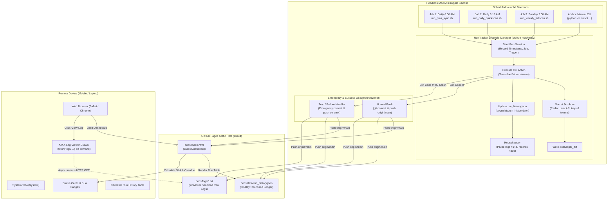

# Remote System Run Monitoring & Diagnostics
**Product Requirements Document (PRD) & Technical Specification**

---

## 1. Executive Summary & Purpose

### 1.1 The Operational Problem
The **STR Competitive Price Advisor** runs three mission-critical scheduled automation jobs on a dedicated headless Apple Silicon Mac Mini:
1. **Daily PMS Reservation Sync (`pms-sync`)**: Runs every morning at **6:00 AM** to query the Streamline OwnerX PMS API, ingest newly booked reservations and calendar blocks, and reconcile revenue.
2. **Daily 90-Day Quick Market Scan (`daily-quickscan`)**: Runs every morning at **6:15 AM** to evaluate the next 12 open intervals, query the 10-node NordVPN stealth proxy pool, scrape live competitor checkout rates across Airbnb, VRBO, and Booking.com, apply the 6-factor luxury rubric, recalculate lead-time tapered pricing recommendations, and publish updates.
3. **Weekly Full 12-Month Market Scan (`weekly-fullscan`)**: Runs every **Sunday at 2:00 AM** to execute a deep audit of all open calendar intervals across 12 months, cross-audit multi-channel OTA markups against Kivoya direct pricing, and regenerate long-range pacing benchmarks.

When the property owner/operator is away from the Mac Mini (traveling, working remotely, or on mobile), there is currently **no centralized, remote way to**:
- Check whether the morning runs succeeded or failed.
- Review the historical run performance over the last 30 days (duration, schedule adherence, failure rate).
- Inspect high-level summary metrics per run (e.g., number of intervals scanned, new reservations imported, urgent rate adjustments needed).
- Access and search detailed execution logs on demand when a job crashes or encounters OTA scraping blockers, without needing an SSH tunnel or terminal session.
- Distinguish between a clean idle state and a catastrophic Mac Mini outage (e.g., power loss, kernel sleep, or internet interruption causing a missed run).

Furthermore, the user specifically requires:
- **Zero Notification Fatigue & Headless Silence**: No routine push notifications (e.g., via ntfy) or local macOS GUI popups/sounds (`osascript`) for daily scheduled successes or failures. The headless Mac Mini runs completely silently; notifications are strictly reserved for direct interactive agent tasks that require human input.
- **Zero Static HTML Bloat**: Large text logs (thousands of lines) must **not** be baked into the static `docs/index.html` dashboard, as that would bloat file size and slow down mobile loading.
- **On-Demand Remote Access**: Logs must be fetched dynamically via client-side JavaScript/AJAX from lightweight static text files hosted alongside the dashboard.

### 1.2 The Solution
We introduce the **Remote System Run Monitoring & Diagnostics** subsystem:
1. **Structured Run Tracking Engine (`src/run_tracker.py`)**: A Python execution lifecycle manager that instruments both scheduled `launchd` jobs and ad-hoc manual CLI executions. It captures start/end timestamps, exit status (`SUCCESS`, `FAILED`, `RUNNING`), duration, job-specific summary metrics, and generates sanitized, secret-scrubbed log artifacts.
2. **Dedicated "System" Tab in GitHub Pages Dashboard (`docs/index.html`)**: A clean, responsive management tab containing:
   - **Service Health Status Cards**: Real-time status badges for each of the 3 recurring jobs (🟢 Healthy, 🔴 Failed, 🟡 Running, 🟠 Overdue).
   - **Overdue SLA / Heartbeat Detection**: Client-side logic comparing current time against scheduled cron windows to proactively warn if the Mac Mini has gone offline and missed an execution window.
   - **30-Day Historical Run Ledger**: Filterable table (by job type and status) displaying timestamp, trigger source (`launchd` vs `manual`), duration, status, and concise key metrics.
   - **Asynchronous Log Viewer Modal**: An on-demand slide-over drawer powered by vanilla JavaScript `fetch()` that pulls individual raw run logs (`docs/logs/<date>_<job>.txt`) only when clicked, featuring log search/filter, error auto-scroll, copy-to-clipboard, and download buttons.
3. **Automated Emergency Git Push on Failure**: In the event of an uncaught exception, scraper block, or non-zero exit code, an automated error trap immediately records the failure summary, logs the stack trace, commits changes, and pushes to GitHub (`origin/main`) within 1–2 minutes, ensuring failures are immediately visible remotely.
4. **Automated Secret Scrubbing & 14-Day Log Pruning**: Automatic regex-based redaction of all API keys, bearer tokens, and credentials from `.env` prior to writing log files to disk, coupled with automatic deletion of log files older than 14 days and history records older than 30 days to preserve repository hygiene.

$$\text{Mac Mini Scheduled Daemon} \xrightarrow{\text{Instrument \& Scrub}} \text{docs/logs/*.txt} + \text{run_history.json} \xrightarrow{\text{Git Push}} \text{GitHub Pages} \xrightarrow{\text{AJAX Fetch}} \text{Remote "System" Tab}$$

---

## 2. Target User Persona & Core User Stories

### 2.1 Persona
- **Role**: Villa del Sol Property Owner & STR Revenue Manager.
- **Context**: Accesses the pricing and operations dashboard primarily from remote devices (iPhone, iPad, MacBook away from home) via GitHub Pages.
- **Preferences**:
  - High information density with zero clutter.
  - Quiet background operations (no ping spam on mobile).
  - Rapid troubleshooting capability: see what broke and why in under 10 seconds.
  - Reliable offline detection: know immediately if the home server went dark.

### 2.2 User Stories
1. **Morning Peace-of-Mind Verification**:
   > *"As an owner checking my phone at 7:00 AM, I want to glance at the top of the dashboard and see a green '● All Systems Operational' status pill confirming that the 6:00 AM PMS sync and 6:15 AM Quickscan completed normally."*

2. **Immediate Failure Investigation**:
   > *"As an owner noticing a red '🔴 Daily Quickscan Failed' status card, I want to click 'View Log' to open an AJAX log viewer that automatically jumps to the error traceback so I can determine whether it was a transient NordVPN proxy timeout or an Airbnb layout change."*

3. **Overdue / Power Loss Detection**:
   > *"As an owner away on vacation, if the Mac Mini loses power at 5:00 AM, I want the dashboard to clearly warn '⚠️ Overdue: PMS Sync missed scheduled run at 6:00 AM (Mac Mini may be offline)' so I don't assume the data is fresh."*

4. **Historical Stability & Trend Auditing**:
   > *"As an operator, I want to review the last 30 days of runs in a filterable table to verify whether scan durations are increasing or certain days experience recurring proxy retries."*

5. **Manual Run Distinguishment**:
   > *"As an operator who occasionally triggers an ad-hoc CLI sweep from my laptop or mobile controller, I want those manual runs logged in the ledger tagged with a 'Manual' badge so they don't get confused with automated launchd schedules."*

---

## 3. High-Level Architecture & Workflow



---

## 4. Functional Requirements

### 4.1 Run Tracking & Lifecycle Instrumentation (`src/run_tracker.py`)
- **FR-1.1 (Context Manager / Wrapper)**: Provide a clean Python context manager (`with RunTracker(job_name, trigger="launchd"):`) or CLI decorator that wraps command execution.
- **FR-1.2 (Run Metadata Capture & Trigger Resolution)**: For every execution, automatically capture:
  - `run_id`: Unique identifier (e.g. `2026-09-23_061500_daily-quickscan`).
  - `job_type`: Enumeration (`pms-sync`, `daily-quickscan`, `weekly-fullscan`, `manual-cli`).
  - `trigger`: Enumeration (`launchd`, `manual`). Resolved via explicit CLI flag `--trigger {launchd,manual}` (default: `manual`), falling back to environment variable `STR_TRIGGER=launchd`. Launchd scripts pass `--trigger launchd`.
  - `tracking_gate`: Manual CLI commands are recorded into `run_history.json` only when `--push` or `--track` is passed, or when `--trigger launchd` is set. Ad-hoc queries and local debugging without these flags run untracked to keep the ledger clean.
  - `status`: String (`SUCCESS`, `FAILED`, `RUNNING`).
  - `start_time`: ISO-8601 string (`YYYY-MM-DDTHH:MM:SSZ`).
  - `end_time`: ISO-8601 string (or `null` while running).
  - `duration_sec`: Float execution duration in seconds.
  - `exit_code`: Integer exit code (`0` for success, `>0` for failure).
  - `git_commit`: Short hash of the current active repository commit.
  - `summary`: Structured dictionary of job-specific business metrics (see FR-1.3).
  - `log_file`: Relative path to the published log file (e.g., `logs/2026-09-23_061500_daily-quickscan.txt`).
  - `error_excerpt`: If failed, the first 3 lines of the final error message/exception for rapid display in the table without opening the full log.
- **FR-1.3 (Job-Specific Business Summaries)**:
  - **`pms-sync`**: Number of active reservations ingested, newly created/shifted bookings detected, next upcoming arrival date, and PMS API latency.
  - **`daily-quickscan`**: Number of intervals scanned (e.g., 12), total competitor rates retrieved, number of urgent/moderate pricing recommendations identified, and stealth proxy health status.
  - **`weekly-fullscan`**: Total 12-month intervals scanned, multi-channel comparisons completed across Airbnb/VRBO/Booking/Kivoya, and count of platform rate anomalies detected.
  - **`manual-cli`**: Command executed and relevant count of modified records.

### 4.2 Automated Failure Handling & Emergency Push
- **FR-2.1 (Unified Error Orchestration)**: Dual-layer error handling:
  1. Python `RunTracker` catches unhandled exceptions, writes sanitized logs, updates `run_history.json`, and if push is enabled (e.g. `--push` or `trigger="launchd"`), immediately executes surgical git commit & push before re-raising the exception.
  2. Shell scripts (`run_pms_sync.sh`, `run_daily_quickscan.sh`, `run_weekly_fullscan.sh`) maintain an active POSIX `trap emergency_push_on_failure ERR` as an outer safety net to handle fatal pre-Python failures (e.g., venv corruptions, syntax/import errors, missing binaries).
- **FR-2.2 (Emergency Commit & Push)**: When an execution fails:
  1. The tracker marks the run as `FAILED`, writes the error traceback to `docs/logs/...`, updates `docs/data/run_history.json`.
  2. The failure handler stages surgically `docs/data/run_history.json` and `docs/logs/` (never `git add -A`).
  3. Commits with message: `🚨 Automated Alert: <job_type> failed with exit code <code-or-error> (<timestamp_pt>)`.
  4. Executes `git pull --rebase --autostash origin main` and `git push origin main`. If an unresolvable merge conflict occurs during rebase, the process immediately executes `git rebase --abort`, logs the conflict, and leaves the local commit clean for the next sync cycle without corrupting git state.
  5. Guarantees that failure state and stack traces reach GitHub Pages within 120 seconds of failure.

### 4.3 Log Artifact Storage & Secret Scrubbing
- **FR-3.1 (Standalone Log Files)**: Every run produces a dedicated text log at `docs/logs/<YYYY-MM-DD_HHMMSS>_<job_type>.txt`.
- **FR-3.2 (Secret Scrubbing Engine)**: Prior to writing log content to `docs/logs/`, the scrubbing engine loads all environment variable values from `.env` (Streamline API secrets, Turso tokens, NordVPN passwords, Kivoya tokens) and replaces all exact matches with `[REDACTED_SECRET]`.
- **FR-3.3 (Zero HTML Bloat)**: Log files are strictly maintained as independent `.txt` files. `docs/index.html` contains zero raw log text in its initial DOM payload.
- **FR-3.4 (Automated Retention Pruning)**:
  - Logs older than **14 days** are automatically deleted from `docs/logs/` during each run.
  - Run records older than **30 days** in `run_history.json` are automatically pruned.
  - Pruned files are deleted via `git rm` or standard filesystem unlink to keep repository clone size minimal.

### 4.4 In-Dashboard SLA & Overdue Heartbeat Detection
- **FR-4.1 (Expected Schedule Definition)**:
  - `pms-sync`: Daily at 6:00 AM (expected window: 06:00 – 06:15 AM).
  - `daily-quickscan`: Daily at 6:15 AM (expected window: 06:15 – 06:45 AM).
  - `weekly-fullscan`: Sundays at 2:00 AM (expected window: 02:00 – 04:00 AM).
- **FR-4.2 (Client-Side Drift Calculation)**: The browser reads the user's current local date/time normalized to Pacific Time (`America/Los_Angeles`), checks the timestamp and status of the latest run for each job in `run_history.json`, and assesses:
  - If current time is past the expected completion window and no run exists for the scheduled date, status transitions to `OVERDUE`.
  - For `weekly-fullscan` on non-Sunday days (Monday through Saturday): if the last Sunday run succeeded, status displays `HEALTHY` (`Last Run: Sunday 2:00 AM`). If the last Sunday run was missed or failed, status remains `OVERDUE` or `FAILED` throughout the week until resolved.
  - Overdue warning banner renders at the top of the "System" tab: `⚠️ Overdue Alert: <Job Name> missed its scheduled run. (Mac Mini may be offline, asleep, or disconnected)`.

### 4.5 User Interface & "System" Tab Specification
- **FR-5.1 (Tab Navigation)**: Add a concise tab labeled `🖥️ System` (or `System`) to the primary navigation bar in `docs/index.html`, positioned at the end of the tab bar (after `🌐 Channels`).
- **FR-5.2 (Header Status Pill)**: In the global header (adjacent to the `Updated: <date>` badge), display an interactive operational status indicator linking directly to `#system`:
  - `● All Systems Healthy` (Green pill, links to `#system`).
  - `⚠️ 1 Job Overdue / Failed` (Red/amber pill with pulsing dot, links to `#system`).
- **FR-5.3 (Service Health Overview Cards)**: Display 3 primary cards side-by-side at the top of the System tab:
  - **Job Title & Schedule badge** (e.g. `Daily PMS Sync • 6:00 AM PT`).
  - **Live Status Pill** (`Healthy`, `Failed`, `Running`, `Overdue`).
  - **Last Completed Run** (`Today, 6:02 AM • 42s duration`).
  - **Summary Metric Badge** (`209 reservations active • 1 update`).
  - **Quick Action**: Direct `[ 📄 View Latest Log ]` button.
- **FR-5.4 (Filterable 30-Day History Table)**:
  - **Columns**: Date/Time, Job Name, Trigger (`Schedule` vs `Manual`), Status Badge (`SUCCESS` green, `FAILED` red, `RUNNING` blue), Duration, Business Summary / Error Excerpt, Log Action.
  - **Interactive Filters**:
    - Trigger filter: `All` | `Scheduled Only` | `Manual Only`.
    - Status filter: `All` | `Failed Only` | `Success Only`.
    - Search box: Filter rows by date or keyword.
- **FR-5.5 (Asynchronous Log Viewer Modal)**:
  - When the user clicks `[ 📄 View Log ]` on any row or card:
    - Displays a loading spinner: `Loading log from docs/logs/...`.
    - Executes `fetch(log_path)` via vanilla JavaScript.
    - Renders the log in a sleek monospace code viewer with dark styling.
    - If the run status is `FAILED`, automatically highlights and scrolls down to the exception traceback.
    - Top toolbar with:
      - Quick Search / Filter box inside the log (highlights matching lines).
      - `Copy Log` button (copies full plain text to clipboard).
      - `Download .txt` button.
      - Close `(X)` button or `Esc` key dismiss.

---

## 5. Data Schema Specification

### 5.1 `data/run_history.json` & `docs/data/run_history.json`
```json
{
  "version": "1.0",
  "last_updated": "2026-09-23T06:21:42Z",
  "active_host": "mac-mini-m2",
  "runs": [
    {
      "run_id": "2026-09-23_061500_daily-quickscan",
      "job_type": "daily-quickscan",
      "job_title": "Daily 90-Day Quick Market Scan",
      "trigger": "launchd",
      "status": "SUCCESS",
      "start_time": "2026-09-23T06:15:01Z",
      "end_time": "2026-09-23T06:21:38Z",
      "duration_sec": 397.4,
      "duration_formatted": "6m 37s",
      "exit_code": 0,
      "git_commit": "e81f4a9",
      "log_file": "logs/2026-09-23_061500_daily-quickscan.txt",
      "summary": {
        "intervals_evaluated": 12,
        "comps_scraped": 97,
        "urgent_adjustments": 3,
        "moderate_adjustments": 5,
        "proxy_pool_health": "10/10 active",
        "message": "Scanned 12 intervals across 97 comps; 3 urgent price adjustments identified."
      },
      "error_excerpt": null
    },
    {
      "run_id": "2026-09-23_060000_pms-sync",
      "job_type": "pms-sync",
      "job_title": "Daily Streamline PMS Sync",
      "trigger": "launchd",
      "status": "SUCCESS",
      "start_time": "2026-09-23T06:00:00Z",
      "end_time": "2026-09-23T06:00:44Z",
      "duration_sec": 44.1,
      "duration_formatted": "44s",
      "exit_code": 0,
      "git_commit": "e81f4a9",
      "log_file": "logs/2026-09-23_060000_pms-sync.txt",
      "summary": {
        "total_reservations": 209,
        "new_reservations": 1,
        "shifted_reservations": 0,
        "next_arrival": "2026-09-28 (Smith)",
        "message": "Synced 209 reservations from Streamline; 1 new booking imported."
      },
      "error_excerpt": null
    },
    {
      "run_id": "2026-09-22_061500_daily-quickscan",
      "job_type": "daily-quickscan",
      "job_title": "Daily 90-Day Quick Market Scan",
      "trigger": "launchd",
      "status": "FAILED",
      "start_time": "2026-09-22T06:15:01Z",
      "end_time": "2026-09-22T06:17:12Z",
      "duration_sec": 131.0,
      "duration_formatted": "2m 11s",
      "exit_code": 1,
      "git_commit": "d4c2b18",
      "log_file": "logs/2026-09-22_061500_daily-quickscan.txt",
      "summary": {
        "intervals_evaluated": 4,
        "comps_scraped": 18,
        "message": "Scrape aborted due to Playwright proxy connection timeout."
      },
      "error_excerpt": "PlaywrightTimeoutError: Timeout 30000ms exceeded while connecting to SOCKS5 feeder hub on worker 3."
    }
  ]
}
```

---

## 6. Non-Functional Requirements

### 6.1 Security & Secret Protection
- **NFR-1.1 (Zero Secret Leakage)**: Logs and JSON metadata pushed to GitHub (origin/main) must NEVER contain plaintext credentials, SOCKS5 passwords, database connection strings, or PMS API tokens.
- **NFR-1.2 (Mandatory Pre-Commit Sanitization)**: All logging buffers pass through the redaction filter before touching disk.

### 6.2 Performance & Bundle Size
- **NFR-2.1 (Instant Dashboard Initial Load)**: The main HTML dashboard (`docs/index.html`) must not exceed its baseline footprint by more than 25 KB for the new "System" tab markup and script.
- **NFR-2.2 (Fast AJAX Log Loading)**: Fetching an individual 500 KB log file via `fetch()` must complete in under 500ms on a standard 4G mobile connection.
- **NFR-2.3 (Repository Bloat Prevention)**: With 14-day log pruning, the `docs/logs/` folder will contain at most ~35 files (~5–10 MB total), completely avoiding Git repository bloat.

### 6.3 Reliability & Resilience
- **NFR-3.1 (Atomic Writes)**: `run_history.json` must be written atomically (write to temp file + `os.replace`) to prevent JSON corruption during concurrent read/write or power interruption.
- **NFR-3.2 (Offline Tolerance)**: If the client browser is completely offline, the dashboard continues to display the last cached run history and clearly flags the offline network state.

---

## 7. Implementation Plan & Technical Tasks

### Milestone 1: Core Run Tracker & Secret Scrubber (`src/run_tracker.py`)
- [x] Implement `RunTracker` class supporting context manager semantics (`with RunTracker(...) as tracker:`).
- [x] Implement `SecretScrubber` using regex compiling known secrets from `.env`.
- [x] Implement atomic update and pruning for `data/run_history.json` and copy to `docs/data/run_history.json`.
- [x] Implement log file creation under `docs/logs/<date>_<job>.txt` and prune files older than 14 days.
- [x] Initialize `data/run_history.json` and `docs/data/run_history.json` with baseline run records for the past 2–3 days (plus last Sunday's weekly full scan) and corresponding scrubbed log files so the dashboard is immediately healthy and populated upon deployment.

### Milestone 2: CLI Integration & Shell Script Error Trapping
- [x] Integrate `RunTracker` into `src/cli.py` commands (`sync-reservations`, `run --quick`, `run --weekly`, `generate-html`).
- [x] Update launchd runner scripts (`run_pms_sync.sh`, `run_daily_quickscan.sh`, `run_weekly_fullscan.sh`):
  - [x] Add POSIX `trap` failure handlers.
  - [x] On failure, invoke emergency commit & push routine (`git commit -m "🚨 Automated Alert: <job> failed..." && git push origin main`).
  - [x] Verify routine ntfy notifications are eliminated from these scripts as requested.

### Milestone 3: HTML Dashboard "System" Tab & AJAX Log Viewer
- [x] Update `src/html_generator.py`:
  - [x] Add `System` tab button to top navigation bar.
  - [x] Add real-time Status Pill to header with hotlink to `#system`.
  - [x] Render Service Health Cards for the 3 recurring jobs.
  - [x] Render 30-day filterable Run History Table.
- [x] Add client-side JavaScript module:
  - [x] Overdue SLA calculation based on scheduled times (6:00 AM, 6:15 AM, Sun 2:00 AM).
  - [x] Filtering logic for the history table (by job, by trigger, by status).
  - [x] AJAX Log Viewer Modal: `fetch('logs/<file>')`, search filter, copy to clipboard, and error auto-scroll.
  - [x] CSS styling matching the dark glassmorphic design of the existing dashboard.

### Milestone 4: Verification & Automated Testing
- [x] Write unit tests in `tests/test_run_tracker.py`:
  - [x] Test secret scrubbing (confirming tokens are redacted).
  - [x] Test run status recording on success and failure.
  - [x] Test log retention pruning (>14 days deleted).
  - [x] Test history pruning (>30 days deleted).
  - [x] Test atomic JSON writes.
- [x] Run end-to-end simulation of a successful run and a simulated failed run, verifying emergency commit and dashboard log rendering.
- [x] Integrate UI unit and Playwright integration tests in `tests/test_html_dashboard_ui.py` validating tab navigation, status pill click, and log drawer modal interactions.

---

## 8. Summary of Design Decisions (Grill-Me Alignment)

| Dimension | Decision | Rationale |
| :--- | :--- | :--- |
| **Primary Delivery Channel** | Static Web Dashboard (`docs/index.html`) on GitHub Pages | Leverages existing zero-cost hosting and automated push infrastructure; viewable anywhere on mobile/desktop without VPN or third-party accounts. |
| **Tab Label** | Concise: `"System"` | Clean, minimal, and integrates seamlessly into the navigation header. |
| **Notification Policy** | **100% Elimination of routine push alerts & local GUI dialogs/sounds** | Strictly eliminates all calls to `notify_mobile.sh` and `osascript` from `run_pms_sync.sh`, `run_daily_quickscan.sh`, and `run_weekly_fullscan.sh` for **both successes and failures**. The headless Mac Mini runs completely silently; remote awareness is delivered via GitHub Pages and emergency git pushes. |
| **Trigger Source Identification** | CLI flag `--trigger {launchd,manual}` with `STR_TRIGGER` fallback | CLI flag explicitly identifies launchd vs manual executions (defaulting to `manual`), falling back to environment variable `STR_TRIGGER=launchd` if present. Launchd scripts supply `--trigger launchd`. |
| **Manual CLI Tracking Scope** | Gated on `--push` or `--track` | Scheduled `launchd` runs are always recorded. Manual ad-hoc CLI commands are tracked in `run_history.json` only if `--push` or `--track` is passed, preventing local debugging and read-only queries from flooding the ledger. |
| **Log Storage & Fetching** | Standalone `docs/logs/*.txt` with on-demand JavaScript `fetch()` | Prevents bloating `index.html` with thousands of log lines while allowing full remote investigation on demand in a sleek modal. |
| **Failure Handling & Conflict Policy** | Automated Emergency Git Push with `git rebase --abort` fallback | Pushes failures, stack traces, and error excerpts within 1–2 minutes. Executes `git pull --rebase --autostash origin main` prior to push; if an unresolvable merge conflict occurs, immediately runs `git rebase --abort`, logs the conflict, and leaves local state clean. |
| **Offline / Crash Detection** | Client-Side In-Dashboard SLA Overdue Calculation | Automatically detects if a scheduled run did not occur past its expected completion window (normalized to Pacific Time `America/Los_Angeles`). On Mon–Sat, Weekly Fullscan reports `HEALTHY` if last Sunday's run succeeded, and `OVERDUE`/`FAILED` if missed or failed. |
| **Data Retention** | 14 days for raw `.txt` logs, 30 days for structured JSON history | Balances comprehensive diagnostic history with a lean Git repository footprint. |
| **Security & Privacy** | Automatic Secret Scrubbing from `.env` | Prevents credential leakage to GitHub repositories and public logs. |


