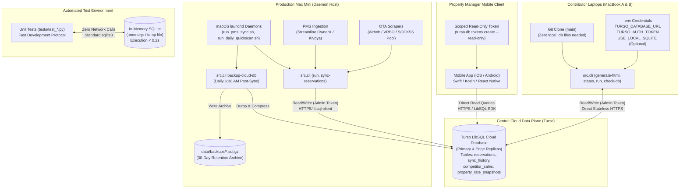
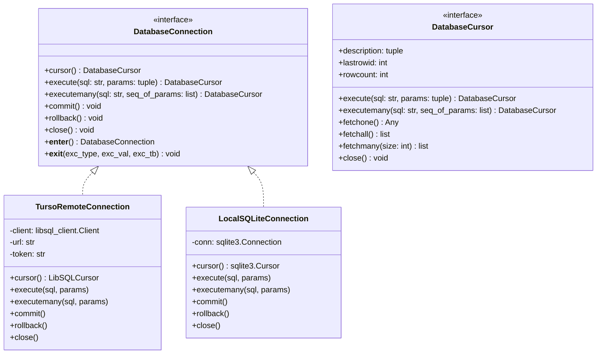
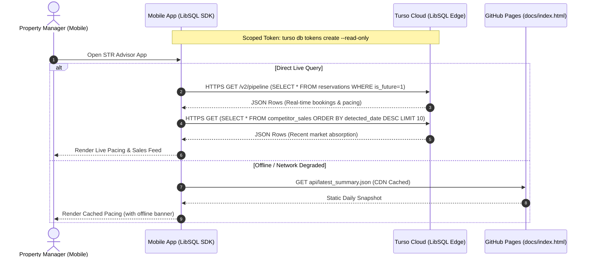

# STR Price Advisor: SQLite to Cloud Database Technical Design Document

- **Document Version**: 1.1.0
- **Status**: APPROVED (via Architecture Grill-Me Alignment)
- **Target Platform**: Turso (LibSQL Managed Cloud Database)
- **Companion Document**: [docs/migrating_sqlite_to_cloud_requirements.md](file:///Users/ivanpe/str-price-advisor/docs/migrating_sqlite_to_cloud_requirements.md)
- **Author**: Antigravity Pair Programmer
- **Date**: 2026-09-19

---

## 1. Architectural Overview & System Topography

This document outlines the technical design for migrating the STR Price Advisor's relational data stores from a local, single-writer SQLite file (`data/reservations.db`) to a centrally managed, serverless LibSQL database hosted on **Turso Cloud**.

The target architecture establishes a unified cloud data plane accessible concurrently by:
1. The **Dedicated Production Host (Apple Silicon Mac Mini)** running automated `launchd` background daemons for daily PMS synchronization, rate scraping, sales detection, dashboard compilation, and automated compressed database backups.
2. Multiple **Contributor Workstations (Mac Laptops A & B)** running interactive CLI commands and compiling dashboards locally without any local `.db` file on disk.
3. A **Mobile Application (iOS / Android)** executing direct, read-only analytical queries over HTTPS using scoped read-only credentials.
4. **Hermetic Test Suites** falling back transparently to in-memory local SQLite for zero-network, sub-second execution.



---

## 2. Turso Account Setup, Database Provisioning, and Web Console Guide

This section provides the end-to-end operational playbook for setting up the Turso account, provisioning the production database, configuring authentication secrets, and inspecting live data in real time via the Turso Web Console.

### 2.1 Step 1: Install the Turso CLI
Install the official Turso command-line tool on macOS:
```bash
curl -sSfL https://get.tur.so/install.sh | bash
```
Add Turso to your shell path (if not added automatically by the installer) and verify:
```bash
export PATH="$HOME/.turso:$PATH"
turso --version
```

### 2.2 Step 2: Authenticate via GitHub (`ivanpenkov`)
Log in or sign up using your GitHub credentials (`ivanpenkov`):
```bash
# For first-time registration:
turso auth signup

# Or to authenticate an existing account:
turso auth login
```
This opens a browser window prompting authorization with GitHub. Once authorized, your default Turso organization/account name matches your GitHub handle: **`ivanpenkov`**.

### 2.3 Step 3: Provision the Cloud Database (`str-price-advisor`)
Create the primary cloud database named `str-price-advisor`. Turso automatically provisions in the closest region (or explicitly specify Phoenix, AZ `--location phx` for <5ms roundtrip latency to the Villa del Sol host in Tempe):
```bash
turso db create str-price-advisor
```

### 2.4 Step 4: Obtain Connection URL & Database Metadata
Inspect the newly provisioned database:
```bash
turso db show str-price-advisor
```
Extract the database URL:
```bash
turso db show str-price-advisor --url
# Outputs: libsql://str-price-advisor-ivanpenkov.turso.io
```

### 2.5 Step 5: Issue Authentication Tokens
Generate tokens following the principle of least privilege:

1. **Admin / Full Read-Write Token** (for Mac Mini daemons and developer workstations):
   ```bash
   turso db tokens create str-price-advisor
   ```
2. **Scoped Read-Only Bearer Token** (for mobile application and public dashboards):
   ```bash
   turso db tokens create str-price-advisor --read-only
   ```

### 2.6 Step 6: Configure Environment Secrets (`.env`)
Add the Turso connection settings to your local `.env` file on each workstation and the Mac Mini:
```bash
# .env (Never commit to Git)
TURSO_DATABASE_URL="libsql://str-price-advisor-ivanpenkov.turso.io"
TURSO_AUTH_TOKEN="<ADMIN_BEARER_TOKEN_HERE>"

# Optional: Set to 1 to temporarily bypass Turso and force local SQLite
USE_LOCAL_SQLITE=0
```
Update `.env.example` as a template for other contributors:
```bash
TURSO_DATABASE_URL="libsql://str-price-advisor-ivanpenkov.turso.io"
TURSO_AUTH_TOKEN="your-turso-auth-token"
USE_LOCAL_SQLITE=0
```

### 2.7 Step 7: Real-Time Data Inspection via Turso Web Console
Turso provides an official, hosted real-time Web Console for browsing tables, inspecting schema definitions, viewing raw rows, and executing arbitrary SQL queries without local tooling:

- **Web Console URL**: [https://app.turso.tech/ivanpenkov/databases/str-price-advisor](https://app.turso.tech/ivanpenkov/databases/str-price-advisor)
- **Features**:
  - **Interactive SQL Shell**: Execute queries (e.g. `SELECT * FROM reservations WHERE is_future=1;`) directly in the browser.
  - **Schema Explorer**: View all 4 tables, column types, primary keys, and B-tree indexes.
  - **Metrics Dashboard**: Track live row read/write operations, storage consumption, and replica health.
  - **Token Management**: Issue or revoke read-only and admin tokens visually.

### 2.8 Step 8: Execute Data Migration & Parity Verification [COMPLETED]
> [!NOTE]
> **Migration Completed & CLI Retired**:
> The one-time migration was executed and verified with 100% row-count parity and matching SHA256 financial integrity checksums. To prevent accidental overwrite or data pollution across new machines, the one-time `migrate-to-turso` command was retired. Ongoing health check and backup commands remain available:

```bash
# 1. Verify health, latency, and row counts on Turso Cloud
python -m src.cli check-db

# 2. Dump and compress cloud database with 30-day rotation
python -m src.cli backup-cloud-db
```

---

## 3. Cloud Database Schema Specification

The Turso database maintains 100% dialect and type compatibility with the existing SQLite schema. All tables utilize native SQLite types (`INTEGER`, `TEXT`, `REAL`) with explicit primary keys, unique constraints, and optimized B-tree indexes.

### 2.1 Table: `reservations`
Stores the ground-truth historical and future booking ledger for Villa del Sol scraped from Streamline OwnerX PMS.

```sql
CREATE TABLE IF NOT EXISTS reservations (
    id INTEGER PRIMARY KEY,
    confirmation_id TEXT UNIQUE NOT NULL,
    creation_date TEXT,
    start_date TEXT NOT NULL,
    end_date TEXT NOT NULL,
    days_number INTEGER NOT NULL,
    type_id INTEGER,
    type_name TEXT,
    type_description TEXT,
    status_name TEXT NOT NULL,
    occupants INTEGER DEFAULT 0,
    occupants_small INTEGER DEFAULT 0,
    pets INTEGER DEFAULT 0,
    unit_id INTEGER,
    unit_name TEXT,
    owner_payout REAL DEFAULT 0.0,
    management_fee REAL DEFAULT 0.0,
    gross_rent REAL DEFAULT 0.0,
    is_future INTEGER DEFAULT 0,
    last_scraped_at TEXT NOT NULL,
    raw_json TEXT
);

CREATE INDEX IF NOT EXISTS idx_res_dates ON reservations (start_date, end_date);
CREATE INDEX IF NOT EXISTS idx_res_status ON reservations (status_name);
CREATE INDEX IF NOT EXISTS idx_res_future ON reservations (is_future);
```

### 2.2 Table: `sync_history`
Maintains an immutable operational audit log of all automated and manual PMS ingestion cycles.

```sql
CREATE TABLE IF NOT EXISTS sync_history (
    id INTEGER PRIMARY KEY AUTOINCREMENT,
    synced_at TEXT NOT NULL,
    sync_mode TEXT NOT NULL,
    records_fetched INTEGER DEFAULT 0,
    records_upserted INTEGER DEFAULT 0,
    records_future INTEGER DEFAULT 0,
    records_past INTEGER DEFAULT 0
);

CREATE INDEX IF NOT EXISTS idx_sync_time ON sync_history (synced_at);
```

### 2.3 Table: `competitor_sales`
Records verified competitor booking absorption events detected by diffing chronological market pricing snapshots.

```sql
CREATE TABLE IF NOT EXISTS competitor_sales (
    id INTEGER PRIMARY KEY AUTOINCREMENT,
    listing_id TEXT NOT NULL,
    listing_name TEXT,
    tier TEXT,
    location TEXT,
    check_in TEXT NOT NULL,
    check_out TEXT NOT NULL,
    nights INTEGER NOT NULL,
    segment_type TEXT,
    detected_date TEXT NOT NULL,
    lead_time_days INTEGER,
    last_observed_rate REAL,
    last_observed_adj_rate REAL,
    last_observed_percentile REAL,
    composite_score REAL,
    desirability_ratio REAL,
    verification_status TEXT DEFAULT 'verified',
    raw_snippet TEXT,
    created_at TEXT NOT NULL,
    UNIQUE(listing_id, check_in, check_out)
);

CREATE INDEX IF NOT EXISTS idx_comp_sales_lead ON competitor_sales (lead_time_days);
CREATE INDEX IF NOT EXISTS idx_comp_sales_seg ON competitor_sales (segment_type);
CREATE INDEX IF NOT EXISTS idx_comp_sales_detected ON competitor_sales (detected_date);
```

### 2.4 Table: `property_rate_snapshots`
Records the longitudinal daily evolution of published calendar rates for Villa del Sol across future calendar intervals.

```sql
CREATE TABLE IF NOT EXISTS property_rate_snapshots (
    id INTEGER PRIMARY KEY AUTOINCREMENT,
    snapshot_date TEXT NOT NULL,
    calendar_date TEXT NOT NULL,
    nightly_rate REAL NOT NULL,
    interval_type TEXT,
    season_name TEXT,
    period_name TEXT,
    created_at TEXT NOT NULL,
    UNIQUE (calendar_date, snapshot_date)
);

CREATE INDEX IF NOT EXISTS idx_rate_snap_lookup ON property_rate_snapshots (calendar_date, snapshot_date);
CREATE INDEX IF NOT EXISTS idx_rate_snap_date ON property_rate_snapshots (snapshot_date);
```

---

## 4. Unified Database Adapter Design

To eliminate code duplication, provide 100% DB-API 2.0 / `sqlite3` interface compatibility, and maintain seamless backward compatibility with unit tests, all database interactions are routed through `src/database.py`.

### 3.1 Adapter Architecture & Interface Parity
The adapter provides a drop-in database connection interface that fully mimics Python's standard `sqlite3` connection and cursor semantics:
1. **`conn.cursor()`**: Returns a functional cursor instance.
2. **`cursor.execute(sql, params)`**: Supports standard positional `?` parameter markers and named `:param` bindings.
3. **`cursor.executemany(sql, param_seq)`**: Batches parameterized statements atomically.
4. **`cursor.description`**: Returns a tuple of 7-item sequences (`(name, type_code, None, None, None, None, None)`) for DB-API 2.0 compliance, enabling callers to dynamically extract column names.
5. **`cursor.lastrowid` and `cursor.rowcount`**: Accurately mapped from LibSQL result metadata (`last_insert_rowid` and `rows_affected`).
6. **`LibSQLRow` Wrapper**: Supports dictionary-key access (`row["confirmation_id"]`), case-insensitive column lookup, and index access (`row[0]`), mirroring `sqlite3.Row`.
7. **Transaction Support**: Full support for `with conn:` transaction blocks, `conn.commit()`, and `conn.rollback()`.
8. **Resilient Retry Logic**: Exponential backoff with random jitter (up to 3 attempts) for transient HTTP 5xx errors.



### 3.2 Dynamic Driver Resolution Logic
When a module requests a database connection via `get_db_connection(db_path=None)`:
1. **Rule 1 (Hermetic Test Isolation)**: If `db_path` is explicitly provided and equals `:memory:` or differs from `DEFAULT_LOCAL_DB` (standard pattern in `tests/test_*.py`), the adapter immediately returns a standard library `sqlite3.connect(db_path)` instance with `sqlite3.Row` row factory. Zero network calls; executes in `<0.2s`.
2. **Rule 2 (Local SQLite Override)**: If `USE_LOCAL_SQLITE` is set to `1`, `true`, or `yes` in the environment, the adapter bypasses Turso Cloud and connects directly to local `data/reservations.db`.
3. **Rule 3 (Turso Cloud Mode)**: If `TURSO_DATABASE_URL` and `TURSO_AUTH_TOKEN` are configured, the adapter instantiates a `TursoRemoteConnection` connected over HTTPS.
4. **Rule 4 (Local Fallback Mode)**: If `TURSO_DATABASE_URL` is absent, the adapter logs an operational notice and opens local `data/reservations.db` using standard `sqlite3`.

### 3.3 Reference Implementation: `src/database.py`

```python
"""
Unified Database Adapter for STR Price Advisor.
Provides a drop-in DB-API 2.0 / sqlite3-compatible interface to Turso Cloud (LibSQL)
with transparent fallback to local sqlite3 for hermetic unit testing and offline development.
"""

import os
import time
import random
import sqlite3
import logging
from pathlib import Path
from typing import Any, Dict, List, Optional, Sequence, Tuple, Union

logger = logging.getLogger(__name__)

DEFAULT_LOCAL_DB = Path("data/reservations.db")


class LibSQLRow:
    """Row wrapper providing both dict-key and index-style access like sqlite3.Row."""
    def __init__(self, columns: List[str], values: Sequence[Any]):
        self._columns = columns
        self._values = list(values)
        self._mapping = {k: v for k, v in zip(columns, self._values)}
        # Lowercase mapping for case-insensitive column lookups
        self._lower_mapping = {k.lower(): v for k, v in zip(columns, self._values)}

    def __getitem__(self, key: Union[str, int]) -> Any:
        if isinstance(key, int):
            return self._values[key]
        if key in self._mapping:
            return self._mapping[key]
        lower = key.lower()
        if lower in self._lower_mapping:
            return self._lower_mapping[lower]
        raise KeyError(key)

    def get(self, key: str, default: Any = None) -> Any:
        if key in self._mapping:
            return self._mapping[key]
        return self._lower_mapping.get(key.lower(), default)

    def keys(self) -> List[str]:
        return list(self._columns)

    def values(self) -> List[Any]:
        return list(self._values)

    def items(self) -> List[Tuple[str, Any]]:
        return list(zip(self._columns, self._values))

    def __iter__(self):
        return iter(self._values)

    def __len__(self):
        return len(self._values)

    def __repr__(self):
        return f"<LibSQLRow {self._mapping}>"


class LibSQLCursor:
    """Cursor wrapper conforming to Python DB-API 2.0 and sqlite3.Cursor."""
    def __init__(self, connection: "TursoRemoteConnection"):
        self._conn = connection
        self._rs = None
        self._columns: List[str] = []
        self._rows: List[LibSQLRow] = []
        self._idx: int = 0
        self.lastrowid: Optional[int] = None
        self.rowcount: int = -1

    @property
    def description(self) -> Optional[Tuple[Tuple[Any, ...], ...]]:
        """Returns DB-API 2.0 sequence of 7-item column descriptors."""
        if not self._columns:
            return None
        return tuple((col, None, None, None, None, None, None) for col in self._columns)

    def execute(self, sql: str, params: Optional[Union[Sequence[Any], Dict[str, Any]]] = None) -> "LibSQLCursor":
        self._rs = self._conn._execute_with_retry(sql, params)
        self._populate_results(self._rs)
        return self

    def executemany(self, sql: str, seq_of_params: Sequence[Sequence[Any]]) -> "LibSQLCursor":
        self._rs = self._conn._executemany_with_retry(sql, seq_of_params)
        self._populate_results(self._rs)
        return self

    def _populate_results(self, rs: Any):
        self._idx = 0
        if rs is not None:
            self._columns = [str(col) for col in getattr(rs, "columns", [])]
            self._rows = [LibSQLRow(self._columns, row) for row in getattr(rs, "rows", [])]
            self.lastrowid = getattr(rs, "last_insert_rowid", None)
            self.rowcount = getattr(rs, "rows_affected", len(self._rows))
        else:
            self._columns = []
            self._rows = []
            self.lastrowid = None
            self.rowcount = 0

    def fetchone(self) -> Optional[LibSQLRow]:
        if self._idx < len(self._rows):
            row = self._rows[self._idx]
            self._idx += 1
            return row
        return None

    def fetchall(self) -> List[LibSQLRow]:
        remaining = self._rows[self._idx:]
        self._idx = len(self._rows)
        return remaining

    def fetchmany(self, size: int = 1) -> List[LibSQLRow]:
        end_idx = min(self._idx + size, len(self._rows))
        batch = self._rows[self._idx:end_idx]
        self._idx = end_idx
        return batch

    def close(self):
        self._rows.clear()
        self._idx = 0

    def __iter__(self):
        return iter(self.fetchall())


class TursoRemoteConnection:
    """Remote LibSQL connection over HTTPS using libsql-client with retries and cursor support."""
    def __init__(self, url: str, auth_token: str):
        import libsql_client
        self._url = url
        self._auth_token = auth_token
        # Create sync HTTP client
        self._client = libsql_client.create_client_sync(url=url, auth_token=auth_token)
        self.row_factory = LibSQLRow
        self._in_transaction = False

    def cursor(self) -> LibSQLCursor:
        return LibSQLCursor(self)

    def execute(self, sql: str, params: Optional[Sequence[Any]] = None) -> LibSQLCursor:
        cur = self.cursor()
        return cur.execute(sql, params)

    def executemany(self, sql: str, seq_of_params: Sequence[Sequence[Any]]) -> LibSQLCursor:
        cur = self.cursor()
        return cur.executemany(sql, seq_of_params)

    def _execute_with_retry(self, sql: str, params: Optional[Any] = None, max_retries: int = 3):
        import libsql_client
        param_list = list(params) if params is not None else []
        for attempt in range(1, max_retries + 1):
            try:
                return self._client.execute(sql, param_list)
            except Exception as e:
                if attempt == max_retries:
                    logger.error(f"Turso query failed after {max_retries} attempts: {e} | SQL: {sql[:100]}")
                    raise
                wait_time = (0.5 * (2 ** (attempt - 1))) + random.uniform(0.1, 0.5)
                logger.warning(f"Turso HTTP blip ({e}), retrying in {wait_time:.2f}s (attempt {attempt}/{max_retries})...")
                time.sleep(wait_time)

    def _executemany_with_retry(self, sql: str, seq_of_params: Sequence[Sequence[Any]], max_retries: int = 3):
        import libsql_client
        stmts = [libsql_client.Statement(sql, list(p)) for p in seq_of_params]
        for attempt in range(1, max_retries + 1):
            try:
                rs_list = self._client.batch(stmts)
                return rs_list[-1] if rs_list else None
            except Exception as e:
                if attempt == max_retries:
                    logger.error(f"Turso batch failed after {max_retries} attempts: {e}")
                    raise
                wait_time = (0.5 * (2 ** (attempt - 1))) + random.uniform(0.1, 0.5)
                time.sleep(wait_time)

    def commit(self):
        pass  # HTTP client auto-commits per transaction batch

    def rollback(self):
        pass

    def close(self):
        try:
            self._client.close()
        except Exception:
            pass

    def __enter__(self):
        self._in_transaction = True
        return self

    def __exit__(self, exc_type, exc_val, exc_tb):
        self._in_transaction = False
        if exc_type is not None:
            self.rollback()
            return False
        self.commit()
        return True


def is_cloud_enabled() -> bool:
    """Returns True if Turso cloud database is configured and not overridden."""
    if os.getenv("USE_LOCAL_SQLITE", "").strip().lower() in ("1", "true", "yes"):
        return False
    url = os.getenv("TURSO_DATABASE_URL", "").strip()
    token = os.getenv("TURSO_AUTH_TOKEN", "").strip()
    return bool(url and token)


def get_db_connection(db_path: Optional[Union[Path, str]] = None):
    """
    Factory creating a database connection.
    - If db_path is an explicit test path (e.g. :memory: or temp file), returns local sqlite3.
    - If USE_LOCAL_SQLITE=1, forces local sqlite3.
    - If TURSO_DATABASE_URL is set, returns TursoRemoteConnection.
    - Fallback returns local sqlite3 at data/reservations.db.
    """
    # Rule 1: Explicit test path override (hermetic test suite isolation)
    if db_path is not None:
        db_str = str(db_path)
        if db_str == ":memory:" or db_str != str(DEFAULT_LOCAL_DB):
            conn = sqlite3.connect(db_str)
            conn.row_factory = sqlite3.Row
            return conn

    # Rule 2: Explicit local SQLite override flag
    if os.getenv("USE_LOCAL_SQLITE", "").strip().lower() in ("1", "true", "yes"):
        target_path = Path(db_path) if db_path else DEFAULT_LOCAL_DB
        target_path.parent.mkdir(parents=True, exist_ok=True)
        conn = sqlite3.connect(str(target_path))
        conn.row_factory = sqlite3.Row
        return conn

    # Rule 3: Turso Cloud Connection
    turso_url = os.getenv("TURSO_DATABASE_URL", "").strip()
    turso_token = os.getenv("TURSO_AUTH_TOKEN", "").strip()
    if turso_url and turso_token:
        try:
            return TursoRemoteConnection(url=turso_url, auth_token=turso_token)
        except Exception as e:
            logger.error(f"Failed to connect to Turso cloud database: {e}. Falling back to local SQLite.")

    # Rule 4: Local fallback
    target_path = Path(db_path) if db_path else DEFAULT_LOCAL_DB
    target_path.parent.mkdir(parents=True, exist_ok=True)
    conn = sqlite3.connect(str(target_path))
    conn.row_factory = sqlite3.Row
    return conn
```

---

## 5. Component Refactoring Specification

The following modules currently execute direct `sqlite3.connect()` calls to `data/reservations.db`. Each requires targeted refactoring to utilize `get_db_connection()`:

### 5.1 `src/reservation_store.py`
- **Current State**: Hardcodes `sqlite3.connect(str(self.db_path))` and exports `data/reservations.json` on sync.
- **Refactoring Steps**:
  1. Replace `self._get_connection()`:
     ```python
     from src.database import get_db_connection
     def _get_connection(self):
         return get_db_connection(self.db_path)
     ```
  2. Remove automatic calls to `export_to_json()` in `upsert_reservations()`.
  3. Mark `export_to_json()` as deprecated or no-op to eliminate Git merge conflicts.
  4. Ensure `_init_db()` executes idempotent DDL (`CREATE TABLE IF NOT EXISTS`) on fresh Turso databases upon first initialization.

### 5.2 `src/competitor_sales_tracker.py`
- **Current State**: Hardcodes `sqlite3.connect(str(self.db_path))` in `_get_connection()`. Calls `cursor = conn.cursor()` in 15+ analytical methods.
- **Refactoring Steps**:
  1. Replace `_get_connection()`:
     ```python
     from src.database import get_db_connection
     def _get_connection(self):
         return get_db_connection(self.db_path)
     ```
  2. Because `TursoRemoteConnection` fully implements `conn.cursor()`, `cursor.description`, and `ON CONFLICT (...) DO UPDATE`, all 2,000+ lines of sales detection logic work unmodified.

### 5.3 `src/reservation_intelligence.py`
- **Current State**: Hardcodes `sqlite3.connect(str(self.db_path))` in `_get_connection()`.
- **Refactoring Steps**:
  1. Replace `_get_connection()` to delegate to `get_db_connection(self.db_path)`.
  2. Lead-time distributions, revenue pacing benchmarks, and seasonal pace metrics execute transparently over Turso Cloud.

### 5.4 `src/kivoya_client.py`
- **Current State**: In `record_published_rates()` (lines 383–387), opens `sqlite3.connect("data/reservations.db")`.
- **Refactoring Steps**:
  1. Replace direct SQLite call with:
     ```python
     from src.database import get_db_connection
     with get_db_connection() as conn:
         cursor = conn.cursor()
         cursor.execute(...)
     ```
  2. Enables published rate snapshots captured on any machine to stream directly into Turso.

### 5.5 `src/comp_manager.py`
- **Current State**: Line 536 opens SQLite to purge competitor sales for disqualified comps.
- **Refactoring Steps**:
  1. Replace direct SQLite connection with `get_db_connection()`. Purges cascade to the cloud database.

### 5.6 `src/html_generator.py`
- **Current State**:
  - Connects to local `data/reservations.db` to render Villa del Sol reservations and competitor absorption tabs.
  - Line 6514 displays hardcoded HTML: `<div ...>SQLite: data/reservations.db</div>`.
- **Refactoring Steps**:
  1. Replace `sqlite3.connect(str(db_file))` with `get_db_connection()`.
  2. Dynamically render the storage badge in the dashboard metadata bar:
     ```python
     from src.database import is_cloud_enabled
     db_badge = (
         '<span class="badge bg-green" style="font-family: monospace;">Cloud: Turso (LibSQL)</span>'
         if is_cloud_enabled()
         else '<span class="badge bg-yellow" style="font-family: monospace;">Local: SQLite (data/reservations.db)</span>'
     )
     ```

### 5.7 `src/cli.py`
- **Refactoring Steps**:
  1. In `push_to_github()`, ensure `data/reservations.json` is not staged or pushed.
  2. In `cmd_status()`, query `is_cloud_enabled()` and display active storage backend and ping latency.
  3. Register new CLI sub-commands:
     - `check-db` (diagnostic health check)
     - `backup-cloud-db` (automated compressed backup rotation)

---

## 6. Database Administration and Diagnostic Tooling

### 6.1 Database Maintenance: `src/db_admin.py`
With the one-time data cutover completed with 100% parity, ongoing cloud administration and disaster recovery tooling is centralized in [src/db_admin.py](file:///Users/ivanpe/str-price-advisor/src/db_admin.py):

- **Authoritative DDL Schema**: `TABLE_SCHEMAS` defines tables and indexes for `reservations`, `sync_history`, `competitor_sales`, and `property_rate_snapshots`.
- **Diagnostic Connectivity**: `check_database_health()` provides latency measurements, connection verification, and row counts.
- **Disaster Recovery Backup**: `backup_cloud_database()` streams data directly to `.sql.gz` archives with 30-day rotation.

> [!NOTE]
> The initial one-time migration command (`migrate-to-turso`) was retired from the CLI following successful cutover to eliminate the risk of accidental overwrite when cloning the repository on new devices.

### 6.2 Diagnostic Command: `check-db`
Enables instant verification of Turso connectivity, network latency, and table integrity:

```bash
python -m src.cli check-db
```

#### Output Specification:
```text
================================================================================
  STR Price Advisor - Database Connectivity & Health Diagnostics
================================================================================
  Backend Type:       Turso Cloud (LibSQL)
  Database URL:       libsql://str-price-advisor-ivanpenkov.turso.io
  Network Latency:    34.2 ms (roundtrip ping)
  Status:             ONLINE (Connected & Authenticated)

  Table Parity & Health:
  +-------------------------+------------+--------------------+
  | Table Name              | Row Count  | Health Status      |
  +-------------------------+------------+--------------------+
  | reservations            | 209 rows   | OK (Indexed)       |
  | sync_history            | 31 rows    | OK (Indexed)       |
  | competitor_sales        | 82 rows    | OK (Indexed)       |
  | property_rate_snapshots | 4,224 rows | OK (Indexed)       |
  +-------------------------+------------+--------------------+
  Overall Health: HEALTHY - Ready for multi-device operation.
================================================================================
```

---

## 7. Mobile Client Integration Architecture

Property managers will access the STR Price Advisor via a lightweight mobile application (iOS / Android) to review live bookings, rate pacing, and market absorption.



### 7.1 Scoped Read-Only Token Provisioning
The mobile client authenticates using a cryptographic read-only token generated via the Turso CLI:
```bash
turso db tokens create str-price-advisor --read-only
```
- **Security Enforcement**: The token is cryptographically restricted by Turso's edge gateway. Any `INSERT`, `UPDATE`, `DELETE`, or `DROP` query is rejected with HTTP 403 Forbidden.
- **Independence**: The mobile app functions 24/7 without requiring the Mac Mini to be turned on or running any local tunnel.

---

## 8. Test Isolation & Fast-Development Protocol Compliance

Adhering to the project's [fast_development_and_testing.md](file:///Users/ivanpe/str-price-advisor/.gemini/config/rules/fast_development_and_testing.md) protocol is a mandatory system invariant:

1. **The Zero-Network Invariant**: Unit tests MUST NEVER make remote HTTP calls to Turso Cloud.
2. **Speed Budget**: Unit tests touching database stores must complete in `<0.2s`.
3. **Transparent Routing**:
   - In `tests/test_reservation_intelligence.py` and `tests/test_ownerx_and_reservations.py`, test fixtures instantiate stores with temporary paths:
     ```python
     self.store = ReservationStore(db_path=self.db_path)
     ```
   - In `src/database.py`, `get_db_connection(db_path)` checks `if db_path is not None and str(db_path) != str(DEFAULT_LOCAL_DB): return sqlite3.connect(...)`.
   - As a result, all existing unit tests execute against local SQLite/in-memory instances in milliseconds with zero mocking required.

---

## 9. Automated Backup and Disaster Recovery Plan

Because Turso Cloud serves as the authoritative single source of truth and `data/reservations.json` is deprecated, robust automated backups are essential.

### 9.1 Daily Backup Utility: `backup-cloud-db`
A new CLI command `python -m src.cli backup-cloud-db` performs an automated backup:
1. Connects to Turso Cloud via `get_db_connection()`.
2. Queries table schemas and all rows for `reservations`, `sync_history`, `competitor_sales`, and `property_rate_snapshots`.
3. Generates a compressed SQL dump: `data/backups/turso_backup_YYYY-MM-DD.sql.gz`.
4. Prunes backups older than 30 days.

### 9.2 Mac Mini Daemon Integration
The daily PMS sync daemon script (`scripts/launchd/run_pms_sync.sh`) is updated to trigger `backup-cloud-db` immediately following the 6:00 AM sync:
```bash
# In scripts/launchd/run_pms_sync.sh
"$VENV_PYTHON" -m src.cli sync-reservations --days-back 60
"$VENV_PYTHON" -m src.cli backup-cloud-db --retention-days 30
```

### 9.3 On-Demand Cloud Snapshots
Before applying major schema migrations or structural updates, administrators can trigger an on-demand Turso CLI database snapshot:
```bash
turso db dump str-price-advisor > data/backups/pre_migration_dump.sql
```

### 9.4 Disaster Recovery & Rollback Procedure
If Turso encounters an outage:
1. Set `USE_LOCAL_SQLITE=1` in `.env`.
2. To restore data from the latest compressed backup:
   ```bash
   gunzip -c data/backups/turso_backup_YYYY-MM-DD.sql.gz | sqlite3 data/reservations.db
   ```
3. The system immediately resumes local operation with zero code modifications.
