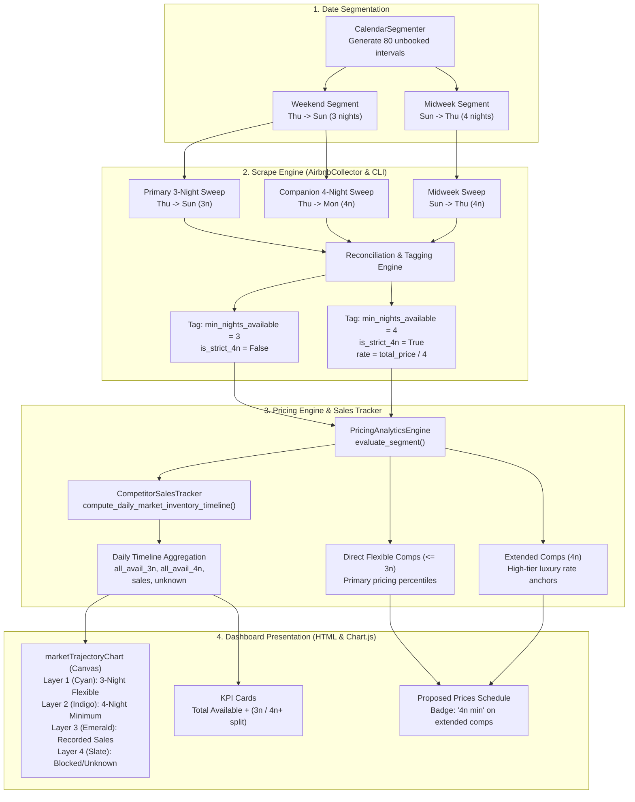

# Technical Architecture & Engineering Design Document
# Competitor Minimum Stay Tracking & Stratified Market Availability Intelligence

**Document Filename:** `docs/min_nights_comps_tracking_design.md`  
**Version:** 1.0.0  
**Status:** Approved for Implementation (Post-Grill Interview Alignment)  
**Target Asset:** Villa del Sol (Tempe, AZ — 6BR / 5BA Luxury Estate)  
**Author:** Antigravity (Pair Programming with Property Owner)  
**Date:** September 25, 2026  

---

## 1. System Architecture & Data Flow

This design addresses the limitation where 4-night minimum luxury competitors (e.g., 6–8BR estates like HÓZHÓ) are invisible to standard 3-night weekend searches. It orchestrates a companion 4-night sweep, tags competitor minimum stay requirements, integrates them into the pricing engine, and renders a 4-layer stratified trajectory chart on the dashboard.



---

## 2. Data Models & Schema Specifications

### 2.1 Comp Listing Item Schema (`comps_list` in `pricing_data_*.json`)

Each competitor listing returned from searches is enriched with minimum stay metadata:

```json
{
  "listing_id": "1163963378107916642",
  "name": "HÓZHÓ | Golf Simulator, Pool, Hot Tub & Fire Pit",
  "location": "Scottsdale",
  "bedrooms": 8,
  "beds": 11,
  "baths": 5.0,
  "rating": 4.91,
  "reviews": 56,
  "effective_nightly": 1450.0,
  "total_price": 5800.0,
  "min_nights_available": 4,
  "is_strict_4n": true,
  "is_guest_favorite": true,
  "guest_favorite_badge": "Guest Favorite",
  "desirability_ratio": 1.25,
  "adjusted_effective_nightly": 1160.0
}
```

### 2.2 Interval Evaluation Summary Schema

In `PricingAnalyticsEngine.evaluate_segment()`:

```json
{
  "check_in": "2026-10-29",
  "check_out": "2026-11-01",
  "segment_type": "weekend",
  "nights": 3,
  "lead_time_days": 34,
  "n_comps": 55,
  "comps_count": 55,
  "comps_3n_count": 38,
  "comps_4n_count": 17,
  "pct_4n_restricted": 30.9,
  "comp_p50_eff": 1285.0,
  "comp_target_eff": 1420.0,
  "comps_list": [...]
}
```

### 2.3 Trajectory Timeline Payload Schema (`market_timeline_data`)

In `CompetitorSalesTracker.compute_daily_market_inventory_timeline()`:

```json
{
  "anchor_date": "2026-09-25",
  "days_count": 365,
  "dates": ["2026-09-25", "2026-09-26", "..."],
  "month_labels": ["Oct", "", "...", "Nov", "..."],
  "days_meta": [
    {
      "date": "2026-10-29",
      "is_weekend": true,
      "avail_3n": 38,
      "avail_4n": 17,
      "total_avail": 55,
      "sales": 2,
      "unknown": 45,
      "is_compressed": false
    }
  ],
  "cohorts": {
    "all": {
      "total_comps": 102,
      "available_3n": [35, 38, "..."],
      "available_4n": [15, 17, "..."],
      "total_available": [50, 55, "..."],
      "recorded_sales": [1, 2, "..."],
      "unknown_unavailable": [51, 45, "..."],
      "avg_available_3n": 38.4,
      "avg_available_4n": 17.8,
      "avg_total_available": 56.2,
      "pct_restricted_4n": 31.7
    }
  }
}
```

---

## 3. Step-by-Step Code Modifications

### 3.1 `src/collector.py` — Companion 4-Night Weekend Sweep

Add helper method to execute the companion 4-night search:

```python
async def fetch_weekend_extended_sweep(
    self,
    check_in: str,
    nights: int = 4,
    use_cache: bool = True,
    max_cache_age: float = 20.0,
) -> List[Dict[str, Any]]:
    """
    Execute a 4-night companion search starting on check_in (Thursday -> Monday)
    to discover competitors enforcing 4-night minimum stay requirements.
    """
    cin_dt = datetime.strptime(check_in, "%Y-%m-%d").date()
    cout_dt = cin_dt + timedelta(days=nights)
    cout = cout_dt.isoformat()
    
    # Leverages existing search_corridors_parallel with 4-night parameters
    return await self.search_corridors_parallel(
        check_in=check_in,
        check_out=cout,
        nights=nights,
        use_cache=use_cache,
        max_cache_age=max_cache_age,
    )
```

### 3.2 `src/cli.py` — Orchestrating Two-Pass Sweep & Comp Tagging

In `run_interval_evaluations()` (`src/cli.py`):

```python
# 1. Primary Scrape (Standard interval duration, e.g. 3n for weekend)
evaluated, comps, n_active = await _run_scrape()

# 2. If Weekend Interval, run Companion 4-Night Sweep
if seg_type == "weekend" and nights == 3:
    try:
        comps_4n = await collector.fetch_weekend_extended_sweep(
            check_in=c_in,
            nights=4,
            use_cache=True,
            max_cache_age=max_cache_age,
        )
        
        # Build map of 3-night listing IDs
        seen_3n_ids = {str(c.get("listing_id")) for c in comps if c.get("listing_id")}
        
        # Tag 3-night comps
        for c in comps:
            c["min_nights_available"] = 3
            c["is_strict_4n"] = False
            
        # Identify 4-night-only comps
        for c in comps_4n:
            cid_str = str(c.get("listing_id") or "")
            if cid_str and cid_str not in seen_3n_ids:
                c_item = dict(c)
                tot_p = float(c_item.get("total_price") or (c_item.get("effective_nightly", 0) * 4))
                c_item["effective_nightly"] = round(tot_p / 4.0, 2)
                c_item["total_price"] = tot_p
                c_item["min_nights_available"] = 4
                c_item["is_strict_4n"] = True
                comps.append(c_item)
                
        # Re-evaluate segment with full combined cohort
        comp_rates = [c["effective_nightly"] for c in comps]
        evaluated = analytics.evaluate_segment(seg, comp_rates, comp_metadata=comps)
    except Exception as e:
        logger.warning(f"Companion 4-night sweep failed for weekend {c_in}: {e}")
```

### 3.3 `src/analytics.py` — Analytics & Percentile Integration

In `PricingAnalyticsEngine.evaluate_segment()`:

```python
# Tag breakdown metrics
comps_3n = [c for c in enriched_comps_list if c.get("min_nights_available", 3) <= 3]
comps_4n = [c for c in enriched_comps_list if c.get("is_strict_4n")]

comps_3n_count = len(comps_3n)
comps_4n_count = len(comps_4n)
tot_valid = len(enriched_comps_list)
pct_4n = round((comps_4n_count / tot_valid * 100), 1) if tot_valid > 0 else 0.0

return {
    **segment,
    "comps_count": tot_valid,
    "comps_3n_count": comps_3n_count,
    "comps_4n_count": comps_4n_count,
    "pct_4n_restricted": pct_4n,
    "comps_list": enriched_comps_list,
    ...
}
```

### 3.4 `src/competitor_sales_tracker.py` — Timeline Stratification

In `compute_daily_market_inventory_timeline()`:

```python
# During daily series construction:
inv = get_nearest_interval(d)
avail_3n_day = set()
avail_4n_day = set()

if inv and "comps" in inv:
    for cid, c_data in inv["comps"].items():
        if cid in all_ids:
            if c_data.get("is_strict_4n"):
                avail_4n_day.add(cid)
            else:
                avail_3n_day.add(cid)

avail_on_day = avail_3n_day | avail_4n_day
sales_on_day = {
    lid for lid, cin, cout in sales_list
    if cin <= d < cout and lid in all_ids and lid not in avail_on_day
}
unknown_on_day = all_ids - avail_on_day - sales_on_day

# Append to daily series
all_avail_3n.append(len(avail_3n_day))
all_avail_4n.append(len(avail_4n_day))
all_sales.append(len(sales_on_day))
all_unknown.append(len(unknown_on_day))
```

### 3.5 `src/html_generator.py` — 4-Layer Chart.js Stack & Badges

In `_render_market_trajectory_script()`:

```javascript
datasets: [
  {
    label: '3-Night Flexible Available',
    data: cohort.available_3n,
    backgroundColor: '#38bdf8', // Bright Cyan
    stack: 'capacity',
    order: 1
  },
  {
    label: '4-Night Minimum Available',
    data: cohort.available_4n,
    backgroundColor: '#818cf8', // Indigo / Purple-Blue
    stack: 'capacity',
    order: 2
  },
  {
    label: 'Recorded Comp Sales',
    data: cohort.recorded_sales,
    backgroundColor: '#34d399', // Emerald
    stack: 'capacity',
    order: 3
  },
  {
    label: 'Unavailable (Unknown)',
    data: cohort.unknown_unavailable,
    backgroundColor: '#334155', // Slate
    stack: 'capacity',
    order: 4
  }
]
```

In the Proposed Prices audit subtable listing generator:

```python
badge_4n = (
    '<span class="badge" style="background:rgba(129,140,248,0.15); color:#818cf8; '
    'border:1px solid rgba(129,140,248,0.3); font-size:0.7rem; font-weight:700; margin-left:4px;">4n min</span>'
    if c.get("is_strict_4n") else ''
)
```

---

## 4. Edge Cases & Resilience

| Edge Case | Failure Mode | Architectural Protection |
| :--- | :--- | :--- |
| **Companion Scrape Timeout / HTTP 503** | Proxy rate limiting or network glitch during 4-night sweep. | Wrap in `try/except`; gracefully fall back to the 3-night sweep results with `comps_4n_count = 0`. System never crashes or fails advisory run. |
| **Legacy Snapshot Ingestion** | Older JSON files (`pricing_data_2026-09-20.json`) do not have `is_strict_4n`. | Default parser: `c.get("is_strict_4n", False)` and `c.get("min_nights_available", 3)`. Legacy data defaults cleanly to 3n flexible. |
| **Midweek Searches** | Midweeks are naturally 4 nights (`Sun -> Thu`). | All valid midweek comps satisfy 4 nights; displayed as available inventory in midweek without false "restricted" classification. |
| **Listing Discrepancy** | Comp charges different rates on 4n vs 3n. | `effective_nightly` is normalized to `total_price / 4` for 4-night listings, reflecting true market cost of reserving that property. |

---

## 5. Verification & Testing Plan

### 5.1 Targeted Unit Tests
1. **`tests/test_collector.py`**:
   - Verify `fetch_weekend_extended_sweep` constructs correct checkout date (`+4 days`).
   - Verify cached search files are saved with `search_{cin}_{cin+4}.json`.
2. **`tests/test_analytics.py`**:
   - Feed mock segment with mixed 3n and 4n comps.
   - Assert `comps_3n_count` and `comps_4n_count` match expected values.
   - Assert `is_strict_4n` is preserved in `comps_list`.
3. **`tests/test_competitor_sales_tracker.py`**:
   - Assert `compute_daily_market_inventory_timeline()` returns `available_3n` and `available_4n` arrays summing to total available inventory.
   - Assert `avg_available_3n + avg_available_4n == avg_total_available`.
4. **`tests/test_html_dashboard_ui.py`**:
   - Verify `marketTrajectoryChart` script contains 4 datasets.
   - Verify `4n min` badge markup renders when `is_strict_4n` is present.

### 5.2 Verification Commands
```bash
# Run targeted unit tests
.venv/bin/python -m unittest tests/test_analytics.py
.venv/bin/python -m unittest tests/test_competitor_sales_tracker.py
.venv/bin/python -m unittest tests/test_html_dashboard_ui.py

# End-to-end dashboard generation
.venv/bin/python -m src.cli generate-html
```
