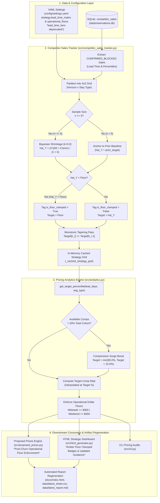

# Technical Design Document
# Dynamic Nightly Rate Percentile Targets & Strategic Lead-Time Matrix

**Document Filename:** `docs/nightly_rate_targets_design.md`  
**Version:** 1.1.0  
**Status:** Approved via `/grill-me` Alignment (Ready for Implementation)  
**Target Asset:** Villa del Sol (Tempe, AZ — 8BR / 5BA Luxury Estate)  
**Author:** Antigravity (Pair Programming with Property Owner)  
**Date:** September 18, 2026  

---

## 1. System Architecture & Data Flow

The Dynamic Nightly Rate Percentile Engine bridges recorded empirical competitor sales with luxury revenue management policies. It consumes verified competitor disappearance events from SQLite, computes a Bayesian-shrunk 2D Strategy Matrix, applies strategic luxury floors and monotonic tapering, and serves dynamic target percentiles to `PricingAnalyticsEngine` and `ProposedPricesEngine`.

### 1.1 End-to-End Architectural Pipeline



---

## 2. Mathematical & Algorithmic Specifications

### 2.1 Lead-Time Horizon Categorization
Given a booking lead time $L$ in calendar days ($L = \text{check\_in\_date} - \text{detected\_date}$):

$$H(L) = \begin{cases} 
\text{">90d"} & \text{if } L > 90 \\
\text{"31–90d"} & \text{if } 31 \le L \le 90 \\
\text{"15–30d"} & \text{if } 15 \le L \le 30 \\
\text{"}\le14\text{d"} & \text{if } L \le 14 
\end{cases}$$

Stay type $T$ is segmented into:
$$T = \begin{cases} 
\text{"weekend"} & \text{if stay contains Thu, Fri, or Sat night} \\
\text{"midweek"} & \text{if stay consists solely of Sun, Mon, Tue, Wed nights} 
\end{cases}$$

### 2.2 Sample Size Qualification & Bayesian Shrinkage
For each cell $(h, t)$ with $n$ verified comp bookings and observed sample median percentile $p_{50}$:

1. **Qualification Rule**: An empirical target is considered statistically valid only if $n \ge n_{\text{min}}$ (where $n_{\text{min}} = 5$).
2. **Bayesian Shrinkage Formulation**:
   $$\hat{Y}(h, t) = \begin{cases} 
   \dfrac{n \cdot p_{50} + k \cdot \text{prior\_target}(h, t)}{n + k} & \text{if } n \ge n_{\text{min}} \\[10pt]
   \text{prior\_target}(h, t) & \text{if } n < n_{\text{min}} 
   \end{cases}$$
   where $k = 5.0$ (equivalent pseudo-observations of prior weight).

### 2.3 Strategic Luxury Floor Clamping
To protect high-value inventory from adverse-selection bargain hunting, raw empirical shrinkage targets are subjected to mandatory policy floors:

$$\text{Target}_{\text{clamped}}(h, t) = \max\left(\text{floor}(h, t),\, \hat{Y}(h, t)\right)$$

**Floor Clamping Tagging Invariant**:
$$\text{is\_floor\_clamped}(h, t) = \begin{cases}
\text{True} & \text{if } \hat{Y}(h, t) < \text{floor}(h, t) \\
\text{False} & \text{if } \hat{Y}(h, t) \ge \text{floor}(h, t)
\end{cases}$$

*Example*: For Far-Out (>90d) Weekend:
- $n = 24$, $p_{50} = 41.0\%$, $\text{prior} = 67.5\%$, $\text{floor} = 65.0\%$.
- Raw shrinkage: $\hat{Y} = \frac{24 \times 41.0 + 5 \times 67.5}{29} = \frac{984.0 + 337.5}{29} = 45.57\%$.
- Because $\hat{Y} (45.57\%) < \text{floor} (65.0\%)$:
  $$\text{Target}_{\text{clamped}}(>90\text{d}, \text{weekend}) = 65.0\%, \quad \text{is\_floor\_clamped} = \text{True}$$

### 2.4 Monotonic Tapering Invariant
Target percentiles must never increase as the stay date approaches. After floor clamping, the system iterates sequentially across ordered horizons:
$$H_{\text{ordered}} = [">90\text{d}", "31\text{--}90\text{d}", "15\text{--}30\text{d}", "\le14\text{d}"]$$

For each stay type $t \in \{\text{weekend}, \text{midweek}\}$:
$$\text{Target}_{\text{monotonic}}(h_i, t) = \min\left(\text{Target}_{\text{clamped}}(h_i, t),\, \text{Target}_{\text{monotonic}}(h_{i-1}, t)\right) \quad \text{for } i \ge 1$$

**Mathematical Safety Guarantee**:
Because configured strategic floors are non-increasing across lead times ($\text{floor}(h_i, t) \le \text{floor}(h_{i-1}, t)$), monotonic smoothing will never reduce $\text{Target}(h_i, t)$ below its own configured floor $\text{floor}(h_i, t)$.

### 2.5 Operational Dollar Floors & Post-Churn Enforcement
In `PricingAnalyticsEngine.evaluate_segment()` and `ProposedPricesEngine.generate_proposed_prices()`:

1. **Segment Evaluation Lower Bound**:
   $$R_{\text{recommended}} \ge \begin{cases} 
   \$450.00 & \text{if stay contains Thu, Fri, or Sat night} \\
   \$300.00 & \text{if stay is Sun, Mon, Tue, or Wed night} 
   \end{cases}$$

2. **Absolute Post-Churn Clamping in `ProposedPricesEngine`**:
   To prevent existing low Kivoya rates or the 5% churn-threshold dampener from keeping prices below operating break-even:
   $$R_{\text{final}} = \max\left(R_{\text{floor}}(t),\, \text{apply\_churn\_threshold}(R_{\text{proposed}}, R_{\text{current}}, \tau)\right)$$
   guaranteeing that every proposed price is bounded by:
   - Midweek finalized proposed rate: $\ge \$300.00$
   - Weekend finalized proposed rate: $\ge \$450.00$

---

## 3. Configuration Schema (`config/settings.yaml`)

The legacy 1D `strategy.lead_time_tiers` ladder is **completely removed**. The 2D Strategy Matrix and operational dollar floors are externalized as the single source of truth:

```yaml
strategy:
  base_percentile: 65
  bayesian_shrinkage_k: 5.0
  min_empirical_sample_size: 5
  enforce_monotonic_tapering: true

  # Absolute Operational Price Floors (Dollar rates per night)
  operational_floors:
    weekend: 450.0
    midweek: 300.0

  # 2D Strategy Matrix (Horizon x Stay Type)
  lead_time_matrix:
    ">90d":
      description: "Early booking window with high willingness-to-pay. Anchor at premium percentiles."
      weekend:
        target: 67.5
        floor: 65.0
        p75: 75.0
      midweek:
        target: 47.5
        floor: 45.0
        p75: 55.0
      action_guidance: "Hold firm at 65%–70% (Weekend) / 45%–50% (Midweek). Strategic floor protects far-out luxury yield against early underpriced bargain hunters."

    "31–90d":
      description: "Prime conversion period for family vacations and luxury group travel."
      weekend:
        target: 62.5
        floor: 60.0
        p75: 70.0
      midweek:
        target: 32.5
        floor: 30.0
        p75: 45.0
      action_guidance: "Target 60%–65% (Weekend) / 30%–35% (Midweek). Aligned with empirical comp conversion band and protected by $300 midweek floor."

    "15–30d":
      description: "Demand curve compresses and price elasticity rises rapidly."
      weekend:
        target: 52.5
        floor: 50.0
        p75: 60.0
      midweek:
        target: 32.5
        floor: 30.0
        p75: 40.0
      action_guidance: "Trim to 50%–55% (Weekend) / 30%–32% (Midweek). Monotonic tapering prevents small-sample near-term spikes."

    "≤14d":
      description: "Distress inventory liquidation window where unbooked nights risk total perishable loss."
      weekend:
        target: 42.5
        floor: 40.0
        p75: 50.0
      midweek:
        target: 30.0
        floor: 28.0
        p75: 38.0
      action_guidance: "Aggressive liquidation: 40%–45% (Weekend) / 28%–32% (Midweek) to secure occupancy above $300 operational floor."

  anomaly_thresholds:
    urgent_percent_diff: 25.0
    urgent_lead_days: 60
    moderate_percent_diff: 10.0
  proposed_pricing:
    comp_weight: 0.67
    historical_weight: 0.33
    weekend_premium_factor: 1.50
```

---

## 4. Component Detailed Design

### 4.1 `src/competitor_sales_tracker.py`

#### Method: `_load_strategy_config()`
Reads `config/settings.yaml` to initialize `HORIZON_PRIORS`, `BAYESIAN_SHRINKAGE_K`, `MIN_SAMPLE_SIZE`, and `OPERATIONAL_FLOORS`. Provides embedded fallback constants if YAML is missing.

#### Method: `compute_strategy_grid()`
Executes the aggregation and calibration pipeline:
1. Fetch all `CONFIRMED_BLOCKED` sales from `data/reservations.db`.
2. Partition into cell buckets $(h, t)$.
3. Compute sample statistics ($p_{50}$, $p_{75}$, $n$, $\text{rates}$).
4. Compute Bayesian target:
   - If $n \ge 5$: $\hat{Y} = \frac{n \cdot p_{50} + k \cdot \text{prior}}{n + k}$ with $k = 5.0$, `is_empirical = True`.
   - If $n < 5$: $\hat{Y} = \text{prior}$, `is_empirical = False`.
5. Evaluate Floor Clamping:
   - `is_floor_clamped = (hat_Y < floor)`
   - `recommended_target = max(floor, hat_Y)`
6. Execute monotonic tapering pass across ordered horizons:
   - For $i \in [1, 2, 3]$: $\text{Target}[h_i, t] = \min(\text{Target}[h_i, t],\, \text{Target}[h_{i-1}, t])$.
7. Build Cell Output Dictionary:
   ```python
   grid[h][t] = {
       "count": n,
       "empirical_p50": emp_p50,
       "empirical_p75": emp_p75,
       "recommended_target": recommended_target,
       "recommended_aggressive": recommended_aggressive,
       "baseline_prior": prior_target,
       "floor": floor,
       "is_empirical": n >= 5,
       "is_floor_clamped": is_floor_clamped,
       "avg_rate": avg_rate,
       "min_rate": min_rate,
       "max_rate": max_rate,
   }
   ```
8. Cache result in `self._cached_strategy_grid`.

#### Method: `get_target_percentile(lead_time_days: int, segment_type: str = "weekend") -> float`
Maps lead days to horizon string, normalizes segment type, retrieves `recommended_target` from cached grid, and returns a floating-point percentile rounded to 1 decimal place.

---

### 4.2 `src/analytics.py`

#### `PricingAnalyticsEngine.get_target_percentile()`
Update static fallback curve (used when `sales_tracker` is not initialized) to map to the 4 horizons:
- $>90$ days: Weekend $67.5\%$, Midweek $47.5\%$.
- $31$ to $90$ days: Weekend $62.5\%$, Midweek $32.5\%$.
- $15$ to $30$ days: Weekend $52.5\%$, Midweek $32.5\%$.
- $\le 14$ days: Weekend $42.5\%$, Midweek $30.0\%$.

#### `PricingAnalyticsEngine.evaluate_segment()`
1. Query dynamic target percentile via `sales_tracker.get_target_percentile()`.
2. Evaluate scarcity compression via `sales_tracker.detect_market_compression()`. If compressed ($<20\%$ available comps), boost target by $+15.0\%$ (max $90.0\%$).
3. Compute target comp rate at target percentile.
4. Pass stay-specific operational floor to `translate_to_recommended_base_rate`:
   ```python
   is_midweek = str(seg_type).lower() in ["midweek", "weekday"]
   op_floor = 300.0 if is_midweek else 450.0
   rec_base = self.translate_to_recommended_base_rate(
       target_eff, nights, floor_rate=op_floor, channel_factor=channel_factor
   )
   ```

---

### 4.3 `src/proposed_prices.py`

In `generate_proposed_prices()`:
- Non-holiday intervals apply operational price floors as an absolute post-churn hard floor:
  ```python
  mid_avg = max(300.0, apply_churn_threshold(mid_avg, cur_mid, churn_threshold_pct))
  mid_med = max(300.0, apply_churn_threshold(mid_med, cur_mid, churn_threshold_pct))
  wkd_avg = max(450.0, apply_churn_threshold(wkd_avg, cur_wkd, churn_threshold_pct))
  wkd_med = max(450.0, apply_churn_threshold(wkd_med, cur_wkd, churn_threshold_pct))
  ```
- Holiday intervals continue to enforce custom holiday floors from `config/holidays.json`.

---

### 4.4 `src/html_generator.py`

Update `_render_market_sales_tab()`:
1. **Cell Badge Rendering**:
   - If `cell.get("is_floor_clamped")`:
     `badge_style = "background:rgba(245,158,11,0.15); color:#fbbf24; border:1px solid rgba(245,158,11,0.3);"`
     `badge_label = "Floor Clamped"`
   - Else if `cell.get("is_empirical")`:
     `badge_style = "background:rgba(52,211,153,0.15); color:#34d399; border:1px solid rgba(52,211,153,0.3);"`
     `badge_label = "Empirical"`
   - Else:
     `badge_style = "background:rgba(168,85,247,0.15); color:#c084fc; border:1px solid rgba(168,85,247,0.3);"`
     `badge_label = "Blended (k=5)"`
2. **Synchronize Guidance Copy**:
   - `>90d`: "Hold firm at 65%–70% (Weekend) / 45%–50% (Midweek). Strategic floor protects far-out luxury yield against early underpriced bargain hunters."
   - `31–90d`: "Target 60%–65% (Weekend) / 30%–35% (Midweek). Aligned with empirical comp conversion band and protected by $300 midweek floor."
   - `15–30d`: "Trim to 50%–55% (Weekend) / 30%–32% (Midweek). Monotonic tapering prevents small-sample near-term spikes."
   - `≤14d`: "Aggressive liquidation: 40%–45% (Weekend) / 28%–32% (Midweek) to secure occupancy above $300 operational floor."

---

## 5. Edge Cases & Resilience Strategy

| Edge Case | Failure Mode / Threat | Remediation Strategy |
| :--- | :--- | :--- |
| **Empty Sales DB ($n=0$)** | Division by zero or null grid | Safe fallback to baseline prior target (`cell.get('baseline_prior', 65.0)`). |
| **Thin Sample ($n=1$ to $4$)** | 1 luxury outlier inflates target (e.g., $P_{87}$) | $n < 5$ gating forces cell to prior; Bayesian shrinkage dampened with $k=5.0$. |
| **Inverted Volatility** | Near-term target > Far-out target | Monotonic tapering pass forces $\text{Target}[h_i] \le \text{Target}[h_{i-1}]$. |
| **Host Rate Dumping** | 24 comps sell at $P_{15}$ far-out | Strategic floor clamping forces $\text{Target} \ge 65.0\%$ (Weekend) / $\ge 45.0\%$ (Midweek). Flagged as `is_floor_clamped = True`. |
| **Low Historical Rate in Kivoya** | Churn threshold holds rate at $220/night | Absolute post-churn clamp enforces $\max(300.0, \dots)$ Midweek and $\max(450.0, \dots)$ Weekend. |
| **Missing YAML File** | FileNotFoundError on load | Embedded dictionary fallbacks in `CompetitorSalesTracker` guarantee zero crashes. |
| **Extreme Scarcity** | Comp supply dries up last minute | +15% scarcity boost overrides monotonic ceiling up to 90.0% max. |

---

## 6. Verification & Testing Strategy

### 6.1 Inner-Loop Targeted Unit Tests
- `tests/test_competitor_sales_tracker.py`:
  - `test_compute_strategy_grid_with_floors`: Verifies far-out weekend does not drop below 65% despite $p_{50} = 41.0\%$.
  - `test_is_floor_clamped_flag`: Verifies $\hat{Y} < \text{floor}$ sets `is_floor_clamped = True`.
  - `test_monotonic_tapering_enforcement`: Verifies 15–30d target is clamped to $\le$ 31–90d target.
  - `test_sample_size_gating_n5`: Verifies $n < 5$ cells remain non-empirical.
- `tests/test_analytics.py`:
  - `test_operational_floors`: Verifies midweek recommended rates never dip below $300/night and weekend rates never dip below $450/night.
  - `test_compression_surge`: Verifies +15% surge applies on top of dynamic target.
- `tests/test_proposed_prices.py`:
  - `test_post_churn_operational_floors`: Verifies proposed rates cannot be suppressed below $300/$450 by churn thresholding.

### 6.2 Full Test Suite Milestone
- Execute `.venv/bin/python -m unittest discover tests` to ensure 0 regressions.

### 6.3 Mandatory Subagent Review
- Execute a strict minimum of 2 clean-context subagent review rounds per `code_review.md` before completion.

### 6.4 Automated Dashboard & Report Artifact Regeneration
- Run `HTMLDashboardGenerator` and `PriceReportGenerator` to update:
  - `docs/index.html`
  - `data/latest_sheet.csv`
  - `data/latest_report.md`
  - `docs/latest_sheet.csv`
  - `docs/latest_report.md`
