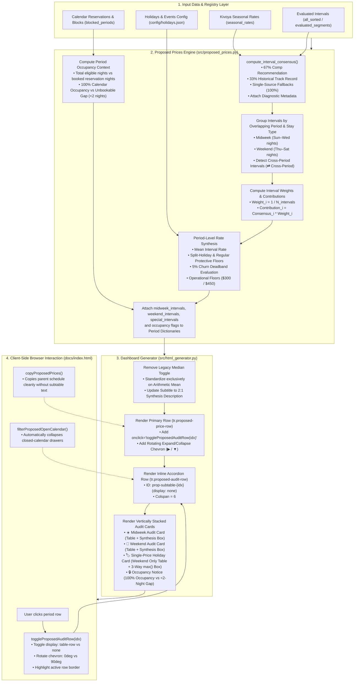

# Technical Design Document
# Interactive Audit UI for Proposed Prices (PMS Consensus Schedule)

**Document Filename:** `docs/proposed_rates_ui_for_audit_design.md`  
**Version:** 1.1.0  
**Status:** Approved via `/grill-me` Alignment (Ready for Implementation)  
**Target Asset:** Villa del Sol (Tempe, AZ — 6BR / 5BA Luxury Estate)  
**Author:** Antigravity (Pair Programming with Property Owner)  
**Date:** September 24, 2026  

---

## 1. System Architecture & End-to-End Data Pipeline

The **Proposed Prices Interactive Audit UI** transforms the static seasonal rate schedule on the dashboard (`docs/index.html`) into a fully auditable, interactive interface. It allows the property owner to click any seasonal rate period row to expand an inline drawer detailing the constituent unbooked stay intervals, their 2:1 market/historical synthesis, their exact fractional weights, and their dollar contributions to the final recommended rate.

### 1.1 High-Level Architecture Flow



---

## 2. Mathematical & Algorithmic Formulations

### 2.1 Interval Consensus Pricing (2:1 Weighted Synthesis)

For each unbooked stay segment $i$, the pricing engine evaluates the competitor market recommendation $M_i$ (adjusted for property quality/desirability ratios) and the realized historical benchmark $H_i$ from past reservations:

$$\text{Consensus}_i = \begin{cases}
\text{round}\left(w_{\text{comp}} \cdot M_i + w_{\text{hist}} \cdot H_i\right) & \text{if } M_i > 0 \text{ and } H_i > 0 \text{ and } N_{\text{hist}} > 0 \\[8pt]
\text{round}(M_i) & \text{if } M_i > 0 \text{ and } (H_i \le 0 \text{ or } N_{\text{hist}} = 0) \quad \text{[100\% Market Fallback]} \\[8pt]
\text{round}(H_i) & \text{if } M_i \le 0 \text{ and } H_i > 0 \text{ and } N_{\text{hist}} > 0 \quad \text{[100\% History Fallback]} \\[8pt]
\text{round}(B_i) & \text{if } M_i \le 0 \text{ and } H_i \le 0 \quad \text{[Hold Base Rate]}
\end{cases}$$

where standard default weights are:
$$w_{\text{comp}} = \frac{0.67}{0.67 + 0.33} = 0.67, \quad w_{\text{hist}} = \frac{0.33}{0.67 + 0.33} = 0.33$$

### 2.2 Strict Arithmetic Mean Invariant & Additive Contributions

In revenue management and PMS seasonal rate setting, rate periods represent the arithmetic average (mean) of their constituent unbooked intervals:

$$\bar{P}_{\text{period}} = \text{round}\left(\frac{1}{N} \sum_{i=1}^N \text{Consensus}_i\right)$$

#### Interval Share (Weight)
Each unbooked stay interval in the period receives equal fractional weight:
$$W_i = \frac{1}{N} \times 100\%$$

#### Interval Dollar Contribution
The exact dollar contribution of interval $i$ to the period average is:
$$C_i = \text{Consensus}_i \times \frac{1}{N}$$

#### Mathematical Invariants
$$\sum_{i=1}^N W_i = 100.0\%, \qquad \left|\sum_{i=1}^N C_i - \bar{P}_{\text{period}}\right| \le 0.5 \quad \text{(integer rounding invariant)}$$

*Note on UI Formatting:* To maintain clean alignment with PMS rates, the Period Synthesis Box formats the total contribution as the rounded integer (e.g. `Σ Contributions = $1,836 (Period Mean)`), while individual table rows display exact cents (`$918.00`).

### 2.3 5% Churn Deadband Rule

To prevent unnecessary PMS update churn for negligible price adjustments, rates only change if the relative deviation from the existing Kivoya base rate $P_{\text{base}}$ meets or exceeds the 5% threshold:

$$\Delta_{\text{pct}} = \frac{|\bar{P}_{\text{period}} - P_{\text{base}}|}{P_{\text{base}}}$$

$$P_{\text{churn\_filtered}} = \begin{cases}
\bar{P}_{\text{period}} & \text{if } \Delta_{\text{pct}} \ge 0.05 \quad \text{(Adjusted rate applied)} \\
P_{\text{base}} & \text{if } \Delta_{\text{pct}} < 0.05 \quad \text{(Held firm at base price)}
\end{cases}$$

### 2.4 Operational Dollar Floors

To safeguard luxury property revenues and prevent underpricing, rates are subjected to mandatory post-churn operational floors:

$$P_{\text{proposed}} = \begin{cases}
\max\left(\$300,\, P_{\text{churn\_filtered}}\right) & \text{for Midweek stays} \\
\max\left(\$450,\, P_{\text{churn\_filtered}}\right) & \text{for Weekend stays}
\end{cases}$$

### 2.5 Holiday Rate Syntheses

#### Single-Rate Holidays (e.g., Thanksgiving, Christmas & New Year)
Only weekend consensus rates are evaluated; midweek shoulder nights do not dilute holiday rates:
$$P_{\text{holiday}} = \max\left(\bar{P}_{\text{weekend\_consensus}},\, \text{Floor}_{\text{holiday}},\, \text{round}\left(\bar{P}_{\text{std\_weekend}} \times (1 + \text{Premium}_{\text{holiday}})\right)\right)$$
Subject to the 5% churn deadband and the \$450 Weekend Operational Floor.

#### Split-Rate Holidays (e.g., Holy Week, Multi-Day Events)
Midweek and Weekend stays are evaluated independently with their own protective floors and premiums:
$$\text{Mid Floor} = \max(\text{Floor}_{\text{midweek}},\, \text{round}(\bar{P}_{\text{std\_midweek}} \times (1 + \text{Premium})))$$
$$\text{Wkd Floor} = \max(\text{Floor}_{\text{weekend}},\, \text{round}(\bar{P}_{\text{std\_weekend}} \times (1 + \text{Premium})))$$
$$\bar{P}_{\text{mid\_adj}} = \max(\bar{P}_{\text{mid\_consensus}},\, \text{Mid Floor}), \qquad \bar{P}_{\text{wkd\_adj}} = \max(\bar{P}_{\text{wkd\_consensus}},\, \text{Wkd Floor})$$
Followed by the 5% churn threshold and operational floors (\$300 Midweek / \$450 Weekend).

### 2.6 Cross-Period Interval Overlap Rule

An unbooked stay interval is considered overlapping a rate period $[b_{\text{dt}}, e_{\text{dt}}]$ if:
$$\text{check\_in} < e_{\text{dt}} \quad \text{and} \quad \text{check\_out} > b_{\text{dt}}$$

When an interval straddles two periods (e.g., checking in February 26 and checking out March 2):
1. It is mathematically evaluated in both periods' consensus averages.
2. In the audit table, the interval is clearly designated with a `⇄ Cross-Period` pill badge.
3. The flag is computed as:
   $$\text{is\_cross\_period} = (\text{check\_in} < b_{\text{dt}}) \lor (\text{check\_out} > e_{\text{dt}})$$

### 2.7 Calendar Occupancy & Unbookable Gap Resolution

To eliminate off-by-one errors and ensure strict accounting of booked versus unbooked inventory, stay nights within a rate period $[b_{\text{dt}}, e_{\text{dt}}]$ are strictly defined as:
$$\text{Stay Nights} = \{d \in \text{Calendar Dates} \mid b_{\text{dt}} \le d < e_{\text{dt}}\}$$
*(The checkout date $e_{\text{dt}}$ is not a stay night in period $[b_{\text{dt}}, e_{\text{dt}}]$, as guests check out on the morning of $e_{\text{dt}}$ and the succeeding rate period begins).*

#### Day-of-Week Night Partitions
- **Midweek Nights**: $d.\text{weekday()} \in \{6, 0, 1, 2\}$ (Sunday, Monday, Tuesday, Wednesday nights).
- **Weekend Nights**: $d.\text{weekday()} \in \{3, 4, 5\}$ (Thursday, Friday, Saturday nights).

#### Metric Definitions
For each rate period $[b_{\text{dt}}, e_{\text{dt}}]$ and stay type (Midweek or Weekend):
1. **$N_{\text{eligible}}$**: Total calendar stay nights of that stay type in $\{d \mid b_{\text{dt}} \le d < e_{\text{dt}}\}$.
2. **$N_{\text{booked}}$**: Total calendar stay nights of that stay type occupied by reservations in `blocked_periods`.
3. **$N_{\text{unbooked}}$**: Count of unbooked stay intervals generated by `CalendarSegmenter` overlapping the period.

#### Classification Rules
- **100% Calendar Occupancy**: $N_{\text{unbooked}} = 0$, $N_{\text{eligible}} > 0$, and $N_{\text{booked}} = N_{\text{eligible}}$.
- **No Bookable Intervals (<2 nights)**: $N_{\text{unbooked}} = 0$, $N_{\text{eligible}} > 0$, and $N_{\text{booked}} < N_{\text{eligible}}$ (unbooked dates exist but fail the 2-night minimum stay constraint).
- **Not Applicable**: $N_{\text{eligible}} = 0$ (e.g. a Thursday–Sunday holiday period has no midweek calendar nights). The card is completely omitted.

---

## 3. Backend Engine Data Model Extensions (`src/proposed_prices.py`)

### 3.1 Interval Diagnostic Metadata Schema

In `compute_interval_consensus(segment, comp_weight=None, historical_weight=None)`:
Enrich the return dictionary with comprehensive diagnostic metadata required by the audit UI:

```python
{
    "check_in": str,                     # e.g. "2027-03-05"
    "check_out": str,                    # e.g. "2027-03-08"
    "nights": int,                       # Derived from dates or segment["nights"]
    "segment_type": "midweek" | "weekend",
    "lead_days": int,                    # Lead-time days out from reference_date
    "target_pct": float,                 # 2D Strategy Matrix target (e.g. 85.0)
    "base_rate": int,                    # Existing Kivoya base nightly rate
    "market_rec": Optional[int],         # Recommended rate from comp percentiles ($1,850)
    "n_comps": int,                      # Number of active, valid comps (e.g. 70)
    "comp_target_effective": float,      # Target effective comp rate
    "hist_med": Optional[int],           # Historical benchmark rate ($1,807)
    "hist_cnt": int,                     # Sample count of past bookings (e.g. 12)
    "comp_weight": float,                # 0.67 (or 1.0 if zero history fallback)
    "hist_weight": float,                # 0.33 (or 0.0 if zero history fallback)
    "is_fallback": bool,                 # True if single-source fallback
    "fallback_reason": Optional[str],    # "No past bookings" or "0 comps"
    "consensus_rate": int,               # Final interval rate ($1,836)
    "status": "INCREASE" | "DECREASE" | "HOLD",
    "zero_history": bool,                # Preserved for backward compatibility
}
```

### 3.2 Period Dictionary Audit Interval Attachments

In `generate_proposed_prices()`:
For each rate period dictionary, attach the structured lists of constituent intervals with precalculated weights, contributions, and cross-period indicators:

```python
# For each overlapping interval in period:
is_cross = bool(interval_item["start_dt"] < b_dt or interval_item["end_dt"] > e_dt)
weight_pct = round((1.0 / len(overlapping_type_intervals)) * 100.0, 1)
weight_frac = 1.0 / len(overlapping_type_intervals)
dollar_contrib = round(interval_item["consensus_rate"] * weight_frac, 2)

interval_audit_record = {
    **interval_item,
    "is_cross_period": is_cross,
    "weight_pct": weight_pct,
    "weight_frac": weight_frac,
    "dollar_contribution": dollar_contrib,
}
```

Attached period attributes:
- `period_dict["midweek_intervals"]`: List of enriched midweek interval dictionaries.
- `period_dict["weekend_intervals"]`: List of enriched weekend interval dictionaries.
- `period_dict["special_intervals"]`: List of enriched holiday weekend intervals.
- `period_dict["midweek_unbooked_count"]`: Count of unbooked midweek intervals.
- `period_dict["weekend_unbooked_count"]`: Count of unbooked weekend intervals.
- `period_dict["midweek_booked_nights"]`: Count of booked midweek nights in period.
- `period_dict["weekend_booked_nights"]`: Count of booked weekend nights in period.
- `period_dict["midweek_total_nights"]`: Count of eligible midweek calendar nights in period.
- `period_dict["weekend_total_nights"]`: Count of eligible weekend calendar nights in period.
- `period_dict["is_midweek_fully_booked"]`: `bool(midweek_unbooked_count == 0 and midweek_total_nights > 0 and midweek_booked_nights == midweek_total_nights)`.
- `period_dict["is_midweek_no_intervals"]`: `bool(midweek_unbooked_count == 0 and midweek_total_nights > 0 and midweek_booked_nights < midweek_total_nights)`.
- `period_dict["is_weekend_fully_booked"]`: `bool(weekend_unbooked_count == 0 and weekend_total_nights > 0 and weekend_booked_nights == weekend_total_nights)`.
- `period_dict["is_weekend_no_intervals"]`: `bool(weekend_unbooked_count == 0 and weekend_total_nights > 0 and weekend_booked_nights < weekend_total_nights)`.

---

## 4. Frontend Dashboard UI & Component Specifications (`src/html_generator.py`)

### 4.1 Header Control Cleanup: Deprecation of Median Toggle

As aligned during `/grill-me`, the Proposed Prices schedule is strictly standardized on the **arithmetic average (mean)**:
1. **Remove Selector**: Delete the `Suggest: [Average] [Median]` toggle buttons from the Proposed Prices section header.
2. **Simplified Column Display**: The Midweek, Weekend, and Special columns directly display `midweek_avg`, `weekend_avg`, and `special_avg`.
3. **Copy Button Update**: `copyProposedPrices()` reads exclusively from the arithmetic mean values, eliminating modal divergence.
4. **Header Subtitle Update**: Update description to accurately describe the 2:1 synthesis without referencing obsolete directional agreement rules:
   > *"Synthesizes competitive market recommendations (67% weight) with historical track record benchmarks (33% weight) across Kivoya seasonal rate periods. Rates adjust when sufficient market and historical evidence warrants change; unverified periods hold current base rates firm."*

### 4.2 Row Interaction & Visual Affordances

1. **Click Target & Accessibility**: `tr.proposed-price-row` has `cursor: pointer;`, `role="button"`, `tabindex="0"`, `aria-expanded="false"`, and `onclick="toggleProposedAuditRow('{idx}', event)"`.
2. **Hover Highlight**: Subtle cyan background on hover:
   ```css
   .proposed-price-row:hover {
     background: rgba(56, 189, 248, 0.06) !important;
   }
   ```
3. **Rotating Chevron Icon Mechanics**: Rendered in the first column (`Dates`):
   ```html
   <span id="prop-chevron-{idx}" class="prop-chevron" style="display:inline-block; transition:transform 0.2s ease; margin-right:6px; color:#60a5fa; font-size:0.75rem;">▶</span>
   ```
   Text content remains constant (`▶`); rotation is managed entirely via CSS transform (`transform: rotate(0deg)` vs `transform: rotate(90deg)`), smoothly transitioning and accenting cyan (`#38bdf8`) when expanded.
4. **Active Row Border**: When expanded, `tr.proposed-price-row` applies a left accent border (`border-left: 3px solid #38bdf8;`) and toggles `aria-expanded="true"`.

---

### 4.3 Expandable Accordion Subtable Container

Directly following each `prop-row-{idx}`, render the hidden accordion row:

```html
<tr id="prop-subtable-{idx}" class="proposed-audit-row" style="display: none;">
  <td colspan="6" style="padding: 0; border-top: none; background: rgba(15, 23, 42, 0.6);">
    <div class="proposed-audit-container" style="padding: 16px 20px; border-left: 3px solid #38bdf8; border-bottom: 1px solid rgba(56, 189, 248, 0.2);">
      <!-- Midweek Audit Card -->
      <!-- Weekend Audit Card -->
      <!-- Holiday Synthesis Card (if applicable) -->
    </div>
  </td>
</tr>
```

---

## 5. Audit Card Component Designs

### 5.1 Vertically Stacked Audit Cards

Midweek and Weekend audit sections are laid out as **vertically stacked, full-width cards**:
1. **Midweek Audit Card** (renders if `midweek_base is not None` or `midweek_intervals` exist).
2. **Weekend Audit Card** (renders if `weekend_base is not None` or `weekend_intervals` exist).
3. If a stay type is not present in the rate period (e.g. a Thursday–Sunday holiday has no midweek nights), that card is completely omitted.

### 5.2 Interval Audit Table Columns & Layout

Each card hosts an audit table wrapped in a dedicated horizontal scroll container (`<div class="table-responsive" style="overflow-x: auto; margin-top: 8px;">`) to ensure responsive presentation across devices.

The table features 7 standardized columns:

| Column Header | Alignment & Font | Data & Formatting | Example |
| :--- | :--- | :--- | :--- |
| **Stay Interval** | Left, Sans-serif | `check_in → check_out` with nights pill badge and optional `⇄ Cross-Period` pill | `02/26 → 03/02` `4 nights` `⇄ Cross-Period` |
| **Strategy Target** | Left, Sans-serif | Lead-time days out + target percentile from 2D Strategy Matrix | `158d out • P85.0` |
| **Market Comps (67% Weight)** | Right, Monospace | Adjusted comp recommendation rate + comp count $N$ | `$1,850 • N=70 comps` |
| **Historical Benchmark (33% Weight)** | Right, Monospace | Realized historical sales rate + booking count $N$ | `$1,807 • 12 bookings` |
| **Consensus Rate** | Right, Monospace | Synthesized 2:1 rate with directional arrow vs base | `→ $1,836` (green/red) |
| **Weight in Period** | Right, Monospace | Equal fractional share: $1 / N \times 100\%$ | `50.0%` (1 of 2) |
| **Contribution** | Right, Monospace | Exact dollar amount contributed to period mean (cents precision) | `$918.00` |

#### Single-Source Fallback Visualization
When an interval lacks market comps or past bookings, the missing source displays an explicit fallback badge:
- Missing Comps: `— (0 comps • 0% weight)` in Market column; History column displays badge `100% fallback weight`.
- Missing History: `— (No past bookings • 0% weight)` in History column; Market column displays badge `100% fallback weight`.
- Missing Both: Both columns display `— (0% weight)`; Consensus Rate displays `$base` with badge `Hold Base Rate`.

### 5.3 Period Synthesis Formula Box (4-State Architecture)

Rendered directly below the interval table in each card, summarizing the mathematical convergence across 4 distinct operational states:

#### State A: Rate Adjusted ($|\Delta| \ge 5\%$, Operational Floor Satisfied)
```html
<div class="audit-synthesis-box" style="background:rgba(30,41,59,0.7); border:1px solid #334155; border-radius:6px; padding:12px 16px; margin-top:12px; display:flex; justify-content:space-between; align-items:center; flex-wrap:wrap; gap:12px;">
  <div style="font-size:0.85rem; color:#cbd5e1; line-height:1.5;">
    <div><strong>Mathematical Trace:</strong> Σ Contributions = <strong>$1,836</strong> (Period Mean) vs. Kivoya Base <strong>$1,492</strong> (Δ = +$344, +23.1%)</div>
    <div style="color:#34d399; margin-top:3px;">✓ Exceeds 5% churn deadband → Rate adjusted to $1,836. Meets $450 Weekend Operational Floor.</div>
  </div>
  <div>
    <span class="badge" style="background:rgba(52,211,153,0.15); color:#34d399; border:1px solid rgba(52,211,153,0.3); font-size:0.85rem; font-weight:700; padding:4px 10px;">
      Final Proposed: $1,836
    </span>
  </div>
</div>
```

#### State B: Held Firm by Churn Deadband ($|\Delta| < 5\%$)
```html
<div class="audit-synthesis-box" style="background:rgba(30,41,59,0.7); border:1px solid #334155; border-radius:6px; padding:12px 16px; margin-top:12px; display:flex; justify-content:space-between; align-items:center; flex-wrap:wrap; gap:12px;">
  <div style="font-size:0.85rem; color:#cbd5e1; line-height:1.5;">
    <div><strong>Mathematical Trace:</strong> Σ Contributions = <strong>$1,020</strong> (Period Mean) vs. Kivoya Base <strong>$1,000</strong> (Δ = +$20, +2.0%)</div>
    <div style="color:#60a5fa; margin-top:3px;">ℹ️ Within 5% churn deadband (|Δ| = 2.0% < 5.0%) → Proposed rate held firm at $1,000 to prevent PMS update churn.</div>
  </div>
  <div>
    <span class="badge" style="background:rgba(96,165,250,0.15); color:#60a5fa; border:1px solid rgba(96,165,250,0.3); font-size:0.85rem; font-weight:700; padding:4px 10px;">
      Final Proposed: $1,000 (Held Firm)
    </span>
  </div>
</div>
```

#### State C: Clamped by Operational Floor
```html
<div class="audit-synthesis-box" style="background:rgba(30,41,59,0.7); border:1px solid #334155; border-radius:6px; padding:12px 16px; margin-top:12px; display:flex; justify-content:space-between; align-items:center; flex-wrap:wrap; gap:12px;">
  <div style="font-size:0.85rem; color:#cbd5e1; line-height:1.5;">
    <div><strong>Mathematical Trace:</strong> Σ Contributions = <strong>$280</strong> (Period Mean) vs. Kivoya Base <strong>$280</strong></div>
    <div style="color:#fbbf24; margin-top:3px;">⚠️ Calculated rate ($280) clamped to $300 by mandatory Midweek Operational Floor.</div>
  </div>
  <div>
    <span class="badge" style="background:rgba(251,191,36,0.15); color:#fbbf24; border:1px solid rgba(251,191,36,0.3); font-size:0.85rem; font-weight:700; padding:4px 10px;">
      Final Proposed: $300 (Floor Applied)
    </span>
  </div>
</div>
```

#### State D: Dual Fallback / Unverified (0 Comps and 0 Past Bookings)
```html
<div class="audit-synthesis-box" style="background:rgba(30,41,59,0.7); border:1px solid #334155; border-radius:6px; padding:12px 16px; margin-top:12px; display:flex; justify-content:space-between; align-items:center; flex-wrap:wrap; gap:12px;">
  <div style="font-size:0.85rem; color:#cbd5e1; line-height:1.5;">
    <div><strong>Mathematical Trace:</strong> No verified market comps or historical bookings available for constituent dates.</div>
    <div style="color:#94a3b8; margin-top:3px;">🔒 Rate held firm at Kivoya Base ($1,001) due to absence of verified market evidence.</div>
  </div>
  <div>
    <span class="badge" style="background:rgba(148,163,184,0.15); color:#94a3b8; border:1px solid rgba(148,163,184,0.3); font-size:0.85rem; font-weight:700; padding:4px 10px;">
      Final Proposed: $1,001 (Unverified Hold)
    </span>
  </div>
</div>
```

#### Split-Pricing Holiday Synthesis Box
For split-pricing holidays (e.g. Holy Week), the synthesis box integrates the protective floor and premium calculation:
```html
<div><strong>Split-Holiday Trace:</strong> max(Interval Mean <strong>$1,250</strong>, Holiday Floor <strong>$999</strong>, Standard + 10% <strong>$1,100</strong>) = <strong>$1,250</strong> vs Kivoya Base <strong>$999</strong> (Δ = +$251, +25.1%)</div>
```

### 5.4 Single-Price Holiday Synthesis Card

For single-price holidays (e.g., *Thanksgiving*, *Christmas & New Year*):
1. **Constituent Weekend Intervals Table**: Displays only evaluated weekend intervals, with subheading note:
   > *"Evaluated Weekend Intervals (Midweek shoulder nights do not dilute single-rate holidays)"*
2. **Midweek Shoulder Nights Notice**: If unbooked midweek intervals overlap the holiday date range, render a collapsed informational note:
   ```html
   <div style="font-size:0.8rem; color:#94a3b8; margin-top:6px; margin-bottom:8px; padding:6px 10px; background:rgba(255,255,255,0.03); border-radius:4px;">
     ℹ️ <em>Notice: N unbooked midweek interval(s) overlap this holiday window. Per revenue strategy, single-rate holiday pricing is driven strictly by peak weekend market demand to prevent rate dilution.</em>
   </div>
   ```
3. **Holiday Rule Synthesis Box**:
   - Outlines the 3-way `max()` formula comparison:
     - **Market Weekend Consensus**: e.g., \$1,120
     - **Configured Holiday Floor**: e.g., \$499
     - **Standard Weekend Benchmark + Premium**: e.g., \$950 + 10% = \$1,045
   - Displays the winning rate and justification banner:
     $$\text{Special Rate} = \max(\$1,120, \$499, \$1,045) = \$1,120$$

### 5.5 Zero Unbooked Intervals Banners

#### Case 1: 100% Calendar Occupancy
```html
<div class="audit-occupancy-notice" style="background:rgba(30,41,59,0.5); border:1px solid rgba(148,163,184,0.25); border-radius:6px; padding:12px 16px; display:flex; align-items:center; gap:12px;">
  <span style="font-size:1.4rem;">🔒</span>
  <div style="font-size:0.85rem; color:#94a3b8; line-height:1.4;">
    <strong style="color:#f8fafc;">100% Calendar Occupancy:</strong> All weekend dates in this rate period are currently reserved on Villa del Sol's calendar. No unbooked market intervals exist to evaluate. Proposed rate is held firm at the current Kivoya base rate (<strong style="color:#ffffff;">$599</strong>).
  </div>
</div>
```

#### Case 2: No Bookable Intervals (<2 nights)
```html
<div class="audit-occupancy-notice" style="background:rgba(30,41,59,0.5); border:1px solid rgba(148,163,184,0.25); border-radius:6px; padding:12px 16px; display:flex; align-items:center; gap:12px;">
  <span style="font-size:1.4rem;">🔒</span>
  <div style="font-size:0.85rem; color:#94a3b8; line-height:1.4;">
    <strong style="color:#f8fafc;">No Bookable Intervals:</strong> Remaining open calendar dates in this period do not meet the 2-night minimum stay requirement. Proposed rate is held firm at the current Kivoya base rate (<strong style="color:#ffffff;">$599</strong>).
  </div>
</div>
```

---

## 6. Client-Side JavaScript Logic

### 6.1 `toggleProposedAuditRow(idx, event)`

Embedded in the dashboard script section:

```javascript
function toggleProposedAuditRow(idx, event) {
  if (event && event.target && event.target.closest('a, button, input')) {
    return;
  }
  const subtable = document.getElementById('prop-subtable-' + idx);
  const chevron = document.getElementById('prop-chevron-' + idx);
  const row = document.getElementById('prop-row-' + idx);
  if (!subtable) return;

  const isExpanded = subtable.style.display !== 'none';
  if (isExpanded) {
    subtable.style.display = 'none';
    if (chevron) {
      chevron.style.transform = 'rotate(0deg)';
      chevron.style.color = '#60a5fa';
    }
    if (row) {
      row.classList.remove('expanded');
      row.setAttribute('aria-expanded', 'false');
    }
  } else {
    subtable.style.display = 'table-row';
    if (chevron) {
      chevron.style.transform = 'rotate(90deg)';
      chevron.style.color = '#38bdf8';
    }
    if (row) {
      row.classList.add('expanded');
      row.setAttribute('aria-expanded', 'true');
    }
  }
}
```

### 6.2 Filter and Copy Compatibility

1. **`filterProposedOpenCalendar()`**:
   Updated to ensure that when a closed-calendar parent row is hidden, any open audit drawer for that period is also hidden, its chevron reset to 0deg, and `aria-expanded` reset to false:
   ```javascript
   function filterProposedOpenCalendar() {
     const checkbox = document.getElementById('filterProposedOpenCalendar');
     const openOnly = checkbox ? checkbox.checked : true;
     const rows = document.querySelectorAll('.proposed-price-row');
     rows.forEach(row => {
       const isCalOpen = row.dataset.calendarOpen === 'true';
       const rowId = row.id;
       const idx = rowId.replace('prop-row-', '');
       const subtable = document.getElementById('prop-subtable-' + idx);
       const chevron = document.getElementById('prop-chevron-' + idx);
       if (openOnly && !isCalOpen) {
         row.style.display = 'none';
         if (subtable) subtable.style.display = 'none';
         if (chevron) {
           chevron.style.transform = 'rotate(0deg)';
           chevron.style.color = '#60a5fa';
         }
         row.classList.remove('expanded');
         row.setAttribute('aria-expanded', 'false');
       } else {
         row.style.display = '';
       }
     });
   }
   ```

2. **`copyProposedPrices()`**:
   Operates strictly on `document.querySelectorAll('.proposed-price-row')`. Because audit drawers have class `.proposed-audit-row`, clipboard copying remains 100% clean and unpolluted.

---

## 7. Verification & Testing Strategy

### 7.1 Automated Unit Tests (`tests/test_proposed_prices.py`)

- `test_generate_proposed_prices_attaches_audit_intervals()`:
  Verify that returned period dictionaries contain `"midweek_intervals"` and `"weekend_intervals"` with all required diagnostic properties (`lead_days`, `target_pct`, `n_comps`, `hist_cnt`, `comp_weight`, `hist_weight`, `weight_pct`, `dollar_contribution`, `is_cross_period`).
- `test_period_weights_sum_to_100_percent()`:
  Verify that for every period with unbooked intervals, $\sum W_i = 100.0\%$.
- `test_dollar_contributions_sum_to_mean()`:
  Verify that $\sum C_i$ matches `midweek_avg` and `weekend_avg` within rounding tolerance ($\le \$0.50$).
- `test_single_source_fallback_diagnostic_tags()`:
  Verify that when comps or history are absent, `is_fallback` is True and the active source carries `1.0` weight.

### 7.2 Automated UI Tests (`tests/test_html_dashboard_ui.py`)

- `test_proposed_prices_has_expandable_audit_subtables()`:
  Verify that every `prop-row-{idx}` has a matching `prop-subtable-{idx}` accordion row and rotating chevron icon.
- `test_toggle_proposed_audit_row_script_present()`:
  Verify that `function toggleProposedAuditRow` is present in generated HTML with event bubbling guard.
- `test_median_toggle_deprecated_and_removed()`:
  Update existing tests in `tests/test_html_dashboard_ui.py`:
  - Lines 153–160 (Playwright interactive toggle click tests): Replace with click tests verifying that clicking a period row expands the audit subtable.
  - Lines 255–256: Replace assertions checking for `#btnSuggestAvg` and `#btnSuggestMed` with `assertNotIn('id="btnSuggestAvg"', ...)` and `assertNotIn('id="btnSuggestMed"', ...)`.
- `test_audit_subtable_displays_67_33_columns()`:
  Verify that `Market Comps (67% Weight)` and `Historical Benchmark (33% Weight)` headers are rendered in subtable cards.
- `test_copy_proposed_prices_excludes_audit_rows()`:
  Verify that `copyProposedPrices` queries `.proposed-price-row` and ignores `.proposed-audit-row`.

### 7.3 End-to-End Verification Scenarios

1. **March 2027 (Peak Spring Training)**:
   Click March 2027 to audit the increase from \$1,492 to \$1,836. Confirm 85th percentile comps (\$1,850 • N=70) and historical sales (\$1,807 • 12 bookings) produce the exact \$1,836 consensus.
2. **November 2026 (Partial Occupancy)**:
   Audit November 2026: Confirm weekend section displays the 100% booked notice while midweek displays the constituent intervals held firm by the 5% churn deadband.
3. **Christmas & New Year 2026 (Holiday Rule Audit)**:
   Confirm the holiday synthesis card outlines the 3-way `max()` formula comparison.
4. **Holy Week 2027 (Split-Holiday Audit)**:
   Confirm both Midweek and Weekend cards show their independent protective holiday floor and premium traces.

---

## 8. Implementation Milestones

| Milestone | Scope | Files Touched |
| :--- | :--- | :--- |
| **M1: Engine Diagnostic Metadata & Occupancy** | Enrich `compute_interval_consensus` and `generate_proposed_prices` with weights, contributions, cross-period indicators, and period occupancy metrics | `src/proposed_prices.py`<br/>`tests/test_proposed_prices.py` |
| **M2: UI Deprecation of Median Toggle** | Remove Suggest: Average/Median toggle, streamline table header, update tests | `src/html_generator.py`<br/>`tests/test_html_dashboard_ui.py` |
| **M3: Audit Subtable Generation** | Implement `_render_proposed_audit_drawer`, chevron affordance, and stacked cards | `src/html_generator.py` |
| **M4: Client Scripting & Polish** | Add `toggleProposedAuditRow`, update `filterProposedOpenCalendar`, styling | `src/html_generator.py` |
| **M5: Full Verification & Code Review** | Run targeted test suites, regenerate `docs/index.html`, dispatch Subagent Review | Test suite, `docs/index.html` |
