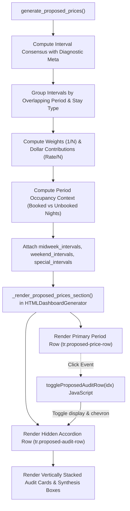

# Product Requirements Document (PRD)
# Interactive Audit UI for Proposed Prices (PMS Consensus Schedule)

**Document Filename:** `docs/proposed_rates_ui_for_audit_requirements.md`  
**Version:** 1.1.0  
**Status:** Approved for Implementation (Post-Grill Interview Alignment)  
**Target Asset:** Villa del Sol (Tempe, AZ — 6BR / 5BA Luxury Estate)  
**Author:** Antigravity (Pair Programming with Property Owner)  
**Date:** September 24, 2026  

---

## 1. Executive Summary & Context

The **STR Competitive Price Advisor** produces a synthesized, PMS-ready pricing schedule on the **Proposed Prices** tab (`docs/index.html`). This schedule maps forward-looking competitor market intelligence and backward-looking historical booking benchmarks into Kivoya / Streamline PMS seasonal rate periods (e.g., *February 2027*, *March 27*, *April 27*).

Currently, each seasonal rate period is rendered as a static table row displaying only the baseline rate and the final proposed rate (e.g., `Weekend: $1,492 → $1,836`). While the system arrives at this number through multi-step mathematical synthesis across individual unbooked stay intervals, the user lacks visibility into the constituent data points, their weighting, and the aggregation logic that produced the final recommendation.

This PRD specifies the functional, visual, and architectural requirements to transform the **Proposed Prices** table into an interactive audit interface. Clicking any period row expands an inline audit subtable directly beneath it, detailing every constituent stay interval, its market comp recommendation ($67\%$ weight), its historical track record benchmark ($33\%$ weight), its interval consensus rate, and its exact weight and dollar contribution to the period average.

Additionally, this release standardizes the Proposed Prices schedule strictly on the **arithmetic average (mean)** by fully deprecating and removing the legacy `[Average] [Median]` toggle buttons, bringing total coherence to interval weighting and dollar contributions.

---

## 2. Problem Statement & User Need

### 2.1 The "Black Box" Trust Barrier
- **Problem**: When a seasonal period shows a significant rate increase (e.g., February Weekend rising from \$1,272 to \$1,501, or March Weekend rising from \$1,492 to \$1,836), the property owner cannot immediately see *why* the price adjusted.
- **User Impact**: Without granular visibility into the underlying unbooked intervals and comp percentiles, the property owner cannot audit the recommendation or verify whether it was driven by high seasonal comp rates, lead-time strategy curves, or historical track records.
- **Objective**: Provide an intuitive, click-to-expand inline audit drawer for every rate period that makes the entire mathematical derivation 100% transparent and self-documenting.

### 2.2 Annoyance of Hover Tooltips
- **Problem**: Hover tooltips are fleeting, hard to read on touch devices, easily obscured by screen boundaries, and prone to accidental dismissal when attempting to inspect detailed multi-column data.
- **Objective**: Implement a persistent, inline expandable subtable (accordion row) modeled directly on the proven pattern of the *12-Month Dynamic Pricing Schedule* in the same dashboard.

### 2.3 Strict Arithmetic Mean Invariant & Immediate Median Toggle Deprecation
- **Context**: The existing UI includes a toggle between "Average" and "Median" suggestions. In revenue management and PMS seasonal rate setting, rate periods represent the arithmetic mean of their constituent unbooked intervals:
  $$\bar{P}_{\text{period}} = \text{round}\left(\frac{1}{N} \sum_{i=1}^N \text{Consensus}_i\right)$$
- **Problem**: A median toggle is mathematically incompatible with additive interval weights ($1/N$) and dollar contributions ($C_i$). Retaining a median toggle while the audit subtable explains the mean creates severe cognitive dissonance and confusion.
- **Requirement**: Deprecate and immediately remove the `[Average] [Median]` toggle from the Proposed Prices header in this release. Standardize the table, the *Copy Proposed Prices* button, and the audit subtable strictly on the arithmetic mean.

---

## 3. User Stories

- **US-1**: *As a property owner/revenue manager, I want to click any seasonal rate period row in the Proposed Prices schedule so that an inline audit subtable expands directly beneath it without reloading or leaving the page.*
- **US-2**: *As a property owner, I want the audit subtable to separate Midweek and Weekend stay intervals into vertically stacked cards so that I can independently evaluate the pricing logic for each stay type.*
- **US-3**: *As a property owner, I want to see every unbooked stay interval that falls into that period, including its check-in/check-out dates, nights, lead-time days, and strategy target percentile.*
- **US-4**: *As a property owner, I want to see the exact 2:1 synthesis breakdown for each interval: the Market Comp recommendation ($67\%$ weight with comp count $N$) and the Historical Benchmark ($33\%$ weight with past booking count $N$), leading to the interval's suggested price.*
- **US-5**: *As a property owner, I want each interval row to display its exact percentage weight in the period (e.g., $50.0\%$ for 1 of 2 intervals) and its dollar contribution to the period average.*
- **US-6**: *As a property owner, I want a summary box at the bottom of the audit drawer showing the mean interval rate, comparison against Kivoya's existing base rate, the 5% churn deadband rule evaluation, and the final proposed rate.*
- **US-7**: *As a property owner, I want periods with zero unbooked intervals to differentiate between 100% calendar occupancy (all dates reserved) and unbookable isolated gaps (<2-night minimum stay), holding rates firm at current base price.*
- **US-8**: *As a property owner, I want stay intervals that cross seasonal rate period boundaries (e.g. Feb 26 → Mar 2) to display a clear `⇄ Cross-Period` badge so I understand why they influence adjacent period averages.*
- **US-9**: *As a property owner, I want split-rate holidays (e.g. Holy Week) to show both Midweek and Weekend cards with their specific protective holiday floors and premiums clearly evaluated in the respective synthesis boxes.*
- **US-10**: *As a property owner, I want single-price holidays (e.g. Thanksgiving, Christmas & New Year) to display only evaluated weekend intervals in their table with a clear note explaining that midweek shoulder nights do not dilute holiday rates.*

---

## 4. Functional Requirements

### 4.1 Header Controls & Deprecation of Median Toggle
1. **Remove Median Selector**: The `Suggest: [Average] [Median]` toggle buttons must be completely removed from the Proposed Prices section header.
2. **Direct Display**: The Midweek, Weekend, and Special table columns directly display the arithmetic average recommendations (`midweek_avg`, `weekend_avg`, `special_avg`).
3. **Copy Button Parity**: The `copyProposedPrices()` function copies rates derived strictly from the arithmetic mean, ensuring zero modal divergence.
4. **Header Subtitle Update**: Update the section subtitle to accurately state:
   > *"Synthesizes competitive market recommendations (67% weight) with historical track record benchmarks (33% weight) across Kivoya seasonal rate periods. Rates adjust when sufficient market and historical evidence warrants change; unverified periods hold current base rates firm."*

#### 4.2 Row Interaction & Visual Affordances
1. **Clickable Row Target**: The entire period row (`tr.proposed-price-row`) must have `cursor: pointer;`, `role="button"`, `tabindex="0"`, `aria-expanded="false"`, and a subtle hover highlight (`background: rgba(56, 189, 248, 0.06);`).
2. **Expand/Collapse Chevron Mechanics**:
   - A chevron icon `<span id="prop-chevron-{idx}" class="prop-chevron">▶</span>` is rendered in the first column immediately preceding the date range.
   - Text content remains constant (`▶`); rotation is managed entirely via CSS transform for smooth animation (`transition: transform 0.2s ease;`).
   - When collapsed: icon displays pointing right (`transform: rotate(0deg); color: #60a5fa;`), `aria-expanded="false"`.
   - When expanded: icon points down (`transform: rotate(90deg); color: #38bdf8;`), `aria-expanded="true"`, and row border highlights (`border-left: 3px solid #38bdf8;`).
3. **Event Bubbling Guard**: The row click handler must inspect `event.target.closest('a, button, input')` and return early if an interactive child element was clicked, preventing accidental expansion when selecting text or clicking badges.
4. **Multi-Row Expansion**: Users must be able to expand multiple period rows simultaneously to compare adjacent months (e.g., expanding February and March side-by-side).
5. **Copy Schedule Integrity**: Expanding audit subtables must not interfere with the *Copy Proposed Prices* button. Audit accordion rows (`tr.proposed-audit-row`) must be excluded from clipboard copying.
6. **Open Calendar Filter Compatibility**: When `filterProposedOpenCalendar()` is toggled to hide closed-calendar periods, any open audit subtables for hidden rows must be automatically collapsed (`display: none`), their chevrons reset to 0deg, and `aria-expanded` reset to false.

---

### 4.3 Subtable Structure & Content

When a period row is expanded, an accordion row (`<tr id="prop-subtable-{idx}" class="proposed-audit-row">`) spans all table columns (`colspan="6"`).

The expanded drawer contains a responsive container (`<div class="proposed-audit-container">`) hosting vertically stacked audit cards wrapped in horizontal scroll containers (`overflow-x: auto;`) to prevent viewport clipping on mobile screens.

#### 4.3.1 Midweek Audit Section (when applicable)
Applies to regular periods and split-rate holidays having unbooked midweek stays (Sunday–Wednesday nights):
- **Section Header**: `☀️ Midweek Intervals (Sun–Wed Nights)` with badge showing count of constituent intervals (e.g., `2 Unbooked Intervals`).
- **Table Columns & Text Alignment**:
  1. **Stay Interval** (Left-aligned): `Check-in → Check-out` with stay length badge (e.g., `03/01 → 03/04 (3 nights)`). If the interval crosses a rate period boundary (starts before or ends after the period), display a `⇄ Cross-Period` pill badge.
  2. **Strategy Target** (Left-aligned): Lead time and target percentile from the 2D Strategy Matrix (e.g., `158d out • P67.5`).
  3. **Market Comps (67% Weight)** (Right-aligned, monospace): Recommended rate, active comp count $N$, and comp target effective rate (e.g., `$1,184 • N=70 comps`). If comps are missing, display fallback badge `— (0 comps • 0% weight)`.
  4. **Historical Benchmark (33% Weight)** (Right-aligned, monospace): Realized historical rate and sample count $N$ from past reservations (e.g., `$926 • 12 bookings`). If past bookings are missing, display fallback badge `— (No past bookings • 0% weight)`.
  5. **Interval Consensus Rate** (Right-aligned, monospace): Synthesized interval rate:
     $$\text{Consensus} = \text{round}(0.67 \cdot \text{Market} + 0.33 \cdot \text{History})$$
     (or 100% active single-source fallback when one source is missing; or base rate if both are absent).
  6. **Weight in Period** (Right-aligned, monospace): Percentage share of this interval in the period average:
     $$\text{Weight} = \frac{1}{N_{\text{intervals}}} \times 100\%$$
  7. **Contribution** (Right-aligned, monospace): Exact dollar value contributed to the period mean (cents precision):
     $$\text{Contribution} = \text{Consensus} \times \frac{1}{N_{\text{intervals}}}$$
- **Midweek Period Synthesis Box (4-State Display)**:
  - **State A (Rate Adjusted)**: $|\Delta| \ge 5\%$, operational floor satisfied:
    - Text: `Σ Contributions = $1,132 (Period Mean) vs. Kivoya Base $1,001 (Δ = +$131, +13.1%)`
    - Subtext (green): `✓ Exceeds 5% churn deadband → Rate adjusted to $1,132. Meets $300 Midweek Operational Floor.`
    - Badge: `Final Proposed: $1,132`
  - **State B (Held Firm by Churn Deadband)**: $|\Delta| < 5\%$:
    - Text: `Σ Contributions = $1,020 (Period Mean) vs. Kivoya Base $1,000 (Δ = +$20, +2.0%)`
    - Subtext (blue/slate): `ℹ️ Within 5% churn deadband (|Δ| = 2.0% < 5.0%) → Proposed rate held firm at $1,000 to prevent PMS update churn.`
    - Badge: `Final Proposed: $1,000 (Held Firm)`
  - **State C (Clamped by Operational Floor)**: Rate falls below \$300 Midweek / \$450 Weekend floor:
    - Text: `Σ Contributions = $280 (Period Mean) vs. Kivoya Base $280`
    - Subtext (amber): `⚠️ Calculated rate ($280) clamped to $300 by mandatory Midweek Operational Floor.`
    - Badge: `Final Proposed: $300 (Floor Applied)`
  - **State D (Dual Fallback / Unverified)**: 0 comps and 0 past bookings:
    - Text: `No verified market comps or historical bookings available for constituent dates.`
    - Subtext (slate): `🔒 Rate held firm at Kivoya Base ($1,001) due to absence of verified market evidence.`
    - Badge: `Final Proposed: $1,001 (Unverified Hold)`
  - For split-rate holidays, displays the protective holiday floor and premium rule:
    $$\text{Adjusted Rate} = \max(\text{Interval Mean}, \text{Holiday Midweek Floor}, \text{Standard Midweek} \times (1 + \text{Premium}))$$

#### 4.3.2 Weekend Audit Section (when applicable)
Applies to regular periods and split-rate holidays having unbooked weekend stays (Thursday–Saturday nights):
- **Section Header**: `🌙 Weekend Intervals (Thu–Sat Nights)` with badge showing count of constituent intervals.
- Follows the identical 7-column structure, right-aligned monospace numeric formatting, and 4-state synthesis trace as Midweek, verifying against the \$450 Weekend Operational Floor and split-holiday weekend protective floors/premiums when applicable.

#### 4.3.3 Special Event / Holiday Audit Section (for single-rate holidays)
Applies to single-price holiday periods (e.g., *Thanksgiving*, *Memorial Day*, *Christmas & New Year*):
- **Constituent Weekend Intervals Table**: Displays the weekend interval consensus derivations. Subheading note explicitly clarifies:
  > *"Evaluated Weekend Intervals (Midweek shoulder nights do not dilute single-rate holidays)"*
- **Midweek Shoulder Nights Notice**: If unbooked midweek intervals overlap the holiday date range, render a collapsed informational note:
  > `ℹ️ Notice: N unbooked midweek interval(s) overlap this holiday window. Per revenue strategy, single-rate holiday pricing is driven strictly by peak weekend market demand to prevent rate dilution.`
- **Holiday Rule Synthesis Box**:
  - Outlines the 3-way `max()` formula comparison:
    - Market Weekend Consensus (e.g. \$1,120)
    - Configured Holiday Floor (e.g. \$499)
    - Standard Weekend Benchmark + Premium (e.g. \$950 + 10% = \$1,045)
  - Displays the winning rate and justification banner:
    $$\text{Special Rate} = \max(\text{Calc Weekend Consensus}, \text{Holiday Floor}, \text{Standard Weekend} \times (1 + \text{Premium}))$$
  - Verifies 5% churn deadband and \$450 Weekend Operational Floor.

#### 4.3.4 Zero Unbooked Intervals & Calendar Occupancy Partitioning
To eliminate off-by-one errors and clarify night counting, stay nights in period $[b_{\text{dt}}, e_{\text{dt}}]$ are strictly defined as:
$$\text{Stay Nights} = \{d \in \text{Calendar Dates} \mid b_{\text{dt}} \le d < e_{\text{dt}}\}$$
*(The checkout date $e_{\text{dt}}$ is not a stay night in period $[b_{\text{dt}}, e_{\text{dt}}]$, as guests check out that morning).*

Day-of-week partitions:
- **Midweek Nights**: $d.\text{weekday()} \in \{6, 0, 1, 2\}$ (Sunday, Monday, Tuesday, Wednesday nights).
- **Weekend Nights**: $d.\text{weekday()} \in \{3, 4, 5\}$ (Thursday, Friday, Saturday nights).

Metrics computation:
- $N_{\text{eligible}}$: Total stay nights of that stay type in $\{d \mid b_{\text{dt}} \le d < e_{\text{dt}}\}$.
- $N_{\text{booked}}$: Total stay nights of that stay type occupied by reservations in `blocked_periods`.
- $N_{\text{unbooked}}$: Count of unbooked segments generated by `CalendarSegmenter` overlapping the period.

Classification rules:
1. **Case 1: 100% Calendar Occupancy** ($N_{\text{unbooked}} = 0$, $N_{\text{eligible}} > 0$, and $N_{\text{booked}} = N_{\text{eligible}}$):
   - Renders a styled occupancy banner:
     > 🔒 **100% Calendar Occupancy**: All weekend dates in this rate period are currently reserved on Villa del Sol's calendar. No unbooked market intervals exist to evaluate. Proposed rate is held firm at the current Kivoya base rate (**\$599**).
2. **Case 2: No Bookable Intervals** ($N_{\text{unbooked}} = 0$, $N_{\text{eligible}} > 0$, and $N_{\text{booked}} < N_{\text{eligible}}$):
   - Renders an unbookable gap notice:
     > 🔒 **No Bookable Intervals**: Remaining open calendar dates in this period do not meet the 2-night minimum stay requirement. Proposed rate is held firm at the current Kivoya base rate (**\$599**).
3. **Case 3: Non-Applicable Stay Type** ($N_{\text{eligible}} = 0$):
   - Period contains zero calendar nights of that stay type (e.g. a Thursday–Sunday holiday has no midweek nights). The card is completely omitted.

---

## 5. Architectural & Technical Specifications



### 5.1 Engine Data Model Extensions (`src/proposed_prices.py`)

1. **`compute_interval_consensus(segment, comp_weight=None, historical_weight=None)`**:
   Ensure each interval consensus object includes diagnostic properties:
   ```python
   {
       "check_in": str,                     # e.g. "2027-03-05"
       "check_out": str,                    # e.g. "2027-03-08"
       "nights": int,                       # e.g. 3
       "segment_type": "midweek" | "weekend",
       "lead_days": int,                    # Lead-time days out from reference_date
       "target_pct": float,                 # 2D Strategy Matrix target (e.g. 85.0)
       "base_rate": int,                    # Existing Kivoya base nightly rate
       "market_rec": Optional[int],         # Recommended rate from comp percentiles ($1,850)
       "n_comps": int,                      # Number of active, valid comps (e.g. 70)
       "comp_target_effective": float,      # Target effective comp rate
       "hist_med": Optional[int],           # Historical benchmark rate ($1,807)
       "hist_cnt": int,                     # Sample count of past bookings (e.g. 12)
       "comp_weight": float,                # 0.67 (or 1.0 if zero history fallback)
       "hist_weight": float,                # 0.33 (or 0.0 if zero history fallback)
       "is_fallback": bool,                 # True if single-source fallback
       "fallback_reason": Optional[str],    # "No past bookings" or "0 comps"
       "consensus_rate": int,               # Final interval rate ($1,836)
       "status": "INCREASE" | "DECREASE" | "HOLD",
       "zero_history": bool,                # Preserved for backward compatibility
   }
   ```

2. **`generate_proposed_prices(...)`**:
   Attach constituent interval lists and occupancy metrics to each period dictionary:
   ```python
   period_dict["midweek_intervals"] = [...]
   period_dict["weekend_intervals"] = [...]
   period_dict["special_intervals"] = [...]
   period_dict["midweek_unbooked_count"] = int
   period_dict["weekend_unbooked_count"] = int
   period_dict["midweek_booked_nights"] = int
   period_dict["weekend_booked_nights"] = int
   period_dict["midweek_total_nights"] = int
   period_dict["weekend_total_nights"] = int
   period_dict["is_midweek_fully_booked"] = bool
   period_dict["is_midweek_no_intervals"] = bool
   period_dict["is_weekend_fully_booked"] = bool
   period_dict["is_weekend_no_intervals"] = bool
   ```

### 5.2 HTML Generator Extensions (`src/html_generator.py`)

1. **Header Cleanup**: Delete `btnSuggestAvg` and `btnSuggestMed` markup and remove `setProposedRateMode` JavaScript function.
2. **Primary Period Row (`tr.proposed-price-row`)**:
   - Add `onclick="toggleProposedAuditRow('{idx}')"`
   - Add rotating chevron container `<span id="prop-chevron-{idx}" class="prop-chevron">▶</span>` in the Dates column.
3. **Accordion Subtable Row (`tr.proposed-audit-row`)**:
   - `id="prop-subtable-{idx}"`, `class="proposed-audit-row"`, `style="display:none;"`
   - Spans all 6 table columns (`colspan="6"`).
4. **Client-Side Scripting (`toggleProposedAuditRow`)**:
   ```javascript
   function toggleProposedAuditRow(idx, event) {
     if (event && event.target && event.target.closest('a, button, input')) {
       return;
     }
     const subtable = document.getElementById('prop-subtable-' + idx);
     const chevron = document.getElementById('prop-chevron-' + idx);
     const row = document.getElementById('prop-row-' + idx);
     if (!subtable) return;

     const isExpanded = subtable.style.display !== 'none';
     if (isExpanded) {
       subtable.style.display = 'none';
       if (chevron) {
         chevron.style.transform = 'rotate(0deg)';
         chevron.style.color = '#60a5fa';
       }
       if (row) {
         row.classList.remove('expanded');
         row.setAttribute('aria-expanded', 'false');
       }
     } else {
       subtable.style.display = 'table-row';
       if (chevron) {
         chevron.style.transform = 'rotate(90deg)';
         chevron.style.color = '#38bdf8';
       }
       if (row) {
         row.classList.add('expanded');
         row.setAttribute('aria-expanded', 'true');
       }
     }
   }
   ```
5. **Calendar Filter Scripting**: Update `filterProposedOpenCalendar()` so that when a closed-calendar row is hidden, its corresponding `prop-subtable-{idx}` is also hidden, chevron reset to `rotate(0deg)`, and `aria-expanded` set to `false`.

---

## 6. Verification & Testing Strategy

### 6.1 Automated Unit Tests (`tests/test_proposed_prices.py`)
1. `test_generate_proposed_prices_attaches_audit_intervals()`: Verify that returned period dictionaries contain `"midweek_intervals"` and `"weekend_intervals"` with all required diagnostic properties (`lead_days`, `target_pct`, `n_comps`, `hist_cnt`, `comp_weight`, `hist_weight`, `weight_pct`, `dollar_contribution`, `is_cross_period`).
2. `test_period_weights_sum_to_100_percent()`: Verify that for every period with unbooked intervals, $\sum W_i = 100.0\%$.
3. `test_dollar_contributions_sum_to_mean()`: Verify that $\sum C_i$ matches `midweek_avg` and `weekend_avg` within rounding tolerance ($\le \$0.50$).
4. `test_single_source_fallback_diagnostic_tags()`: Verify that when comps or history are absent, `is_fallback` is True and the active source carries `1.0` weight.

### 6.2 Automated UI Tests (`tests/test_html_dashboard_ui.py`)
1. `test_proposed_prices_has_expandable_audit_subtables()`: Verify that each period row has a corresponding `prop-subtable-{idx}` element and chevron icon.
2. `test_toggle_proposed_audit_row_script_present()`: Verify that `toggleProposedAuditRow` function with event bubbling guard is embedded in the generated HTML.
3. `test_median_toggle_deprecated_and_removed()`:
   - Update lines 153–160 (Playwright interactive toggle clicks) and lines 255–256 (`self.assertIn('id="btnSuggestAvg"', ...)`) to assert `assertNotIn('id="btnSuggestAvg"', ...)` and `assertNotIn('id="btnSuggestMed"', ...)`.
   - Add Playwright interaction test verifying that clicking a period row expands `prop-subtable-{idx}`.
4. `test_audit_subtable_displays_67_33_columns()`: Verify that `Market Comps (67% Weight)` and `Historical Benchmark (33% Weight)` headers are rendered in subtable cards.
5. `test_copy_proposed_prices_excludes_audit_rows()`: Verify that `copyProposedPrices` queries `.proposed-price-row` and ignores `.proposed-audit-row`.

### 6.3 Manual End-to-End Verification
1. Regenerate `docs/index.html` via `.venv/bin/python -m src.cli generate-html`.
2. Click period rows across different seasons:
   - **March 2027**: Verify unbooked Spring Training weekends expand showing 85th percentile comps, historical track record, and the exact derivation of \$1,836.
   - **November 2026**: Verify that weekend section displays the 100% booked notice while midweek displays the constituent intervals held by the 5% churn deadband.
   - **Christmas & New Year 2026**: Verify the holiday breakdown explaining the reduction from \$1,860 to \$1,251.
   - **Holy Week 2027**: Verify the split-pricing holiday audit cards showing independent midweek and weekend protective floors and premiums.
3. Test responsiveness on desktop and mobile viewports.
