# Villa del Sol Review Scraping Engine
**Technical Architecture & Detailed Design Specification**  
`review_scraping_engine_design.md`

---

## 1. Architectural Overview & Component Topology

The **Review Scraping Engine** provides autonomous, resilient, and stealthy synchronization of platform reputation data across Airbnb, VRBO, Booking.com, and Kivoya Direct. It bridges the gap between aggregate platform scorecards and the full historical review archive by introducing automated browser control, network request interception, review modal pagination, and atomic JSON persistence.

```mermaid
flowchart TD
    subgraph CLI_Layer ["CLI & Trigger Layer (src/cli.py)"]
        CLI["src.cli sync-ratings<br>Flags: --platform, --backfill, --force, --headless, --dry-run"]
    end

    subgraph Proxy_Layer ["Proxy Infrastructure (src/stealth_connection.py)"]
        ProxyMgr["StealthConnectionManager"]
        LA_Bridge["pproxy: LA Hub (Airbnb)<br>los-angeles.us.socks.nordhold.net:1080"]
        DAL_Bridge["pproxy: Dallas Hub (VRBO)<br>dallas.us.socks.nordhold.net:1080"]
        SF_Bridge["pproxy: SF Hub (Booking)<br>san-francisco.us.socks.nordhold.net:1080"]
    end

    subgraph Ingestion_Engine ["Ingestion Engine (src/ratings_collector.py)"]
        Collector["RatingsCollector"]
        PW_Runner["Playwright Browser Engine<br>(Chromium Headless / Leased Proxies)"]
        KV_Client["Kivoya Direct Client<br>(Streamline REST API + SSL Context)"]

        subgraph Interceptors ["Network Interception & DOM Parsers"]
            AB_Parser["Airbnb GraphQL Interceptor<br>(StayProductDetailPage / PdpReviews)"]
            VR_Parser["VRBO Apollo Interceptor<br>(propertyReviewSummary / reviewList)"]
            BK_Parser["Booking.com Review Parser<br>(Pros/Cons pairing / Sub-scores)"]
            KV_Parser["Streamline VRS Feedback Parser<br>(GetAllFeedback response)"]
        end

        Deduplicator["MD5 Deduplicator & In-Place Host Response Merger"]
    end

    subgraph Storage_And_Presentation ["Persistence & Presentation"]
        MasterDB[("data/ratings_reviews.json<br>(141+ Reviews Master Record)")]
        HTMLGen["HTML Dashboard Generator<br>(src/html_generator.py)"]
        Dashboard["Static Dashboard<br>(docs/index.html)"]
    end

    CLI -->|Initialize & Lease Proxies| ProxyMgr
    ProxyMgr --> LA_Bridge
    ProxyMgr --> DAL_Bridge
    ProxyMgr --> SF_Bridge

    CLI -->|Execute sync_all(backfill)| Collector
    Collector -->|Route corridor proxy| PW_Runner
    Collector -->|Direct HTTPS with CA certs| KV_Client

    PW_Runner -->|Intercept| AB_Parser
    PW_Runner -->|Intercept| VR_Parser
    PW_Runner -->|Intercept| BK_Parser
    KV_Client -->|Parse| KV_Parser

    AB_Parser --> Deduplicator
    VR_Parser --> Deduplicator
    BK_Parser --> Deduplicator
    KV_Parser --> Deduplicator

    Deduplicator -->|Atomic Write| MasterDB
    MasterDB -->|Ingest| HTMLGen
    HTMLGen -->|Render 11 Tabs| Dashboard
```

---

## 1.1 Confirmed Architectural Decisions from `/grill-me` Alignment

Following the interactive `/grill-me` design interview, all architectural trade-offs and design questions were formally resolved:

1. **Shared Chromium Browser with Isolated Contexts (`FR-ORCH-01`)**:
   - Rather than launching 3 separate browser processes, the engine launches a **single Playwright Chromium instance** and spawns isolated `BrowserContext` objects per platform, each configured with its designated corridor proxy (`feeder-sf-1` for Airbnb, `feeder-dal-1` for VRBO, `feeder-chi-1` for Booking.com). Kivoya Direct executes direct HTTPS without a browser context.
   - Total memory footprint is contained to $\le 350\text{MB}$ with $< 1\text{s}$ startup overhead.
2. **Transparent Corridor Proxy Failover & AFRINIC Exclusion (`FR-PRX-04`)**:
   - Hosts resolving to AFRINIC subnets (`feeder-la-1`, `feeder-la-2`, `feeder-atl-1`) are permanently purged because their South African IP allocations trigger automatic `airbnb.co.za` redirects and bot walls.
   - Designated regional corridors route through verified US datacenter nodes: Airbnb -> San Francisco (`feeder-sf-1`), VRBO -> Dallas (`feeder-dal-1`), Booking.com -> Chicago (`feeder-chi-1`). If a designated regional node fails pre-flight checks or is unreachable, the engine transparently hot-swaps to an active standby endpoint from `proxy_mgr.endpoints` (e.g., New York or US Anycast) while maintaining strict out-of-state Zero Phoenix compliance.
3. **Incremental Early Stopping & Modal Sort Order (`FR-DAT-03`)**:
   - In daily incremental sync, the review modal attempts to select "Most recent" sorting if present (`button:has-text("Most recent")`). Pagination terminates as soon as 3 consecutive reviews match existing records in `data/ratings_reviews.json` with identical host replies. If sorting cannot be modified, incremental pagination is bounded to at most 1–2 scroll batches.
4. **Kivoya Direct Ingestion Priority (`FR-KV-01`–`03`)**:
   - Direct Streamline REST POST (`GetAllFeedback`) is executed first via resilient CA SSL context (`certifi.where()` with fallback to unverified context for macOS Python), completing in $\approx 300\text{ms}$. Playwright AngularJS scope evaluation is invoked strictly as a fallback if the REST query fails or returns 0 reviews.
5. **Dry-Run Full Preview Mode (`FR-CLI-01`)**:
   - `--dry-run` performs live crawling through leased proxies and prints a rich terminal preview table showing parsed scorecards, newly detected reviews, and in-place host response changes, while strictly skipping disk writes to `data/ratings_reviews.json` and skipping HTML regeneration.
6. **Zero-Sleep Test Verification Protocol (`NFR-TEST-01`, `SEC-01`)**:
   - Mock fixtures are established under `tests/fixtures/` (`mock_airbnb_graphql.json`, `mock_vrbo_apollo.json`, `mock_booking_dom.html`, `mock_kivoya_feedback.json`) and executed with `stealth_delay = 0.0`, guaranteeing the complete collector and CLI test suites execute in $< 2.0\text{s}$ prior to dispatching the mandatory 2-round subagent code review.

---

## 2. End-to-End Execution Sequence Flow

The following sequence details how the CLI orchestrates proxy leasing, browser launching, network interception, modal scrolling, and persistence:

```mermaid
sequenceDiagram
    autonumber
    actor UserOrCron as User / Daily launchd
    participant CLI as src.cli (sync-ratings)
    participant Proxies as StealthConnectionManager
    participant Collector as RatingsCollector
    participant Browser as Playwright Chromium
    participant Channel as Booking Platform (AB / VR / BK)
    participant JSON as data/ratings_reviews.json
    participant HTML as HTMLDashboardGenerator

    UserOrCron->>CLI: sync-ratings --backfill --platform all [--dry-run]
    CLI->>Proxies: start_pool(num_workers=3, servers=Corridors, wait_for_full_pool=False, min_healthy=1)
    Note over Proxies: Transparent candidate failover if primary hub down
    Proxies-->>CLI: Leased endpoints (SF:56301, DAL:56302, CHI:56303)
    CLI->>Collector: sync_all(platforms, backfill=True, dry_run=args.dry_run)

    rect rgb(20, 30, 48)
        note over Collector,Channel: Concurrent Multi-Platform Crawling (asyncio.gather)
        Collector->>Browser: Launch Chromium contexts via leased corridor proxies
        Collector->>Browser: context.new_page() + attach page.on('response', handle_json)
        Collector->>Browser: page.goto('https://www.airbnb.com/rooms/573857947793833342')
        Channel-->>Browser: Initial PDP GraphQL (StayProductDetailPage)
        Browser->>Collector: Intercepted aggregate metrics & sub-scores

        opt Backfill Mode Active
            Collector->>Browser: Click 'Show all reviews' modal button
            loop Dual-Condition Scroll Pagination (Count reach or 3 stalls, max 30 cycles)
                Collector->>Browser: Scroll modal panel by 1200px
                Channel-->>Browser: PdpReviews GraphQL batch (offset N)
                Browser->>Collector: Intercepted review batch items
            end
        end
    end

    Collector->>Collector: parse_data(payloads)
    Collector->>Collector: compute_review_id() for all reviews
    Collector->>Collector: merge_channel_data() (in-place host response update)
    Collector->>Collector: recalculate_recency(cutoff_days=30)
    
    alt dry_run == False
        Collector->>JSON: Atomic persist data/ratings_reviews.json
        JSON-->>Collector: Saved successfully
    else dry_run == True
        Collector-->>Collector: Skip disk persistence (Full Preview Mode)
    end

    Collector-->>CLI: Sync summary (4 platforms, N new reviews)
    CLI->>Proxies: stop_pool()
    Proxies-->>CLI: All pproxy forwarders terminated

    alt dry_run == False and not no_dashboard
        CLI->>HTML: generate()
        HTML->>UserOrCron: docs/index.html updated with complete review archive
    else dry_run == True
        CLI->>UserOrCron: Print rich terminal preview table (No disk writes)
    end
```



---

## 3. Class & Module Architecture (`src/ratings_collector.py`)

### 3.1 Class Interface & Attributes

```python
class RatingsCollector:
    """
    Multi-channel ratings and reviews ingestion engine.
    Orchestrates stealth proxy leasing, headless Playwright response interception,
    Streamline API querying, and incremental deduplication.
    """

    CHANNELS: Dict[str, Dict[str, Any]] = {
        "airbnb": {
            "platform_id": "airbnb",
            "display_name": "Airbnb",
            "url": "https://www.airbnb.com/rooms/573857947793833342",
            "proxy_hub": "feeder-sf-1",
            "scale": "5.0",
            "rating_max": 5.0,
        },
        "vrbo": {
            "platform_id": "vrbo",
            "display_name": "VRBO",
            "url": "https://www.vrbo.com/2685684",
            "proxy_hub": "feeder-dal-1",
            "scale": "10.0",
            "rating_max": 10.0,
        },
        "booking": {
            "platform_id": "booking",
            "display_name": "Booking.com",
            "url": "https://www.booking.com/hotel/us/villa-del-sol-amazing-house-by-kivoya.html",
            "proxy_hub": "feeder-chi-1",
            "scale": "10.0",
            "rating_max": 10.0,
        },
        "kivoya": {
            "platform_id": "kivoya",
            "display_name": "Kivoya Direct",
            "url": "https://www.kivoya.com/503802/",
            "proxy_hub": None,
            "scale": "5.0",
            "rating_max": 5.0,
        },
    }

    def __init__(
        self,
        db_path: Path = Path("data/ratings_reviews.json"),
        proxy_mgr: Optional[Any] = None,
        headless: bool = True,
        recent_window_days: int = 30,
        stealth_delay: float = 0.0,
    ):
        self.db_path = Path(db_path)
        self.proxy_mgr = proxy_mgr
        self.headless = headless
        self.recent_window_days = recent_window_days
        self.stealth_delay = stealth_delay
        self.data: Dict[str, Any] = self.load_database()
```

---

## 4. Platform Crawling & Interception Logic

### 4.1 Airbnb Playwright Crawler (`_scrape_airbnb_live`)

Airbnb employs Apollo/GraphQL with dynamic query hashing. The scraper uses network interception as its primary channel with DOM fallback:

1. **Response Interception**:
   - Register listener: `page.on("response", self._handle_airbnb_response)`.
   - Filter criteria:
     ```python
     if "/api/v3/" in response.url or "/graphql" in response.url:
         try:
             json_data = await response.json()
             # Inspect for StayProductDetailPage or PdpReviews
             if "StayProductDetailPage" in str(json_data) or "PdpReviews" in str(json_data):
                 self.captured_airbnb_payloads.append(json_data)
         except Exception:
             pass
     ```
2. **Page Navigation**:
   - `await page.goto(url, wait_until="domcontentloaded", timeout=25000)`
   - Inject human-like mouse wiggle or subtle scroll ($200\text{px}$) to trigger lazy hydration.
3. **Review Modal Interaction**:
   - Trigger selector: `button[data-testid*="pdp-show-all-reviews-button"], button:has-text("Show all")`.
   - If present, `await button.click()`.
   - Wait for modal panel selector: `div[data-testid="pdp-reviews-modal-scrollable-panel"], div[role="dialog"]`.
4. **Backfill Pagination Loop & Dual-Condition Bounding**:
   - When `backfill=True`:
     ```python
     modal = await page.query_selector('div[data-testid="pdp-reviews-modal-scrollable-panel"]')
     last_count = len(self.extracted_reviews)
     consecutive_stalls = 0
     scroll_cycles = 0
     max_scroll_cycles = 30  # Hard safety cap (60s max per platform)

     while consecutive_stalls < 3 and scroll_cycles < max_scroll_cycles:
         scroll_cycles += 1
         if modal:
             await modal.evaluate("el => el.scrollTop += 1500")
         else:
             await page.mouse.wheel(0, 1500)
         await page.wait_for_timeout(self.stealth_delay * 1000 or 500)

         # Check if new reviews arrived
         curr_count = self._count_captured_reviews("airbnb")
         # Condition 1: Terminate if announced aggregate review count reached
         if announced_review_count > 0 and curr_count >= announced_review_count:
             logger.info(f"Captured all {curr_count}/{announced_review_count} reviews; terminating modal pagination.")
             break
         # Condition 2: Track stalled scrolls
         if curr_count > last_count:
             last_count = curr_count
             consecutive_stalls = 0
         else:
             consecutive_stalls += 1
     ```

### 4.2 VRBO Playwright Crawler (`_scrape_vrbo_live`)

VRBO (Expedia Partner Central / Apollo) uses GraphQL and JSON-LD schema:

1. **Response Interception**:
   - Filter responses matching `*graphql*` or containing `propertyReviewSummary`, `reviewList`, or `PropertyReviewsQuery`.
2. **DOM Scorecard & Badge Fallback**:
   - Extract native 10.0 scale rating:
     - Regex on rendered header: `(\d+(?:\.\d+)?)\s*/\s*10(?:\.0)?\s*(?:Loved by Guests|Exceptional|Wonderful)`.
   - Check for `"Loved by Guests"` badge:
     - Extract subtitle `Top (\d+%) of guest reviews in this area`.
3. **Reviews List Extraction**:
   - Parse author, submission date, headline, body text, and management response.

### 4.3 Booking.com Playwright Crawler (`_scrape_booking_live`)

1. **Page Structure**:
   - Booking renders reviews under the `#reviews-tab` container and review blocks (`.c-review-block`).
2. **Review Data Extraction**:
   - **Reviewer**: `.bui-avatar-block__title` (name) and `.bui-avatar-block__subtitle` (country).
   - **Score**: `.bui-review-score__badge` (native 10.0 scale, e.g. `9.0`).
   - **Date**: Extract from `.c-review-block__date`.
   - **Feedback Pairing**: Concatenate positive remarks (`.c-review__row--positive`) and negative remarks (`.c-review__row--negative`).
   - **Host Response**: Extract `.c-review-block__response`.

### 4.4 Kivoya Direct REST Client (`_scrape_kivoya_direct`)

1. **SSL Context Resilience**:
   ```python
   ctx = ssl.create_default_context()
   try:
       import certifi
       ctx.load_verify_locations(certifi.where())
   except Exception:
       ctx = ssl._create_unverified_context()
   ```
2. **Direct REST Query**:
   ```python
   params = json.dumps({
       "methodName": "GetAllFeedback",
       "params": {
           "unit_id": "503802",
           "show_booking_dates": 1,
           "madetype_id": 2
       }
   })
   url = f"https://www.kivoya.com/wp-admin/admin-ajax.php?action=streamlinecore-api-request&params={urllib.parse.quote(params)}"
   req = urllib.request.Request(url, headers={"User-Agent": "Mozilla/5.0 ..."})
   with urllib.request.urlopen(req, timeout=12, context=ctx) as resp:
       data = json.loads(resp.read().decode("utf-8"))
   ```
3. **Playwright Fallback**:
   If the REST query returns empty or encounters errors, launch Chromium to load `https://www.kivoya.com/503802/` and evaluate `angular.element('#property-reviews').scope().reviews`.

---

## 5. Deduplication, State Management & Merging

### 5.1 Deterministic Review ID
Each review receives a 32-character hexadecimal MD5 hash:
$$\text{ReviewID} = \text{MD5}(\text{platform} + \text{author} + \text{date} + \text{body}[:60])$$

### 5.2 In-Place Host Response Merging Algorithm
```python
def merge_reviews(existing_reviews: List[Dict[str, Any]], new_reviews: List[Dict[str, Any]]) -> int:
    existing_map = {r["id"]: r for r in existing_reviews}
    added_count = 0

    for new_r in new_reviews:
        r_id = new_r["id"]
        if r_id in existing_map:
            # Review already exists: check if host response needs updating
            cur_r = existing_map[r_id]
            if not cur_r.get("host_response") and new_r.get("host_response"):
                cur_r["host_response"] = new_r["host_response"]
                logger.info(f"Updated in-place host response for review {r_id} ({new_r['reviewer_name']})")
        else:
            # Truly new review
            existing_reviews.append(new_r)
            existing_map[r_id] = new_r
            added_count += 1

    # Re-sort descending by date
    existing_reviews.sort(key=lambda x: str(x.get("date") or ""), reverse=True)
    return added_count
```

### 5.3 Atomic Database Persistence
To prevent race conditions and file corruption during concurrent operations:
```python
def save_database(self):
    self.recalculate_recency()
    self.data["last_updated"] = datetime.now().astimezone().isoformat()
    temp_path = self.db_path.with_suffix(".tmp")
    temp_path.write_text(json.dumps(self.data, indent=2, ensure_ascii=False), encoding="utf-8")
    temp_path.replace(self.db_path)
```

---

## 6. CLI Orchestration (`src/cli.py`)

The CLI `sync-ratings` subcommand manages proxy leasing, execution, and dashboard generation:

```python
def run_sync_ratings(args):
    """Scrape and synchronize ratings and reviews across channels with proxy lifecycle."""
    from src.ratings_collector import RatingsCollector
    from src.stealth_connection import StealthConnectionManager
    from src.html_generator import HTMLDashboardGenerator

    proxy_mgr = StealthConnectionManager(required=not (args.platform == "kivoya"))
    collector = RatingsCollector(
        proxy_mgr=proxy_mgr,
        headless=args.headless,
    )
    platforms = None if args.platform == "all" else [args.platform]

    print(f"⭐ Synchronizing ratings and reviews for: {args.platform} (backfill={args.backfill}, dry_run={args.dry_run})...")

    async def _execute_sync():
        try:
            # Lease proxies if external OTA platforms are targeted with candidate failover
            if not args.platform == "kivoya":
                corridors = [
                    ("feeder-sf-1", "San Francisco, CA", "san-francisco.us.socks.nordhold.net:1080"),
                    ("feeder-dal-1", "Dallas, TX", "dallas.us.socks.nordhold.net:1080"),
                    ("feeder-chi-1", "Chicago, IL", "chicago.us.socks.nordhold.net:1080"),
                ]
                await proxy_mgr.start_pool(
                    num_workers=3,
                    servers=corridors,
                    wait_for_full_pool=False,
                    min_healthy=1,
                )
            return await collector.sync_all(
                platforms=platforms,
                force=args.force,
                backfill=args.backfill,
                dry_run=args.dry_run,
            )
        finally:
            await proxy_mgr.stop_pool()

    summary = asyncio.run(_execute_sync())

    # Format rich terminal summary
    print(f"\n📊 Synchronization Summary (backfill={args.backfill}):")
    for p_id, res in summary.get("channels", {}).items():
        if isinstance(res, dict):
            status = res.get("status", "ok")
            rating = res.get("rating")
            cnt = res.get("review_count", 0)
            added = res.get("new_reviews_added", 0)
            print(f"  • {p_id.title():<14}: Rating={rating} ({cnt} reviews, +{added} new) [{status}]")

    if args.dry_run:
        print("\n🔍 DRY RUN: Previewed extracted metrics and new reviews. No files written to disk. Dashboard generation skipped.")
        return

    if not args.no_dashboard:
        print("🎨 Regenerating HTML dashboard with updated reviews...")
        html_gen = HTMLDashboardGenerator(output_path="docs/index.html")
        html_gen.generate()
        print("✅ Dashboard updated at docs/index.html")
```

---

## 7. Fast Testing & Zero-Sleep Verification Strategy

In compliance with the **Zero-Sleep Test Environment Invariant**:
1. **Mocked Response Fixtures**:
   - `tests/fixtures/mock_airbnb_graphql.json` (contains `StayProductDetailPage` and `PdpReviews`).
   - `tests/fixtures/mock_vrbo_apollo.json` (contains `propertyReviewSummary` and `reviewList`).
   - `tests/fixtures/mock_booking_dom.html` (contains `.c-review-block` elements).
   - `tests/fixtures/mock_kivoya_feedback.json` (contains `GetAllFeedback` response).
2. **Zero-Sleep Delay Invariants**:
   - In all unit tests, `collector.stealth_delay = 0.0`.
   - Playwright context is mocked using `unittest.mock.AsyncMock` so tests execute in $< 0.2\text{s}$ per method.
3. **Full Test Coverage**:
   - `test_airbnb_live_interception`: Validates GraphQL response capture and pagination.
   - `test_vrbo_apollo_interception`: Validates 10.0 scale and Loved by Guests badge capture.
   - `test_booking_parsing_and_pairing`: Validates pros/cons comment pairing.
   - `test_kivoya_ssl_resilience`: Validates SSL context fallback and REST parsing.
   - `test_backfill_vs_incremental_stopping`: Validates early stopping on known reviews vs full backfill traversal.
   - `test_in_place_host_response_merging`: Validates host response update without review record duplication.
   - `test_cli_sync_ratings_dry_run`: Validates `--dry-run` prints summary and does not modify disk.
   - `test_cli_sync_ratings_proxy_lifecycle`: Validates proxy pool start and stop in `finally` block.

---

## 8. Implementation Phasing & Verification Protocol

1. **Phase 1: Zero-Sleep Unit Testing**: All scrapers, mock fixtures, and proxy lifecycle managers are implemented and verified completely offline using mocks with $< 2.0\text{s}$ runtime.
2. **Phase 2: Mandatory Subagent Code Review**: Execute a minimum of 2 clean-context review cycles (`Role: "Code Reviewer Round 1"` and `Role: "Code Reviewer Round 2"`).
3. **Phase 3: Optional On-Demand Live Backfill**: Once verified, prompt the user with the option to execute a live multi-channel `--backfill` run with active NordVPN forwarders.

---

## 9. Harvest Completeness Ratio & Granular Channel Status

To eliminate "silent failure" where a channel reports `[ok]` because overall metadata was scraped despite missing 90%+ of historical review texts, the engine implements a formal **Harvest Completeness Ratio**:

$$\text{Harvest Ratio} = \frac{\text{len}(\text{stored\_reviews\_for\_platform})}{\max(\text{announced\_review\_count}, 1)}$$

### Status Taxonomy
| Status Code | Description | Criteria |
| :--- | :--- | :--- |
| `ok` | Fully Healthy & Harvested | Overall rating captured AND $\text{Harvest Ratio} \ge 90\%$. |
| `partial_harvest` | Partial Review Harvest | Overall rating captured, but $0\% < \text{Harvest Ratio} < 90\%$. |
| `metadata_only` | Scorecard Only | Overall rating captured, but $0$ review bodies collected when announced count $> 0$. |
| `stale_error` | Scrape Interrupted / Blocked | Network timeout, bot challenge, or unhandled exception during crawl. |

---

## 10. Strict CLI Reporting & Mandatory Verification Invariant

### A. Truthful Summary Headlines
The CLI summary line reflects actual harvest state:
- `✅ Full Sync Complete`: 100% of platforms are `ok` with full review text coverage.
- `⚠️ Partial Sync`: When any platform is in `partial_harvest`, `metadata_only`, or `stale_error`.
- `❌ Sync Failed`: When critical platforms fail completely.

### B. Strict Exit Codes (`--strict`)
In `--strict` mode or whenever any platform enters `stale_error`, the CLI process exits with non-zero return code `1` to prevent automated scripts and CI/CD pipelines from mistaking partial failure for success.

### C. Mandatory Post-Scrape Verification Invariant
Every live scraping run executes an automated post-verification assertion:
1. Total review record count in `data/ratings_reviews.json` must be non-empty and non-decreasing.
2. The terminal summary outputs an explicit count delta (`+X new reviews persisted`).
3. Stored review count per platform is audited against announced count.


