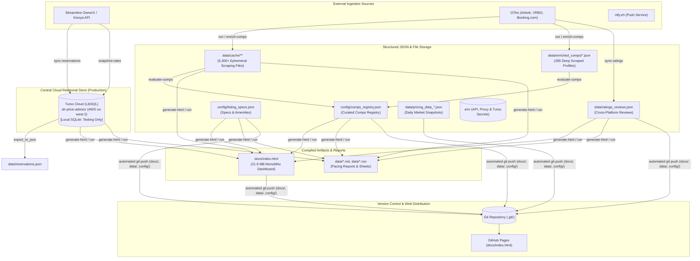
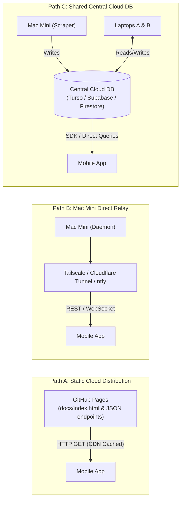

# STR Price Advisor: Data Storage Architecture & Multi-Device Concurrency Analysis

This document provides a comprehensive technical audit of all data storage mechanisms, files, databases, registries, and caches in the **STR Competitive Price Advisor** system for **Villa del Sol** (Tempe, AZ). 

It catalogues what data is stored in each location, which CLI commands and background scripts read and write there, how data flows across the system today, and analyzes the architectural requirements for enabling parallel, multi-device operation across **at least three Mac computers** (one dedicated Mac Mini + two contributor laptops) and a **mobile application**.

---

## 1. Executive Summary & Problem Context

### 1.1 The Multi-Device Operational Challenge
The STR Price Advisor originally operated on a **single dedicated host** (an Apple Silicon Mac Mini) with unversioned local SQLite files (`data/reservations.db`). 

To support **multiple active contributor workstations** (two laptops + the Mac Mini) and a **mobile client**, the relational data store has been **fully migrated to Turso Cloud (LibSQL)**. Production data—including historical reservations, competitor sales detections, sync logs, and published rate snapshots—now resides centrally in the cloud on AWS us-west-2 (`libsql://str-price-advisor-ivanpenkov.aws-us-west-2.turso.io`). 

**SQLite is now strictly reserved for hermetic unit testing and offline development** (via `USE_LOCAL_SQLITE=1`). Any Mac computer with repository credentials can immediately read and write to the central database, eliminating database split-brain, missing data on fresh clones, and manual database copying.

### 1.2 Non-Negotiable Core Invariants
Per operational requirements, any evolution of the storage architecture must preserve these workflows:
- **Universal Git Workflow**: Every Mac computer must be able to pull latest from GitHub, merge local feature branches, and push changes back to GitHub.
- **Universal Dashboard Generation**: Every Mac computer must be able to compile and build the complete `docs/index.html` page containing the latest market data (querying the central Turso database or falling back to local SQLite for tests).
- **Flexible Mobile Access**: Mobile apps can consume data directly from Turso Cloud via LibSQL SDKs, from static web pages/endpoints pushed to GitHub Pages, or through the mobile ntfy bridge.

---

## 2. Complete Data Storage Taxonomy & Technical Inventory

The system employs **11 distinct storage mechanisms** spanning relational databases, structured JSON documents, configuration catalogs, flat CSVs, compiled HTML, local kernel locks, and remote cloud services.



---

### Store 1: Central Cloud Relational Database — Turso Cloud (LibSQL) [Production] & SQLite [Testing Only]

- **Hosting & Infrastructure**: **Turso Cloud (LibSQL)** serverless database (`str-price-advisor`), hosted on AWS us-west-2:
  - **Database URL**: `libsql://str-price-advisor-ivanpenkov.aws-us-west-2.turso.io`
  - **Transport Protocol**: HTTPS `/v2/pipeline` via `src/database.py` (`TursoRemoteConnection`)
  - **Live Web Console**: [https://app.turso.tech/ivanpenkov/databases/str-price-advisor](https://app.turso.tech/ivanpenkov/databases/str-price-advisor)
- **Local Testing & Offline Mode**: **SQLite 3** (`data/reservations.db` or `:memory:`)
  - **Strictly Reserved for Testing**: Unit tests automatically route to in-memory or temporary SQLite instances, guaranteeing zero production data leakage.
  - **Offline Override**: Setting `USE_LOCAL_SQLITE=1` in `.env` directs queries to local `data/reservations.db` without network access.
- **Git Tracking Status**: Local `.db` files and backups are **strictly ignored** in `.gitignore` (`*.db`, `*.db-*`, `*.sqlite*`, `data/backups/`). Cloud credentials are managed via `.env` (`TURSO_DATABASE_URL`, `TURSO_AUTH_TOKEN`).
- **Current Size & Scale**: 4 relational tables; 4,904 total rows; ~130ms average ping roundtrip.
- **Concurrency & Locking**: **Serverless multi-client concurrency**. Turso handles concurrent transactions safely in the cloud across any number of Mac workstations (Mac Mini, contributor laptops) and mobile clients. No file locks, no `database is locked` errors, and no split-brain divergence.
- **Ongoing Administration & Disaster Recovery** (`src/db_admin.py`):
  - `check-db`: Verifies cloud connectivity, ping latency, table record counts, and index health.
  - `backup-cloud-db`: Dumps and streams all 4 tables directly into `gzip.open` compressed SQL archives (`data/backups/turso_backup_*.sql.gz`) with 30-day automated rotation.

#### Schema & Data Contents:
1. **`reservations`** (209 rows): Ground-truth booking ledger for Villa del Sol scraped from Streamline OwnerX PMS.
   - *Columns*: `id` (PK), `confirmation_id`, `creation_date`, `start_date`, `end_date`, `days_number`, `type_id`, `type_name`, `type_description`, `status_name`, `occupants`, `occupants_small`, `pets`, `unit_id`, `unit_name`, `owner_payout`, `management_fee`, `gross_rent`, `is_future`, `last_scraped_at`, `raw_json`.
   - *Indexes*: `idx_res_dates` (`start_date`, `end_date`), `idx_res_status` (`status_name`), `idx_res_future` (`is_future`).
2. **`sync_history`** (32 rows): Audit log of all automated and manual PMS ingestion syncs.
   - *Columns*: `id` (PK auto), `synced_at`, `sync_mode`, `records_fetched`, `records_upserted`, `records_future`, `records_past`.
3. **`competitor_sales`** (81 rows): Empirical market sales velocity detections derived from diffing consecutive daily pricing snapshots.
   - *Columns*: `id` (PK auto), `listing_id`, `listing_name`, `tier`, `location`, `check_in`, `check_out`, `nights`, `segment_type`, `detected_date`, `lead_time_days`, `last_observed_rate`, `last_observed_adj_rate`, `last_observed_percentile`, `composite_score`, `desirability_ratio`, `verification_status`, `raw_snippet`, `created_at`.
   - *Constraint*: `UNIQUE(listing_id, check_in, check_out)`.
   - *Indexes*: `idx_comp_sales_lead` (`lead_time_days`), `idx_comp_sales_seg` (`segment_type`), `idx_comp_sales_detected` (`detected_date`).
4. **`property_rate_snapshots`** (4,582 rows): Daily historical ledger of Kivoya's published rates across calendar intervals for Villa del Sol.
   - *Columns*: `id` (PK auto), `snapshot_date`, `calendar_date`, `nightly_rate`, `interval_type`, `season_name`, `period_name`, `created_at`.
   - *Constraint & Indexes*: `UNIQUE INDEX idx_rate_snap_unique (calendar_date, snapshot_date)`, `INDEX idx_rate_snap_lookup (calendar_date, snapshot_date)`.

#### Accessing Commands & Scripts:
- **Readers**:
  - `src.cli generate-html` (via `ReservationStore`, `ReservationIntelligence`, and `CompetitorSalesTracker` to generate tabs for Villa del Sol bookings, revenue pacing, rate evolution, and competitor absorption).
  - `src.cli run` (reads reservations and competitor sales for dynamic target calculations).
  - `src.cli track-competitor-sales` / `track-sales` (reads past detections and unique constraints).
  - `src.cli snapshot-rates` (queries existing daily rate snapshots).
  - `src.cli status` (summarizes reservation counts, pacing totals, and sales detections).
  - `src.cli check-db` (measures connectivity, ping latency, and verifies table row parity).
  - `src.cli backup-cloud-db` (streams compressed disaster-recovery SQL dumps).
  - `scripts/mobile_ntfy_bridge.py` (reads for `status` and `sales` push responses).
- **Writers**:
  - `src.cli sync-reservations` (upserts PMS reservations into `reservations` and records `sync_history`).
  - `src.cli track-competitor-sales` / `track-sales` (inserts verified sales into `competitor_sales`).
  - `src.cli snapshot-rates` (inserts published calendar rates into `property_rate_snapshots`).
  - `src.cli run` (snapshots current rates and reconciles/purges obsolete sales).
  - `src.cli scrape-comp-prices` (records confirmed direct sales via `tracker.record_direct_sale()`).
  - `src.cli disqualify-comp` (purges historical rows from `competitor_sales` for disqualified comps; `remove-comp` blacklists comps in registry/specs without touching SQLite).
  - `scripts/launchd/run_pms_sync.sh` (executes `sync-reservations` and `snapshot-rates` daily at 6:00 AM).

---

### Store 2: Curated Registries & Configuration Catalogs (`config/*.json`, `config/*.yaml`)

- **Filesystem Path**: `config/comps_registry.json`, `config/listing_specs.json`, `config/settings.yaml`, `config/holidays.json`, `config/fallback_intervals.yaml`, `config/mobile_bridge.json`
- **Technology**: Structured UTF-8 JSON and YAML files.
- **Git Tracking Status**: **Tracked in Git** (except `config/secrets.yaml` which is ignored).
- **Current Size & Scale**:
  - `config/comps_registry.json`: ~388 KB (109 curated luxury competitor listings).
  - `config/listing_specs.json`: ~121 KB (detailed property specs for 200+ properties).
  - `config/settings.yaml`: ~3.2 KB (strategy hyperparameters and market thresholds).
  - `config/holidays.json`: ~1.9 KB (holiday pricing rules and calendar overrides).
  - `config/fallback_intervals.yaml`: ~1.3 KB (offline calendar interval catalog).
  - `config/mobile_bridge.json`: ~2.2 KB (ntfy push topic and command shortcuts).
- **Concurrency & Locking**: File replacement / atomic writes (`Path.write_text()`). Git handles versioning; concurrent edits on separate branches require standard text merging.

#### Schema & Data Contents:
- **`comps_registry.json`**: Primary competitive universe dictionary organized into `tier_a` (16+ guests), `tier_b` (12–15 guests), `disqualified` (disqualified homes with audit trails), and `excluded_comps`. Each entry stores listing title, URL, location corridor, bedrooms, bathrooms, guest capacity, pool features, 6-factor luxury rubric scores, quality tier, and derived desirability ratio.
- **`listing_specs.json`**: Granular architectural specifications (exact bed arrangements, bedroom counts, bathroom counts, square footage, pool heating type, amenities like pickleball/putting green, coordinates, and primary photo URLs).
- **`settings.yaml`**: Core business logic parameters: `urgent_percent_diff` (25%), `moderate_percent_diff` (10%), `base_percentile` (65%), `cleaning_fee` ($500), `comp_weight` (0.67), `historical_weight` (0.33), `weekend_premium_factor` (1.50), Bayesian shrinkage $k$ (5.0), and operational rate floors ($450 weekend / $300 midweek).
- **`holidays.json`**: Peak demand period definitions (Thanksgiving, Christmas/New Year, WM Phoenix Open, Super Bowl, Spring Break, etc.) specifying rate floor minimums, length-of-stay minimums, and premium markup multipliers.

#### Accessing Commands & Scripts:
- **Readers**:
  - All pricing, scraping, evaluation, and reporting CLI commands (`run`, `generate-html`, `evaluate-comps`, `audit-comps`, `enrich-comps`, `add-comp`, `remove-comp`, `discover-comps`, `compare-platforms`, `track-competitor-sales`).
- **Writers**:
  - `src.cli evaluate-comps` (updates factor scores and desirability ratios in `comps_registry.json`).
  - `src.cli add-comp` (registers new comp in `comps_registry.json` and `listing_specs.json`).
  - `src.cli remove-comp` (deletes comp from both registries).
  - `src.cli disqualify-comp` (moves comp to `disqualified` section with explanation).
  - `src.cli requalify-comp` (restores comp to active tier).
  - `src.cli enrich-comps` (updates verified specs in `listing_specs.json`).
  - `src.cli bootstrap-comps` (bootstraps and curates initial registry entries).
  - `src.cli sync-comp-ratings` (harvests ratings and Guest Favorite badges, updates `comps_registry.json` and `listing_specs.json`).
  - `src.cli run` (via Step 3b `sync_comp_ratings` updates badges and ratings in registries).
  - Manual text editor modifications for `settings.yaml` and `holidays.json`.

---

### Store 3: Canonical Guest Reviews & Sentiment Store (`data/ratings_reviews.json`)

- **Filesystem Path**: `data/ratings_reviews.json`
- **Technology**: Structured UTF-8 JSON.
- **Git Tracking Status**: **Tracked in Git**.
- **Current Size & Scale**: ~88 KB; contains overall scorecard and ~107 deduplicated guest review objects.
- **Concurrency & Locking**: Atomic write with temporary file replacement.

#### Schema & Data Contents:
- Top-level channels: `airbnb`, `vrbo`, `booking`, `kivoya`.
- Channel metrics: `star_rating`, `review_count`, `sub_scores` (cleanliness, accuracy, communication, location, check-in, value).
- Review objects: `review_id`, `author_name`, `date` (ISO `YYYY-MM-DD`), `rating`, `language`, `text`, `host_response` (text and date), `stay_date`, `is_recent` (boolean), `sentiment_flags`.

#### Accessing Commands & Scripts:
- **Readers**:
  - `src.cli generate-html` (renders the ratings scorecard, 4-channel breakdown, sentiment alerts, and interactive review feed tab).
  - `src.cli show-ratings` (outputs terminal summary or mobile-formatted push text).
  - `src.cli audit-reviews` / Agent review skill (parses reviews for open vs resolved maintenance issues).
  - `scripts/mobile_ntfy_bridge.py` (executes on `rating` / `ratings` shortcuts).
- **Writers**:
  - `src.cli sync-ratings` (scrapes live reviews from Airbnb, VRBO, Booking, Kivoya; deduplicates by `review_id`; performs in-place host response updates; sorts newest-first).
  - `scripts/launchd/run_daily_quickscan.sh` (runs `sync-ratings --no-dashboard` every morning).

---

### Store 4: Daily Market Pricing Snapshots (`data/pricing_data_YYYY-MM-DD.json`)

- **Filesystem Path**: `data/pricing_data_YYYY-MM-DD.json` (e.g. `data/pricing_data_2026-09-19.json`)
- **Technology**: Large structured JSON documents.
- **Git Tracking Status**: **Tracked in Git**.
- **Current Size & Scale**: 17 historical snapshot files currently in repository; sizes range from **250 KB** (quick 3-interval scans) to **7.5 MB** (full 82-interval 12-month scans). Total tracked volume is ~45 MB and growing by up to 7.5 MB weekly.
- **Concurrency & Locking**: Write-once daily based on filename date stem.

#### Schema & Data Contents:
- Top-Level Metadata (`PriceReportGenerator.generate_all()`):
  - `property`: Property name (`"Villa del Sol"`).
  - `report_date`: ISO date string (`YYYY-MM-DD`).
  - `generated_at`: ISO timestamp with time.
  - `summary`: High-level counts (`total_open_intervals`, `urgent_count`, `moderate_count`, `competitive_count`).
- Partition Arrays:
  - `urgent_intervals`, `moderate_intervals`, `informational_intervals`: Grouped arrays of segment dictionaries.
  - Segment object fields:
    - `check_in`, `check_out`, `nights`, `day_of_week`, `season`, `is_holiday`, `lead_time_days`, `is_calendar_open`.
    - `our_base_nightly`, `our_total_price`, `recommended_base_nightly`, `recommended_total_price`, `price_diff_percent`, `priority_tier` (`URGENT ACTION`, `REVIEW`, `ON TARGET`).
    - `market_percentiles`: Dictionary of percentile benchmarks (`10th`, `25th`, `50th`, `65th`, `75th`, `90th`).
    - `comps_list`: Complete array of scraped competitor quotes for this interval (listing ID, name, base nightly rate, cleaning fee, total checkout price, quality tier, desirability ratio, quality-adjusted rate).

#### Accessing Commands & Scripts:
- **Readers**:
  - `src.cli track-competitor-sales` (chronologically diffs predecessor $T-1$ and successor $T$ snapshots to identify booked listings).
  - `src.cli generate-html` (uses snapshot data when passed into reporter).
  - `src.cli run` (scans previous snapshots for historical price trend weighting).
  - `src.cli sync-comp-ratings` (reads search snippets if `--force` is omitted).
- **Writers**:
  - `src.cli run` (via `PriceReportGenerator.generate_all()` saves snapshot for the current execution date).
  - `src.cli generate-html` (calls `reporter.generate_all()`).
  - `src.cli compare-platforms` (calls `reporter.generate_all()`).
  - `src.cli sync-reservations --dashboard` (calls `reporter.generate_all()`).
  - `src.cli track-competitor-sales --dashboard` (calls `reporter.generate_all()`).
  - `src.cli remove-comp` (scrubs removed listing ID from all historical `data/pricing_data_*.json` files).
  - `src.cli add-comp`, `disqualify-comp`, `requalify-comp`, `scrape-comp-prices` (via internal `_regenerate_dashboard()` which calls `reporter.generate_all()`).
  - `scripts/launchd/run_daily_quickscan.sh` (daily 6:15 AM).
  - `scripts/launchd/run_weekly_fullscan.sh` (Sunday 2:00 AM).

---

### Store 5: Competitor Enrichment Cache (`data/enriched_comps/*.json`) & Our Property Profile

- **Filesystem Path**: `data/enriched_comps/<listing_id>.json` (285 files) and `data/our_property_profile.json`
- **Technology**: Individual JSON files named by Airbnb numeric listing ID.
- **Git Tracking Status**: **Tracked in Git**.
- **Current Size & Scale**: 285 files; ~2 KB to 42 KB each; ~1.6 MB total.
- **Concurrency & Locking**: Independent per-file writes.

#### Schema & Data Contents:
- `data/our_property_profile.json`: Definitive ground-truth specifications for Villa del Sol (6 bedrooms, 4 full baths, sleeps 16, heated lagoon pool, hot tub, rock grotto, half-court basketball, 4-hole putting green, 3,800 sq ft, 80A EV charger).
- `data/enriched_comps/<listing_id>.json`: Deep-scraped competitor profiles containing listing title, host name/badge, exact bed configuration per room, full bathroom inventory, amenities checklist, cancellation policy text, GPS coordinates, and high-resolution photo gallery URLs.

#### Accessing Commands & Scripts:
- **Readers**:
  - `src.cli evaluate-comps` (evaluates comp against Villa del Sol baseline).
  - `src.cli audit-comps` (checks capacity caps, bathroom ratios, host presence).
  - `src.cli enrich-comps` (skips scraping if profile is already cached).
  - `src.cli generate-html` (displays photos and specs in competitor detail modals).
- **Writers**:
  - `src.cli enrich-comps` (fetches listing PDP via Playwright and writes JSON).
  - `src.cli add-comp` (scrapes and caches newly registered comp profile).
  - `src.cli sync-comp-ratings` (updates cached profile with guest satisfaction ratings and badges).
  - `src.cli remove-comp` (deletes cache file).

---

### Store 6: Ephemeral OTA Scraping Cache (`data/cache/**`)

- **Filesystem Path**: `data/cache/` (and subdirectories like `data/cache/platform_comparison/`)
- **Technology**: Unversioned transient JSON cache files.
- **Git Tracking Status**: **Strictly Ignored** in `.gitignore` (`data/cache/`).
- **Current Size & Scale**: **6,306 files** totaling ~35 MB on disk.
- **Concurrency & Locking**: Process-local file writes.

#### File Types & Contents:
1. `search_YYYY-MM-DD_YYYY-MM-DD_<Corridor>_tier_<tier>_<hash>.json`: Raw results from Airbnb corridor searches (top 20 listings per corridor).
2. `search_YYYY-MM-DD_YYYY-MM-DD_comp_<listing_id>.json`: Direct checkout pricing quotes for specific registered comps.
3. `unavailable_YYYY-MM-DD_YYYY-MM-DD_comp_<listing_id>.json`: Negative cache markers indicating a competitor is unavailable/blocked for a specific date window.
4. `our_property_YYYY-MM-DD_YYYY-MM-DD.json`: Villa del Sol's own live Airbnb checkout rate.
5. `kivoya_seasonal_rates.json`: Cached Kivoya PMS rate calendar.
6. `calendar_cutoff.json`: Timestamp marker of PMS booking horizon.
7. `platform_comparison/*.json`: Multi-platform price check responses (VRBO, Booking, Kivoya).

#### Accessing Commands & Scripts:
- **Readers**:
  - `src.cli run` (reuses cached OTA pricing within TTL to prevent redundant scraping).
  - `src.cli generate-html` (via `_load_cached_comps_by_key()` reads cached prices to build interval comparisons).
  - `src.cli compare-platforms` (reads platform comparison cache).
- **Writers**:
  - `src.cli run`, `src.cli scrape-comp-prices`, `src.cli compare-platforms`.
  - Purged via `--force` flag, or explicitly by `remove-comp` and `disqualify-comp`.

---

### Store 7: Compiled Dashboard & Analytical Reports (`docs/` & `data/`)

- **Filesystem Path**:
  - `docs/index.html` (Primary production dashboard)
  - `data/latest_report.md` and `docs/latest_report.md`
  - `data/latest_sheet.csv` and `docs/latest_sheet.csv`
  - `data/pricing_report_YYYY-MM-DD.md` and `data/pricing_sheet_YYYY-MM-DD.csv`
  - `data/reviews_analysis.md`
  - `data/audit_sales_results.json`
- **Technology**: Monolithic HTML/CSS/JS (embedded data), Markdown, Flat CSV.
- **Git Tracking Status**: **Tracked in Git** (`docs/*.pdf` are ignored).
- **Current Size & Scale**:
  - `docs/index.html`: **21.9 MB** (contains full inline JSON databases for all 9 tabs: market rates, pacing, competitor directory, review feed, sales tracking, calendar matrix, sensitivity curves).
  - `latest_report.md`: ~17 KB.
  - `latest_sheet.csv`: ~3.1 KB.
- **Concurrency & Locking**: Overwritten on each pipeline execution.

#### Accessing Commands & Scripts:
- **Readers**:
  - Human end-users & property managers via GitHub Pages (`https://ivanpenkov.github.io/str-price-advisor/`).
  - Mobile devices opening the GitHub Pages URL.
  - Excel / Google Sheets importing `latest_sheet.csv`.
- **Writers**:
  - `src.cli generate-html` (builds `docs/index.html`).
  - `src.cli run` (builds `docs/index.html`, `latest_report.md`, `latest_sheet.csv`, and dated archives).
  - Antigravity `analyze-reviews` agent skill (generates `data/reviews_analysis.md`; `src.cli audit-reviews` acts as operational terminal viewer).
  - `scripts/launchd/run_daily_quickscan.sh` and `run_weekly_fullscan.sh`.

---

### Store 8: Secrets & Environment Credentials (`.env`)

- **Filesystem Path**: `.env` (Template: `.env.example`)
- **Technology**: Key-value plaintext dotfile.
- **Git Tracking Status**: **Strictly Ignored** in `.gitignore` (`.env`, `.env.*`).
- **Current Size & Scale**: ~270 bytes (7 environment keys).
- **Concurrency & Locking**: Read-only at application startup.

#### Schema & Variables:
- `NORDVPN_USER`, `NORDVPN_PASS`: SOCKS5 service credentials for proxy rotation pool.
- `NORDVPN_SERVER`: Primary proxy gateway fallback (`us8245.nordvpn.com:89`).
- `STREAMLINE_OWNER_USERNAME`, `STREAMLINE_OWNER_PASSWORD`: Streamline OwnerX PMS login.
- `NTFY_TOPIC`: Mobile push topic on `ntfy.sh` (default: `ivan-str-advisor-xyz`).
- `STEALTH_STARTUP_DELAY`: Floating-point delay (seconds) for local proxy forwarder startup.

#### Accessing Commands & Scripts:
- **Readers**:
  - `src/stealth_connection.py` (authenticates 10-worker parallel proxy pool).
  - `src/ownerx_client.py` (authenticates Streamline OwnerX PMS sessions; `src/kivoya_client.py` queries public PMS endpoints without authentication credentials).
  - `scripts/mobile_ntfy_bridge.py` and `~/.gemini/config/scripts/notify_mobile.sh` (publishes push notifications).
- **Writers**: Manual setup per machine (copied via AirDrop, SCP, or 1Password).

---

### Store 9: Git Repository & GitHub Upstream (`.git/` & GitHub Pages)

- **Remote URL**: `https://github.com/ivanpenkov/str-price-advisor.git`
- **Default Branch**: `main`
- **Technology**: Distributed Git object graph + GitHub Pages hosting.
- **Git Tracking Status**: Repository infrastructure.
- **Concurrency & Locking**: Git commit/rebase/push mechanics. GitHub enforces linear or merge history; simultaneous pushes trigger rejection requiring `git pull --rebase`.

#### Automated Push Mechanism:
In `src/cli.py`, the helper function `push_to_github()` runs whenever commands are invoked with `--push`:
```python
def push_to_github(commit_msg: str = "Update STR pricing dashboard and reports"):
    subprocess.run(["git", "add", "docs/", "data/", "config/"], check=True, cwd=str(repo_root))
    res = subprocess.run(["git", "diff", "--staged", "--quiet"], cwd=str(repo_root))
    if res.returncode != 0:
        subprocess.run(["git", "commit", "-m", commit_msg], check=True, cwd=str(repo_root))
        try:
            subprocess.run(["git", "pull", "--rebase", "--autostash", "origin", "main"], check=True, cwd=str(repo_root))
        except subprocess.CalledProcessError:
            subprocess.run(["git", "rebase", "--abort"], check=False, cwd=str(repo_root))
            raise
        subprocess.run(["git", "push", "origin", "HEAD:main"], check=True, cwd=str(repo_root))
```
> [!NOTE]
> `push_to_github()` stages `docs/`, `data/`, and `config/` together. It performs an atomic `git pull --rebase --autostash origin main` prior to pushing, automatically aborting the rebase (`git rebase --abort`) if merge conflicts arise so that automated daemon runs on the Mac Mini are never left in a halted or corrupted state.

#### Accessing Commands & Scripts:
- **Writers (Push to origin/main)**:
  - `src.cli run --push`
  - `src.cli generate-html --push`
  - `src.cli sync-reservations --push`
  - `src.cli track-competitor-sales --push`
  - `scripts/launchd/run_daily_quickscan.sh`
  - `scripts/launchd/run_weekly_fullscan.sh`
  - `scripts/launchd/run_pms_sync.sh`
- **Readers (Pull/Fetch from origin/main)**:
  - Contributor laptops executing `git pull --rebase origin main`.
  - GitHub Pages deployment runner (automatically serves `docs/index.html`).

---

### Store 10: OS-Level State, Locks & Scheduled Daemons

- **Filesystem Paths**:
  - `/tmp/villasol_market_scan.lock`: Kernel file lock (using `lockf` on fd 9) preventing concurrent market scans (`run_daily_quickscan.sh` and `run_weekly_fullscan.sh`).
  - `/tmp/villasol_pms_sync.lock`: Kernel file lock (using `lockf` on fd 9) preventing concurrent PMS sync runs (`run_pms_sync.sh`).
  - `~/Library/Logs/str-price-advisor/*.log`: Runtime stdout/stderr logs (`daily_quickscan.log`, `weekly_fullscan.log`, `pms_sync.log`, `mobile_bridge.log`).
  - `~/Library/LaunchAgents/*.plist`: User-level macOS `launchd` daemons (`com.villasol.daily-quickscan`, `com.villasol.weekly-fullscan`, `com.villasol.pms-sync`, `com.villasol.mobile-ntfy-bridge`).
- **Technology**: POSIX file locks, syslog/flat text files, macOS launchd property lists.
- **Git Tracking Status**: Ignored / System-level. (Daemon templates are tracked under `scripts/launchd/`).

#### Accessing Commands & Scripts:
- **Readers/Writers**:
  - `scripts/launchd/run_daily_quickscan.sh` & `run_weekly_fullscan.sh` acquire lock on `/tmp/villasol_market_scan.lock`.
  - `scripts/launchd/run_pms_sync.sh` acquires lock on `/tmp/villasol_pms_sync.lock`.
  - `scripts/mobile_ntfy_bridge.py` runs as persistent background service.

---

### Store 11: External Remote Systems (Ground Truth Source APIs)

While external to the local disk, these remote systems represent the authoritative upstream data stores:
1. **Streamline OwnerX PMS / Kivoya API**: Source of actual monetary transactions, guest counts, reservation dates, and published calendar rates.
2. **NordVPN SOCKS5 Infrastructure**: Distributed IP egress network preventing localized rate-limiting.
3. **OTA Listing Portals (Airbnb, VRBO, Booking.com)**: Target live marketplaces scraped for competitor checkout pricing, calendar availability, and reviews.
4. **ntfy.sh Pub/Sub Server**: Hosted notification broker facilitating two-way mobile app command execution and push notifications.

---

## 3. Master Matrix: Data Stores vs. CLI Commands & Scripts

The following cross-reference maps every CLI sub-command and operational script to its exact data store interactions:

- `[R]` = Reads from store
- `[W]` = Writes / Updates store
- `[R/W]` = Reads and Modifies store
- `[-]` = No direct interaction

| CLI Command / Script | Store 1: Turso Cloud (LibSQL) | Store 2: `config/*.json` | Store 3: `ratings_reviews.json` | Store 4: `pricing_data_*.json` | Store 5: `enriched_comps/` | Store 6: `data/cache/` | Store 7: `docs/index.html` | Store 8: `.env` | Store 9: Git Remote |
| :--- | :---: | :---: | :---: | :---: | :---: | :---: | :---: | :---: | :---: |
| **`run`** | `[R/W]` | `[R/W]` | `[R]` | `[R/W]` | `[R/W]` | `[R/W]` | `[W]` | `[R]` | `[W]`* |
| **`generate-html`** | `[R]` | `[R]` | `[R]` | `[W]` | `[R]` | `[R]` | `[W]` | `[-]` | `[W]`* |
| **`sync-reservations`** | `[R/W]` | `[-]` | `[-]` | `[W]`* | `[-]` | `[R/W]` | `[W]`* | `[R]` | `[W]`* |
| **`snapshot-rates`** | `[R/W]` | `[-]` | `[-]` | `[-]` | `[-]` | `[R/W]` | `[-]` | `[-]` | `[-]` |
| **`track-competitor-sales`** | `[R/W]` | `[R]` | `[-]` | `[R/W]`* | `[-]` | `[-]` | `[W]`* | `[R]`* | `[W]`* |
| **`check-db`** | `[R]` | `[-]` | `[-]` | `[-]` | `[-]` | `[-]` | `[-]` | `[R]` | `[-]` |
| **`backup-cloud-db`** | `[R]` | `[-]` | `[-]` | `[-]` | `[-]` | `[-]` | `[-]` | `[R]` | `[-]` |
| **`sync-ratings`** | `[-]` | `[-]` | `[R/W]` | `[-]` | `[-]` | `[-]` | `[W]`* | `[R]` | `[-]` |
| **`sync-comp-ratings`** | `[-]` | `[R/W]` | `[-]` | `[R]` | `[R/W]` | `[-]` | `[W]`* | `[R]` | `[-]` |
| **`show-ratings`** | `[-]` | `[-]` | `[R]` | `[-]` | `[-]` | `[-]` | `[-]` | `[-]` | `[-]` |
| **`audit-reviews`** | `[-]` | `[-]` | `[-]` | `[-]` | `[-]` | `[-]` | `[R]` | `[-]` | `[-]` |
| **`compare-platforms`** | `[R/W]`* | `[R]` | `[-]` | `[W]` | `[-]` | `[R/W]` | `[W]` | `[R]` | `[W]`* |
| **`enrich-comps`** | `[-]` | `[R/W]` | `[-]` | `[-]` | `[R/W]` | `[-]` | `[-]` | `[R]` | `[-]` |
| **`evaluate-comps`** | `[-]` | `[R/W]` | `[-]` | `[-]` | `[R]` | `[-]` | `[-]` | `[-]` | `[-]` |
| **`audit-comps`** | `[-]` | `[R]` | `[-]` | `[-]` | `[R]` | `[-]` | `[-]` | `[-]` | `[-]` |
| **`add-comp`** | `[R]` | `[R/W]` | `[R]` | `[W]` | `[R/W]` | `[R/W]`* | `[W]` | `[R]` | `[W]`* |
| **`remove-comp`** | `[R]` | `[R/W]` | `[R]` | `[W]` | `[W]` | `[W]` | `[W]` | `[-]` | `[W]`* |
| **`disqualify-comp`** | `[R/W]` | `[R/W]` | `[R]` | `[W]` | `[-]` | `[W]` | `[W]` | `[-]` | `[W]`* |
| **`requalify-comp`** | `[R]` | `[R/W]` | `[R]` | `[W]` | `[-]` | `[R]` | `[W]` | `[-]` | `[W]`* |
| **`discover-comps`** | `[-]` | `[R]` | `[-]` | `[-]` | `[-]` | `[R/W]` | `[-]` | `[R]` | `[-]` |
| **`scrape-comp-prices`** | `[R/W]` | `[R]` | `[R]` | `[W]` | `[-]` | `[R/W]` | `[W]` | `[R]` | `[W]`* |
| **`bootstrap-comps`** | `[-]` | `[R/W]` | `[-]` | `[-]` | `[-]` | `[R/W]` | `[-]` | `[R]` | `[-]` |
| **`test-kivoya`** | `[-]` | `[R]` | `[-]` | `[-]` | `[-]` | `[R/W]` | `[-]` | `[-]` | `[-]` |
| **`test-stealth`** | `[-]` | `[-]` | `[-]` | `[-]` | `[-]` | `[-]` | `[-]` | `[R]` | `[-]` |
| **`status`** | `[R]` | `[R]` | `[-]` | `[R]` | `[-]` | `[-]` | `[-]` | `[-]` | `[-]` |
| **`mobile_ntfy_bridge.py`** | `[R]` | `[R]` | `[R]` | `[R]` | `[-]` | `[-]` | `[-]` | `[R]` | `[-]` |
| **`run_daily_quickscan.sh`** | `[R/W]` | `[R/W]` | `[R/W]` | `[W]` | `[R/W]` | `[R/W]` | `[W]` | `[R]` | `[W]` |
| **`run_weekly_fullscan.sh`** | `[R/W]` | `[R/W]` | `[R]` | `[W]` | `[R/W]` | `[R/W]` | `[W]` | `[R]` | `[W]` |
| **`run_pms_sync.sh`** | `[R/W]` | `[R]` | `[-]` | `[W]` | `[-]` | `[R/W]` | `[W]` | `[R]` | `[W]` |

*\*Note: Marked with asterisk when action is conditioned upon specific flags (e.g. `--push`, `--dashboard`, `--verify`, or `--scrape-prices).*

---

## 4. Multi-Device Operational Analysis

### 4.1 Fresh-Clone Experience on Secondary Laptops
When a developer clones `ivanpenkov/str-price-advisor` on a contributor laptop:
1. **Reservations & Financial History**: **[SOLVED BY TURSO CLOUD]**. With relational data migrated to Turso Cloud, any secondary laptop with `.env` configured connects directly to Turso. Running `generate-html` immediately renders the full reservation pacing, past revenue, and competitor absorption analytics with 100% data parity. Local SQLite is not used for production data and is strictly reserved for hermetic testing.
2. **Empty Scraping Cache (`data/cache/`)**: `data/cache/` remains local/ephemeral on the scraping host. In `html_generator.py`, `_load_cached_comps_by_key()` automatically inspects the latest tracked `data/pricing_data_YYYY-MM-DD.json` snapshot whenever `data/cache/` is empty, allowing fresh clones to build complete dashboards immediately without running redundant web scrapes.

### 4.2 Database Split-Brain & Divergence: [SOLVED BY TURSO CLOUD]
Because production state is hosted centrally on Turso Cloud:
- When the Mac Mini detects competitor sales or syncs Streamline reservations, rows are committed directly to Turso Cloud.
- Contributor laptops immediately see those new sales and bookings on subsequent queries.
- Rate snapshots and manual syncs made from any authorized machine update the shared cloud database in real time.
- Local SQLite divergence is eliminated because SQLite is only used during automated unit testing or explicit offline mode (`USE_LOCAL_SQLITE=1`).

### 4.3 Operational Role Separation (Enforced via `STR_NODE_ROLE`)
To eliminate the risk of distributed lock deadlocks while completely preventing proxy connection contention and OTA perimeter blocks across machines, the system enforces **Operational Role Separation**:

| Dimension | Dedicated Scraper Host (Mac Mini) | Contributor Workstations (Laptops) |
| :--- | :--- | :--- |
| **Node Role Setting** | `STR_NODE_ROLE=primary` in `.env` | `STR_NODE_ROLE=workstation` in `.env` (default) |
| **Scheduled Market Scrapes** | **Active**: Runs automated `launchd` daemons (`run_daily_quickscan.sh`, `run_weekly_fullscan.sh`). | **Guarded**: `src.cli run` automatically halts with a warning. Use `run --force` to override. |
| **PMS Reservations Sync** | **Active**: Daily `run_pms_sync.sh` commits to Turso Cloud. | Available for manual sync; reads live from Turso Cloud. |
| **Dashboard Compilation** | Compiles & commits to GitHub Pages on schedule. | **Instant**: `generate-html` queries Turso Cloud in ~5s with zero scraping. |
| **Comp Curation & Audit** | Full access. | **Primary Workstation Workflow**: `evaluate-comps`, `audit-comps`, `status`. |
| **Single-Comp Scrapes** | Full access. | **Permitted**: `add-comp` and `scrape-comp-prices` (scrapes 1 listing; zero proxy exhaustion). |

#### Why Operational Role Separation is Superior to Distributed Locking:
1. **Zero Deadlock / Lock Leakage Risk**: Distributed cloud locks carry severe hazards if a laptop sleeps, drops WiFi, or terminates abruptly. With role separation, there is **no cloud lock row that can leak** or halt the automated morning scrape.
2. **Safe Automated Git Pushes**: `push_to_github()` in `src/cli.py` executes `git pull --rebase origin main` before pushing and stages `config/` alongside `docs/` and `data/`, guaranteeing zero non-fast-forward push rejections.
3. **NordVPN Proxy Conservation**: Only the primary host maintains long-lived stealth forwarder pools. Workstations perform instant cloud reads, preventing session limit exhaustion.

### 4.4 Proxy Quota & IP Protection
The project relies on a 10-worker NordVPN SOCKS5 proxy pool configured in `.env`.
- NordVPN accounts enforce concurrent session limits (typically 6–10 active connections).
- Under Operational Role Separation, only the primary scraper host activates the 10-worker pool during scheduled sweeps.
- Contributor laptops execute read-only queries against Turso Cloud or brief single-comp scrapes (`add-comp`), eliminating proxy exhaustion.

### 4.5 Multi-Machine Concurrency Controls
1. **Guarded Scrape Entry**: In `src/cli.py`, `run_weekly_advisory()` checks `STR_NODE_ROLE`. If set to `workstation`, it safely aborts and advises the developer to run `generate-html` or pass `--force`.
2. **Auto-Rebasing Push**: In `src/cli.py`, `push_to_github()` stages `docs/`, `data/`, and `config/`, executes `git pull --rebase origin main`, and pushes cleanly.
3. **Local Kernel Mutex**: On the Mac Mini, `/tmp/villasol_market_scan.lock` and `/tmp/villasol_pms_sync.lock` prevent overlapping local daemons.

---

## 5. Mobile App Data Access Paths

For a mobile app (iOS or Android) used to monitor Villa del Sol rates, view reservation pacing, and check competitor sales, there are **three viable integration paths**:



### Path A: Consume from Static Web Distribution (GitHub Pages / Object CDN)
- **Mechanism**: The Mac Mini generates `docs/index.html` (or separate lightweight JSON payloads like `docs/api/latest_summary.json`) and pushes them to GitHub. The mobile app makes standard HTTP GET requests to `https://ivanpenkov.github.io/str-price-advisor/api/latest_summary.json`.
- **Pros**: Zero backend infrastructure costs; highly resilient; free CDN edge caching via GitHub Pages; no inbound network ports or tunnels needed on the Mac Mini.
- **Cons**: Read-only; updates only as fast as Mac Mini git pushes (daily); mobile app cannot trigger actions or write overrides; subject to 1–3 minute GitHub Actions build/deployment latency; CDN edge caching headers require mobile clients to pass cache-busting timestamps (`?t=<timestamp>`) to guarantee freshness.

### Path B: Interface Directly with Mac Mini (Local API Relay)
- **Mechanism**: The Mac Mini runs a lightweight Python REST server (FastAPI or extended `mobile_ntfy_bridge.py`) exposed securely via Tailscale, Cloudflare Tunnels, or `ntfy.sh`.
- **Pros**: Direct access to local files; can execute CLI commands (`add-comp`, `run --quick`); real-time status.
- **Cons**: Requires Mac Mini to remain powered on and connected 24/7; single point of failure; exposes local machine to network tunnel management.

### Path C: Query a Central Shared Cloud Database
- **Mechanism**: All relational and canonical state (`reservations`, `sales`, `comp registry`, `ratings`) resides in a managed cloud database (e.g., Supabase PostgreSQL, Turso Cloud SQLite, or Firebase Firestore).
- **Pros**: Real-time read/write for all 3 Macs AND mobile; mobile can update notes, change comp overrides, or flag reviews; eliminates SQLite file synchronization; offline sync support (with Firestore or Turso embedded replicas).
- **Cons**: Introduces cloud provider dependency; requires authentication/authorization rules; requires code refactor in `src/reservation_store.py` and `src/competitor_sales_tracker.py`.

---

## 6. Central Service Migration Assessment & Strategic Tiers

To transition to a parallel multi-device environment without premature complexity, storage components are managed across **four priority tiers**:

### Tier 1: Relational Stores — COMPLETED (Turso Cloud LibSQL)
*Production relational state has been fully migrated to Turso Cloud (AWS us-west-2). Local SQLite is strictly retained for hermetic unit testing and offline development.*

| Component | Production Cloud Table | Status | Records & Integrity | Local Fallback Role |
| :--- | :--- | :---: | :--- | :--- |
| **Reservations Ledger** | `reservations`, `sync_history` | **COMPLETED** | 209 reservations, 32 sync logs; 100% parity; SHA256 financial checksum verified. | Hermetic testing (`sqlite3` in-memory / tempfile). |
| **Competitor Sales Tracker** | `competitor_sales` | **COMPLETED** | 81 verified competitor sales records. | Hermetic testing (`sqlite3` in-memory / tempfile). |
| **Property Rate Snapshots** | `property_rate_snapshots` | **COMPLETED** | 4,582 published calendar rate snapshots. | Hermetic testing (`sqlite3` in-memory / tempfile). |

---

### Tier 2: High Value for Repository Decoupling (Candidate for Cloud Storage)
*Components that currently work via Git, but cause repo bloat and rebase collisions.*

| Component | Current Store | Problem in Multi-Mac | Target Solution | Migration Status |
| :--- | :--- | :--- | :--- | :--- |
| **Daily Pricing Snapshots** | `data/pricing_data_*.json` (17 files, ~45 MB) | Git repository bloat (+7.5 MB/week); git rebase merge conflicts. | Cloud Object Storage (Cloudflare R2 or AWS S3) or DB JSONB column. | Next Priority (Candidate for Tier 2). |
| **Compiled Monolithic Dashboard** | `docs/index.html` (21.9 MB) | Massive merge conflicts during git rebase on laptops; bloats `.git` packfiles. | Decouple from git commits; deploy via GitHub Actions build workflow or Cloudflare Pages. | Next Priority (Candidate for Tier 2). |

---

### Tier 3: Business Configuration (Retained in Git)
*Components that represent human-curated business rules and registries.*

| Component | Current Store | Multi-Mac Operational Rule |
| :--- | :--- | :--- |
| **Comps Registry** | `config/comps_registry.json` | **Tracked in Git**. CLI mutations (`add-comp`, `disqualify-comp`) require explicit git commit & push. |
| **Listing Specs** | `config/listing_specs.json` | **Tracked in Git**. Granular specs and coordinates for curated comps. |
| **Strategy Settings** | `config/settings.yaml` | **Tracked in Git**. Strategic weights, floors, and Bayesian hyperparameters. |
| **Holidays Catalog** | `config/holidays.json` | **Tracked in Git**. Event calendars and minimum stay requirements. |
| **Ratings & Reviews** | `data/ratings_reviews.json` | **Tracked in Git**. Host responses and cross-platform rating digests. |

---

### Tier 4: Ephemeral Scraper Cache (Local to Scraping Host)
*Components that are strictly transient.*

| Component | Current Store | Multi-Mac Operational Rule |
| :--- | :--- | :--- |
| **Scraping Cache** | `data/cache/**` (6,306 files) | **Retained on local disk of primary scraping host (Mac Mini)**. Secondary laptops transparently read from latest `data/pricing_data_*.json` snapshot when local cache is empty. |
| **Stealth Proxy Locks** | `/tmp/*.lock` | Local process mutex. Prevents overlapping scrapes on the same machine. |

---

## 7. Central Database Architecture: Turso Cloud (LibSQL)

The relational database layer uses **Turso Cloud (LibSQL)**:
- **Serverless Cloud Engine**: Managed LibSQL database on AWS us-west-2 (`libsql://str-price-advisor-ivanpenkov.aws-us-west-2.turso.io`).
- **Unified DB-API 2.0 Adapter** (`src/database.py`): Drop-in replacement for standard `sqlite3`, providing `TursoRemoteConnection`, `LibSQLCursor`, and `LibSQLRow` over HTTPS `/v2/pipeline`.
- **Hermetic Testing Invariant**: Local `sqlite3` is automatically used when database path is `:memory:`, a temporary file, or when `USE_LOCAL_SQLITE=1` is set. Unit tests run 100% isolated without network calls.
- **Disaster Recovery** (`src/db_admin.py`): Daily automated compressed backups (`backup-cloud-db`) with 30-day rotation, and real-time connectivity diagnostics (`check-db`).

---

## 8. Multi-Mac Onboarding & Environment Setup

To configure a new contributor laptop or secondary Mac computer for parallel development:

1. **Clone the Repository**:
   ```bash
   git clone https://github.com/ivanpenkov/str-price-advisor.git
   cd str-price-advisor
   ```

2. **Configure Cloud Credentials (`.env`)**:
   Create a local `.env` file containing:
   ```bash
   # Central Database (Turso Cloud)
   TURSO_DATABASE_URL=libsql://str-price-advisor-ivanpenkov.aws-us-west-2.turso.io
   TURSO_AUTH_TOKEN=<your-turso-jwt-auth-token>

   # Proxy Credentials (NordVPN SOCKS5)
   NORD_USER=<nordvpn-service-username>
   NORD_PASS=<nordvpn-service-password>
   ```

3. **Verify Central Cloud Connectivity**:
   ```bash
   .venv/bin/python -m src.cli check-db
   ```
   Expected output: `Status: ONLINE (Connected & Authenticated)`, with verified row counts across `reservations`, `sync_history`, `competitor_sales`, and `property_rate_snapshots`.

4. **Run Hermetic Unit Tests (Zero Network / Zero Cloud Leakage)**:
   ```bash
   .venv/bin/python -m unittest tests/test_database_adapter.py
   USE_LOCAL_SQLITE=1 .venv/bin/python -m unittest discover tests
   ```

5. **Generate Full Dashboard Locally**:
   ```bash
   .venv/bin/python -m src.cli generate-html
   ```
   Instantly compiles `docs/index.html` reading live reservations and rate snapshots directly from Turso Cloud.

---

## 9. Cloud Database Migration Specifications

For the comprehensive technical specification, requirements, and system design detailing the completed cloud migration to Turso (LibSQL), refer to:
- **Requirements Specification**: [docs/migrating_sqlite_to_cloud_requirements.md](file:///Users/ivanpe/str-price-advisor/docs/migrating_sqlite_to_cloud_requirements.md)
- **Technical Design Document**: [docs/migrating_sqlite_to_cloud_design.md](file:///Users/ivanpe/str-price-advisor/docs/migrating_sqlite_to_cloud_design.md)


