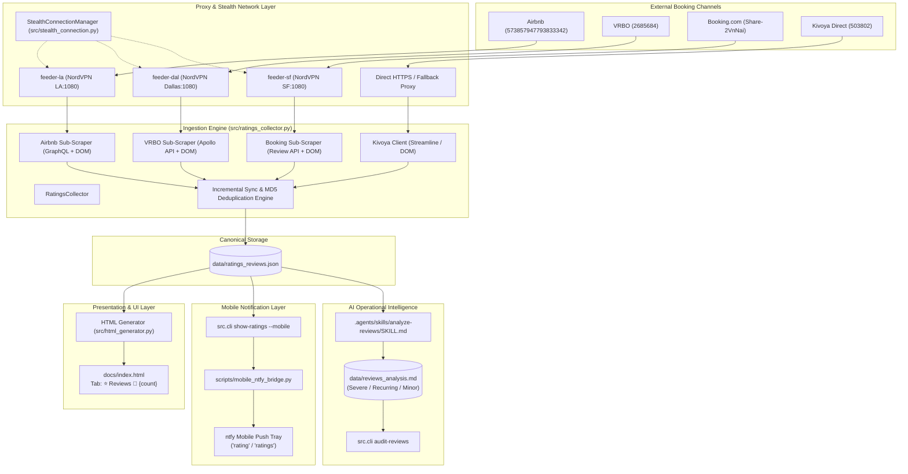
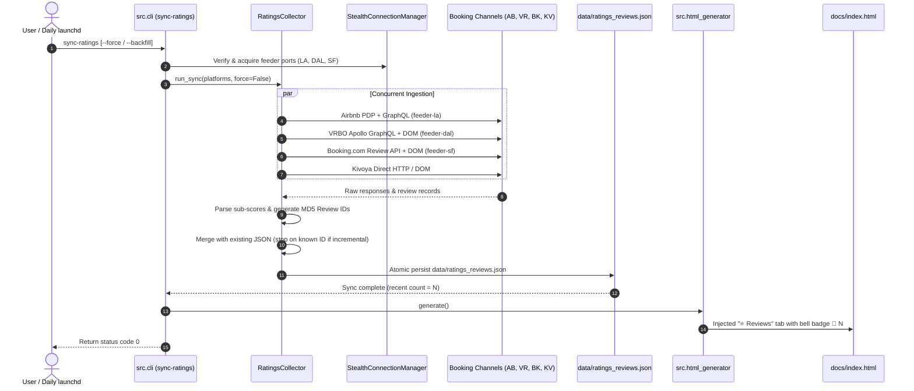
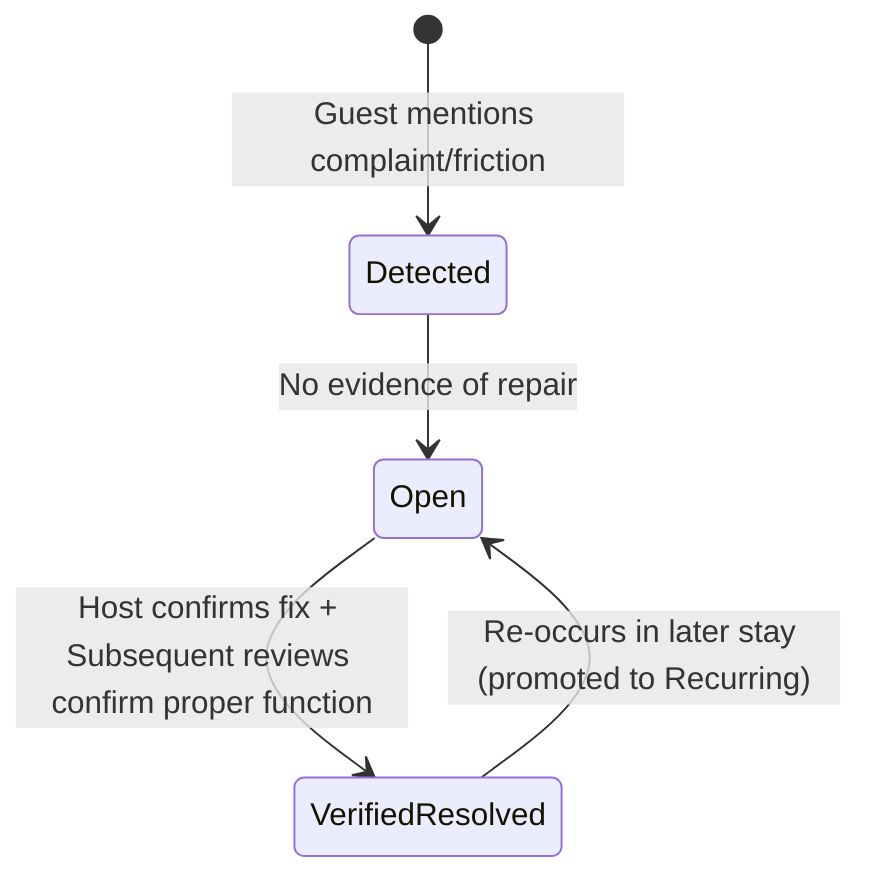
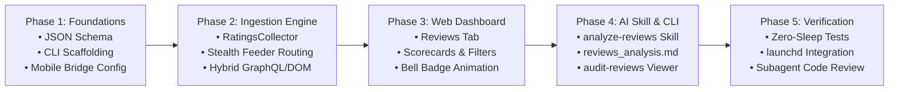

# Villa del Sol Cross-Platform Ratings & Reviews Intelligence System
**System Architecture & Technical Design Document**
`ratings_design.md`

---

## 1. Executive Summary & Design Overview

The **Ratings & Reviews Intelligence System** provides continuous reputation surveillance, guest sentiment analysis, and operational triage for **Villa del Sol** (Tempe, AZ). Prospective guests booking high-ticket luxury stays ($800–$2,500+/night) evaluate reviews across multiple booking channels:
- **Airbnb** (Primary domestic luxury leisure channel)
- **VRBO / Expedia** (Family retreats & multi-generational groups)
- **Booking.com** (International travelers & corporate stays)
- **Kivoya Direct / Streamline VRS** (Direct bookings & VIP repeat guests)

This system establishes an end-to-end automated pipeline:
1. **Stealth Multi-Channel Ingestion**: Scrapes aggregate ratings, category sub-scores, and complete historical guest reviews across all 4 platforms via regional NordVPN SOCKS5 proxy feeders.
2. **Deterministic Canonical Storage**: Maintains a single source of truth in `data/ratings_reviews.json` preserving native platform rating scales (e.g. 10.0 for Booking.com, 5.0 for Airbnb/VRBO/Kivoya) without distortive blending.
3. **Interactive Web Dashboard Tab**: Injects a responsive "⭐ Reviews" tab with an animated pulsing notification bell (`🔔 N`) in `docs/index.html` featuring zero-latency client-side filtering and search.
4. **Two-Way Mobile Push Bridge**: Extends `config/mobile_bridge.json` with `rating` / `ratings` commands, formatting concise push responses via `ntfy`.
5. **AI Operational Intelligence Skill**: Equips Google Antigravity with `.agents/skills/analyze-reviews/SKILL.md` to triage negative feedback into Severe, Recurring, and Minor tiers, tracking resolution state (`[OPEN]` vs `[VERIFIED RESOLVED]`) in `data/reviews_analysis.md`.

---

## 2. High-Level Architecture & Component Map

### 2.1 System Architecture Diagram



### 2.2 End-to-End Execution Sequence



### 2.3 Component & Directory Map

| Path | Role | Description |
| :--- | :--- | :--- |
| `src/ratings_collector.py` | Core Module | Multi-channel scraper with hybrid GraphQL/DOM parsers, MD5 hashing, and incremental merge. |
| `data/ratings_reviews.json` | Master Database | Canonical JSON database of platform ratings, sub-scores, and chronological review records. |
| `src/html_generator.py` | UI Generator | Renders the "⭐ Reviews" tab, platform scorecards, client-side filters, and pulsing bell badge. |
| `src/cli.py` | CLI Interface | Houses `sync-ratings`, `show-ratings`, and `audit-reviews` subcommands. |
| `config/mobile_bridge.json` | Configuration | Registers `rating` and `ratings` mobile shortcuts. |
| `.agents/skills/analyze-reviews/SKILL.md` | AI Agent Skill | Guides Antigravity in 3-tier complaint triage and issue resolution tracking. |
| `data/reviews_analysis.md` | AI Report | Operational action plan detailing open vs verified resolved issues. |
| `scripts/launchd/run_daily_quickscan.sh` | Orchestration | Automated daily trigger running `sync-ratings` in launchd. |
| `tests/test_ratings_collector.py` | Unit Tests | Fast, zero-sleep tests for parsing, deduplication, and error isolation. |
| `tests/test_html_generator.py` | Unit Tests | Tests for review tab rendering, bell badge visibility, and scorecards. |
| `tests/test_mobile_bridge.py` | Unit Tests | Tests for mobile push output formatting, character capping, and shortcuts. |

---

## 3. Ingestion Engine Design (`src/ratings_collector.py`)

### 3.1 Class Architecture & Interfaces

```python
class RatingsCollector:
    """
    Multi-channel ratings and reviews ingestion engine.
    Scrapes Airbnb, VRBO, Booking.com, and Kivoya Direct using stealth
    NordVPN proxy routing, hybrid network-interception/DOM extraction,
    and incremental deduplication.
    """

    CHANNELS = {
        "airbnb": {
            "name": "Airbnb",
            "url": "https://www.airbnb.com/rooms/573857947793833342",
            "proxy_feeder": "feeder-la",
            "scale": 5.0,
        },
        "vrbo": {
            "name": "VRBO",
            "url": "https://www.vrbo.com/2685684",
            "proxy_feeder": "feeder-dal",
            "scale": 5.0,
        },
        "booking": {
            "name": "Booking.com",
            "url": "https://www.booking.com/hotel/us/villa-del-sol-amazing-house-by-kivoya.html",
            "proxy_feeder": "feeder-sf",
            "scale": 10.0,
        },
        "kivoya": {
            "name": "Kivoya Direct",
            "url": "https://www.kivoya.com/503802/",
            "proxy_feeder": None,  # Direct HTTPS with fallback
            "scale": 5.0,
        },
    }

    def __init__(
        self,
        db_path: Path = Path("data/ratings_reviews.json"),
        proxy_mgr: Optional[StealthConnectionManager] = None,
        headless: bool = True,
        recent_window_days: int = 30,
    ):
        self.db_path = Path(db_path)
        self.proxy_mgr = proxy_mgr
        self.headless = headless
        self.recent_window_days = recent_window_days
        self._existing_data: Dict[str, Any] = self._load_existing_db()

    async def sync_channel(
        self,
        platform_id: str,
        force: bool = False,
        backfill: bool = False,
    ) -> ChannelSyncResult:
        """Scrape and parse an individual platform channel with error isolation."""
        ...

    async def sync_all(
        self,
        platforms: Optional[List[str]] = None,
        force: bool = False,
        backfill: bool = False,
    ) -> SyncSummary:
        """Execute concurrent multi-channel scraping via asyncio.gather."""
        ...
```

### 3.2 Channel-Specific Ingestion & Hybrid Extraction

#### 1. Airbnb Ingestion
- **Proxy Feeder**: `feeder-la` (`los-angeles.us.socks.nordhold.net:1080`).
- **Target URL**: `https://www.airbnb.com/rooms/573857947793833342?locale=en`.
- **Primary Extraction (GraphQL Interception)**:
  - Intercept network responses matching `graphql/StayProductDetailPage` or `PdpReviews`.
  - Extract:
    - Overall rating: `data.presentation.stayProductDetailPage.sections.metadata.overallRating`.
    - Review count: `data.presentation.stayProductDetailPage.sections.metadata.reviewCount`.
    - Category sub-scores: `data.presentation.stayProductDetailPage.sections.reviewComponent.reviewCategorySubscores` (`cleanliness`, `accuracy`, `communication`, `location`, `checkin`, `value`).
    - Review list: `data.presentation.stayProductDetailPage.sections.reviewComponent.reviews` with fields:
      - Author name: `author.firstName`
      - Date: `createdAt` (normalized to `YYYY-MM-DD`)
      - Rating: `rating` (5.0 scale)
      - Body: `comments`
      - Host response: `response.comments`, `response.createdAt`
- **Fallback Extraction (DOM / JSON-LD)**:
  - JSON-LD script block: `script[type="application/ld+json"]` (`aggregateRating.ratingValue`, `reviewCount`).
  - DOM review nodes: `div[data-review-id]`, `div[elementtiming="LCP-target"]`.

#### 2. VRBO / Expedia Ingestion
- **Proxy Feeder**: `feeder-dal` (`dallas.us.socks.nordhold.net:1080`).
- **Target URL**: `https://www.vrbo.com/2685684`.
- **Primary Extraction (Apollo GraphQL / REST Interception)**:
  - Intercept responses from `graphql` operations matching `PropertyReviewsQuery` or Expedia Reviews API.
  - Extract:
    - Overall rating: `propertyReviewSummary.rating` (5.0 scale).
    - Review count: `propertyReviewSummary.totalCount`.
    - Sub-scores: Cleanliness, Accuracy, Communication, Location, Check-in.
    - Review list:
      - Title: `review.title` (headline)
      - Author: `review.reviewer.name`
      - Location: `review.reviewer.location`
      - Date: `review.submissionDate`
      - Score: `review.rating`
      - Body: `review.text`
      - Host response: `review.managementResponse.text`
- **Fallback Extraction (DOM Selectors)**:
  - Selectors: `[data-stid="reviews-summary"]`, `article[data-stid="review-item"]`.

#### 3. Booking.com Ingestion
- **Proxy Feeder**: `feeder-sf` (`san-francisco.us.socks.nordhold.net:1080`).
- **Target URL**: `https://www.booking.com/hotel/us/villa-del-sol-amazing-house-by-kivoya.html`.
- **Primary Extraction (Review Modal / API Interception)**:
  - Intercept AJAX review pagination: `/reviewlist.html` or `/dml/graphql?operationName=ReviewList`.
  - Extract:
    - Overall rating: Native 10.0 scale (e.g. `9.4`).
    - Review count: Total verified guest reviews.
    - Sub-scores (10.0 scale): Staff, Facilities, Cleanliness, Comfort, Value for money, Location, Free WiFi.
    - Review list:
      - Title: Headline text (`c-review__title`)
      - Author: Guest name and country code (`bui-avatar__text`, flag icon)
      - Date: Date of review
      - Rating: Native score out of 10.0
      - Body: Positive text (`c-review__row--positive`) + Negative text (`c-review__row--negative`) merged with clear delineation
      - Host response: `c-review__response`
- **Fallback Extraction (DOM / Microdata)**:
  - Selectors: `div[data-review-url]`, `.bui-review-score__badge`, `li.review_item`.

#### 4. Kivoya Direct Ingestion
- **Network**: Direct HTTPS (fallback to `feeder-la` if blocked).
- **Target URL**: `https://www.kivoya.com/503802/` & Streamline VRS AJAX.
- **Extraction**:
  - Fetch property page HTML or query Streamline VRS guest reviews endpoint.
  - Extract:
    - Overall rating: 5.0 scale (e.g. `5.0`).
    - Total reviews count.
    - Review entries: Author, date, star score, body text, host comments.

### 3.3 Incremental Sync & Pagination Logic

To keep daily executions fast (< 30 seconds) while maintaining complete historical integrity:
1. **Incremental Mode (Default)**:
   - On routine runs, the collector fetches **page 1** (most recent reviews) for each channel.
   - For each review parsed, compute $\text{ReviewID} = \text{MD5}(\text{platform} + \text{reviewer\_name} + \text{date} + \text{text}[:60])$.
   - If $\text{ReviewID}$ already exists in `data/ratings_reviews.json`:
     - Update in-place (captures any newly posted host responses).
     - Continue inspecting the remainder of page 1 to ensure no interleaved edits.
     - **Stop pagination** immediately without loading deeper pages (saving proxy bandwidth and runtime).
   - If an unknown $\text{ReviewID}$ is encountered, prepend the new review to the master list and proceed.
2. **Backfill / Force Mode (`--force` or `--backfill`)**:
   - The collector paginates through all available review pages until the channel's review count is exhausted.
   - Used for initial bootstrap or full portfolio reconciliations.

```python
def compute_review_id(platform: str, author: str, date_str: str, body: str) -> str:
    """Deterministic unique MD5 identifier for a review."""
    raw = f"{platform.lower().strip()}_{author.lower().strip()}_{date_str.strip()}_{body.strip()[:60]}"
    return hashlib.md5(raw.encode("utf-8")).hexdigest()
```

### 3.4 Error Isolation & Resilience Policy
- Scraping runs concurrently via `asyncio.gather(return_exceptions=True)`.
- If an individual platform fails (e.g. CAPTCHA, HTTP 503, proxy timeout):
  1. Emit an operational `WARNING` log with the failure reason.
  2. Set `platforms[platform_id]["status"] = "stale_error"` in the JSON metadata.
  3. **Preserve** the existing review records and previous rating values for that platform.
  4. Continue successfully processing remaining platforms.
  5. The CLI exits with code `0` if at least one platform succeeded, ensuring launchd pipelines are not broken by isolated anti-bot spikes.

---

## 4. Canonical Data Storage Schema (`data/ratings_reviews.json`)

The single persistent data store resides at `data/ratings_reviews.json`.

### 4.1 Strict Native Scale Invariant
> [!IMPORTANT]
> **Strict Platform Fidelity**: All ratings and sub-scores remain strictly in their native platform scale:
> - **Booking.com**: 1.0 – 10.0 scale (e.g. `9.4 / 10.0`).
> - **Airbnb**: 1.0 – 5.0 scale (e.g. `4.96 / 5.0`).
> - **VRBO**: 1.0 – 5.0 scale (e.g. `4.90 / 5.0`).
> - **Kivoya**: 1.0 – 5.0 scale (e.g. `5.0 / 5.0`).
>
> **No artificial normalization, 10-to-5 conversions, or blended cross-platform averages** are stored or displayed. Each channel stands authentically on its own native standards.

### 4.2 Comprehensive JSON Schema

```json
{
  "$schema": "https://json-schema.org/draft/2020-12/schema",
  "title": "VillaDelSolRatingsAndReviews",
  "type": "object",
  "required": ["last_updated", "recent_window_days", "recent_reviews_count", "platforms", "reviews"],
  "properties": {
    "last_updated": { "type": "string", "format": "date-time" },
    "recent_window_days": { "type": "integer", "default": 30 },
    "recent_reviews_count": { "type": "integer" },
    "platforms": {
      "type": "object",
      "additionalProperties": {
        "type": "object",
        "required": ["platform_id", "display_name", "url", "scale", "rating", "review_count", "sub_scores", "last_scraped", "status"],
        "properties": {
          "platform_id": { "type": "string" },
          "display_name": { "type": "string" },
          "url": { "type": "string" },
          "scale": { "type": "string", "enum": ["5.0", "10.0"] },
          "rating": { "type": ["number", "null"] },
          "review_count": { "type": "integer" },
          "sub_scores": { "type": "object", "additionalProperties": { "type": "number" } },
          "last_scraped": { "type": "string", "format": "date-time" },
          "status": { "type": "string", "enum": ["ok", "stale_error", "degraded"] }
        }
      }
    },
    "reviews": {
      "type": "array",
      "items": {
        "type": "object",
        "required": ["id", "platform", "reviewer_name", "date", "rating", "rating_max", "body", "is_recent"],
        "properties": {
          "id": { "type": "string" },
          "platform": { "type": "string", "enum": ["airbnb", "vrbo", "booking", "kivoya"] },
          "reviewer_name": { "type": "string" },
          "reviewer_location": { "type": ["string", "null"] },
          "title": { "type": ["string", "null"] },
          "date": { "type": "string", "format": "date" },
          "rating": { "type": "number" },
          "rating_max": { "type": "number" },
          "body": { "type": "string" },
          "host_response": {
            "type": ["object", "null"],
            "properties": {
              "responder_name": { "type": "string" },
              "date": { "type": "string", "format": "date" },
              "body": { "type": "string" }
            }
          },
          "is_recent": { "type": "boolean" }
        }
      }
    }
  }
}
```

---

## 5. Web Dashboard Tab & Pulsing Bell UI (`src/html_generator.py`)

### 5.1 Tab Navigation & Dynamic Pulsing Bell Badge

In `src/html_generator.py`, the tab navigation header adds the "⭐ Reviews" tab:

```html
<button class="tab-btn" onclick="switchTab('reviews')" role="tab" id="tab-reviews" aria-selected="false">
  ⭐ Reviews <!-- Bell Badge injected dynamically if N > 0 -->
  <span class="review-bell-badge" id="reviewBellBadge">🔔 2</span>
</button>
```

#### Dynamic Badge Logic
During `html_generator.generate()`:
1. Scan `data/ratings_reviews.json`.
2. Compute $N = \sum [\text{review.date} \ge (\text{today} - 30\text{ days})]$.
3. If $N > 0$, render `<span class="review-bell-badge">🔔 {N}</span>`.
4. If $N == 0$, omit the badge entirely.

#### Styling Tokens & Pulse Animation
```css
.review-bell-badge {
  display: inline-flex;
  align-items: center;
  gap: 4px;
  background: rgba(239, 68, 68, 0.16);
  color: #f87171;
  border: 1px solid rgba(239, 68, 68, 0.35);
  border-radius: 12px;
  padding: 2px 7px;
  font-size: 0.72rem;
  font-weight: 700;
  margin-left: 6px;
  animation: review-bell-pulse 2s infinite ease-in-out;
}

@keyframes review-bell-pulse {
  0% {
    transform: scale(1);
    box-shadow: 0 0 0 0 rgba(239, 68, 68, 0.4);
  }
  50% {
    transform: scale(1.06);
    box-shadow: 0 0 8px 2px rgba(239, 68, 68, 0.25);
  }
  100% {
    transform: scale(1);
    box-shadow: 0 0 0 0 rgba(239, 68, 68, 0);
  }
}
```

### 5.2 Reviews Tab Layout Specification

The tab `<section id="tab-reviews" class="tab-content">` consists of three visual tiers:

```
+-----------------------------------------------------------------------------------------+
|  ⭐ Cross-Platform Reviews & Guest Sentiment                                            |
|  Live reputation surveillance across Airbnb, VRBO, Booking.com, and Kivoya Direct       |
+-----------------------------------------------------------------------------------------+
|  Platform Scorecards: 4 Cards across Top                                                |
|  +--------------------+ +--------------------+ +--------------------+ +---------------+ |
|  |  AIRBNB            | |  VRBO              | |  BOOKING.COM       | | KIVOYA DIRECT | |
|  |  ★ 4.96 / 5.0      | |  ★ 4.90 / 5.0      | |  ★ 9.4 / 10.0      | | ★ 5.0 / 5.0   | |
|  |  76 Total Reviews  | |  34 Total Reviews  | |  18 Total Reviews  | | 12 Reviews    | |
|  |  Cleanliness: 4.98 | |  Cleanliness: 4.90 | |  Cleanliness: 9.8  | | Direct Guest  | |
|  |  Accuracy: 4.97    | |  Accuracy: 4.90    | |  Facilities: 9.5   | | Feedback      | |
|  |  Location: 4.93    | |  Location: 4.80    | |  Comfort: 9.4      | |               | |
|  |  [View Listing ↗]  | |  [View Listing ↗]  | |  [View Listing ↗]  | | [View Unit ↗] | |
|  +--------------------+ +--------------------+ +--------------------+ +---------------+ |
+-----------------------------------------------------------------------------------------+
|  Filter & Search Bar                                                                    |
|  [ Platform: All ▾ ]  [ Rating: All ▾ ]  [🔘 Recent Only (<30d)]   [ 🔍 Search text... ] |
+-----------------------------------------------------------------------------------------+
|  Chronological Review Cards Feed (Default: Newest First)                                |
|  +-----------------------------------------------------------------------------------+  |
|  | [AIRBNB]  Sarah M. (Scottsdale, AZ) • 2026-08-28 • ★ 5.0 / 5.0        [✨ NEW]    |  |
|  | "Villa del Sol was beyond perfection for our executive retreat! The backyard      |  |
|  | pool and patio were magnificent, and the bedrooms were spacious and spotless..." |  |
|  |                                                                                   |  |
|  | ↳ 💬 Host Response (2026-08-29): "Thank you Sarah! It was an absolute pleasure..."|  |
|  +-----------------------------------------------------------------------------------+  |
|  +-----------------------------------------------------------------------------------+  |
|  | [BOOKING] David K. (Germany) • 2026-08-19 • ★ 9.0 / 10.0               [✨ NEW]    |  |
|  | "Exceptional property in a quiet Tempe neighborhood. Kitchen was fully stocked    |  |
|  | and the outdoor grill was top notch. A minor issue with one of the secondary      |  |
|  | bathroom door locks was quickly attended to."                                     |  |
|  +-----------------------------------------------------------------------------------+  |
+-----------------------------------------------------------------------------------------+
```

### 5.3 Client-Side Filtering & Search Engine

A lightweight, zero-latency JavaScript controller handles instant filtering:
- **Filters**:
  - `platform-filter`: `all`, `airbnb`, `vrbo`, `booking`, `kivoya`.
  - `rating-filter`: `all`, `5star` (5.0 or $\ge 9.0$), `4star` (4.0–4.9 or 7.0–8.9), `low` ($<4.0$ or $<7.0$).
  - `recent-toggle`: Boolean toggle for $\le 30$ days.
  - `search-input`: Debounced text query searching `reviewer_name`, `title`, `body`, and `host_response`.
- **Execution**:
  - Iterates over `.review-card` elements in the DOM.
  - Toggles `card.style.display = 'none'` / `''`.
  - Updates a live results counter: *"Showing X of Y reviews"*.

---

## 6. Mobile Bridge Push Notification Engine

### 6.1 Shortcut Registration (`config/mobile_bridge.json`)

```json
{
  "shortcuts": {
    "rating": {
      "desc": "Villa del Sol platform ratings and recent 30-day reviews feed",
      "command": [".venv/bin/python", "-m", "src.cli", "show-ratings", "--mobile"]
    },
    "ratings": {
      "desc": "Villa del Sol platform ratings and recent 30-day reviews feed",
      "command": [".venv/bin/python", "-m", "src.cli", "show-ratings", "--mobile"]
    }
  }
}
```

### 6.2 Output Formatting & Readability Rules

To guarantee readability on mobile screens:
- **Character Constraint**: Strictly $\le 3,800$ characters.
- **Recent Snippet Cap**: Cap at **up to 3 recent reviews** within the 30-day window.
- If $N > 3$, append: `\n📌 + {N - 3} more recent reviews in web dashboard`.

#### Format Specification:
```text
⭐ Villa del Sol — Ratings & Recent Reviews
===========================================
📊 Platform Ratings (Native Scales):
  • Airbnb      : 4.96 / 5.0 (76 reviews)
  • VRBO        : 4.90 / 5.0 (34 reviews)
  • Booking.com : 9.4 / 10.0 (18 reviews)
  • Kivoya      : 5.0 / 5.0 (12 reviews)

🔔 Recent Reviews in Last 30 Days (2):
-------------------------------------------
1. [Airbnb] ★ 5.0 — Sarah M. (Aug 28, 2026)
   "Villa del Sol was beyond perfection for our executive retreat! The backyard pool and patio were magnificent..."

2. [Booking] ★ 9.0/10 — David K. (Aug 19, 2026)
   "Exceptional property in a quiet Tempe neighborhood. Kitchen was fully stocked and the outdoor grill was top notch..."
```

#### Fallback (Zero Reviews in Last 30 Days):
```text
⭐ Villa del Sol — Ratings & Recent Reviews
===========================================
📊 Platform Ratings (Native Scales):
  • Airbnb      : 4.96 / 5.0 (76 reviews)
  • VRBO        : 4.90 / 5.0 (34 reviews)
  • Booking.com : 9.4 / 10.0 (18 reviews)
  • Kivoya      : 5.0 / 5.0 (12 reviews)

🔔 Recent Reviews: No new reviews in the last 30 days.

📌 Most Recent Review on Record:
  • [Airbnb] ★ 5.0 — James T. (July 14, 2026)
    "Outstanding stay! The heated pool and outdoor gazebo made our family reunion unforgettable. Host was very responsive."
```

---

## 7. AI Operational Intelligence Skill & CLI Viewer

### 7.1 Skill Architecture (`.agents/skills/analyze-reviews/SKILL.md`)

The AI Agent Skill systematically audits pre-scraped reviews from `data/ratings_reviews.json`. It triages complaints, cross-references host responses and subsequent stays, and produces an actionable remediation report in `data/reviews_analysis.md`.

#### Problem Classification Rubric:
- **Tier 1: Severe Issues (`[SEVERE]`)**: Critical structural, safety, HVAC, or hygiene failures (e.g. AC failure $>100^\circ\text{F}$, winter pool heater failure $<75^\circ\text{F}$, hot water outage, uncleaned home). **Immediate 24-hr vendor remediation.**
- **Tier 2: Recurring Problems (`[RECURRING]`)**: Repeated friction points mentioned across 2+ distinct stays (e.g. smart lock keypad lag, Wi-Fi dead zones, insufficient towels/cookware, confusing pool controls). **Schedule during turnover window.**
- **Tier 3: Minor Issues (`[MINOR]`)**: Isolated, one-off quirks or stylistic preferences (e.g. mattress firmness, board game request, burnt lightbulb). **Batch into routine upgrades.**

#### Issue State Machine:


### 7.2 Output Artifact Structure (`data/reviews_analysis.md`)

```markdown
# Villa del Sol — Guest Reviews Operational Audit & Action Plan
**Generated by Antigravity Review Analysis Engine**
**Data Source**: `data/ratings_reviews.json` (Total Reviews: 140)

## Executive Summary
- Overall Guest Satisfaction: Exceptional (Airbnb 4.96, VRBO 4.90, Booking 9.4, Kivoya 5.0)
- Open Severe Issues: 0
- Open Recurring Problems: 1 (Smart Lock Keypad Lag)
- Open Minor Issues: 2 (Back bedroom lamps, blender gasket)

---

## 🚨 Tier 1: Severe Issues (Address Immediately)
*None currently open.*

---

## ⚠️ Tier 2: Recurring Problems (Address Soon)

### 1. Smart Lock Keypad Lag on Front Door `[OPEN]`
- **Frequency**: Mentioned in 2 stays (July 2026, August 2026).
- **Guest Citations**:
  - *David K. (Booking.com, Aug 2026)*: "Keypad took three tries to register code."
  - *Mark P. (Airbnb, July 2026)*: "Front door lock buttons felt sluggish in afternoon heat."
- **Root Cause**: Thermal strain on exterior lithium batteries.
- **Recommended Action**: Replace Yale smart lock lithium batteries and lubricate deadbolt alignment.

---

## ℹ️ Tier 3: Minor Issues (Optionally Address)

### 1. Kitchen Blender Gasket `[OPEN]`
- **Frequency**: 1 mention (June 2026).
- **Guest Citation**: *Rachel W. (VRBO)*: "Blender was a bit leaky when making smoothies."
- **Recommended Action**: Inspect Ninja blender pitcher and replace sealing ring.

---

## ✅ Verified Resolved Issues Catalog
| Issue | Platform & Date | Resolution Evidence |
| :--- | :--- | :--- |
| Pool Heater Tripped Breaker | Airbnb (Jan 2026) | Host dispatched pool tech same-day; 6 subsequent winter reviews confirmed perfect 86° pool temperature. |
| Secondary Bath Door Latch | Booking.com (Aug 2026) | Handyman adjusted strike plate; verified latching smoothly. |
```

### 7.3 CLI Report Viewer (`src.cli audit-reviews`)
- Serves as a terminal viewer/formatter for `data/reviews_analysis.md`.
- Uses ANSI color formatting (Red for Severe, Yellow for Recurring, Blue for Minor, Green for Resolved).
- If `data/reviews_analysis.md` does not exist or is stale, prints:
  `"⚠️ No review analysis report found. Run Antigravity skill 'analyze-reviews' to generate data/reviews_analysis.md."`

---

## 8. CLI Interface Specification (`src/cli.py`)

### 8.1 Command Syntax & Arguments

```bash
# 1. Synchronize ratings and reviews from all channels (auto-updates dashboard)
.venv/bin/python -m src.cli sync-ratings

# Sync a specific platform with visible browser for debugging
.venv/bin/python -m src.cli sync-ratings --platform airbnb --headless false

# Full historical backfill ignoring pagination stops
.venv/bin/python -m src.cli sync-ratings --force --backfill

# Sync data without touching docs/index.html
.venv/bin/python -m src.cli sync-ratings --no-dashboard

# 2. Display ratings in terminal or format for mobile push
.venv/bin/python -m src.cli show-ratings
.venv/bin/python -m src.cli show-ratings --mobile
.venv/bin/python -m src.cli show-ratings --json

# 3. View operational reviews triage report
.venv/bin/python -m src.cli audit-reviews
```

### 8.2 Argument Parser Definitions in `src/cli.py`

```python
# sync-ratings
sync_ratings_parser = subparsers.add_parser(
    "sync-ratings",
    help="Scrape and synchronize ratings and reviews across all booking channels",
)
sync_ratings_parser.add_argument(
    "--platform",
    choices=["all", "airbnb", "vrbo", "booking", "kivoya"],
    default="all",
    help="Platform to sync (default: all)",
)
sync_ratings_parser.add_argument(
    "--force",
    action="store_true",
    help="Ignore cache and force re-scrape",
)
sync_ratings_parser.add_argument(
    "--backfill",
    action="store_true",
    help="Traverse all historical pages instead of incremental stop",
)
sync_ratings_parser.add_argument(
    "--headless",
    type=lambda x: (str(x).lower() == "true"),
    default=True,
    help="Run browser in headless mode (default: true)",
)
sync_ratings_parser.add_argument(
    "--no-dashboard",
    action="store_true",
    help="Do not re-generate docs/index.html after sync",
)

# show-ratings
show_ratings_parser = subparsers.add_parser(
    "show-ratings",
    help="Display platform ratings, sub-scores, and recent reviews",
)
show_ratings_parser.add_argument(
    "--mobile",
    action="store_true",
    help="Format output for mobile ntfy push notification",
)
show_ratings_parser.add_argument(
    "--json",
    action="store_true",
    help="Output raw JSON data",
)

# audit-reviews
audit_reviews_parser = subparsers.add_parser(
    "audit-reviews",
    help="Display AI reviews triage analysis and action plan from data/reviews_analysis.md",
)
```

### 8.3 Daily Scheduled Orchestration

Integrated into `scripts/launchd/run_daily_quickscan.sh`:
```bash
# Ingest fresh guest reviews and platform scores
echo "⭐ Syncing guest reviews and ratings..." >> "$LOG_FILE"
"$PROJECT_ROOT/.venv/bin/python" -u -m src.cli sync-ratings --no-dashboard >> "$LOG_FILE" 2>&1 || true
```
The subsequent `src.cli run` execution automatically renders the fresh review counts and glowing bell into `docs/index.html`.

---

## 9. Verification & Fast Testing Plan

In accordance with the **Fast Development, Targeted Testing, and Zero-Sleep Test Environment Invariant**:
- Tests run against local HTML/JSON fixtures in `tests/fixtures/`.
- All timeouts, stealth proxy startup waits, and retry delays are set to `0.0`.
- Each test file executes in $< 1.5$ seconds.

### 9.1 Unit Test Suites

#### 1. Ingestion Engine Tests (`tests/test_ratings_collector.py`)
- `test_airbnb_graphql_and_dom_parsing`: Validates extraction of 4.96 rating, sub-scores, and comments from mock GraphQL responses and HTML fixtures.
- `test_vrbo_apollo_parsing`: Validates extraction of VRBO 4.90 rating, sub-scores, headlines, and reviews.
- `test_booking_parsing_native_10_scale`: Validates native 10.0 scale extraction (e.g. 9.4), sub-scores, and positive/negative comment pairing.
- `test_kivoya_streamline_parsing`: Validates direct Streamline review extraction.
- `test_md5_deduplication_and_merge`: Validates deterministic MD5 hash generation, incremental stopping, and in-place host response updating.
- `test_error_isolation`: Simulates a failure in one platform (e.g. VRBO network error) and verifies that other platforms succeed and previous VRBO data is preserved.
- `test_recent_window_calculation`: Verifies that reviews $\le 30$ days are flagged `is_recent = True` and counted accurately.

#### 2. HTML Generator & UI Tests (`tests/test_html_generator.py`)
- `test_reviews_tab_rendering`: Verifies that `_render_reviews_tab()` emits valid HTML with scorecards, filters, and review cards.
- `test_bell_badge_injection`: Verifies that `<span class="review-bell-badge">🔔 N</span>` is rendered in `.tabs-nav` when $N > 0$, and completely omitted when $N = 0$.
- `test_native_scale_display`: Asserts that Booking.com displays `9.4 / 10.0` while Airbnb displays `4.96 / 5.0` without conversion.

#### 3. Mobile Bridge Tests (`tests/test_mobile_bridge.py`)
- `test_mobile_shortcuts_registration`: Verifies `rating` and `ratings` are present in `config/mobile_bridge.json`.
- `test_mobile_output_formatting_scenario_a`: Verifies mobile output text when recent reviews exist ($\le 3$ full snippets + dashboard prompt).
- `test_mobile_output_formatting_scenario_b`: Verifies fallback to most recent review when 0 recent reviews exist.
- `test_mobile_character_limit`: Asserts payload never exceeds 3,800 characters even with long review bodies.

#### 4. AI Skill & Report Viewer Tests (`tests/test_cli_ratings.py`)
- `test_cli_show_ratings_terminal`: Validates formatted ASCII table output.
- `test_cli_audit_reviews_viewer`: Validates terminal colorization of `data/reviews_analysis.md`.

---

## 10. Implementation Milestones & Roadmap



### Milestone Breakdown:
1. **Phase 1: Foundations & Contracts**
   - Initialize `data/ratings_reviews.json` baseline template.
   - Register `rating` and `ratings` shortcuts in `config/mobile_bridge.json`.
   - Add CLI command parser stubs in `src/cli.py`.
2. **Phase 2: Ingestion Engine & Scraping Mechanics**
   - Implement `src/ratings_collector.py` with `RatingsCollector`.
   - Wire `StealthConnectionManager` proxy routing (`feeder-la`, `feeder-dal`, `feeder-sf`).
   - Implement hybrid network GraphQL/API interceptors + DOM fallbacks for Airbnb, VRBO, Booking.com, and Kivoya.
   - Implement incremental deduplication and atomic file writing.
3. **Phase 3: Web Dashboard Integration**
   - Extend `src/html_generator.py` with `_render_reviews_tab()`.
   - Implement dynamic pulsing bell badge `🔔 N` in tab header.
   - Build 4 platform scorecards with native scale badges.
   - Add client-side JavaScript search & filtering engine.
4. **Phase 4: AI Operational Intelligence Skill**
   - Create `.agents/skills/analyze-reviews/SKILL.md`.
   - Define 3-tier complaint rubric and issue state machine (`[OPEN]` vs `[VERIFIED RESOLVED]`).
   - Implement `src.cli audit-reviews` terminal viewer.
5. **Phase 5: Automated Testing, Orchestration & Review**
   - Implement unit test suites in `tests/test_ratings_collector.py`, `tests/test_html_generator.py`, and `tests/test_mobile_bridge.py`.
   - Integrate `sync-ratings` into `scripts/launchd/run_daily_quickscan.sh`.
   - Execute Mandatory Subagent Code Review Protocol.

