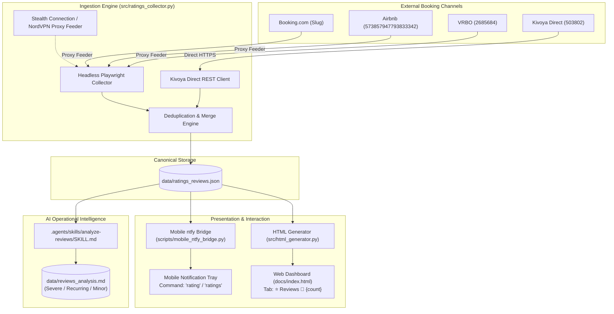

# Villa del Sol Cross-Platform Ratings & Reviews Intelligence System
**Product Requirements Document (PRD) & Functional Specification**
`ratings_requirements.md`

---

## 1. Executive Summary & Purpose

### 1.1 Operational Context
Guest satisfaction and online reputation are critical revenue drivers for luxury short-term rental estates like **Villa del Sol** (Tempe, AZ). Prospective guests booking high-ticket stays ($800–$2,500+/night) scrutinize reviews across all major booking platforms:
- **Booking.com**: High international and business traveler volume.
- **Airbnb**: Core primary domestic luxury leisure channel.
- **VRBO / Expedia**: Large family gatherings and multi-generational groups.
- **Kivoya Direct / Streamline**: Direct bookings and repeat VIP clientele.

Historically, monitoring guest feedback has been manual, disjointed, and reactive. Reviews published on one channel often go unnoticed by property operators until a bad review impacts search visibility or cancellation rates. Furthermore, recurring minor complaints (e.g., gate access friction, kitchen supplies, pool temperature calibration) can simmer across multiple stays before being escalated.

### 1.2 System Objectives
This specification defines the architecture, ingestion pipelines, presentation layers, mobile alerting, and AI analysis capabilities for the **Ratings & Reviews Intelligence System**:
1. **Cross-Platform Ingestion**: Automatically scrape and synchronize comprehensive guest reviews, ratings, and category sub-scores from all 4 primary booking channels.
2. **Deduplicated Central Storage**: Maintain a canonical, persistent JSON record (`data/ratings_reviews.json`) preserving full historical context.
3. **Interactive Dashboard Tab**: Provide an elegant, searchable, and filterable "⭐ Reviews" tab in the static web dashboard (`docs/index.html`), featuring dynamic recency alerts (a notification bell `🔔` with badge count).
4. **Mobile Bridge Command**: Enable instant mobile queries via the two-way `ntfy` bridge (`rating` / `ratings`) to review platform scores and recent 30-day guest feedback on the go.
5. **AI Operational Audit Skill (`SKILL.md`)**: Equip the Google Antigravity AI Agent with a systematic analytical skill to triage complaints into Severe, Recurring, and Minor issues, tracking resolution state (`[OPEN]` vs `[VERIFIED RESOLVED]`) into `data/reviews_analysis.md`.

---

## 2. Core Listing Endpoints & Channel Registry

| Channel | Listing URL / Identifier | Ingestion Protocol | Proxy Routing |
| :--- | :--- | :--- | :--- |
| **Booking.com** | [Share-2VnNai](https://www.booking.com/Share-2VnNai)<br>*(Slug: `hotel/us/villa-del-sol-amazing-house-by-kivoya.html`)* | Headless Playwright + DOM / JSON-LD / API | Mandatory NordVPN San Francisco (`feeder-sf`) |
| **Airbnb** | [Room 573857947793833342](https://www.airbnb.com/rooms/573857947793833342) | Headless Playwright + GraphQL / PDP JSON | Mandatory NordVPN Los Angeles (`feeder-la`) |
| **VRBO** | [Onelink / Listing 2685684](https://www.vrbo.com/2685684)<br>*(Redirect: `https://vrbo.onelink.me/ItNz/zxihwpyy`)* | Headless Playwright + Expedia API / DOM | Mandatory NordVPN Dallas (`feeder-dal`) |
| **Kivoya Direct** | [Property 503802](https://www.kivoya.com/503802/) | Direct HTTP/REST AJAX Client (`Streamline VRS`) | Direct HTTPS (or Fallback NordVPN) |

---

## 3. High-Level System Architecture



---

## 4. Ingestion Engine Specification

### 4.1 Scraping Scope & Depth
The ingestion engine extracts **full historical review depth** rather than only recent snapshots:
- **Aggregate Rating Metrics**: Current overall platform rating and total review count.
- **Category Sub-Scores**: Individual category scores where available:
  - Airbnb: Cleanliness, Accuracy, Communication, Location, Check-in, Value.
  - Booking.com: Cleanliness, Comfort, Facilities, Staff, Value for money, Location, Free WiFi.
  - VRBO: Cleanliness, Accuracy, Communication, Location, Check-in.
  - Kivoya: Overall guest rating score.
- **Full Review Records**:
  - Reviewer display name (and location/country if available).
  - Review publication date (normalized to ISO `YYYY-MM-DD`).
  - Native rating score assigned by the guest.
  - Complete review body text.
  - Host public response (body text, responder name, response date), if any.
  - Review language (with automatic translation or raw capture).

### 4.2 Network & Stealth Proxy Routing
In compliance with the project's proxy-scraping protocol:
- **Stealth Integration**: All requests to Airbnb, VRBO, and Booking.com must route through the `StealthConnectionManager` and NordVPN SOCKS5 proxy pool (`feeder-la`, `feeder-dal`, `feeder-sf`).
- **Resilience & Partial Failures**: If any individual channel encounters temporary rate limiting, CAPTCHA, or network failure, the collector must:
  1. Record an operational warning log.
  2. Preserve the previous scrape data for that channel without wiping out existing records.
  3. Proceed to update remaining accessible channels.
  4. Exit with status code `0` if at least one platform succeeded, or flag a partial status in the output metadata.

### 4.3 Deduplication & Record Hashing
Each review receives a deterministic unique identifier:
$$\text{ReviewID} = \text{MD5}(\text{platform} + \text{reviewer\_name} + \text{date} + \text{text}[:60])$$

When updating `data/ratings_reviews.json`:
- Existing reviews matching the `ReviewID` are updated in-place (e.g. to reflect newly posted host responses).
- New reviews are prepended/merged in chronological order.
- No duplicate records may ever appear in the master dataset.

### 4.4 Execution & Automation Triggers
1. **On-Demand CLI**:
   ```bash
   .venv/bin/python -m src.cli sync-ratings
   ```
   Supports optional flags:
   - `--platform [all|airbnb|vrbo|booking|kivoya]`: Scrape a specific channel.
   - `--headless [true|false]`: Run with visible browser for debugging.
   - `--force`: Ignore local cache and re-fetch all pages.
2. **Scheduled Automated Execution**:
   - Integrated into the daily background pricing and market sync launchd job (`com.villasol.str-price-advisor.plist`).
   - Ensures fresh reviews and ratings are synced at least once daily without manual intervention.

---

## 5. Data Storage Schema (`data/ratings_reviews.json`)

The canonical dataset resides at `data/ratings_reviews.json`.

### 5.1 Native Rating Scale Policy
> [!IMPORTANT]
> **Strict Scale Fidelity**: In accordance with user specification, ratings are strictly recorded and displayed in their **native platform scale**:
> - **Booking.com**: 1.0 – 10.0 scale (e.g. `9.4 / 10.0`).
> - **Airbnb**: 1.0 – 5.0 scale (e.g. `4.96 / 5.0`).
> - **VRBO**: 1.0 – 5.0 scale (e.g. `4.9 / 5.0`).
> - **Kivoya**: 1.0 – 5.0 scale (e.g. `5.0 / 5.0`).
>
> **No cross-platform conversion or blended weighted averages** are calculated. Each platform's performance stands authentically on its native measurement system.

### 5.2 JSON Schema Specification

```json
{
  "$schema": "https://json-schema.org/draft/2020-12/schema",
  "last_updated": "2026-09-14T14:30:00-07:00",
  "recent_window_days": 30,
  "recent_reviews_count": 2,
  "platforms": {
    "airbnb": {
      "platform_id": "airbnb",
      "display_name": "Airbnb",
      "url": "https://www.airbnb.com/rooms/573857947793833342",
      "scale": "5.0",
      "rating": 4.96,
      "review_count": 76,
      "sub_scores": {
        "cleanliness": 4.98,
        "accuracy": 4.97,
        "communication": 5.0,
        "location": 4.93,
        "check_in": 5.0,
        "value": 4.88
      },
      "last_scraped": "2026-09-14T14:28:10-07:00",
      "status": "ok"
    },
    "vrbo": {
      "platform_id": "vrbo",
      "display_name": "VRBO",
      "url": "https://www.vrbo.com/2685684",
      "scale": "5.0",
      "rating": 4.90,
      "review_count": 34,
      "sub_scores": {
        "cleanliness": 4.9,
        "accuracy": 4.9,
        "communication": 5.0,
        "location": 4.8,
        "check_in": 5.0
      },
      "last_scraped": "2026-09-14T14:28:40-07:00",
      "status": "ok"
    },
    "booking": {
      "platform_id": "booking",
      "display_name": "Booking.com",
      "url": "https://www.booking.com/hotel/us/villa-del-sol-amazing-house-by-kivoya.html",
      "scale": "10.0",
      "rating": 9.4,
      "review_count": 18,
      "sub_scores": {
        "staff": 9.6,
        "facilities": 9.5,
        "cleanliness": 9.8,
        "comfort": 9.4,
        "value_for_money": 9.1,
        "location": 9.3,
        "free_wifi": 10.0
      },
      "last_scraped": "2026-09-14T14:29:15-07:00",
      "status": "ok"
    },
    "kivoya": {
      "platform_id": "kivoya",
      "display_name": "Kivoya Direct",
      "url": "https://www.kivoya.com/503802/",
      "scale": "5.0",
      "rating": 5.0,
      "review_count": 12,
      "sub_scores": {},
      "last_scraped": "2026-09-14T14:29:30-07:00",
      "status": "ok"
    }
  },
  "reviews": [
    {
      "id": "c4ca4238a0b923820dcc509a6f75849b",
      "platform": "airbnb",
      "reviewer_name": "Sarah M.",
      "date": "2026-08-28",
      "rating": 5.0,
      "rating_max": 5.0,
      "body": "Villa del Sol was beyond perfection for our executive retreat! The backyard pool and patio were magnificent, and the bedrooms were spacious and spotless. We will definitely be back.",
      "host_response": {
        "responder_name": "Villa del Sol Host",
        "date": "2026-08-29",
        "body": "Thank you so much Sarah! It was our pleasure hosting your team."
      },
      "is_recent": true
    },
    {
      "id": "c81e728d9d4c2f636f067f89cc14862c",
      "platform": "booking",
      "reviewer_name": "David K.",
      "date": "2026-08-19",
      "rating": 9.0,
      "rating_max": 10.0,
      "body": "Exceptional property in a quiet Tempe neighborhood. Kitchen was fully stocked and the outdoor grill was top notch. A minor issue with one of the secondary bathroom door locks was quickly attended to.",
      "host_response": null,
      "is_recent": true
    }
  ]
}
```

---

## 6. Web Dashboard Tab & Visual Bell Notification

### 6.1 Tab Navigation & Notification Bell
In `src/html_generator.py`, a new tab is added to `.tabs-nav`:
```html
<button class="tab-btn" onclick="switchTab('reviews')" role="tab" id="tab-reviews" aria-selected="false">
  ⭐ Reviews <span class="review-bell-badge">🔔 2</span>
</button>
```

#### Bell Icon Logic
- **Recency Condition**: Calculated dynamically during HTML generation based on whether any review in `data/ratings_reviews.json` has:
  $$\text{date} \ge \text{today} - 30\text{ days}$$
- **Badge Content**: If recent reviews exist ($N > 0$), append `🔔 N` with an animated, glowing notification indicator:
  ```css
  .review-bell-badge {
    display: inline-flex;
    align-items: center;
    gap: 4px;
    background: rgba(239, 68, 68, 0.18);
    color: #ef4444;
    border: 1px solid rgba(239, 68, 68, 0.4);
    border-radius: 12px;
    padding: 2px 8px;
    font-size: 0.75rem;
    font-weight: 700;
    margin-left: 6px;
    animation: pulse-badge 2s infinite ease-in-out;
  }
  ```
- If $N = 0$, omit the bell badge from the tab header button entirely (`⭐ Reviews`).

### 6.2 Reviews Tab Layout & Components

The tab content (`<section id="tab-reviews" class="tab-content">`) consists of three primary visual tiers:

```
+-----------------------------------------------------------------------------------+
|  ⭐ Cross-Platform Reviews & Guest Sentiment                                      |
+-----------------------------------------------------------------------------------+
|  [ Platform Scorecards: 4 Cards across Top ]                                      |
|  +--------------------+ +--------------------+ +--------------------+ +---------+ |
|  |  AIRBNB            | |  VRBO              | |  BOOKING.COM       | | KIVOYA  | |
|  |  ★ 4.96 / 5.0      | |  ★ 4.90 / 5.0      | |  ★ 9.4 / 10.0      | | 5.0/5.0 | |
|  |  76 Total Reviews  | |  34 Total Reviews  | |  18 Total Reviews  | | 12 Revs | |
|  |  Clean: 4.98       | |  Clean: 4.90       | |  Clean: 9.8        | | Direct  | |
|  |  [View Listing ↗]  | |  [View Listing ↗]  | |  [View Listing ↗]  | | [Link ↗]| |
|  +--------------------+ +--------------------+ +--------------------+ +---------+ |
+-----------------------------------------------------------------------------------+
|  [ Filter & Search Bar ]                                                          |
|  [ Platform: All ▾ ]  [ Rating: All ▾ ]  [🔘 Recent Only (<30d)]  [ 🔍 Search... ] |
+-----------------------------------------------------------------------------------+
|  [ Review Cards Feed (Chronological) ]                                            |
|  +-----------------------------------------------------------------------------+  |
|  | [AIRBNB]  Sarah M.  •  2026-08-28  •  ★ 5.0 / 5.0                 [NEW BADGE] |  |
|  | "Villa del Sol was beyond perfection for our executive retreat! The..."    |  |
|  |                                                                             |  |
|  | ↳ 💬 Host Response (2026-08-29): "Thank you so much Sarah!..."             |  |
|  +-----------------------------------------------------------------------------+  |
|  +-----------------------------------------------------------------------------+  |
|  | [BOOKING] David K.  •  2026-08-19  •  ★ 9.0 / 10.0                [NEW BADGE] |  |
|  | "Exceptional property in a quiet Tempe neighborhood. Kitchen was fully..."  |  |
|  +-----------------------------------------------------------------------------+  |
+-----------------------------------------------------------------------------------+
```

#### Component Specifications:
1. **Platform Summary Scorecards**:
   - Distinct brand badges (Airbnb Red/Coral, VRBO Blue, Booking.com Navy/Azure, Kivoya Coral/Teal).
   - Prominent native rating score and total count.
   - Expandable subcategory rating grid.
   - Clickable outbound link directly to the live listing.
2. **Client-Side Filtering & Search Toolbar**:
   - Instant zero-latency JavaScript filtering.
   - Platform selector: `All Platforms`, `Airbnb`, `VRBO`, `Booking.com`, `Kivoya`.
   - Rating filter: `All Ratings`, `5★ / 9+`, `4★ / 7-8`, `≤3★ / <7`.
   - Toggle button: `Recent Only (Last 30 Days)`.
   - Text search input: Instant live search across reviewer name, review body, and host replies.
3. **Individual Review Cards**:
   - Header with platform badge, reviewer name, relative & absolute date, and native score badge.
   - Prominent `NEW` tag (pulsing emerald badge) for reviews within the last 30 days.
   - Full review text formatted with readable typography and line height.
   - Indented, distinct host reply block with icon `↳ 💬 Host Response` if available.

---

## 7. Mobile Bridge Command (`rating` / `ratings`)

### 7.1 Command Registration in `config/mobile_bridge.json`
Both singular `rating` and plural `ratings` must be registered in the mobile bridge shortcuts:
```json
{
  "shortcuts": {
    "rating": {
      "desc": "Villa del Sol platform ratings and recent 30-day reviews feed",
      "command": [".venv/bin/python", "-m", "src.cli", "show-ratings", "--mobile"]
    },
    "ratings": {
      "desc": "Villa del Sol platform ratings and recent 30-day reviews feed",
      "command": [".venv/bin/python", "-m", "src.cli", "show-ratings", "--mobile"]
    }
  }
}
```

### 7.2 CLI Output Formatting (`show-ratings --mobile`)
The CLI command formats a mobile-optimized push notification payload obeying the character constraints ($\le 3,800$ characters):

#### Scenario A: New Reviews Exist in Last 30 Days
```text
⭐ Villa del Sol — Ratings & Recent Reviews
===========================================
📊 Platform Ratings (Native Scales):
  • Airbnb      : 4.96 / 5.0 (76 reviews)
  • VRBO        : 4.90 / 5.0 (34 reviews)
  • Booking.com : 9.4 / 10.0 (18 reviews)
  • Kivoya      : 5.0 / 5.0 (12 reviews)

🔔 Recent Reviews in Last 30 Days (2):
-------------------------------------------
1. [Airbnb] ★ 5.0 — Sarah M. (Aug 28, 2026)
   "Villa del Sol was beyond perfection for our executive retreat! The backyard pool and patio were magnificent..."

2. [Booking] ★ 9.0/10 — David K. (Aug 19, 2026)
   "Exceptional property in a quiet Tempe neighborhood. Kitchen was fully stocked and the outdoor grill was top notch..."
```

#### Scenario B: Zero New Reviews in Last 30 Days
```text
⭐ Villa del Sol — Ratings & Recent Reviews
===========================================
📊 Platform Ratings (Native Scales):
  • Airbnb      : 4.96 / 5.0 (76 reviews)
  • VRBO        : 4.90 / 5.0 (34 reviews)
  • Booking.com : 9.4 / 10.0 (18 reviews)
  • Kivoya      : 5.0 / 5.0 (12 reviews)

🔔 Recent Reviews: No new reviews in the last 30 days.

📌 Most Recent Review on Record:
  • [Airbnb] ★ 5.0 — James T. (July 14, 2026)
    "Outstanding stay! The heated pool and outdoor gazebo made our family reunion unforgettable. Host was very responsive."
```

---

## 8. AI Operational Intelligence Skill (`analyze-reviews`)

### 8.1 Skill Location & Frontmatter
A dedicated skill is created at `.agents/skills/analyze-reviews/SKILL.md`:
```markdown
---
name: analyze-reviews
description: >-
  Systematically audits pre-scraped guest reviews from data/ratings_reviews.json
  across Airbnb, VRBO, Booking.com, and Kivoya. Triages complaints into Severe,
  Recurring, and Minor issues, tracking resolution status ([OPEN] vs [VERIFIED RESOLVED])
  to produce an actionable remediation report in data/reviews_analysis.md.
---
```

### 8.2 Three-Tier Problem Classification Rubric

The skill directs the AI agent to systematically evaluate all negative sentiments, complaints, and constructive criticisms in `data/ratings_reviews.json` using this exact rubric:

| Tier | Severity | Definition & Trigger Examples | Expected Response |
| :--- | :--- | :--- | :--- |
| **Tier 1: Severe Issues** | `[SEVERE]` | Critical structural, safety, HVAC, or hygiene failures that would directly lead to bad reviews ($<4.0★$), refund requests, or cancellations.<br>• Air conditioning failure during Phoenix summer ($>100^\circ\text{F}$).<br>• Pool heater failure during winter reservation ($<75^\circ\text{F}$).<br>• Hot water outage, major plumbing leaks, or sewage backups.<br>• Uncleaned home on arrival or severe pest infestations. | **Address Immediately** (Emergency dispatch / 24-hr vendor remediation). |
| **Tier 2: Recurring Problems** | `[RECURRING]` | Persistent or repeated friction points mentioned across 2 or more distinct stays. Not catastrophic individually, but chronic annoyances that steadily erode 5-star ratings.<br>• Gate code / smart lock access confusion or finicky keypad.<br>• Wi-Fi dead zones in specific back bedrooms.<br>• Insufficient bath towels or kitchen cookware for 14–16 guests.<br>• Finicky pool controls or confusing BBQ grill ignition.<br>• Noise complaints regarding pool equipment or local neighbors. | **Address Soon** (Schedule during next turnover or maintenance window). |
| **Tier 3: Minor Issues** | `[MINOR]` | Isolated, one-off quirks, subjective stylistic preferences, or minor nits that are unlikely to reoccur or damage overall rating.<br>• Guest found mattresses slightly too firm or soft.<br>• Suggestion to add a specific board game or extra coffee pods.<br>• Light bulb burned out during a stay and replaced.<br>• Landscape debris in pool after high-wind monsoon storm. | **Optionally Address** (Low priority; batch into routine home upgrades). |

### 8.3 Issue Resolution Tracking (`[OPEN]` vs `[VERIFIED RESOLVED]`)
To prevent property management from repeatedly troubleshooting problems that were already fixed:
1. **Host Response Cross-Reference**: Inspect public host responses for explicit commitments and confirmation of fixes (e.g., *"We immediately had our HVAC technician replace the secondary AC capacitor on Saturday afternoon"*).
2. **Subsequent Review Verification**: Verify if subsequent chronological reviews mention that the amenity is now working properly (e.g., a pool heat complaint followed by three subsequent reviews praising the *"wonderfully warm 85° pool"* confirms resolution).
3. **Status Annotation**:
   - `[OPEN]`: Active issue with no evidence of repair or resolution.
   - `[VERIFIED RESOLVED]`: Problem addressed by host response and validated by subsequent positive guest feedback.

### 8.4 Output Report Artifact (`data/reviews_analysis.md`)
The skill generates and updates a persistent markdown report at `data/reviews_analysis.md` formatted as follows:

```markdown
# Villa del Sol — Guest Reviews Operational Audit & Action Plan
**Generated by Antigravity Review Analysis Engine**
**Data Source**: `data/ratings_reviews.json` (Total Reviews: 140)

## Executive Summary
- Overall Guest Satisfaction: Exceptional across all 4 channels (Airbnb 4.96, VRBO 4.90, Booking 9.4, Kivoya 5.0).
- Open Severe Issues: 0
- Open Recurring Problems: 1 (Smart Lock Master Keypad battery warning)
- Open Minor Issues: 2 (Back bedroom nightstand lamps, blender gasket)

---

## 🚨 Tier 1: Severe Issues (Address Immediately)
*None currently open. Last recorded severe issue was resolved in May 2026 (Pool heater heat pump replacement).*

---

## ⚠️ Tier 2: Recurring Problems (Address Soon)

### 1. Smart Lock Keypad Lag on Front Door `[OPEN]`
- **Frequency**: Mentioned in 2 stays (July 2026, August 2026).
- **Guest Citations**:
  - *David K. (Booking.com, Aug 2026)*: "Keypad took three tries to register code."
  - *Mark P. (Airbnb, July 2026)*: "Front door lock buttons felt sluggish in afternoon heat."
- **Root Cause**: Exterior keypad battery level low / thermal battery strain.
- **Recommended Action**: Replace Yale smart lock lithium batteries and re-lubricate deadbolt alignment during next turnover.

---

## ℹ️ Tier 3: Minor Issues (Optionally Address)

### 1. Kitchen Blender Gasket `[OPEN]`
- **Frequency**: 1 mention (June 2026).
- **Guest Citation**: *Rachel W. (VRBO)*: "Blender was a bit leaky when making smoothies."
- **Recommended Action**: Inspect Ninja blender pitcher and replace sealing ring.

---

## ✅ Verified Resolved Issues Catalog
| Issue | Platform & Date | Resolution Evidence |
| :--- | :--- | :--- |
| Pool Heater Tripped Breaker | Airbnb (Jan 2026) | Host dispatched pool tech same-day; 6 subsequent winter reviews confirmed perfect 86° pool temperature. |
| Secondary Bath Door Latch | Booking.com (Aug 2026) | Host handyman adjusted strike plate; verified latching smoothly. |
```

---

## 9. Verification & Test Plan

### 9.1 Automated Unit Tests (`tests/test_ratings_collector.py`)
In accordance with the **Zero-Sleep Test Environment Invariant**:
- Tests must use local mocked HTML/JSON fixture data (`tests/fixtures/ratings_*.html`).
- Zero wall-clock sleep delays (`retry_delay=0.0`, `stealth_delay=0.0`).
- Execution of single test file must complete in $< 1.5$ seconds:
  ```bash
  .venv/bin/python -m unittest tests/test_ratings_collector.py
  ```
- **Test Scenarios**:
  1. `test_airbnb_reviews_parsing`: Correct extraction of ratings, sub-scores, author, body, and host replies.
  2. `test_vrbo_reviews_parsing`: Extraction from VRBO HTML/JSON payloads.
  3. `test_booking_reviews_parsing`: Extraction from Booking.com 10-point scale.
  4. `test_kivoya_reviews_parsing`: Extraction from Streamline/Kivoya AJAX responses.
  5. `test_deduplication_and_merge`: Deterministic MD5 ID generation, merging without duplicates, and in-place updates.
  6. `test_recent_window_flagging`: Accurate tagging of reviews with $\le 30$ days age.

### 9.2 Dashboard Rendering Tests (`tests/test_html_generator.py`)
- Verify `render_reviews_tab()` outputs valid HTML.
- Verify `review-bell-badge` is injected into `.tabs-nav` when recent reviews exist, and omitted when recent count is 0.
- Verify platform scorecards display native scales without unwanted conversion.
- Verify client-side filter and search JavaScript executes cleanly in headless browser.

### 9.3 Mobile Bridge Tests (`tests/test_mobile_bridge.py`)
- Verify shortcuts `rating` and `ratings` in `config/mobile_bridge.json` trigger `src.cli show-ratings --mobile`.
- Verify mobile output text formatting for both 30-day review presence and fallback to most recent review.
- Verify message length does not exceed 3,800 characters.

### 9.4 Agent Review Skill Verification
- Verify `.agents/skills/analyze-reviews/SKILL.md` successfully guides the AI agent in triaging sample reviews into Severe, Recurring, and Minor tiers.
- Verify status tagging correctly differentiates `[OPEN]` vs `[VERIFIED RESOLVED]` based on host responses and subsequent review sentiment.

---

## 10. Operational Summary & File Index

| File / Component | Purpose | Action Required |
| :--- | :--- | :--- |
| `ratings_requirements.md` | Core PRD & functional specification (this document). | Created in project root. |
| `src/ratings_collector.py` | Multi-channel scraping engine for Booking, Airbnb, VRBO, Kivoya. | New module to implement. |
| `data/ratings_reviews.json` | Master JSON persistence for ratings, sub-scores, and review feed. | Generated & maintained by collector. |
| `src/html_generator.py` | Adds "⭐ Reviews" tab, scorecards, filters, and notification bell `🔔`. | Extend existing generator. |
| `config/mobile_bridge.json` | Registers `rating` and `ratings` shortcuts. | Add shortcut entries. |
| `src/cli.py` | Adds `sync-ratings`, `show-ratings`, and `audit-reviews` subcommands. | Extend CLI subparser. |
| `.agents/skills/analyze-reviews/SKILL.md` | Operational skill for Severe/Recurring/Minor complaint triage. | New skill document. |
| `data/reviews_analysis.md` | AI-generated operational action plan with resolution status. | Produced by agent skill. |

